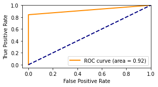

```python
# Import libraries and layers
import os
import numpy as np
from numpy import expand_dims
from numpy import zeros,ones
from numpy.random import randn
from numpy.random import randint
from keras.optimizers import Adam, RMSprop
from keras.layers.advanced_activations import LeakyReLU,ReLU
from keras.models import Sequential
from keras.layers import Dense,Reshape,Flatten,Conv2D,MaxPooling2D,Dropout,BatchNormalization,Conv2DTranspose
import matplotlib.pyplot as plt
import scipy.io
from scipy.io import loadmat
from keras.initializers import RandomNormal
```


```python
os.environ["KERAS_BACKEND"] = "tensorflow"
np.random.seed(10)
from google.colab import drive 
drive.mount('/content/drive')
#TrainData=scipy.io.loadmat('/content/drive/My Drive/TrainData.mat');
Y_noisy=scipy.io.loadmat('/content/drive/My Drive/In_Data.mat');
Y_noisy = np.array(list(Y_noisy.values())[3])
Channels=scipy.io.loadmat('/content/drive/My Drive/Out_Data.mat');
Channels = np.array(list(Channels.values())[3])
print(Y_noisy.shape)
print(Channels.shape)
```

    Mounted at /content/drive
    (4000, 64, 8, 2)
    (4000, 64, 8, 2)


```python
# design discriminator
# The input size if discriminator
Input_shape=(64,8,2)

# Discriminator network structure
def define_discriminator(Input_shape):
    init = RandomNormal(mean=0, stddev=0.02)
    model=Sequential()
    
    model.add(Conv2D(64,kernel_size=4,strides=2,input_shape=Input_shape,
                             padding='same',kernel_initializer=init))
    model.add(BatchNormalization())
    model.add(LeakyReLU(0.2))
    model.add(Dropout(rate = 0.4))
    
    model.add(Conv2D(128,kernel_size=4,strides=2,padding='same',kernel_initializer=init))
    model.add(BatchNormalization())
    model.add(LeakyReLU(0.2))
    model.add(Dropout(rate = 0.5))

    model.add(Conv2D(256,kernel_size=4,strides=2,padding='same',kernel_initializer=init))
    model.add(BatchNormalization())
    model.add(LeakyReLU(0.2))
    model.add(Dropout(rate = 0.4))
    
    model.add(Flatten())
    model.add(Dense(1,activation='linear'))
    
    model.compile(loss='mean_squared_error',optimizer=Adam(lr=0.0002, beta_1=0.5),
                          metrics=['accuracy'])
    return model
Figure1=define_discriminator(Input_shape)
Figure1.summary()
```

    Model: "sequential"
    _________________________________________________________________
    Layer (type)                 Output Shape              Param #   
    =================================================================
    conv2d (Conv2D)              (None, 32, 4, 64)         2112      
    _________________________________________________________________
    batch_normalization (BatchNo (None, 32, 4, 64)         256       
    _________________________________________________________________
    leaky_re_lu (LeakyReLU)      (None, 32, 4, 64)         0         
    _________________________________________________________________
    dropout (Dropout)            (None, 32, 4, 64)         0         
    _________________________________________________________________
    conv2d_1 (Conv2D)            (None, 16, 2, 128)        131200    
    _________________________________________________________________
    batch_normalization_1 (Batch (None, 16, 2, 128)        512       
    _________________________________________________________________
    leaky_re_lu_1 (LeakyReLU)    (None, 16, 2, 128)        0         
    _________________________________________________________________
    dropout_1 (Dropout)          (None, 16, 2, 128)        0         
    _________________________________________________________________
    conv2d_2 (Conv2D)            (None, 8, 1, 256)         524544    
    _________________________________________________________________
    batch_normalization_2 (Batch (None, 8, 1, 256)         1024      
    _________________________________________________________________
    leaky_re_lu_2 (LeakyReLU)    (None, 8, 1, 256)         0         
    _________________________________________________________________
    dropout_2 (Dropout)          (None, 8, 1, 256)         0         
    _________________________________________________________________
    flatten (Flatten)            (None, 2048)              0         
    _________________________________________________________________
    dense (Dense)                (None, 1)                 2049      
    =================================================================
    Total params: 661,697
    Trainable params: 660,801
    Non-trainable params: 896
    _________________________________________________________________


```python
# design autoencoder as generator
Input = (64,8,2)

# Generator network structure
def define_generator(Input):
    init = RandomNormal(mean=0, stddev=0.02)
    model=Sequential()
    # Encoder
    model.add(Conv2D(128,kernel_size=4,strides=2,input_shape=Input_shape,padding='same',kernel_initializer=init))
    model.add(ReLU(0.2))
    model.add(BatchNormalization())
    
    model.add(Conv2D(128,kernel_size=4,strides=1,input_shape=Input_shape,padding='same',kernel_initializer=init))
    model.add(ReLU(0.2))
    model.add(BatchNormalization())
    
    model.add(Conv2D(64,kernel_size=4,strides=2,padding='same',kernel_initializer=init))
    model.add(ReLU(0.2))
    model.add(BatchNormalization())

    model.add(Conv2D(32,kernel_size=4,strides=2,padding='same',kernel_initializer=init))
    model.add(ReLU(0.2))
    model.add(BatchNormalization())
    
    
    # Decoder
    model.add(Conv2DTranspose(32,kernel_size=4,strides=2,padding='same',kernel_initializer=init))
    model.add(ReLU(0.2))
    model.add(BatchNormalization())
    
    model.add(Conv2DTranspose(64,kernel_size=4,strides=1,padding='same',kernel_initializer=init))
    model.add(ReLU(0.2))
    model.add(BatchNormalization())
    
    model.add(Conv2DTranspose(128,kernel_size=4,strides=2,padding='same',kernel_initializer=init))
    model.add(BatchNormalization())
    model.add(ReLU(0.2))
    
    model.add(Conv2DTranspose(2,kernel_size=4,strides=2,activation='tanh',padding='same',kernel_initializer=init))
    #generator.compile(loss='binary_crossentropy',optimizer=Adam(lr=0.0002,beta_1=0.5))
    
    return model
Figure2=define_generator(Input)
Figure2.summary()    
```

    Model: "sequential_1"
    _________________________________________________________________
    Layer (type)                 Output Shape              Param #   
    =================================================================
    conv2d_3 (Conv2D)            (None, 32, 4, 128)        4224      
    _________________________________________________________________
    re_lu (ReLU)                 (None, 32, 4, 128)        0         
    _________________________________________________________________
    batch_normalization_3 (Batch (None, 32, 4, 128)        512       
    _________________________________________________________________
    conv2d_4 (Conv2D)            (None, 32, 4, 128)        262272    
    _________________________________________________________________
    re_lu_1 (ReLU)               (None, 32, 4, 128)        0         
    _________________________________________________________________
    batch_normalization_4 (Batch (None, 32, 4, 128)        512       
    _________________________________________________________________
    conv2d_5 (Conv2D)            (None, 16, 2, 64)         131136    
    _________________________________________________________________
    re_lu_2 (ReLU)               (None, 16, 2, 64)         0         
    _________________________________________________________________
    batch_normalization_5 (Batch (None, 16, 2, 64)         256       
    _________________________________________________________________
    conv2d_6 (Conv2D)            (None, 8, 1, 32)          32800     
    _________________________________________________________________
    re_lu_3 (ReLU)               (None, 8, 1, 32)          0         
    _________________________________________________________________
    batch_normalization_6 (Batch (None, 8, 1, 32)          128       
    _________________________________________________________________
    conv2d_transpose (Conv2DTran (None, 16, 2, 32)         16416     
    _________________________________________________________________
    re_lu_4 (ReLU)               (None, 16, 2, 32)         0         
    _________________________________________________________________
    batch_normalization_7 (Batch (None, 16, 2, 32)         128       
    _________________________________________________________________
    conv2d_transpose_1 (Conv2DTr (None, 16, 2, 64)         32832     
    _________________________________________________________________
    re_lu_5 (ReLU)               (None, 16, 2, 64)         0         
    _________________________________________________________________
    batch_normalization_8 (Batch (None, 16, 2, 64)         256       
    _________________________________________________________________
    conv2d_transpose_2 (Conv2DTr (None, 32, 4, 128)        131200    
    _________________________________________________________________
    batch_normalization_9 (Batch (None, 32, 4, 128)        512       
    _________________________________________________________________
    re_lu_6 (ReLU)               (None, 32, 4, 128)        0         
    _________________________________________________________________
    conv2d_transpose_3 (Conv2DTr (None, 64, 8, 2)          4098      
    =================================================================
    Total params: 617,282
    Trainable params: 616,130
    Non-trainable params: 1,152
    _________________________________________________________________


```python
# GAN design
Generator=define_generator(Input)
Discriminator=define_discriminator(Input_shape)
def define_GAN(Generator,Discriminator):
    Discriminator.tainable=False
    model=Sequential()
    model.add(Generator)
    model.add(Discriminator)
    model.compile(loss='mean_squared_error',optimizer=Adam(lr=0.0002, beta_1=0.5))
    return model
Figure3=define_GAN(Generator,Discriminator)
Figure3.summary()
```

    Model: "sequential_4"
    _________________________________________________________________
    Layer (type)                 Output Shape              Param #   
    =================================================================
    sequential_2 (Sequential)    (None, 64, 8, 2)          617282    
    _________________________________________________________________
    sequential_3 (Sequential)    (None, 1)                 661697    
    =================================================================
    Total params: 1,278,979
    Trainable params: 1,276,931
    Non-trainable params: 2,048
    _________________________________________________________________


```python
# training
def Train(Discriminator, Generator, GAN, Epoche, batch_size):
    # load data
    #Xtrain = np.array([np.array(TrainData[4][ii][0]) for ii in range(len(TrainData[4]))])
    #YTrain = np.array([np.array(TrainData[5][ii][0]) for ii in range(len(TrainData[5]))])
    # add one size to Xtrain 
    Y=Y_noisy.reshape(Y_noisy.shape[0],64,8,2)
    H=Channels.reshape(Channels.shape[0],64,8,2)
    
    #Xtrain=Xtrain.reshape(Xtrain.shape[0],128,400,1)
    Num_Batch=int(Y.shape[0]/batch_size)
    print("Num_Batch in each epoche:",Num_Batch)
    
    
    # prepare to save results
    #Rloss=[]
    #Floss=[]
    Raccuracy=list()
    Faccuracy=list()
    Dloss=list()
    #Accuracy=[]
    Gloss=list()
    
    
    for i in range(Epoche):
        for j in range (Num_Batch):
            
            # generate label 1 and 0 for real and fake data respectively
            Real_label=np.ones((batch_size,1))
            Fake_label=np.zeros((batch_size,1))
            
            # calculating loss and accuracy of discriminator on real and fake data
            Ch_index=np.random.randint(0,H.shape[0],batch_size)
            Real_data=H[Ch_index]
            
            Y_index=np.random.randint(0,Y.shape[0],batch_size)
            Fake=Y[Y_index]
            Fake_data=Generator.predict(Fake)
            
            
            Rloss,Racc=Discriminator.train_on_batch(Real_data,Real_label)
            #_,Racc_temp=discriminator.evaluate(Real_data,Real_label, verbose=0)
            
            Floss,Facc=Discriminator.train_on_batch(Fake_data,Fake_label)
            #_,Facc_temp=discriminator.evaluate(Fake_data,Fake_label, verbose=0)
            
            d_loss=0.5*np.add(Rloss,Floss)
            
            # calculating loss of generator and its training
            #discriminator.trainable=False
            Y_index=np.random.randint(0,Y.shape[0],batch_size)
            Fake=Y[Y_index]
            g_loss=GAN.train_on_batch(Fake,Real_label)
            
            #discriminator.trainable=True

            # show results for each batch size
            print("%d [Dloss: %f , Racc: %.2f, Facc: %.2f ] [Gloss: %f]" %
                   (j,d_loss,Racc,Facc,g_loss))
            
            Dloss.append(d_loss)
            #Accuracy.append((accuracy_temp))
            #Floss.append((Floss_temp))
            Raccuracy.append(Racc)
            Faccuracy.append(Facc)
            Gloss.append(g_loss)
            
        # save weights of both networks
        Generator.save('generator.h5')
        Discriminator.save('discriminator.h5')
        Generator.save_weights('weightG.h5')
        Discriminator.save_weights('weightsD.h5')
    
    plt.figure(figsize=(18,4))
    plt.subplot(1,2,1)
    plt.plot(range(Epoche*Num_Batch),Dloss,label='Discriminator')
    plt.plot(range(Epoche*Num_Batch),Gloss,label='Generator')
    #plt.plot(range(Epoche*Num_Batch),Gloss,label='Generator')
    plt.xlabel('Batch')
    plt.xlim(0,Epoche*Num_Batch,10)
    plt.ylabel('Loss')
    plt.title('Loss of discriminator and generator')
    plt.legend(prop={"size":18})
    plt.savefig('Loss.png')
    plt.show()
    
    plt.figure(figsize=(18,4))
    plt.subplot(1,2,2)
    #plt.plot(range(Epoche*Num_Batch),Accuracy,label='Discriminator')
    plt.plot(range(Epoche*Num_Batch),Raccuracy,label='Real')
    plt.plot(range(Epoche*Num_Batch),Faccuracy,label='Fake')
    plt.xlabel('Batch')
    plt.xlim(0,Epoche*Num_Batch,10)
    plt.ylabel('Accuracy')
    plt.title('Accuracy of discriminator on real and fake data')
    plt.legend(prop={"size":18})
    plt.savefig('Accuracy.png')
    plt.show()
    

Epoche=200
batch_size=64
Generator=define_generator(Input)
Discriminator=define_discriminator(Input_shape)
GAN=define_GAN(Generator,Discriminator)
    
Train(Discriminator, Generator, GAN, Epoche, batch_size)    
        
    
```

    Streaming output truncated to the last 5000 lines.
    22 [Dloss: 0.325670 , Racc: 0.81, Facc: 0.33 ] [Gloss: 0.371892]
    23 [Dloss: 0.319216 , Racc: 0.83, Facc: 0.47 ] [Gloss: 0.463164]
    24 [Dloss: 0.370924 , Racc: 0.73, Facc: 0.34 ] [Gloss: 0.397082]
    25 [Dloss: 0.359802 , Racc: 0.70, Facc: 0.33 ] [Gloss: 0.309206]
    26 [Dloss: 0.337152 , Racc: 0.78, Facc: 0.34 ] [Gloss: 0.390157]
    27 [Dloss: 0.339414 , Racc: 0.81, Facc: 0.38 ] [Gloss: 0.448989]
    28 [Dloss: 0.320471 , Racc: 0.86, Facc: 0.30 ] [Gloss: 0.371380]
    29 [Dloss: 0.343091 , Racc: 0.81, Facc: 0.33 ] [Gloss: 0.465602]
    30 [Dloss: 0.363014 , Racc: 0.78, Facc: 0.34 ] [Gloss: 0.374419]
    31 [Dloss: 0.380100 , Racc: 0.62, Facc: 0.25 ] [Gloss: 0.451514]
    32 [Dloss: 0.395298 , Racc: 0.81, Facc: 0.34 ] [Gloss: 0.383047]
    33 [Dloss: 0.306638 , Racc: 0.86, Facc: 0.34 ] [Gloss: 0.332761]
    34 [Dloss: 0.218151 , Racc: 0.89, Facc: 0.52 ] [Gloss: 0.351302]
    35 [Dloss: 0.352372 , Racc: 0.80, Facc: 0.31 ] [Gloss: 0.265369]
    36 [Dloss: 0.394915 , Racc: 0.72, Facc: 0.28 ] [Gloss: 0.324385]
    37 [Dloss: 0.248888 , Racc: 0.80, Facc: 0.53 ] [Gloss: 0.382537]
    38 [Dloss: 0.310766 , Racc: 0.88, Facc: 0.41 ] [Gloss: 0.355970]
    39 [Dloss: 0.337235 , Racc: 0.86, Facc: 0.22 ] [Gloss: 0.401503]
    40 [Dloss: 0.279360 , Racc: 0.83, Facc: 0.42 ] [Gloss: 0.467137]
    41 [Dloss: 0.282693 , Racc: 0.84, Facc: 0.47 ] [Gloss: 0.389557]
    42 [Dloss: 0.301703 , Racc: 0.88, Facc: 0.36 ] [Gloss: 0.351202]
    43 [Dloss: 0.316683 , Racc: 0.86, Facc: 0.42 ] [Gloss: 0.373720]
    44 [Dloss: 0.374709 , Racc: 0.72, Facc: 0.38 ] [Gloss: 0.315192]
    45 [Dloss: 0.319683 , Racc: 0.78, Facc: 0.36 ] [Gloss: 0.290358]
    46 [Dloss: 0.325572 , Racc: 0.83, Facc: 0.36 ] [Gloss: 0.324267]
    47 [Dloss: 0.329919 , Racc: 0.91, Facc: 0.27 ] [Gloss: 0.291404]
    48 [Dloss: 0.290178 , Racc: 0.80, Facc: 0.42 ] [Gloss: 0.427888]
    49 [Dloss: 0.323084 , Racc: 0.69, Facc: 0.33 ] [Gloss: 0.412696]
    50 [Dloss: 0.316687 , Racc: 0.89, Facc: 0.41 ] [Gloss: 0.272199]
    51 [Dloss: 0.328451 , Racc: 0.78, Facc: 0.41 ] [Gloss: 0.512556]
    52 [Dloss: 0.289584 , Racc: 0.86, Facc: 0.41 ] [Gloss: 0.320082]
    53 [Dloss: 0.349496 , Racc: 0.80, Facc: 0.30 ] [Gloss: 0.500612]
    54 [Dloss: 0.326410 , Racc: 0.72, Facc: 0.38 ] [Gloss: 0.330348]
    55 [Dloss: 0.378207 , Racc: 0.75, Facc: 0.27 ] [Gloss: 0.344312]
    56 [Dloss: 0.323046 , Racc: 0.72, Facc: 0.44 ] [Gloss: 0.307989]
    57 [Dloss: 0.325167 , Racc: 0.91, Facc: 0.41 ] [Gloss: 0.288020]
    58 [Dloss: 0.302539 , Racc: 0.91, Facc: 0.27 ] [Gloss: 0.359278]
    59 [Dloss: 0.283851 , Racc: 0.72, Facc: 0.53 ] [Gloss: 0.384670]
    60 [Dloss: 0.333223 , Racc: 0.80, Facc: 0.33 ] [Gloss: 0.395546]
    61 [Dloss: 0.437551 , Racc: 0.73, Facc: 0.23 ] [Gloss: 0.366099]
    0 [Dloss: 0.250661 , Racc: 0.88, Facc: 0.45 ] [Gloss: 0.343029]
    1 [Dloss: 0.287209 , Racc: 0.86, Facc: 0.41 ] [Gloss: 0.338301]
    2 [Dloss: 0.298910 , Racc: 0.78, Facc: 0.41 ] [Gloss: 0.263139]
    3 [Dloss: 0.279779 , Racc: 0.80, Facc: 0.48 ] [Gloss: 0.318202]
    4 [Dloss: 0.334457 , Racc: 0.73, Facc: 0.44 ] [Gloss: 0.207481]
    5 [Dloss: 0.341963 , Racc: 0.83, Facc: 0.34 ] [Gloss: 0.357470]
    6 [Dloss: 0.314401 , Racc: 0.77, Facc: 0.48 ] [Gloss: 0.351913]
    7 [Dloss: 0.281329 , Racc: 0.86, Facc: 0.36 ] [Gloss: 0.304479]
    8 [Dloss: 0.275792 , Racc: 0.78, Facc: 0.45 ] [Gloss: 0.327734]
    9 [Dloss: 0.357585 , Racc: 0.73, Facc: 0.38 ] [Gloss: 0.270465]
    10 [Dloss: 0.312009 , Racc: 0.78, Facc: 0.34 ] [Gloss: 0.280337]
    11 [Dloss: 0.384603 , Racc: 0.77, Facc: 0.33 ] [Gloss: 0.434009]
    12 [Dloss: 0.309194 , Racc: 0.83, Facc: 0.47 ] [Gloss: 0.434572]
    13 [Dloss: 0.308345 , Racc: 0.81, Facc: 0.36 ] [Gloss: 0.315431]
    14 [Dloss: 0.304946 , Racc: 0.84, Facc: 0.45 ] [Gloss: 0.285715]
    15 [Dloss: 0.275950 , Racc: 0.83, Facc: 0.48 ] [Gloss: 0.468374]
    16 [Dloss: 0.327644 , Racc: 0.77, Facc: 0.42 ] [Gloss: 0.364478]
    17 [Dloss: 0.315118 , Racc: 0.86, Facc: 0.39 ] [Gloss: 0.313666]
    18 [Dloss: 0.369498 , Racc: 0.78, Facc: 0.30 ] [Gloss: 0.311715]
    19 [Dloss: 0.285983 , Racc: 0.78, Facc: 0.38 ] [Gloss: 0.383325]
    20 [Dloss: 0.316861 , Racc: 0.84, Facc: 0.33 ] [Gloss: 0.453266]
    21 [Dloss: 0.298779 , Racc: 0.73, Facc: 0.42 ] [Gloss: 0.344060]
    22 [Dloss: 0.432368 , Racc: 0.73, Facc: 0.28 ] [Gloss: 0.286326]
    23 [Dloss: 0.376376 , Racc: 0.73, Facc: 0.33 ] [Gloss: 0.419454]
    24 [Dloss: 0.305380 , Racc: 0.86, Facc: 0.42 ] [Gloss: 0.456153]
    25 [Dloss: 0.342088 , Racc: 0.83, Facc: 0.28 ] [Gloss: 0.427889]
    26 [Dloss: 0.342424 , Racc: 0.69, Facc: 0.34 ] [Gloss: 0.409624]
    27 [Dloss: 0.352323 , Racc: 0.72, Facc: 0.27 ] [Gloss: 0.338482]
    28 [Dloss: 0.359816 , Racc: 0.80, Facc: 0.25 ] [Gloss: 0.376579]
    29 [Dloss: 0.370896 , Racc: 0.73, Facc: 0.36 ] [Gloss: 0.285520]
    30 [Dloss: 0.347996 , Racc: 0.80, Facc: 0.33 ] [Gloss: 0.296181]
    31 [Dloss: 0.340580 , Racc: 0.88, Facc: 0.38 ] [Gloss: 0.271610]
    32 [Dloss: 0.326008 , Racc: 0.77, Facc: 0.38 ] [Gloss: 0.350023]
    33 [Dloss: 0.336145 , Racc: 0.73, Facc: 0.45 ] [Gloss: 0.402696]
    34 [Dloss: 0.257032 , Racc: 0.89, Facc: 0.41 ] [Gloss: 0.445312]
    35 [Dloss: 0.351417 , Racc: 0.77, Facc: 0.25 ] [Gloss: 0.359142]
    36 [Dloss: 0.337695 , Racc: 0.81, Facc: 0.42 ] [Gloss: 0.335148]
    37 [Dloss: 0.325350 , Racc: 0.86, Facc: 0.38 ] [Gloss: 0.295132]
    38 [Dloss: 0.293480 , Racc: 0.89, Facc: 0.41 ] [Gloss: 0.476774]
    39 [Dloss: 0.318763 , Racc: 0.86, Facc: 0.33 ] [Gloss: 0.456596]
    40 [Dloss: 0.411413 , Racc: 0.73, Facc: 0.30 ] [Gloss: 0.268247]
    41 [Dloss: 0.291963 , Racc: 0.88, Facc: 0.34 ] [Gloss: 0.358575]
    42 [Dloss: 0.328525 , Racc: 0.77, Facc: 0.38 ] [Gloss: 0.355217]
    43 [Dloss: 0.330274 , Racc: 0.78, Facc: 0.36 ] [Gloss: 0.327533]
    44 [Dloss: 0.262708 , Racc: 0.77, Facc: 0.45 ] [Gloss: 0.315100]
    45 [Dloss: 0.322212 , Racc: 0.83, Facc: 0.42 ] [Gloss: 0.292956]
    46 [Dloss: 0.310555 , Racc: 0.83, Facc: 0.36 ] [Gloss: 0.301774]
    47 [Dloss: 0.350702 , Racc: 0.77, Facc: 0.34 ] [Gloss: 0.411184]
    48 [Dloss: 0.282742 , Racc: 0.81, Facc: 0.41 ] [Gloss: 0.357852]
    49 [Dloss: 0.370795 , Racc: 0.78, Facc: 0.25 ] [Gloss: 0.381846]
    50 [Dloss: 0.328002 , Racc: 0.78, Facc: 0.47 ] [Gloss: 0.411997]
    51 [Dloss: 0.373348 , Racc: 0.73, Facc: 0.31 ] [Gloss: 0.290969]
    52 [Dloss: 0.330580 , Racc: 0.83, Facc: 0.34 ] [Gloss: 0.488799]
    53 [Dloss: 0.317893 , Racc: 0.77, Facc: 0.34 ] [Gloss: 0.337386]
    54 [Dloss: 0.341639 , Racc: 0.88, Facc: 0.31 ] [Gloss: 0.331131]
    55 [Dloss: 0.323704 , Racc: 0.80, Facc: 0.39 ] [Gloss: 0.380079]
    56 [Dloss: 0.318783 , Racc: 0.91, Facc: 0.41 ] [Gloss: 0.436849]
    57 [Dloss: 0.313601 , Racc: 0.81, Facc: 0.30 ] [Gloss: 0.394814]
    58 [Dloss: 0.340546 , Racc: 0.80, Facc: 0.33 ] [Gloss: 0.379258]
    59 [Dloss: 0.288469 , Racc: 0.84, Facc: 0.41 ] [Gloss: 0.398225]
    60 [Dloss: 0.264693 , Racc: 0.86, Facc: 0.42 ] [Gloss: 0.351677]
    61 [Dloss: 0.329183 , Racc: 0.80, Facc: 0.30 ] [Gloss: 0.363950]
    0 [Dloss: 0.364904 , Racc: 0.80, Facc: 0.38 ] [Gloss: 0.349085]
    1 [Dloss: 0.351885 , Racc: 0.83, Facc: 0.27 ] [Gloss: 0.305041]
    2 [Dloss: 0.333632 , Racc: 0.81, Facc: 0.33 ] [Gloss: 0.400523]
    3 [Dloss: 0.404509 , Racc: 0.66, Facc: 0.34 ] [Gloss: 0.539685]
    4 [Dloss: 0.345787 , Racc: 0.84, Facc: 0.31 ] [Gloss: 0.379941]
    5 [Dloss: 0.285437 , Racc: 0.86, Facc: 0.34 ] [Gloss: 0.485141]
    6 [Dloss: 0.361604 , Racc: 0.81, Facc: 0.23 ] [Gloss: 0.392719]
    7 [Dloss: 0.345982 , Racc: 0.92, Facc: 0.38 ] [Gloss: 0.423602]
    8 [Dloss: 0.289126 , Racc: 0.84, Facc: 0.45 ] [Gloss: 0.352554]
    9 [Dloss: 0.330966 , Racc: 0.72, Facc: 0.36 ] [Gloss: 0.299044]
    10 [Dloss: 0.335646 , Racc: 0.72, Facc: 0.45 ] [Gloss: 0.293238]
    11 [Dloss: 0.322913 , Racc: 0.91, Facc: 0.38 ] [Gloss: 0.369947]
    12 [Dloss: 0.311928 , Racc: 0.73, Facc: 0.44 ] [Gloss: 0.317008]
    13 [Dloss: 0.362840 , Racc: 0.83, Facc: 0.28 ] [Gloss: 0.345312]
    14 [Dloss: 0.325184 , Racc: 0.78, Facc: 0.34 ] [Gloss: 0.420811]
    15 [Dloss: 0.333531 , Racc: 0.88, Facc: 0.36 ] [Gloss: 0.445209]
    16 [Dloss: 0.321194 , Racc: 0.84, Facc: 0.42 ] [Gloss: 0.401172]
    17 [Dloss: 0.432866 , Racc: 0.80, Facc: 0.16 ] [Gloss: 0.487879]
    18 [Dloss: 0.318738 , Racc: 0.81, Facc: 0.38 ] [Gloss: 0.429622]
    19 [Dloss: 0.349285 , Racc: 0.75, Facc: 0.27 ] [Gloss: 0.442025]
    20 [Dloss: 0.268916 , Racc: 0.84, Facc: 0.44 ] [Gloss: 0.313721]
    21 [Dloss: 0.270940 , Racc: 0.91, Facc: 0.38 ] [Gloss: 0.494839]
    22 [Dloss: 0.282840 , Racc: 0.88, Facc: 0.41 ] [Gloss: 0.284921]
    23 [Dloss: 0.360845 , Racc: 0.77, Facc: 0.28 ] [Gloss: 0.440456]
    24 [Dloss: 0.343026 , Racc: 0.80, Facc: 0.34 ] [Gloss: 0.323185]
    25 [Dloss: 0.311455 , Racc: 0.88, Facc: 0.42 ] [Gloss: 0.433805]
    26 [Dloss: 0.342435 , Racc: 0.84, Facc: 0.34 ] [Gloss: 0.369507]
    27 [Dloss: 0.269166 , Racc: 0.88, Facc: 0.45 ] [Gloss: 0.353941]
    28 [Dloss: 0.308842 , Racc: 0.78, Facc: 0.42 ] [Gloss: 0.310563]
    29 [Dloss: 0.360226 , Racc: 0.72, Facc: 0.38 ] [Gloss: 0.339798]
    30 [Dloss: 0.340816 , Racc: 0.72, Facc: 0.33 ] [Gloss: 0.408330]
    31 [Dloss: 0.333414 , Racc: 0.81, Facc: 0.39 ] [Gloss: 0.348024]
    32 [Dloss: 0.366548 , Racc: 0.80, Facc: 0.38 ] [Gloss: 0.364899]
    33 [Dloss: 0.353267 , Racc: 0.80, Facc: 0.28 ] [Gloss: 0.375776]
    34 [Dloss: 0.287002 , Racc: 0.88, Facc: 0.44 ] [Gloss: 0.355854]
    35 [Dloss: 0.330998 , Racc: 0.83, Facc: 0.34 ] [Gloss: 0.383613]
    36 [Dloss: 0.291017 , Racc: 0.81, Facc: 0.39 ] [Gloss: 0.342315]
    37 [Dloss: 0.335810 , Racc: 0.84, Facc: 0.39 ] [Gloss: 0.368153]
    38 [Dloss: 0.295752 , Racc: 0.80, Facc: 0.47 ] [Gloss: 0.298242]
    39 [Dloss: 0.388852 , Racc: 0.73, Facc: 0.25 ] [Gloss: 0.278238]
    40 [Dloss: 0.298217 , Racc: 0.78, Facc: 0.41 ] [Gloss: 0.417600]
    41 [Dloss: 0.346954 , Racc: 0.75, Facc: 0.38 ] [Gloss: 0.376252]
    42 [Dloss: 0.315246 , Racc: 0.88, Facc: 0.33 ] [Gloss: 0.436808]
    43 [Dloss: 0.309889 , Racc: 0.78, Facc: 0.44 ] [Gloss: 0.317993]
    44 [Dloss: 0.343103 , Racc: 0.80, Facc: 0.36 ] [Gloss: 0.328054]
    45 [Dloss: 0.283223 , Racc: 0.88, Facc: 0.38 ] [Gloss: 0.286966]
    46 [Dloss: 0.294698 , Racc: 0.86, Facc: 0.42 ] [Gloss: 0.340684]
    47 [Dloss: 0.324555 , Racc: 0.86, Facc: 0.33 ] [Gloss: 0.416668]
    48 [Dloss: 0.383292 , Racc: 0.83, Facc: 0.27 ] [Gloss: 0.396559]
    49 [Dloss: 0.274409 , Racc: 0.75, Facc: 0.42 ] [Gloss: 0.381720]
    50 [Dloss: 0.276476 , Racc: 0.86, Facc: 0.38 ] [Gloss: 0.317438]
    51 [Dloss: 0.354783 , Racc: 0.80, Facc: 0.39 ] [Gloss: 0.338779]
    52 [Dloss: 0.345018 , Racc: 0.73, Facc: 0.42 ] [Gloss: 0.355469]
    53 [Dloss: 0.327173 , Racc: 0.83, Facc: 0.42 ] [Gloss: 0.450806]
    54 [Dloss: 0.274883 , Racc: 0.88, Facc: 0.36 ] [Gloss: 0.368187]
    55 [Dloss: 0.309732 , Racc: 0.84, Facc: 0.36 ] [Gloss: 0.274305]
    56 [Dloss: 0.264225 , Racc: 0.83, Facc: 0.44 ] [Gloss: 0.390800]
    57 [Dloss: 0.323178 , Racc: 0.89, Facc: 0.30 ] [Gloss: 0.393201]
    58 [Dloss: 0.366796 , Racc: 0.75, Facc: 0.28 ] [Gloss: 0.499507]
    59 [Dloss: 0.266129 , Racc: 0.80, Facc: 0.39 ] [Gloss: 0.438045]
    60 [Dloss: 0.413287 , Racc: 0.89, Facc: 0.20 ] [Gloss: 0.353250]
    61 [Dloss: 0.341467 , Racc: 0.88, Facc: 0.31 ] [Gloss: 0.350491]
    0 [Dloss: 0.356159 , Racc: 0.73, Facc: 0.38 ] [Gloss: 0.450347]
    1 [Dloss: 0.259420 , Racc: 0.86, Facc: 0.47 ] [Gloss: 0.279379]
    2 [Dloss: 0.244196 , Racc: 0.86, Facc: 0.53 ] [Gloss: 0.315836]
    3 [Dloss: 0.339426 , Racc: 0.73, Facc: 0.38 ] [Gloss: 0.398590]
    4 [Dloss: 0.397591 , Racc: 0.77, Facc: 0.23 ] [Gloss: 0.303784]
    5 [Dloss: 0.335729 , Racc: 0.84, Facc: 0.38 ] [Gloss: 0.333787]
    6 [Dloss: 0.405561 , Racc: 0.75, Facc: 0.36 ] [Gloss: 0.309175]
    7 [Dloss: 0.303494 , Racc: 0.78, Facc: 0.39 ] [Gloss: 0.317854]
    8 [Dloss: 0.334574 , Racc: 0.83, Facc: 0.27 ] [Gloss: 0.396637]
    9 [Dloss: 0.315052 , Racc: 0.73, Facc: 0.41 ] [Gloss: 0.382207]
    10 [Dloss: 0.246492 , Racc: 0.83, Facc: 0.44 ] [Gloss: 0.318684]
    11 [Dloss: 0.351872 , Racc: 0.78, Facc: 0.31 ] [Gloss: 0.374992]
    12 [Dloss: 0.353692 , Racc: 0.86, Facc: 0.33 ] [Gloss: 0.389322]
    13 [Dloss: 0.284834 , Racc: 0.88, Facc: 0.52 ] [Gloss: 0.352175]
    14 [Dloss: 0.374328 , Racc: 0.83, Facc: 0.30 ] [Gloss: 0.298011]
    15 [Dloss: 0.322215 , Racc: 0.83, Facc: 0.33 ] [Gloss: 0.335632]
    16 [Dloss: 0.319489 , Racc: 0.80, Facc: 0.38 ] [Gloss: 0.452165]
    17 [Dloss: 0.311596 , Racc: 0.80, Facc: 0.45 ] [Gloss: 0.345795]
    18 [Dloss: 0.281410 , Racc: 0.78, Facc: 0.42 ] [Gloss: 0.267884]
    19 [Dloss: 0.332293 , Racc: 0.88, Facc: 0.33 ] [Gloss: 0.391266]
    20 [Dloss: 0.273612 , Racc: 0.84, Facc: 0.53 ] [Gloss: 0.412041]
    21 [Dloss: 0.391705 , Racc: 0.78, Facc: 0.31 ] [Gloss: 0.309329]
    22 [Dloss: 0.303950 , Racc: 0.92, Facc: 0.36 ] [Gloss: 0.429298]
    23 [Dloss: 0.310899 , Racc: 0.89, Facc: 0.31 ] [Gloss: 0.381321]
    24 [Dloss: 0.302798 , Racc: 0.80, Facc: 0.36 ] [Gloss: 0.305434]
    25 [Dloss: 0.336594 , Racc: 0.69, Facc: 0.41 ] [Gloss: 0.301578]
    26 [Dloss: 0.365452 , Racc: 0.78, Facc: 0.36 ] [Gloss: 0.396728]
    27 [Dloss: 0.335179 , Racc: 0.83, Facc: 0.33 ] [Gloss: 0.408460]
    28 [Dloss: 0.320029 , Racc: 0.75, Facc: 0.36 ] [Gloss: 0.357206]
    29 [Dloss: 0.353860 , Racc: 0.81, Facc: 0.36 ] [Gloss: 0.335517]
    30 [Dloss: 0.321108 , Racc: 0.73, Facc: 0.38 ] [Gloss: 0.339739]
    31 [Dloss: 0.304386 , Racc: 0.91, Facc: 0.31 ] [Gloss: 0.329147]
    32 [Dloss: 0.352133 , Racc: 0.67, Facc: 0.33 ] [Gloss: 0.303836]
    33 [Dloss: 0.395548 , Racc: 0.80, Facc: 0.30 ] [Gloss: 0.331653]
    34 [Dloss: 0.322395 , Racc: 0.73, Facc: 0.44 ] [Gloss: 0.346834]
    35 [Dloss: 0.357242 , Racc: 0.73, Facc: 0.25 ] [Gloss: 0.367890]
    36 [Dloss: 0.320241 , Racc: 0.84, Facc: 0.39 ] [Gloss: 0.359199]
    37 [Dloss: 0.325869 , Racc: 0.75, Facc: 0.42 ] [Gloss: 0.341931]
    38 [Dloss: 0.317593 , Racc: 0.80, Facc: 0.41 ] [Gloss: 0.255913]
    39 [Dloss: 0.388758 , Racc: 0.83, Facc: 0.22 ] [Gloss: 0.340121]
    40 [Dloss: 0.338205 , Racc: 0.78, Facc: 0.44 ] [Gloss: 0.406781]
    41 [Dloss: 0.378315 , Racc: 0.72, Facc: 0.30 ] [Gloss: 0.371286]
    42 [Dloss: 0.309279 , Racc: 0.84, Facc: 0.47 ] [Gloss: 0.410400]
    43 [Dloss: 0.375170 , Racc: 0.77, Facc: 0.39 ] [Gloss: 0.322187]
    44 [Dloss: 0.339123 , Racc: 0.84, Facc: 0.34 ] [Gloss: 0.376473]
    45 [Dloss: 0.312927 , Racc: 0.69, Facc: 0.45 ] [Gloss: 0.353417]
    46 [Dloss: 0.292064 , Racc: 0.86, Facc: 0.41 ] [Gloss: 0.308651]
    47 [Dloss: 0.352577 , Racc: 0.80, Facc: 0.30 ] [Gloss: 0.404186]
    48 [Dloss: 0.348157 , Racc: 0.77, Facc: 0.41 ] [Gloss: 0.324481]
    49 [Dloss: 0.339984 , Racc: 0.77, Facc: 0.36 ] [Gloss: 0.366180]
    50 [Dloss: 0.322916 , Racc: 0.86, Facc: 0.30 ] [Gloss: 0.330685]
    51 [Dloss: 0.333750 , Racc: 0.81, Facc: 0.38 ] [Gloss: 0.411729]
    52 [Dloss: 0.369803 , Racc: 0.80, Facc: 0.31 ] [Gloss: 0.381460]
    53 [Dloss: 0.355340 , Racc: 0.81, Facc: 0.30 ] [Gloss: 0.355812]
    54 [Dloss: 0.373653 , Racc: 0.78, Facc: 0.33 ] [Gloss: 0.380431]
    55 [Dloss: 0.419220 , Racc: 0.72, Facc: 0.31 ] [Gloss: 0.354729]
    56 [Dloss: 0.400698 , Racc: 0.75, Facc: 0.30 ] [Gloss: 0.319966]
    57 [Dloss: 0.343678 , Racc: 0.88, Facc: 0.36 ] [Gloss: 0.332164]
    58 [Dloss: 0.340324 , Racc: 0.81, Facc: 0.34 ] [Gloss: 0.305921]
    59 [Dloss: 0.291367 , Racc: 0.77, Facc: 0.34 ] [Gloss: 0.372088]
    60 [Dloss: 0.307400 , Racc: 0.86, Facc: 0.41 ] [Gloss: 0.314091]
    61 [Dloss: 0.290475 , Racc: 0.78, Facc: 0.42 ] [Gloss: 0.344257]
    0 [Dloss: 0.355839 , Racc: 0.80, Facc: 0.36 ] [Gloss: 0.373551]
    1 [Dloss: 0.368941 , Racc: 0.91, Facc: 0.25 ] [Gloss: 0.295053]
    2 [Dloss: 0.362500 , Racc: 0.86, Facc: 0.30 ] [Gloss: 0.379692]
    3 [Dloss: 0.286411 , Racc: 0.80, Facc: 0.47 ] [Gloss: 0.438879]
    4 [Dloss: 0.299407 , Racc: 0.81, Facc: 0.42 ] [Gloss: 0.361720]
    5 [Dloss: 0.285643 , Racc: 0.89, Facc: 0.38 ] [Gloss: 0.377663]
    6 [Dloss: 0.364948 , Racc: 0.83, Facc: 0.36 ] [Gloss: 0.442582]
    7 [Dloss: 0.359677 , Racc: 0.78, Facc: 0.28 ] [Gloss: 0.470400]
    8 [Dloss: 0.302954 , Racc: 0.77, Facc: 0.38 ] [Gloss: 0.404062]
    9 [Dloss: 0.293687 , Racc: 0.86, Facc: 0.45 ] [Gloss: 0.261162]
    10 [Dloss: 0.310141 , Racc: 0.89, Facc: 0.20 ] [Gloss: 0.354674]
    11 [Dloss: 0.315915 , Racc: 0.78, Facc: 0.30 ] [Gloss: 0.417477]
    12 [Dloss: 0.223582 , Racc: 0.89, Facc: 0.55 ] [Gloss: 0.312393]
    13 [Dloss: 0.304479 , Racc: 0.92, Facc: 0.45 ] [Gloss: 0.355571]
    14 [Dloss: 0.374389 , Racc: 0.69, Facc: 0.38 ] [Gloss: 0.440388]
    15 [Dloss: 0.359267 , Racc: 0.72, Facc: 0.33 ] [Gloss: 0.388524]
    16 [Dloss: 0.365849 , Racc: 0.91, Facc: 0.34 ] [Gloss: 0.414911]
    17 [Dloss: 0.344725 , Racc: 0.81, Facc: 0.38 ] [Gloss: 0.326428]
    18 [Dloss: 0.358372 , Racc: 0.84, Facc: 0.23 ] [Gloss: 0.328776]
    19 [Dloss: 0.301829 , Racc: 0.81, Facc: 0.48 ] [Gloss: 0.393623]
    20 [Dloss: 0.297241 , Racc: 0.88, Facc: 0.39 ] [Gloss: 0.369165]
    21 [Dloss: 0.347518 , Racc: 0.72, Facc: 0.34 ] [Gloss: 0.320294]
    22 [Dloss: 0.275212 , Racc: 0.88, Facc: 0.48 ] [Gloss: 0.558052]
    23 [Dloss: 0.300170 , Racc: 0.78, Facc: 0.50 ] [Gloss: 0.325092]
    24 [Dloss: 0.355207 , Racc: 0.78, Facc: 0.30 ] [Gloss: 0.323068]
    25 [Dloss: 0.381903 , Racc: 0.80, Facc: 0.25 ] [Gloss: 0.407351]
    26 [Dloss: 0.316838 , Racc: 0.86, Facc: 0.36 ] [Gloss: 0.337277]
    27 [Dloss: 0.303499 , Racc: 0.83, Facc: 0.34 ] [Gloss: 0.448595]
    28 [Dloss: 0.322591 , Racc: 0.80, Facc: 0.34 ] [Gloss: 0.328390]
    29 [Dloss: 0.384812 , Racc: 0.70, Facc: 0.30 ] [Gloss: 0.310660]
    30 [Dloss: 0.425048 , Racc: 0.73, Facc: 0.19 ] [Gloss: 0.400533]
    31 [Dloss: 0.363393 , Racc: 0.83, Facc: 0.33 ] [Gloss: 0.379744]
    32 [Dloss: 0.343509 , Racc: 0.81, Facc: 0.38 ] [Gloss: 0.428547]
    33 [Dloss: 0.293765 , Racc: 0.84, Facc: 0.41 ] [Gloss: 0.476004]
    34 [Dloss: 0.379350 , Racc: 0.78, Facc: 0.31 ] [Gloss: 0.413828]
    35 [Dloss: 0.367033 , Racc: 0.84, Facc: 0.25 ] [Gloss: 0.384441]
    36 [Dloss: 0.354550 , Racc: 0.81, Facc: 0.23 ] [Gloss: 0.412521]
    37 [Dloss: 0.360817 , Racc: 0.80, Facc: 0.45 ] [Gloss: 0.261414]
    38 [Dloss: 0.375222 , Racc: 0.81, Facc: 0.25 ] [Gloss: 0.272840]
    39 [Dloss: 0.329671 , Racc: 0.81, Facc: 0.38 ] [Gloss: 0.363892]
    40 [Dloss: 0.270892 , Racc: 0.81, Facc: 0.50 ] [Gloss: 0.386707]
    41 [Dloss: 0.325512 , Racc: 0.81, Facc: 0.34 ] [Gloss: 0.373590]
    42 [Dloss: 0.382387 , Racc: 0.73, Facc: 0.23 ] [Gloss: 0.398018]
    43 [Dloss: 0.418391 , Racc: 0.83, Facc: 0.27 ] [Gloss: 0.379420]
    44 [Dloss: 0.334974 , Racc: 0.75, Facc: 0.38 ] [Gloss: 0.451603]
    45 [Dloss: 0.341330 , Racc: 0.86, Facc: 0.34 ] [Gloss: 0.405059]
    46 [Dloss: 0.323218 , Racc: 0.78, Facc: 0.34 ] [Gloss: 0.337128]
    47 [Dloss: 0.360569 , Racc: 0.80, Facc: 0.27 ] [Gloss: 0.317881]
    48 [Dloss: 0.294726 , Racc: 0.78, Facc: 0.47 ] [Gloss: 0.434606]
    49 [Dloss: 0.361035 , Racc: 0.78, Facc: 0.42 ] [Gloss: 0.368543]
    50 [Dloss: 0.384293 , Racc: 0.77, Facc: 0.30 ] [Gloss: 0.353040]
    51 [Dloss: 0.358568 , Racc: 0.80, Facc: 0.41 ] [Gloss: 0.325917]
    52 [Dloss: 0.309404 , Racc: 0.84, Facc: 0.45 ] [Gloss: 0.337225]
    53 [Dloss: 0.383482 , Racc: 0.75, Facc: 0.30 ] [Gloss: 0.379342]
    54 [Dloss: 0.293008 , Racc: 0.69, Facc: 0.48 ] [Gloss: 0.340386]
    55 [Dloss: 0.355531 , Racc: 0.80, Facc: 0.34 ] [Gloss: 0.372614]
    56 [Dloss: 0.380944 , Racc: 0.81, Facc: 0.33 ] [Gloss: 0.490445]
    57 [Dloss: 0.344089 , Racc: 0.69, Facc: 0.33 ] [Gloss: 0.379104]
    58 [Dloss: 0.282153 , Racc: 0.84, Facc: 0.47 ] [Gloss: 0.358730]
    59 [Dloss: 0.346773 , Racc: 0.83, Facc: 0.41 ] [Gloss: 0.416159]
    60 [Dloss: 0.393482 , Racc: 0.75, Facc: 0.25 ] [Gloss: 0.456633]
    61 [Dloss: 0.348980 , Racc: 0.73, Facc: 0.34 ] [Gloss: 0.439866]
    0 [Dloss: 0.304932 , Racc: 0.81, Facc: 0.38 ] [Gloss: 0.576252]
    1 [Dloss: 0.326802 , Racc: 0.88, Facc: 0.30 ] [Gloss: 0.362442]
    2 [Dloss: 0.380496 , Racc: 0.81, Facc: 0.22 ] [Gloss: 0.385486]
    3 [Dloss: 0.330562 , Racc: 0.84, Facc: 0.38 ] [Gloss: 0.405148]
    4 [Dloss: 0.357072 , Racc: 0.78, Facc: 0.36 ] [Gloss: 0.436768]
    5 [Dloss: 0.346875 , Racc: 0.84, Facc: 0.30 ] [Gloss: 0.351315]
    6 [Dloss: 0.374851 , Racc: 0.80, Facc: 0.39 ] [Gloss: 0.446163]
    7 [Dloss: 0.375864 , Racc: 0.83, Facc: 0.23 ] [Gloss: 0.462350]
    8 [Dloss: 0.300209 , Racc: 0.80, Facc: 0.41 ] [Gloss: 0.442183]
    9 [Dloss: 0.340308 , Racc: 0.92, Facc: 0.28 ] [Gloss: 0.407228]
    10 [Dloss: 0.350413 , Racc: 0.80, Facc: 0.38 ] [Gloss: 0.430688]
    11 [Dloss: 0.320054 , Racc: 0.78, Facc: 0.28 ] [Gloss: 0.360526]
    12 [Dloss: 0.325270 , Racc: 0.78, Facc: 0.41 ] [Gloss: 0.280454]
    13 [Dloss: 0.349376 , Racc: 0.92, Facc: 0.31 ] [Gloss: 0.452608]
    14 [Dloss: 0.309567 , Racc: 0.81, Facc: 0.34 ] [Gloss: 0.358464]
    15 [Dloss: 0.346316 , Racc: 0.81, Facc: 0.42 ] [Gloss: 0.434466]
    16 [Dloss: 0.274588 , Racc: 0.80, Facc: 0.47 ] [Gloss: 0.358849]
    17 [Dloss: 0.294593 , Racc: 0.81, Facc: 0.41 ] [Gloss: 0.383800]
    18 [Dloss: 0.315829 , Racc: 0.80, Facc: 0.39 ] [Gloss: 0.335033]
    19 [Dloss: 0.307031 , Racc: 0.83, Facc: 0.39 ] [Gloss: 0.340519]
    20 [Dloss: 0.291421 , Racc: 0.81, Facc: 0.44 ] [Gloss: 0.327129]
    21 [Dloss: 0.323272 , Racc: 0.88, Facc: 0.45 ] [Gloss: 0.455653]
    22 [Dloss: 0.305949 , Racc: 0.88, Facc: 0.38 ] [Gloss: 0.480609]
    23 [Dloss: 0.329358 , Racc: 0.84, Facc: 0.33 ] [Gloss: 0.335596]
    24 [Dloss: 0.380731 , Racc: 0.72, Facc: 0.36 ] [Gloss: 0.412670]
    25 [Dloss: 0.373795 , Racc: 0.84, Facc: 0.36 ] [Gloss: 0.314571]
    26 [Dloss: 0.273250 , Racc: 0.75, Facc: 0.47 ] [Gloss: 0.283959]
    27 [Dloss: 0.404166 , Racc: 0.81, Facc: 0.27 ] [Gloss: 0.468096]
    28 [Dloss: 0.378812 , Racc: 0.69, Facc: 0.34 ] [Gloss: 0.362299]
    29 [Dloss: 0.322748 , Racc: 0.81, Facc: 0.36 ] [Gloss: 0.468288]
    30 [Dloss: 0.352493 , Racc: 0.88, Facc: 0.30 ] [Gloss: 0.361177]
    31 [Dloss: 0.251044 , Racc: 0.83, Facc: 0.50 ] [Gloss: 0.411653]
    32 [Dloss: 0.343112 , Racc: 0.78, Facc: 0.30 ] [Gloss: 0.334646]
    33 [Dloss: 0.360139 , Racc: 0.86, Facc: 0.31 ] [Gloss: 0.379689]
    34 [Dloss: 0.348107 , Racc: 0.64, Facc: 0.33 ] [Gloss: 0.297840]
    35 [Dloss: 0.308169 , Racc: 0.81, Facc: 0.45 ] [Gloss: 0.429359]
    36 [Dloss: 0.412470 , Racc: 0.73, Facc: 0.28 ] [Gloss: 0.338105]
    37 [Dloss: 0.340825 , Racc: 0.78, Facc: 0.27 ] [Gloss: 0.362960]
    38 [Dloss: 0.375895 , Racc: 0.73, Facc: 0.28 ] [Gloss: 0.355679]
    39 [Dloss: 0.343933 , Racc: 0.86, Facc: 0.28 ] [Gloss: 0.313155]
    40 [Dloss: 0.300593 , Racc: 0.83, Facc: 0.39 ] [Gloss: 0.342366]
    41 [Dloss: 0.339049 , Racc: 0.88, Facc: 0.31 ] [Gloss: 0.339260]
    42 [Dloss: 0.270406 , Racc: 0.81, Facc: 0.41 ] [Gloss: 0.482859]
    43 [Dloss: 0.310640 , Racc: 0.72, Facc: 0.47 ] [Gloss: 0.383453]
    44 [Dloss: 0.353577 , Racc: 0.86, Facc: 0.31 ] [Gloss: 0.305876]
    45 [Dloss: 0.331506 , Racc: 0.84, Facc: 0.38 ] [Gloss: 0.273318]
    46 [Dloss: 0.403716 , Racc: 0.77, Facc: 0.39 ] [Gloss: 0.311642]
    47 [Dloss: 0.299078 , Racc: 0.75, Facc: 0.42 ] [Gloss: 0.391940]
    48 [Dloss: 0.295786 , Racc: 0.84, Facc: 0.47 ] [Gloss: 0.359481]
    49 [Dloss: 0.364821 , Racc: 0.80, Facc: 0.33 ] [Gloss: 0.321248]
    50 [Dloss: 0.323999 , Racc: 0.88, Facc: 0.33 ] [Gloss: 0.377569]
    51 [Dloss: 0.305927 , Racc: 0.81, Facc: 0.41 ] [Gloss: 0.401925]
    52 [Dloss: 0.327146 , Racc: 0.80, Facc: 0.33 ] [Gloss: 0.351056]
    53 [Dloss: 0.387422 , Racc: 0.81, Facc: 0.27 ] [Gloss: 0.377018]
    54 [Dloss: 0.322260 , Racc: 0.72, Facc: 0.39 ] [Gloss: 0.285273]
    55 [Dloss: 0.337812 , Racc: 0.80, Facc: 0.33 ] [Gloss: 0.327422]
    56 [Dloss: 0.237233 , Racc: 0.83, Facc: 0.45 ] [Gloss: 0.328737]
    57 [Dloss: 0.313429 , Racc: 0.70, Facc: 0.44 ] [Gloss: 0.324906]
    58 [Dloss: 0.381799 , Racc: 0.83, Facc: 0.28 ] [Gloss: 0.228816]
    59 [Dloss: 0.378797 , Racc: 0.75, Facc: 0.31 ] [Gloss: 0.354029]
    60 [Dloss: 0.311165 , Racc: 0.83, Facc: 0.41 ] [Gloss: 0.329197]
    61 [Dloss: 0.328191 , Racc: 0.83, Facc: 0.34 ] [Gloss: 0.407771]
    0 [Dloss: 0.329539 , Racc: 0.77, Facc: 0.42 ] [Gloss: 0.313952]
    1 [Dloss: 0.296182 , Racc: 0.81, Facc: 0.36 ] [Gloss: 0.332123]
    2 [Dloss: 0.291206 , Racc: 0.81, Facc: 0.45 ] [Gloss: 0.379138]
    3 [Dloss: 0.339179 , Racc: 0.84, Facc: 0.25 ] [Gloss: 0.357850]
    4 [Dloss: 0.348781 , Racc: 0.84, Facc: 0.36 ] [Gloss: 0.328025]
    5 [Dloss: 0.295793 , Racc: 0.81, Facc: 0.41 ] [Gloss: 0.364116]
    6 [Dloss: 0.305300 , Racc: 0.75, Facc: 0.48 ] [Gloss: 0.422991]
    7 [Dloss: 0.351400 , Racc: 0.78, Facc: 0.33 ] [Gloss: 0.292868]
    8 [Dloss: 0.287895 , Racc: 0.86, Facc: 0.36 ] [Gloss: 0.317970]
    9 [Dloss: 0.320892 , Racc: 0.89, Facc: 0.30 ] [Gloss: 0.221366]
    10 [Dloss: 0.297656 , Racc: 0.83, Facc: 0.44 ] [Gloss: 0.315707]
    11 [Dloss: 0.349514 , Racc: 0.73, Facc: 0.30 ] [Gloss: 0.362052]
    12 [Dloss: 0.389939 , Racc: 0.80, Facc: 0.25 ] [Gloss: 0.336124]
    13 [Dloss: 0.322510 , Racc: 0.77, Facc: 0.41 ] [Gloss: 0.371218]
    14 [Dloss: 0.299645 , Racc: 0.80, Facc: 0.39 ] [Gloss: 0.308607]
    15 [Dloss: 0.399374 , Racc: 0.77, Facc: 0.19 ] [Gloss: 0.388225]
    16 [Dloss: 0.332959 , Racc: 0.80, Facc: 0.42 ] [Gloss: 0.490117]
    17 [Dloss: 0.427858 , Racc: 0.73, Facc: 0.31 ] [Gloss: 0.357129]
    18 [Dloss: 0.320777 , Racc: 0.84, Facc: 0.31 ] [Gloss: 0.427953]
    19 [Dloss: 0.309908 , Racc: 0.78, Facc: 0.47 ] [Gloss: 0.353187]
    20 [Dloss: 0.281798 , Racc: 0.78, Facc: 0.47 ] [Gloss: 0.366377]
    21 [Dloss: 0.375396 , Racc: 0.86, Facc: 0.22 ] [Gloss: 0.411783]
    22 [Dloss: 0.269085 , Racc: 0.92, Facc: 0.44 ] [Gloss: 0.407922]
    23 [Dloss: 0.304198 , Racc: 0.73, Facc: 0.48 ] [Gloss: 0.314871]
    24 [Dloss: 0.339229 , Racc: 0.80, Facc: 0.31 ] [Gloss: 0.253692]
    25 [Dloss: 0.323284 , Racc: 0.88, Facc: 0.36 ] [Gloss: 0.307611]
    26 [Dloss: 0.334185 , Racc: 0.86, Facc: 0.34 ] [Gloss: 0.330181]
    27 [Dloss: 0.314002 , Racc: 0.72, Facc: 0.39 ] [Gloss: 0.356711]
    28 [Dloss: 0.288553 , Racc: 0.81, Facc: 0.36 ] [Gloss: 0.426571]
    29 [Dloss: 0.376788 , Racc: 0.81, Facc: 0.28 ] [Gloss: 0.331582]
    30 [Dloss: 0.322551 , Racc: 0.83, Facc: 0.34 ] [Gloss: 0.305418]
    31 [Dloss: 0.289695 , Racc: 0.80, Facc: 0.47 ] [Gloss: 0.334941]
    32 [Dloss: 0.394469 , Racc: 0.80, Facc: 0.34 ] [Gloss: 0.300743]
    33 [Dloss: 0.311979 , Racc: 0.83, Facc: 0.31 ] [Gloss: 0.393906]
    34 [Dloss: 0.274320 , Racc: 0.81, Facc: 0.50 ] [Gloss: 0.367188]
    35 [Dloss: 0.366555 , Racc: 0.80, Facc: 0.36 ] [Gloss: 0.463991]
    36 [Dloss: 0.296483 , Racc: 0.89, Facc: 0.41 ] [Gloss: 0.408240]
    37 [Dloss: 0.320383 , Racc: 0.92, Facc: 0.34 ] [Gloss: 0.399544]
    38 [Dloss: 0.349693 , Racc: 0.84, Facc: 0.34 ] [Gloss: 0.285063]
    39 [Dloss: 0.361834 , Racc: 0.69, Facc: 0.27 ] [Gloss: 0.332578]
    40 [Dloss: 0.399608 , Racc: 0.81, Facc: 0.28 ] [Gloss: 0.264003]
    41 [Dloss: 0.328333 , Racc: 0.86, Facc: 0.42 ] [Gloss: 0.423598]
    42 [Dloss: 0.296511 , Racc: 0.89, Facc: 0.44 ] [Gloss: 0.574037]
    43 [Dloss: 0.348228 , Racc: 0.78, Facc: 0.34 ] [Gloss: 0.308000]
    44 [Dloss: 0.292420 , Racc: 0.83, Facc: 0.36 ] [Gloss: 0.393852]
    45 [Dloss: 0.379110 , Racc: 0.70, Facc: 0.31 ] [Gloss: 0.329915]
    46 [Dloss: 0.271455 , Racc: 0.91, Facc: 0.45 ] [Gloss: 0.447261]
    47 [Dloss: 0.267745 , Racc: 0.84, Facc: 0.42 ] [Gloss: 0.371825]
    48 [Dloss: 0.357143 , Racc: 0.86, Facc: 0.38 ] [Gloss: 0.348764]
    49 [Dloss: 0.371465 , Racc: 0.77, Facc: 0.27 ] [Gloss: 0.323789]
    50 [Dloss: 0.330274 , Racc: 0.83, Facc: 0.38 ] [Gloss: 0.242985]
    51 [Dloss: 0.307382 , Racc: 0.78, Facc: 0.34 ] [Gloss: 0.426210]
    52 [Dloss: 0.292196 , Racc: 0.88, Facc: 0.44 ] [Gloss: 0.366935]
    53 [Dloss: 0.404964 , Racc: 0.80, Facc: 0.28 ] [Gloss: 0.403046]
    54 [Dloss: 0.359081 , Racc: 0.80, Facc: 0.28 ] [Gloss: 0.378155]
    55 [Dloss: 0.261931 , Racc: 0.83, Facc: 0.47 ] [Gloss: 0.326788]
    56 [Dloss: 0.349352 , Racc: 0.78, Facc: 0.42 ] [Gloss: 0.346628]
    57 [Dloss: 0.361958 , Racc: 0.86, Facc: 0.39 ] [Gloss: 0.276394]
    58 [Dloss: 0.351751 , Racc: 0.83, Facc: 0.36 ] [Gloss: 0.372248]
    59 [Dloss: 0.266653 , Racc: 0.84, Facc: 0.42 ] [Gloss: 0.318271]
    60 [Dloss: 0.273312 , Racc: 0.89, Facc: 0.44 ] [Gloss: 0.311291]
    61 [Dloss: 0.339252 , Racc: 0.78, Facc: 0.39 ] [Gloss: 0.337138]
    0 [Dloss: 0.260025 , Racc: 0.83, Facc: 0.48 ] [Gloss: 0.350214]
    1 [Dloss: 0.263673 , Racc: 0.83, Facc: 0.48 ] [Gloss: 0.380138]
    2 [Dloss: 0.377976 , Racc: 0.70, Facc: 0.34 ] [Gloss: 0.375440]
    3 [Dloss: 0.326022 , Racc: 0.80, Facc: 0.44 ] [Gloss: 0.417829]
    4 [Dloss: 0.307525 , Racc: 0.89, Facc: 0.36 ] [Gloss: 0.290669]
    5 [Dloss: 0.397144 , Racc: 0.86, Facc: 0.38 ] [Gloss: 0.420733]
    6 [Dloss: 0.368282 , Racc: 0.84, Facc: 0.33 ] [Gloss: 0.360649]
    7 [Dloss: 0.330604 , Racc: 0.75, Facc: 0.36 ] [Gloss: 0.343832]
    8 [Dloss: 0.326674 , Racc: 0.83, Facc: 0.42 ] [Gloss: 0.247849]
    9 [Dloss: 0.328696 , Racc: 0.75, Facc: 0.38 ] [Gloss: 0.352117]
    10 [Dloss: 0.385024 , Racc: 0.83, Facc: 0.28 ] [Gloss: 0.324852]
    11 [Dloss: 0.361211 , Racc: 0.81, Facc: 0.27 ] [Gloss: 0.415673]
    12 [Dloss: 0.275988 , Racc: 0.83, Facc: 0.41 ] [Gloss: 0.429072]
    13 [Dloss: 0.368781 , Racc: 0.77, Facc: 0.42 ] [Gloss: 0.413763]
    14 [Dloss: 0.336899 , Racc: 0.84, Facc: 0.30 ] [Gloss: 0.322639]
    15 [Dloss: 0.340094 , Racc: 0.88, Facc: 0.31 ] [Gloss: 0.425935]
    16 [Dloss: 0.335534 , Racc: 0.67, Facc: 0.41 ] [Gloss: 0.333619]
    17 [Dloss: 0.346265 , Racc: 0.69, Facc: 0.33 ] [Gloss: 0.371083]
    18 [Dloss: 0.328924 , Racc: 0.81, Facc: 0.27 ] [Gloss: 0.333692]
    19 [Dloss: 0.350700 , Racc: 0.80, Facc: 0.36 ] [Gloss: 0.340946]
    20 [Dloss: 0.409508 , Racc: 0.72, Facc: 0.30 ] [Gloss: 0.328143]
    21 [Dloss: 0.308003 , Racc: 0.88, Facc: 0.33 ] [Gloss: 0.361978]
    22 [Dloss: 0.370831 , Racc: 0.73, Facc: 0.25 ] [Gloss: 0.230867]
    23 [Dloss: 0.290249 , Racc: 0.69, Facc: 0.42 ] [Gloss: 0.501686]
    24 [Dloss: 0.310051 , Racc: 0.88, Facc: 0.39 ] [Gloss: 0.367016]
    25 [Dloss: 0.345326 , Racc: 0.78, Facc: 0.38 ] [Gloss: 0.351064]
    26 [Dloss: 0.298997 , Racc: 0.86, Facc: 0.36 ] [Gloss: 0.339954]
    27 [Dloss: 0.368043 , Racc: 0.75, Facc: 0.33 ] [Gloss: 0.326038]
    28 [Dloss: 0.333057 , Racc: 0.88, Facc: 0.36 ] [Gloss: 0.377899]
    29 [Dloss: 0.327900 , Racc: 0.80, Facc: 0.31 ] [Gloss: 0.310087]
    30 [Dloss: 0.394187 , Racc: 0.73, Facc: 0.36 ] [Gloss: 0.420248]
    31 [Dloss: 0.306258 , Racc: 0.91, Facc: 0.39 ] [Gloss: 0.326071]
    32 [Dloss: 0.278346 , Racc: 0.84, Facc: 0.44 ] [Gloss: 0.344626]
    33 [Dloss: 0.327406 , Racc: 0.75, Facc: 0.44 ] [Gloss: 0.341901]
    34 [Dloss: 0.306561 , Racc: 0.83, Facc: 0.53 ] [Gloss: 0.487470]
    35 [Dloss: 0.410147 , Racc: 0.70, Facc: 0.28 ] [Gloss: 0.307198]
    36 [Dloss: 0.348449 , Racc: 0.80, Facc: 0.28 ] [Gloss: 0.441424]
    37 [Dloss: 0.349131 , Racc: 0.84, Facc: 0.28 ] [Gloss: 0.300741]
    38 [Dloss: 0.425986 , Racc: 0.70, Facc: 0.30 ] [Gloss: 0.311465]
    39 [Dloss: 0.364977 , Racc: 0.72, Facc: 0.41 ] [Gloss: 0.275739]
    40 [Dloss: 0.418718 , Racc: 0.67, Facc: 0.25 ] [Gloss: 0.298157]
    41 [Dloss: 0.358475 , Racc: 0.78, Facc: 0.27 ] [Gloss: 0.323528]
    42 [Dloss: 0.258658 , Racc: 0.83, Facc: 0.38 ] [Gloss: 0.441568]
    43 [Dloss: 0.349489 , Racc: 0.78, Facc: 0.33 ] [Gloss: 0.243299]
    44 [Dloss: 0.353784 , Racc: 0.89, Facc: 0.31 ] [Gloss: 0.437508]
    45 [Dloss: 0.278468 , Racc: 0.81, Facc: 0.42 ] [Gloss: 0.370779]
    46 [Dloss: 0.342904 , Racc: 0.77, Facc: 0.39 ] [Gloss: 0.329016]
    47 [Dloss: 0.311680 , Racc: 0.70, Facc: 0.38 ] [Gloss: 0.356671]
    48 [Dloss: 0.326572 , Racc: 0.84, Facc: 0.30 ] [Gloss: 0.368819]
    49 [Dloss: 0.331893 , Racc: 0.75, Facc: 0.42 ] [Gloss: 0.447791]
    50 [Dloss: 0.340472 , Racc: 0.84, Facc: 0.31 ] [Gloss: 0.392048]
    51 [Dloss: 0.331385 , Racc: 0.67, Facc: 0.31 ] [Gloss: 0.375285]
    52 [Dloss: 0.349133 , Racc: 0.75, Facc: 0.38 ] [Gloss: 0.353822]
    53 [Dloss: 0.362773 , Racc: 0.86, Facc: 0.30 ] [Gloss: 0.338865]
    54 [Dloss: 0.320563 , Racc: 0.83, Facc: 0.39 ] [Gloss: 0.405570]
    55 [Dloss: 0.387160 , Racc: 0.70, Facc: 0.31 ] [Gloss: 0.367343]
    56 [Dloss: 0.326274 , Racc: 0.81, Facc: 0.34 ] [Gloss: 0.393409]
    57 [Dloss: 0.386826 , Racc: 0.72, Facc: 0.33 ] [Gloss: 0.415578]
    58 [Dloss: 0.310090 , Racc: 0.80, Facc: 0.39 ] [Gloss: 0.320565]
    59 [Dloss: 0.271407 , Racc: 0.83, Facc: 0.47 ] [Gloss: 0.355342]
    60 [Dloss: 0.325975 , Racc: 0.84, Facc: 0.33 ] [Gloss: 0.310913]
    61 [Dloss: 0.306074 , Racc: 0.83, Facc: 0.39 ] [Gloss: 0.316124]
    0 [Dloss: 0.357396 , Racc: 0.78, Facc: 0.33 ] [Gloss: 0.312188]
    1 [Dloss: 0.313417 , Racc: 0.77, Facc: 0.41 ] [Gloss: 0.247814]
    2 [Dloss: 0.335330 , Racc: 0.77, Facc: 0.41 ] [Gloss: 0.375718]
    3 [Dloss: 0.309964 , Racc: 0.86, Facc: 0.34 ] [Gloss: 0.280461]
    4 [Dloss: 0.325838 , Racc: 0.81, Facc: 0.34 ] [Gloss: 0.342946]
    5 [Dloss: 0.277846 , Racc: 0.81, Facc: 0.42 ] [Gloss: 0.317796]
    6 [Dloss: 0.302483 , Racc: 0.83, Facc: 0.44 ] [Gloss: 0.418891]
    7 [Dloss: 0.293129 , Racc: 0.86, Facc: 0.39 ] [Gloss: 0.432540]
    8 [Dloss: 0.325778 , Racc: 0.81, Facc: 0.23 ] [Gloss: 0.286209]
    9 [Dloss: 0.301024 , Racc: 0.81, Facc: 0.42 ] [Gloss: 0.347818]
    10 [Dloss: 0.289752 , Racc: 0.88, Facc: 0.42 ] [Gloss: 0.437804]
    11 [Dloss: 0.331345 , Racc: 0.69, Facc: 0.42 ] [Gloss: 0.269855]
    12 [Dloss: 0.325092 , Racc: 0.86, Facc: 0.36 ] [Gloss: 0.330043]
    13 [Dloss: 0.273579 , Racc: 0.89, Facc: 0.41 ] [Gloss: 0.378019]
    14 [Dloss: 0.397387 , Racc: 0.86, Facc: 0.27 ] [Gloss: 0.375278]
    15 [Dloss: 0.366880 , Racc: 0.73, Facc: 0.34 ] [Gloss: 0.500376]
    16 [Dloss: 0.354004 , Racc: 0.73, Facc: 0.42 ] [Gloss: 0.341968]
    17 [Dloss: 0.377311 , Racc: 0.78, Facc: 0.30 ] [Gloss: 0.410421]
    18 [Dloss: 0.324307 , Racc: 0.83, Facc: 0.34 ] [Gloss: 0.354750]
    19 [Dloss: 0.357901 , Racc: 0.80, Facc: 0.30 ] [Gloss: 0.420839]
    20 [Dloss: 0.324630 , Racc: 0.84, Facc: 0.25 ] [Gloss: 0.262970]
    21 [Dloss: 0.338711 , Racc: 0.86, Facc: 0.36 ] [Gloss: 0.438775]
    22 [Dloss: 0.326833 , Racc: 0.84, Facc: 0.38 ] [Gloss: 0.463104]
    23 [Dloss: 0.333877 , Racc: 0.77, Facc: 0.36 ] [Gloss: 0.346880]
    24 [Dloss: 0.236825 , Racc: 0.86, Facc: 0.45 ] [Gloss: 0.399419]
    25 [Dloss: 0.379199 , Racc: 0.88, Facc: 0.27 ] [Gloss: 0.280774]
    26 [Dloss: 0.329724 , Racc: 0.89, Facc: 0.34 ] [Gloss: 0.250765]
    27 [Dloss: 0.343886 , Racc: 0.83, Facc: 0.42 ] [Gloss: 0.370489]
    28 [Dloss: 0.271188 , Racc: 0.70, Facc: 0.45 ] [Gloss: 0.322064]
    29 [Dloss: 0.321000 , Racc: 0.84, Facc: 0.28 ] [Gloss: 0.386768]
    30 [Dloss: 0.339913 , Racc: 0.83, Facc: 0.36 ] [Gloss: 0.375042]
    31 [Dloss: 0.287257 , Racc: 0.86, Facc: 0.42 ] [Gloss: 0.313536]
    32 [Dloss: 0.290362 , Racc: 0.84, Facc: 0.34 ] [Gloss: 0.328924]
    33 [Dloss: 0.305308 , Racc: 0.80, Facc: 0.34 ] [Gloss: 0.415102]
    34 [Dloss: 0.327515 , Racc: 0.77, Facc: 0.44 ] [Gloss: 0.281061]
    35 [Dloss: 0.314206 , Racc: 0.81, Facc: 0.39 ] [Gloss: 0.280845]
    36 [Dloss: 0.403362 , Racc: 0.86, Facc: 0.25 ] [Gloss: 0.358681]
    37 [Dloss: 0.353161 , Racc: 0.73, Facc: 0.34 ] [Gloss: 0.265392]
    38 [Dloss: 0.356241 , Racc: 0.81, Facc: 0.25 ] [Gloss: 0.396060]
    39 [Dloss: 0.290564 , Racc: 0.83, Facc: 0.53 ] [Gloss: 0.390065]
    40 [Dloss: 0.325126 , Racc: 0.80, Facc: 0.44 ] [Gloss: 0.250715]
    41 [Dloss: 0.380135 , Racc: 0.84, Facc: 0.27 ] [Gloss: 0.357033]
    42 [Dloss: 0.355081 , Racc: 0.78, Facc: 0.38 ] [Gloss: 0.341935]
    43 [Dloss: 0.416531 , Racc: 0.80, Facc: 0.22 ] [Gloss: 0.381058]
    44 [Dloss: 0.321454 , Racc: 0.83, Facc: 0.34 ] [Gloss: 0.383569]
    45 [Dloss: 0.388504 , Racc: 0.78, Facc: 0.30 ] [Gloss: 0.396316]
    46 [Dloss: 0.364567 , Racc: 0.77, Facc: 0.31 ] [Gloss: 0.375536]
    47 [Dloss: 0.334783 , Racc: 0.67, Facc: 0.41 ] [Gloss: 0.390413]
    48 [Dloss: 0.421467 , Racc: 0.73, Facc: 0.23 ] [Gloss: 0.384404]
    49 [Dloss: 0.307853 , Racc: 0.81, Facc: 0.42 ] [Gloss: 0.270368]
    50 [Dloss: 0.312568 , Racc: 0.88, Facc: 0.38 ] [Gloss: 0.400678]
    51 [Dloss: 0.348167 , Racc: 0.88, Facc: 0.22 ] [Gloss: 0.403505]
    52 [Dloss: 0.286680 , Racc: 0.84, Facc: 0.44 ] [Gloss: 0.296150]
    53 [Dloss: 0.286357 , Racc: 0.77, Facc: 0.41 ] [Gloss: 0.305266]
    54 [Dloss: 0.377891 , Racc: 0.83, Facc: 0.30 ] [Gloss: 0.408212]
    55 [Dloss: 0.310800 , Racc: 0.86, Facc: 0.41 ] [Gloss: 0.379104]
    56 [Dloss: 0.346188 , Racc: 0.81, Facc: 0.31 ] [Gloss: 0.348929]
    57 [Dloss: 0.380460 , Racc: 0.81, Facc: 0.27 ] [Gloss: 0.344742]
    58 [Dloss: 0.327132 , Racc: 0.84, Facc: 0.36 ] [Gloss: 0.432117]
    59 [Dloss: 0.324908 , Racc: 0.73, Facc: 0.39 ] [Gloss: 0.449290]
    60 [Dloss: 0.331971 , Racc: 0.78, Facc: 0.34 ] [Gloss: 0.354015]
    61 [Dloss: 0.384512 , Racc: 0.69, Facc: 0.39 ] [Gloss: 0.436872]
    0 [Dloss: 0.361268 , Racc: 0.89, Facc: 0.30 ] [Gloss: 0.295050]
    1 [Dloss: 0.328486 , Racc: 0.70, Facc: 0.36 ] [Gloss: 0.402066]
    2 [Dloss: 0.314370 , Racc: 0.83, Facc: 0.39 ] [Gloss: 0.342857]
    3 [Dloss: 0.351122 , Racc: 0.81, Facc: 0.25 ] [Gloss: 0.287923]
    4 [Dloss: 0.314170 , Racc: 0.73, Facc: 0.38 ] [Gloss: 0.289791]
    5 [Dloss: 0.338230 , Racc: 0.80, Facc: 0.34 ] [Gloss: 0.398090]
    6 [Dloss: 0.343391 , Racc: 0.83, Facc: 0.28 ] [Gloss: 0.346569]
    7 [Dloss: 0.329781 , Racc: 0.78, Facc: 0.39 ] [Gloss: 0.318799]
    8 [Dloss: 0.290660 , Racc: 0.84, Facc: 0.39 ] [Gloss: 0.333995]
    9 [Dloss: 0.371859 , Racc: 0.81, Facc: 0.36 ] [Gloss: 0.417797]
    10 [Dloss: 0.360559 , Racc: 0.73, Facc: 0.34 ] [Gloss: 0.312570]
    11 [Dloss: 0.323100 , Racc: 0.88, Facc: 0.36 ] [Gloss: 0.359870]
    12 [Dloss: 0.323704 , Racc: 0.86, Facc: 0.44 ] [Gloss: 0.427718]
    13 [Dloss: 0.244365 , Racc: 0.86, Facc: 0.44 ] [Gloss: 0.312290]
    14 [Dloss: 0.332440 , Racc: 0.83, Facc: 0.33 ] [Gloss: 0.392493]
    15 [Dloss: 0.368914 , Racc: 0.73, Facc: 0.33 ] [Gloss: 0.322226]
    16 [Dloss: 0.398151 , Racc: 0.84, Facc: 0.31 ] [Gloss: 0.303499]
    17 [Dloss: 0.343282 , Racc: 0.78, Facc: 0.33 ] [Gloss: 0.353434]
    18 [Dloss: 0.400986 , Racc: 0.73, Facc: 0.28 ] [Gloss: 0.337106]
    19 [Dloss: 0.378906 , Racc: 0.62, Facc: 0.44 ] [Gloss: 0.361396]
    20 [Dloss: 0.298032 , Racc: 0.80, Facc: 0.33 ] [Gloss: 0.465415]
    21 [Dloss: 0.374119 , Racc: 0.75, Facc: 0.33 ] [Gloss: 0.336433]
    22 [Dloss: 0.351079 , Racc: 0.75, Facc: 0.36 ] [Gloss: 0.363821]
    23 [Dloss: 0.346718 , Racc: 0.89, Facc: 0.33 ] [Gloss: 0.221690]
    24 [Dloss: 0.312248 , Racc: 0.77, Facc: 0.45 ] [Gloss: 0.315625]
    25 [Dloss: 0.337050 , Racc: 0.81, Facc: 0.33 ] [Gloss: 0.335838]
    26 [Dloss: 0.323550 , Racc: 0.83, Facc: 0.34 ] [Gloss: 0.383243]
    27 [Dloss: 0.350994 , Racc: 0.78, Facc: 0.31 ] [Gloss: 0.389872]
    28 [Dloss: 0.268687 , Racc: 0.86, Facc: 0.41 ] [Gloss: 0.490502]
    29 [Dloss: 0.342773 , Racc: 0.62, Facc: 0.44 ] [Gloss: 0.361401]
    30 [Dloss: 0.428748 , Racc: 0.86, Facc: 0.28 ] [Gloss: 0.304112]
    31 [Dloss: 0.295638 , Racc: 0.89, Facc: 0.38 ] [Gloss: 0.261651]
    32 [Dloss: 0.282605 , Racc: 0.83, Facc: 0.45 ] [Gloss: 0.475558]
    33 [Dloss: 0.309646 , Racc: 0.81, Facc: 0.36 ] [Gloss: 0.346212]
    34 [Dloss: 0.377820 , Racc: 0.81, Facc: 0.28 ] [Gloss: 0.522932]
    35 [Dloss: 0.316828 , Racc: 0.72, Facc: 0.36 ] [Gloss: 0.438841]
    36 [Dloss: 0.390441 , Racc: 0.70, Facc: 0.33 ] [Gloss: 0.270582]
    37 [Dloss: 0.335301 , Racc: 0.89, Facc: 0.36 ] [Gloss: 0.386292]
    38 [Dloss: 0.357239 , Racc: 0.80, Facc: 0.34 ] [Gloss: 0.307163]
    39 [Dloss: 0.270450 , Racc: 0.89, Facc: 0.52 ] [Gloss: 0.362418]
    40 [Dloss: 0.326670 , Racc: 0.81, Facc: 0.42 ] [Gloss: 0.338958]
    41 [Dloss: 0.352356 , Racc: 0.69, Facc: 0.33 ] [Gloss: 0.358763]
    42 [Dloss: 0.299298 , Racc: 0.78, Facc: 0.44 ] [Gloss: 0.358403]
    43 [Dloss: 0.353563 , Racc: 0.81, Facc: 0.28 ] [Gloss: 0.419152]
    44 [Dloss: 0.300939 , Racc: 0.83, Facc: 0.36 ] [Gloss: 0.281038]
    45 [Dloss: 0.306069 , Racc: 0.73, Facc: 0.48 ] [Gloss: 0.393112]
    46 [Dloss: 0.347970 , Racc: 0.84, Facc: 0.34 ] [Gloss: 0.396026]
    47 [Dloss: 0.248440 , Racc: 0.83, Facc: 0.48 ] [Gloss: 0.317116]
    48 [Dloss: 0.319125 , Racc: 0.80, Facc: 0.31 ] [Gloss: 0.262899]
    49 [Dloss: 0.316376 , Racc: 0.84, Facc: 0.39 ] [Gloss: 0.366661]
    50 [Dloss: 0.274498 , Racc: 0.92, Facc: 0.34 ] [Gloss: 0.371284]
    51 [Dloss: 0.342867 , Racc: 0.84, Facc: 0.33 ] [Gloss: 0.361140]
    52 [Dloss: 0.258224 , Racc: 0.77, Facc: 0.56 ] [Gloss: 0.382653]
    53 [Dloss: 0.373920 , Racc: 0.80, Facc: 0.25 ] [Gloss: 0.354885]
    54 [Dloss: 0.337405 , Racc: 0.84, Facc: 0.36 ] [Gloss: 0.285150]
    55 [Dloss: 0.302239 , Racc: 0.83, Facc: 0.45 ] [Gloss: 0.375752]
    56 [Dloss: 0.341658 , Racc: 0.83, Facc: 0.39 ] [Gloss: 0.359997]
    57 [Dloss: 0.330892 , Racc: 0.81, Facc: 0.38 ] [Gloss: 0.317984]
    58 [Dloss: 0.361651 , Racc: 0.83, Facc: 0.27 ] [Gloss: 0.341561]
    59 [Dloss: 0.345816 , Racc: 0.84, Facc: 0.25 ] [Gloss: 0.355746]
    60 [Dloss: 0.268268 , Racc: 0.92, Facc: 0.38 ] [Gloss: 0.358563]
    61 [Dloss: 0.310239 , Racc: 0.86, Facc: 0.42 ] [Gloss: 0.368752]
    0 [Dloss: 0.336080 , Racc: 0.86, Facc: 0.39 ] [Gloss: 0.271508]
    1 [Dloss: 0.327000 , Racc: 0.80, Facc: 0.34 ] [Gloss: 0.423853]
    2 [Dloss: 0.321073 , Racc: 0.88, Facc: 0.34 ] [Gloss: 0.400332]
    3 [Dloss: 0.384060 , Racc: 0.84, Facc: 0.31 ] [Gloss: 0.510008]
    4 [Dloss: 0.323523 , Racc: 0.83, Facc: 0.47 ] [Gloss: 0.437975]
    5 [Dloss: 0.326707 , Racc: 0.77, Facc: 0.36 ] [Gloss: 0.457507]
    6 [Dloss: 0.260184 , Racc: 0.86, Facc: 0.44 ] [Gloss: 0.457412]
    7 [Dloss: 0.392378 , Racc: 0.83, Facc: 0.33 ] [Gloss: 0.328658]
    8 [Dloss: 0.368825 , Racc: 0.86, Facc: 0.28 ] [Gloss: 0.335877]
    9 [Dloss: 0.327398 , Racc: 0.81, Facc: 0.41 ] [Gloss: 0.358910]
    10 [Dloss: 0.212842 , Racc: 0.83, Facc: 0.59 ] [Gloss: 0.282172]
    11 [Dloss: 0.343228 , Racc: 0.84, Facc: 0.28 ] [Gloss: 0.278559]
    12 [Dloss: 0.318125 , Racc: 0.84, Facc: 0.31 ] [Gloss: 0.334208]
    13 [Dloss: 0.324743 , Racc: 0.73, Facc: 0.31 ] [Gloss: 0.302506]
    14 [Dloss: 0.343421 , Racc: 0.78, Facc: 0.28 ] [Gloss: 0.388358]
    15 [Dloss: 0.315925 , Racc: 0.69, Facc: 0.41 ] [Gloss: 0.245302]
    16 [Dloss: 0.374944 , Racc: 0.84, Facc: 0.30 ] [Gloss: 0.396620]
    17 [Dloss: 0.325927 , Racc: 0.86, Facc: 0.36 ] [Gloss: 0.367777]
    18 [Dloss: 0.320180 , Racc: 0.83, Facc: 0.44 ] [Gloss: 0.301046]
    19 [Dloss: 0.273936 , Racc: 0.86, Facc: 0.41 ] [Gloss: 0.398364]
    20 [Dloss: 0.332797 , Racc: 0.81, Facc: 0.30 ] [Gloss: 0.419780]
    21 [Dloss: 0.368384 , Racc: 0.84, Facc: 0.34 ] [Gloss: 0.275970]
    22 [Dloss: 0.379510 , Racc: 0.80, Facc: 0.33 ] [Gloss: 0.360735]
    23 [Dloss: 0.298518 , Racc: 0.88, Facc: 0.33 ] [Gloss: 0.293952]
    24 [Dloss: 0.283814 , Racc: 0.83, Facc: 0.33 ] [Gloss: 0.422338]
    25 [Dloss: 0.300295 , Racc: 0.78, Facc: 0.47 ] [Gloss: 0.423973]
    26 [Dloss: 0.366272 , Racc: 0.83, Facc: 0.33 ] [Gloss: 0.327658]
    27 [Dloss: 0.335565 , Racc: 0.89, Facc: 0.31 ] [Gloss: 0.212820]
    28 [Dloss: 0.360423 , Racc: 0.86, Facc: 0.31 ] [Gloss: 0.450116]
    29 [Dloss: 0.275287 , Racc: 0.84, Facc: 0.47 ] [Gloss: 0.300376]
    30 [Dloss: 0.289652 , Racc: 0.80, Facc: 0.42 ] [Gloss: 0.376832]
    31 [Dloss: 0.299818 , Racc: 0.77, Facc: 0.36 ] [Gloss: 0.411873]
    32 [Dloss: 0.348054 , Racc: 0.72, Facc: 0.31 ] [Gloss: 0.306216]
    33 [Dloss: 0.270202 , Racc: 0.84, Facc: 0.38 ] [Gloss: 0.307599]
    34 [Dloss: 0.388585 , Racc: 0.80, Facc: 0.28 ] [Gloss: 0.386594]
    35 [Dloss: 0.348401 , Racc: 0.84, Facc: 0.33 ] [Gloss: 0.315480]
    36 [Dloss: 0.284415 , Racc: 0.83, Facc: 0.47 ] [Gloss: 0.400772]
    37 [Dloss: 0.342189 , Racc: 0.83, Facc: 0.39 ] [Gloss: 0.335199]
    38 [Dloss: 0.357035 , Racc: 0.69, Facc: 0.36 ] [Gloss: 0.397074]
    39 [Dloss: 0.382839 , Racc: 0.78, Facc: 0.27 ] [Gloss: 0.350400]
    40 [Dloss: 0.318508 , Racc: 0.73, Facc: 0.34 ] [Gloss: 0.338937]
    41 [Dloss: 0.285979 , Racc: 0.88, Facc: 0.38 ] [Gloss: 0.361948]
    42 [Dloss: 0.298638 , Racc: 0.80, Facc: 0.38 ] [Gloss: 0.308447]
    43 [Dloss: 0.326804 , Racc: 0.86, Facc: 0.31 ] [Gloss: 0.359009]
    44 [Dloss: 0.291532 , Racc: 0.88, Facc: 0.39 ] [Gloss: 0.239038]
    45 [Dloss: 0.280942 , Racc: 0.92, Facc: 0.33 ] [Gloss: 0.302393]
    46 [Dloss: 0.324330 , Racc: 0.75, Facc: 0.34 ] [Gloss: 0.406618]
    47 [Dloss: 0.372929 , Racc: 0.73, Facc: 0.31 ] [Gloss: 0.288344]
    48 [Dloss: 0.387791 , Racc: 0.75, Facc: 0.23 ] [Gloss: 0.261765]
    49 [Dloss: 0.369838 , Racc: 0.81, Facc: 0.34 ] [Gloss: 0.438959]
    50 [Dloss: 0.358593 , Racc: 0.84, Facc: 0.34 ] [Gloss: 0.353459]
    51 [Dloss: 0.353294 , Racc: 0.73, Facc: 0.33 ] [Gloss: 0.243878]
    52 [Dloss: 0.305565 , Racc: 0.75, Facc: 0.41 ] [Gloss: 0.336018]
    53 [Dloss: 0.327876 , Racc: 0.78, Facc: 0.33 ] [Gloss: 0.362798]
    54 [Dloss: 0.294613 , Racc: 0.81, Facc: 0.34 ] [Gloss: 0.318599]
    55 [Dloss: 0.363763 , Racc: 0.70, Facc: 0.34 ] [Gloss: 0.383657]
    56 [Dloss: 0.414327 , Racc: 0.78, Facc: 0.31 ] [Gloss: 0.312252]
    57 [Dloss: 0.311624 , Racc: 0.89, Facc: 0.31 ] [Gloss: 0.317660]
    58 [Dloss: 0.280748 , Racc: 0.89, Facc: 0.34 ] [Gloss: 0.298920]
    59 [Dloss: 0.309968 , Racc: 0.75, Facc: 0.44 ] [Gloss: 0.349755]
    60 [Dloss: 0.359529 , Racc: 0.80, Facc: 0.28 ] [Gloss: 0.368582]
    61 [Dloss: 0.267672 , Racc: 0.83, Facc: 0.39 ] [Gloss: 0.316614]
    0 [Dloss: 0.327779 , Racc: 0.81, Facc: 0.39 ] [Gloss: 0.338222]
    1 [Dloss: 0.377367 , Racc: 0.70, Facc: 0.38 ] [Gloss: 0.368107]
    2 [Dloss: 0.392306 , Racc: 0.73, Facc: 0.28 ] [Gloss: 0.217370]
    3 [Dloss: 0.366658 , Racc: 0.78, Facc: 0.38 ] [Gloss: 0.384148]
    4 [Dloss: 0.320229 , Racc: 0.89, Facc: 0.38 ] [Gloss: 0.368689]
    5 [Dloss: 0.280154 , Racc: 0.89, Facc: 0.45 ] [Gloss: 0.388925]
    6 [Dloss: 0.285776 , Racc: 0.84, Facc: 0.39 ] [Gloss: 0.347762]
    7 [Dloss: 0.330278 , Racc: 0.80, Facc: 0.33 ] [Gloss: 0.251328]
    8 [Dloss: 0.333381 , Racc: 0.81, Facc: 0.41 ] [Gloss: 0.351720]
    9 [Dloss: 0.341083 , Racc: 0.83, Facc: 0.30 ] [Gloss: 0.308925]
    10 [Dloss: 0.291077 , Racc: 0.88, Facc: 0.36 ] [Gloss: 0.369018]
    11 [Dloss: 0.363584 , Racc: 0.81, Facc: 0.30 ] [Gloss: 0.386982]
    12 [Dloss: 0.297246 , Racc: 0.77, Facc: 0.42 ] [Gloss: 0.353821]
    13 [Dloss: 0.281421 , Racc: 0.86, Facc: 0.45 ] [Gloss: 0.381110]
    14 [Dloss: 0.348153 , Racc: 0.78, Facc: 0.34 ] [Gloss: 0.383216]
    15 [Dloss: 0.346473 , Racc: 0.70, Facc: 0.39 ] [Gloss: 0.339584]
    16 [Dloss: 0.411271 , Racc: 0.69, Facc: 0.30 ] [Gloss: 0.313879]
    17 [Dloss: 0.315292 , Racc: 0.81, Facc: 0.30 ] [Gloss: 0.336816]
    18 [Dloss: 0.322069 , Racc: 0.78, Facc: 0.34 ] [Gloss: 0.303700]
    19 [Dloss: 0.347273 , Racc: 0.78, Facc: 0.22 ] [Gloss: 0.460289]
    20 [Dloss: 0.324270 , Racc: 0.80, Facc: 0.41 ] [Gloss: 0.320928]
    21 [Dloss: 0.312935 , Racc: 0.80, Facc: 0.36 ] [Gloss: 0.412711]
    22 [Dloss: 0.312979 , Racc: 0.83, Facc: 0.41 ] [Gloss: 0.366155]
    23 [Dloss: 0.298621 , Racc: 0.89, Facc: 0.25 ] [Gloss: 0.332985]
    24 [Dloss: 0.300700 , Racc: 0.80, Facc: 0.47 ] [Gloss: 0.466500]
    25 [Dloss: 0.330625 , Racc: 0.83, Facc: 0.38 ] [Gloss: 0.317571]
    26 [Dloss: 0.310414 , Racc: 0.80, Facc: 0.34 ] [Gloss: 0.371545]
    27 [Dloss: 0.281082 , Racc: 0.92, Facc: 0.39 ] [Gloss: 0.458878]
    28 [Dloss: 0.345142 , Racc: 0.75, Facc: 0.34 ] [Gloss: 0.368120]
    29 [Dloss: 0.370793 , Racc: 0.83, Facc: 0.28 ] [Gloss: 0.296877]
    30 [Dloss: 0.312521 , Racc: 0.94, Facc: 0.33 ] [Gloss: 0.291442]
    31 [Dloss: 0.431827 , Racc: 0.66, Facc: 0.27 ] [Gloss: 0.306633]
    32 [Dloss: 0.272933 , Racc: 0.83, Facc: 0.48 ] [Gloss: 0.366855]
    33 [Dloss: 0.323293 , Racc: 0.75, Facc: 0.34 ] [Gloss: 0.299580]
    34 [Dloss: 0.330023 , Racc: 0.80, Facc: 0.42 ] [Gloss: 0.213449]
    35 [Dloss: 0.391022 , Racc: 0.69, Facc: 0.28 ] [Gloss: 0.283577]
    36 [Dloss: 0.333991 , Racc: 0.84, Facc: 0.36 ] [Gloss: 0.285066]
    37 [Dloss: 0.332535 , Racc: 0.78, Facc: 0.41 ] [Gloss: 0.353981]
    38 [Dloss: 0.311436 , Racc: 0.84, Facc: 0.38 ] [Gloss: 0.353936]
    39 [Dloss: 0.334823 , Racc: 0.80, Facc: 0.34 ] [Gloss: 0.355722]
    40 [Dloss: 0.332261 , Racc: 0.89, Facc: 0.30 ] [Gloss: 0.412109]
    41 [Dloss: 0.300751 , Racc: 0.89, Facc: 0.34 ] [Gloss: 0.218328]
    42 [Dloss: 0.334290 , Racc: 0.72, Facc: 0.33 ] [Gloss: 0.232902]
    43 [Dloss: 0.285114 , Racc: 0.83, Facc: 0.41 ] [Gloss: 0.384471]
    44 [Dloss: 0.307656 , Racc: 0.80, Facc: 0.31 ] [Gloss: 0.409339]
    45 [Dloss: 0.322945 , Racc: 0.75, Facc: 0.41 ] [Gloss: 0.304253]
    46 [Dloss: 0.307002 , Racc: 0.78, Facc: 0.34 ] [Gloss: 0.284546]
    47 [Dloss: 0.348372 , Racc: 0.80, Facc: 0.33 ] [Gloss: 0.367156]
    48 [Dloss: 0.350855 , Racc: 0.83, Facc: 0.38 ] [Gloss: 0.324146]
    49 [Dloss: 0.320948 , Racc: 0.84, Facc: 0.34 ] [Gloss: 0.343963]
    50 [Dloss: 0.327349 , Racc: 0.83, Facc: 0.36 ] [Gloss: 0.363335]
    51 [Dloss: 0.270647 , Racc: 0.94, Facc: 0.39 ] [Gloss: 0.309382]
    52 [Dloss: 0.327653 , Racc: 0.80, Facc: 0.34 ] [Gloss: 0.325167]
    53 [Dloss: 0.335503 , Racc: 0.72, Facc: 0.34 ] [Gloss: 0.347986]
    54 [Dloss: 0.358392 , Racc: 0.89, Facc: 0.33 ] [Gloss: 0.364007]
    55 [Dloss: 0.349335 , Racc: 0.80, Facc: 0.33 ] [Gloss: 0.438574]
    56 [Dloss: 0.326206 , Racc: 0.84, Facc: 0.30 ] [Gloss: 0.348604]
    57 [Dloss: 0.309213 , Racc: 0.80, Facc: 0.44 ] [Gloss: 0.324112]
    58 [Dloss: 0.304314 , Racc: 0.81, Facc: 0.36 ] [Gloss: 0.393365]
    59 [Dloss: 0.341331 , Racc: 0.83, Facc: 0.41 ] [Gloss: 0.305161]
    60 [Dloss: 0.344085 , Racc: 0.75, Facc: 0.31 ] [Gloss: 0.289780]
    61 [Dloss: 0.305685 , Racc: 0.81, Facc: 0.27 ] [Gloss: 0.251015]
    0 [Dloss: 0.331917 , Racc: 0.84, Facc: 0.31 ] [Gloss: 0.276833]
    1 [Dloss: 0.288383 , Racc: 0.81, Facc: 0.39 ] [Gloss: 0.256082]
    2 [Dloss: 0.284300 , Racc: 0.86, Facc: 0.33 ] [Gloss: 0.313528]
    3 [Dloss: 0.308104 , Racc: 0.81, Facc: 0.45 ] [Gloss: 0.396268]
    4 [Dloss: 0.290263 , Racc: 0.91, Facc: 0.42 ] [Gloss: 0.316413]
    5 [Dloss: 0.331062 , Racc: 0.66, Facc: 0.42 ] [Gloss: 0.238896]
    6 [Dloss: 0.341278 , Racc: 0.86, Facc: 0.30 ] [Gloss: 0.383958]
    7 [Dloss: 0.318499 , Racc: 0.89, Facc: 0.39 ] [Gloss: 0.346340]
    8 [Dloss: 0.290866 , Racc: 0.83, Facc: 0.41 ] [Gloss: 0.339162]
    9 [Dloss: 0.373810 , Racc: 0.72, Facc: 0.23 ] [Gloss: 0.227689]
    10 [Dloss: 0.305430 , Racc: 0.88, Facc: 0.38 ] [Gloss: 0.348707]
    11 [Dloss: 0.365003 , Racc: 0.80, Facc: 0.39 ] [Gloss: 0.370562]
    12 [Dloss: 0.379879 , Racc: 0.75, Facc: 0.28 ] [Gloss: 0.292849]
    13 [Dloss: 0.369457 , Racc: 0.73, Facc: 0.33 ] [Gloss: 0.347256]
    14 [Dloss: 0.334503 , Racc: 0.80, Facc: 0.41 ] [Gloss: 0.413630]
    15 [Dloss: 0.319618 , Racc: 0.80, Facc: 0.34 ] [Gloss: 0.309776]
    16 [Dloss: 0.295051 , Racc: 0.81, Facc: 0.38 ] [Gloss: 0.293565]
    17 [Dloss: 0.367413 , Racc: 0.73, Facc: 0.34 ] [Gloss: 0.466429]
    18 [Dloss: 0.313800 , Racc: 0.75, Facc: 0.47 ] [Gloss: 0.367136]
    19 [Dloss: 0.327182 , Racc: 0.88, Facc: 0.34 ] [Gloss: 0.342453]
    20 [Dloss: 0.336205 , Racc: 0.78, Facc: 0.39 ] [Gloss: 0.287051]
    21 [Dloss: 0.333092 , Racc: 0.75, Facc: 0.44 ] [Gloss: 0.324140]
    22 [Dloss: 0.377696 , Racc: 0.80, Facc: 0.33 ] [Gloss: 0.299682]
    23 [Dloss: 0.270393 , Racc: 0.81, Facc: 0.39 ] [Gloss: 0.286982]
    24 [Dloss: 0.323401 , Racc: 0.83, Facc: 0.36 ] [Gloss: 0.245686]
    25 [Dloss: 0.348837 , Racc: 0.80, Facc: 0.38 ] [Gloss: 0.184731]
    26 [Dloss: 0.333912 , Racc: 0.83, Facc: 0.28 ] [Gloss: 0.374940]
    27 [Dloss: 0.295537 , Racc: 0.77, Facc: 0.38 ] [Gloss: 0.362577]
    28 [Dloss: 0.377266 , Racc: 0.70, Facc: 0.41 ] [Gloss: 0.383584]
    29 [Dloss: 0.310126 , Racc: 0.91, Facc: 0.36 ] [Gloss: 0.426936]
    30 [Dloss: 0.306911 , Racc: 0.78, Facc: 0.53 ] [Gloss: 0.299507]
    31 [Dloss: 0.325150 , Racc: 0.84, Facc: 0.30 ] [Gloss: 0.350089]
    32 [Dloss: 0.359284 , Racc: 0.78, Facc: 0.28 ] [Gloss: 0.425623]
    33 [Dloss: 0.320926 , Racc: 0.78, Facc: 0.36 ] [Gloss: 0.376554]
    34 [Dloss: 0.381153 , Racc: 0.83, Facc: 0.30 ] [Gloss: 0.388292]
    35 [Dloss: 0.393052 , Racc: 0.77, Facc: 0.20 ] [Gloss: 0.400631]
    36 [Dloss: 0.312043 , Racc: 0.81, Facc: 0.41 ] [Gloss: 0.340908]
    37 [Dloss: 0.380543 , Racc: 0.75, Facc: 0.31 ] [Gloss: 0.348341]
    38 [Dloss: 0.289543 , Racc: 0.83, Facc: 0.39 ] [Gloss: 0.293303]
    39 [Dloss: 0.355295 , Racc: 0.84, Facc: 0.33 ] [Gloss: 0.321269]
    40 [Dloss: 0.326773 , Racc: 0.84, Facc: 0.34 ] [Gloss: 0.334571]
    41 [Dloss: 0.349175 , Racc: 0.80, Facc: 0.33 ] [Gloss: 0.302084]
    42 [Dloss: 0.306718 , Racc: 0.81, Facc: 0.39 ] [Gloss: 0.407124]
    43 [Dloss: 0.370398 , Racc: 0.84, Facc: 0.28 ] [Gloss: 0.330867]
    44 [Dloss: 0.277398 , Racc: 0.84, Facc: 0.48 ] [Gloss: 0.331273]
    45 [Dloss: 0.341649 , Racc: 0.77, Facc: 0.36 ] [Gloss: 0.349854]
    46 [Dloss: 0.282982 , Racc: 0.81, Facc: 0.38 ] [Gloss: 0.378917]
    47 [Dloss: 0.312460 , Racc: 0.88, Facc: 0.36 ] [Gloss: 0.374589]
    48 [Dloss: 0.339784 , Racc: 0.81, Facc: 0.38 ] [Gloss: 0.273484]
    49 [Dloss: 0.324727 , Racc: 0.91, Facc: 0.28 ] [Gloss: 0.373481]
    50 [Dloss: 0.368828 , Racc: 0.75, Facc: 0.41 ] [Gloss: 0.353186]
    51 [Dloss: 0.321546 , Racc: 0.69, Facc: 0.41 ] [Gloss: 0.229668]
    52 [Dloss: 0.308502 , Racc: 0.91, Facc: 0.31 ] [Gloss: 0.307875]
    53 [Dloss: 0.367119 , Racc: 0.84, Facc: 0.31 ] [Gloss: 0.255318]
    54 [Dloss: 0.338429 , Racc: 0.86, Facc: 0.28 ] [Gloss: 0.385686]
    55 [Dloss: 0.325684 , Racc: 0.80, Facc: 0.39 ] [Gloss: 0.359758]
    56 [Dloss: 0.314482 , Racc: 0.77, Facc: 0.50 ] [Gloss: 0.332480]
    57 [Dloss: 0.357235 , Racc: 0.80, Facc: 0.31 ] [Gloss: 0.384756]
    58 [Dloss: 0.330810 , Racc: 0.86, Facc: 0.27 ] [Gloss: 0.323063]
    59 [Dloss: 0.334495 , Racc: 0.80, Facc: 0.42 ] [Gloss: 0.330865]
    60 [Dloss: 0.317536 , Racc: 0.83, Facc: 0.31 ] [Gloss: 0.328756]
    61 [Dloss: 0.340381 , Racc: 0.80, Facc: 0.38 ] [Gloss: 0.315641]
    0 [Dloss: 0.368876 , Racc: 0.84, Facc: 0.34 ] [Gloss: 0.311566]
    1 [Dloss: 0.384620 , Racc: 0.81, Facc: 0.31 ] [Gloss: 0.393107]
    2 [Dloss: 0.288827 , Racc: 0.86, Facc: 0.34 ] [Gloss: 0.442108]
    3 [Dloss: 0.375509 , Racc: 0.75, Facc: 0.30 ] [Gloss: 0.465696]
    4 [Dloss: 0.279811 , Racc: 0.83, Facc: 0.42 ] [Gloss: 0.403648]
    5 [Dloss: 0.341621 , Racc: 0.89, Facc: 0.25 ] [Gloss: 0.280109]
    6 [Dloss: 0.336280 , Racc: 0.80, Facc: 0.25 ] [Gloss: 0.363388]
    7 [Dloss: 0.310835 , Racc: 0.81, Facc: 0.44 ] [Gloss: 0.405589]
    8 [Dloss: 0.267022 , Racc: 0.83, Facc: 0.48 ] [Gloss: 0.477935]
    9 [Dloss: 0.241899 , Racc: 0.92, Facc: 0.41 ] [Gloss: 0.249593]
    10 [Dloss: 0.378343 , Racc: 0.81, Facc: 0.28 ] [Gloss: 0.384066]
    11 [Dloss: 0.286687 , Racc: 0.77, Facc: 0.38 ] [Gloss: 0.341812]
    12 [Dloss: 0.293382 , Racc: 0.89, Facc: 0.36 ] [Gloss: 0.248034]
    13 [Dloss: 0.349472 , Racc: 0.83, Facc: 0.27 ] [Gloss: 0.350320]
    14 [Dloss: 0.324596 , Racc: 0.78, Facc: 0.31 ] [Gloss: 0.288384]
    15 [Dloss: 0.333999 , Racc: 0.80, Facc: 0.38 ] [Gloss: 0.317775]
    16 [Dloss: 0.348915 , Racc: 0.84, Facc: 0.28 ] [Gloss: 0.319432]
    17 [Dloss: 0.303834 , Racc: 0.78, Facc: 0.39 ] [Gloss: 0.290953]
    18 [Dloss: 0.315953 , Racc: 0.88, Facc: 0.42 ] [Gloss: 0.329495]
    19 [Dloss: 0.355493 , Racc: 0.84, Facc: 0.31 ] [Gloss: 0.302133]
    20 [Dloss: 0.382989 , Racc: 0.75, Facc: 0.30 ] [Gloss: 0.401500]
    21 [Dloss: 0.341406 , Racc: 0.83, Facc: 0.22 ] [Gloss: 0.370427]
    22 [Dloss: 0.342654 , Racc: 0.78, Facc: 0.34 ] [Gloss: 0.315765]
    23 [Dloss: 0.351300 , Racc: 0.70, Facc: 0.34 ] [Gloss: 0.384126]
    24 [Dloss: 0.266450 , Racc: 0.86, Facc: 0.39 ] [Gloss: 0.266801]
    25 [Dloss: 0.319418 , Racc: 0.80, Facc: 0.39 ] [Gloss: 0.352768]
    26 [Dloss: 0.304211 , Racc: 0.83, Facc: 0.39 ] [Gloss: 0.277268]
    27 [Dloss: 0.306396 , Racc: 0.84, Facc: 0.36 ] [Gloss: 0.267439]
    28 [Dloss: 0.265205 , Racc: 0.88, Facc: 0.48 ] [Gloss: 0.392038]
    29 [Dloss: 0.358997 , Racc: 0.78, Facc: 0.39 ] [Gloss: 0.336270]
    30 [Dloss: 0.319220 , Racc: 0.75, Facc: 0.42 ] [Gloss: 0.367630]
    31 [Dloss: 0.377239 , Racc: 0.77, Facc: 0.33 ] [Gloss: 0.324781]
    32 [Dloss: 0.292266 , Racc: 0.81, Facc: 0.38 ] [Gloss: 0.328690]
    33 [Dloss: 0.298984 , Racc: 0.80, Facc: 0.42 ] [Gloss: 0.266528]
    34 [Dloss: 0.312955 , Racc: 0.83, Facc: 0.42 ] [Gloss: 0.406413]
    35 [Dloss: 0.350348 , Racc: 0.75, Facc: 0.28 ] [Gloss: 0.293191]
    36 [Dloss: 0.408152 , Racc: 0.75, Facc: 0.27 ] [Gloss: 0.351668]
    37 [Dloss: 0.317146 , Racc: 0.84, Facc: 0.28 ] [Gloss: 0.329913]
    38 [Dloss: 0.355997 , Racc: 0.80, Facc: 0.27 ] [Gloss: 0.362937]
    39 [Dloss: 0.372624 , Racc: 0.77, Facc: 0.39 ] [Gloss: 0.372540]
    40 [Dloss: 0.331802 , Racc: 0.75, Facc: 0.41 ] [Gloss: 0.328925]
    41 [Dloss: 0.353995 , Racc: 0.80, Facc: 0.38 ] [Gloss: 0.286435]
    42 [Dloss: 0.290415 , Racc: 0.89, Facc: 0.33 ] [Gloss: 0.248411]
    43 [Dloss: 0.293089 , Racc: 0.84, Facc: 0.39 ] [Gloss: 0.428796]
    44 [Dloss: 0.339711 , Racc: 0.83, Facc: 0.42 ] [Gloss: 0.396014]
    45 [Dloss: 0.301135 , Racc: 0.78, Facc: 0.42 ] [Gloss: 0.345992]
    46 [Dloss: 0.350589 , Racc: 0.81, Facc: 0.41 ] [Gloss: 0.393107]
    47 [Dloss: 0.312055 , Racc: 0.81, Facc: 0.33 ] [Gloss: 0.440550]
    48 [Dloss: 0.302159 , Racc: 0.86, Facc: 0.33 ] [Gloss: 0.336806]
    49 [Dloss: 0.293178 , Racc: 0.84, Facc: 0.38 ] [Gloss: 0.261695]
    50 [Dloss: 0.371924 , Racc: 0.77, Facc: 0.28 ] [Gloss: 0.312425]
    51 [Dloss: 0.320319 , Racc: 0.78, Facc: 0.39 ] [Gloss: 0.303128]
    52 [Dloss: 0.339653 , Racc: 0.84, Facc: 0.30 ] [Gloss: 0.286644]
    53 [Dloss: 0.334513 , Racc: 0.78, Facc: 0.45 ] [Gloss: 0.413648]
    54 [Dloss: 0.343315 , Racc: 0.81, Facc: 0.28 ] [Gloss: 0.317998]
    55 [Dloss: 0.340395 , Racc: 0.83, Facc: 0.31 ] [Gloss: 0.330709]
    56 [Dloss: 0.291207 , Racc: 0.83, Facc: 0.39 ] [Gloss: 0.283002]
    57 [Dloss: 0.267142 , Racc: 0.88, Facc: 0.42 ] [Gloss: 0.280048]
    58 [Dloss: 0.364403 , Racc: 0.84, Facc: 0.25 ] [Gloss: 0.339540]
    59 [Dloss: 0.310188 , Racc: 0.81, Facc: 0.39 ] [Gloss: 0.295000]
    60 [Dloss: 0.304182 , Racc: 0.77, Facc: 0.44 ] [Gloss: 0.422767]
    61 [Dloss: 0.318275 , Racc: 0.84, Facc: 0.36 ] [Gloss: 0.310032]
    0 [Dloss: 0.276693 , Racc: 0.84, Facc: 0.42 ] [Gloss: 0.319207]
    1 [Dloss: 0.372005 , Racc: 0.81, Facc: 0.33 ] [Gloss: 0.364157]
    2 [Dloss: 0.308000 , Racc: 0.86, Facc: 0.42 ] [Gloss: 0.401699]
    3 [Dloss: 0.260050 , Racc: 0.81, Facc: 0.36 ] [Gloss: 0.286029]
    4 [Dloss: 0.327552 , Racc: 0.88, Facc: 0.33 ] [Gloss: 0.292295]
    5 [Dloss: 0.308005 , Racc: 0.91, Facc: 0.38 ] [Gloss: 0.359269]
    6 [Dloss: 0.269851 , Racc: 0.88, Facc: 0.33 ] [Gloss: 0.352710]
    7 [Dloss: 0.325544 , Racc: 0.80, Facc: 0.38 ] [Gloss: 0.403989]
    8 [Dloss: 0.246613 , Racc: 0.83, Facc: 0.45 ] [Gloss: 0.436164]
    9 [Dloss: 0.361443 , Racc: 0.86, Facc: 0.28 ] [Gloss: 0.337020]
    10 [Dloss: 0.276931 , Racc: 0.86, Facc: 0.47 ] [Gloss: 0.410592]
    11 [Dloss: 0.301109 , Racc: 0.94, Facc: 0.38 ] [Gloss: 0.442901]
    12 [Dloss: 0.331536 , Racc: 0.83, Facc: 0.30 ] [Gloss: 0.332376]
    13 [Dloss: 0.297061 , Racc: 0.84, Facc: 0.48 ] [Gloss: 0.313410]
    14 [Dloss: 0.338326 , Racc: 0.84, Facc: 0.38 ] [Gloss: 0.338101]
    15 [Dloss: 0.364253 , Racc: 0.89, Facc: 0.28 ] [Gloss: 0.366592]
    16 [Dloss: 0.396953 , Racc: 0.70, Facc: 0.33 ] [Gloss: 0.323140]
    17 [Dloss: 0.338777 , Racc: 0.81, Facc: 0.39 ] [Gloss: 0.368032]
    18 [Dloss: 0.286172 , Racc: 0.80, Facc: 0.45 ] [Gloss: 0.409560]
    19 [Dloss: 0.339376 , Racc: 0.78, Facc: 0.38 ] [Gloss: 0.419563]
    20 [Dloss: 0.337662 , Racc: 0.80, Facc: 0.34 ] [Gloss: 0.369972]
    21 [Dloss: 0.303501 , Racc: 0.80, Facc: 0.41 ] [Gloss: 0.278484]
    22 [Dloss: 0.316509 , Racc: 0.92, Facc: 0.36 ] [Gloss: 0.320160]
    23 [Dloss: 0.260134 , Racc: 0.88, Facc: 0.33 ] [Gloss: 0.232795]
    24 [Dloss: 0.254313 , Racc: 0.86, Facc: 0.36 ] [Gloss: 0.332490]
    25 [Dloss: 0.332737 , Racc: 0.83, Facc: 0.33 ] [Gloss: 0.308561]
    26 [Dloss: 0.393943 , Racc: 0.67, Facc: 0.28 ] [Gloss: 0.302551]
    27 [Dloss: 0.325949 , Racc: 0.86, Facc: 0.30 ] [Gloss: 0.301700]
    28 [Dloss: 0.287639 , Racc: 0.83, Facc: 0.50 ] [Gloss: 0.399257]
    29 [Dloss: 0.298311 , Racc: 0.84, Facc: 0.38 ] [Gloss: 0.449267]
    30 [Dloss: 0.342761 , Racc: 0.84, Facc: 0.25 ] [Gloss: 0.303608]
    31 [Dloss: 0.301181 , Racc: 0.80, Facc: 0.45 ] [Gloss: 0.394793]
    32 [Dloss: 0.365119 , Racc: 0.70, Facc: 0.17 ] [Gloss: 0.253861]
    33 [Dloss: 0.344398 , Racc: 0.84, Facc: 0.39 ] [Gloss: 0.281453]
    34 [Dloss: 0.329393 , Racc: 0.77, Facc: 0.39 ] [Gloss: 0.404982]
    35 [Dloss: 0.377841 , Racc: 0.70, Facc: 0.34 ] [Gloss: 0.368990]
    36 [Dloss: 0.351773 , Racc: 0.86, Facc: 0.23 ] [Gloss: 0.316109]
    37 [Dloss: 0.329162 , Racc: 0.91, Facc: 0.42 ] [Gloss: 0.303737]
    38 [Dloss: 0.301215 , Racc: 0.83, Facc: 0.30 ] [Gloss: 0.401229]
    39 [Dloss: 0.295187 , Racc: 0.78, Facc: 0.44 ] [Gloss: 0.360716]
    40 [Dloss: 0.305425 , Racc: 0.84, Facc: 0.41 ] [Gloss: 0.343041]
    41 [Dloss: 0.289850 , Racc: 0.81, Facc: 0.44 ] [Gloss: 0.236996]
    42 [Dloss: 0.316823 , Racc: 0.86, Facc: 0.28 ] [Gloss: 0.465531]
    43 [Dloss: 0.319891 , Racc: 0.83, Facc: 0.41 ] [Gloss: 0.332926]
    44 [Dloss: 0.370271 , Racc: 0.83, Facc: 0.28 ] [Gloss: 0.213310]
    45 [Dloss: 0.324565 , Racc: 0.88, Facc: 0.28 ] [Gloss: 0.360452]
    46 [Dloss: 0.249962 , Racc: 0.88, Facc: 0.44 ] [Gloss: 0.287361]
    47 [Dloss: 0.337666 , Racc: 0.81, Facc: 0.41 ] [Gloss: 0.364428]
    48 [Dloss: 0.324143 , Racc: 0.72, Facc: 0.28 ] [Gloss: 0.425966]
    49 [Dloss: 0.332673 , Racc: 0.78, Facc: 0.50 ] [Gloss: 0.371456]
    50 [Dloss: 0.401550 , Racc: 0.83, Facc: 0.25 ] [Gloss: 0.325899]
    51 [Dloss: 0.298308 , Racc: 0.75, Facc: 0.38 ] [Gloss: 0.324905]
    52 [Dloss: 0.364316 , Racc: 0.80, Facc: 0.27 ] [Gloss: 0.325462]
    53 [Dloss: 0.306924 , Racc: 0.78, Facc: 0.38 ] [Gloss: 0.271428]
    54 [Dloss: 0.300705 , Racc: 0.84, Facc: 0.31 ] [Gloss: 0.294222]
    55 [Dloss: 0.386869 , Racc: 0.86, Facc: 0.31 ] [Gloss: 0.359816]
    56 [Dloss: 0.283093 , Racc: 0.81, Facc: 0.44 ] [Gloss: 0.343256]
    57 [Dloss: 0.316067 , Racc: 0.78, Facc: 0.42 ] [Gloss: 0.310958]
    58 [Dloss: 0.359104 , Racc: 0.86, Facc: 0.23 ] [Gloss: 0.417731]
    59 [Dloss: 0.317642 , Racc: 0.78, Facc: 0.42 ] [Gloss: 0.327660]
    60 [Dloss: 0.325565 , Racc: 0.75, Facc: 0.38 ] [Gloss: 0.325928]
    61 [Dloss: 0.358253 , Racc: 0.81, Facc: 0.33 ] [Gloss: 0.372199]
    0 [Dloss: 0.409847 , Racc: 0.75, Facc: 0.30 ] [Gloss: 0.222711]
    1 [Dloss: 0.436002 , Racc: 0.73, Facc: 0.19 ] [Gloss: 0.346720]
    2 [Dloss: 0.265205 , Racc: 0.80, Facc: 0.45 ] [Gloss: 0.377004]
    3 [Dloss: 0.288443 , Racc: 0.80, Facc: 0.52 ] [Gloss: 0.359124]
    4 [Dloss: 0.384820 , Racc: 0.83, Facc: 0.19 ] [Gloss: 0.347418]
    5 [Dloss: 0.412230 , Racc: 0.81, Facc: 0.19 ] [Gloss: 0.330406]
    6 [Dloss: 0.317094 , Racc: 0.88, Facc: 0.34 ] [Gloss: 0.332272]
    7 [Dloss: 0.329062 , Racc: 0.84, Facc: 0.30 ] [Gloss: 0.470325]
    8 [Dloss: 0.323311 , Racc: 0.80, Facc: 0.47 ] [Gloss: 0.393057]
    9 [Dloss: 0.329101 , Racc: 0.75, Facc: 0.31 ] [Gloss: 0.357733]
    10 [Dloss: 0.356335 , Racc: 0.81, Facc: 0.30 ] [Gloss: 0.325084]
    11 [Dloss: 0.396392 , Racc: 0.73, Facc: 0.33 ] [Gloss: 0.366012]
    12 [Dloss: 0.330883 , Racc: 0.78, Facc: 0.34 ] [Gloss: 0.279594]
    13 [Dloss: 0.321680 , Racc: 0.80, Facc: 0.44 ] [Gloss: 0.333413]
    14 [Dloss: 0.314277 , Racc: 0.88, Facc: 0.28 ] [Gloss: 0.356229]
    15 [Dloss: 0.296019 , Racc: 0.88, Facc: 0.45 ] [Gloss: 0.309620]
    16 [Dloss: 0.326041 , Racc: 0.88, Facc: 0.31 ] [Gloss: 0.238447]
    17 [Dloss: 0.433519 , Racc: 0.86, Facc: 0.20 ] [Gloss: 0.332785]
    18 [Dloss: 0.351908 , Racc: 0.75, Facc: 0.27 ] [Gloss: 0.347462]
    19 [Dloss: 0.304794 , Racc: 0.81, Facc: 0.39 ] [Gloss: 0.399886]
    20 [Dloss: 0.352630 , Racc: 0.78, Facc: 0.36 ] [Gloss: 0.416374]
    21 [Dloss: 0.336987 , Racc: 0.72, Facc: 0.45 ] [Gloss: 0.351422]
    22 [Dloss: 0.365046 , Racc: 0.80, Facc: 0.33 ] [Gloss: 0.256406]
    23 [Dloss: 0.361838 , Racc: 0.84, Facc: 0.30 ] [Gloss: 0.239541]
    24 [Dloss: 0.248985 , Racc: 0.84, Facc: 0.45 ] [Gloss: 0.349975]
    25 [Dloss: 0.370713 , Racc: 0.66, Facc: 0.27 ] [Gloss: 0.208828]
    26 [Dloss: 0.418663 , Racc: 0.81, Facc: 0.16 ] [Gloss: 0.296304]
    27 [Dloss: 0.320702 , Racc: 0.86, Facc: 0.33 ] [Gloss: 0.360729]
    28 [Dloss: 0.314597 , Racc: 0.80, Facc: 0.34 ] [Gloss: 0.340622]
    29 [Dloss: 0.328031 , Racc: 0.81, Facc: 0.27 ] [Gloss: 0.330669]
    30 [Dloss: 0.318563 , Racc: 0.78, Facc: 0.31 ] [Gloss: 0.354429]
    31 [Dloss: 0.351937 , Racc: 0.86, Facc: 0.25 ] [Gloss: 0.341489]
    32 [Dloss: 0.324467 , Racc: 0.83, Facc: 0.38 ] [Gloss: 0.358241]
    33 [Dloss: 0.324787 , Racc: 0.77, Facc: 0.42 ] [Gloss: 0.303481]
    34 [Dloss: 0.327132 , Racc: 0.83, Facc: 0.44 ] [Gloss: 0.290396]
    35 [Dloss: 0.346035 , Racc: 0.77, Facc: 0.30 ] [Gloss: 0.259290]
    36 [Dloss: 0.351169 , Racc: 0.80, Facc: 0.23 ] [Gloss: 0.410753]
    37 [Dloss: 0.280657 , Racc: 0.81, Facc: 0.52 ] [Gloss: 0.331769]
    38 [Dloss: 0.326524 , Racc: 0.75, Facc: 0.41 ] [Gloss: 0.334305]
    39 [Dloss: 0.369167 , Racc: 0.78, Facc: 0.28 ] [Gloss: 0.315816]
    40 [Dloss: 0.313922 , Racc: 0.70, Facc: 0.38 ] [Gloss: 0.349716]
    41 [Dloss: 0.305251 , Racc: 0.89, Facc: 0.30 ] [Gloss: 0.240041]
    42 [Dloss: 0.323327 , Racc: 0.86, Facc: 0.38 ] [Gloss: 0.418929]
    43 [Dloss: 0.327615 , Racc: 0.86, Facc: 0.33 ] [Gloss: 0.344740]
    44 [Dloss: 0.307022 , Racc: 0.77, Facc: 0.41 ] [Gloss: 0.306554]
    45 [Dloss: 0.388001 , Racc: 0.73, Facc: 0.31 ] [Gloss: 0.303998]
    46 [Dloss: 0.346991 , Racc: 0.86, Facc: 0.27 ] [Gloss: 0.396187]
    47 [Dloss: 0.361083 , Racc: 0.83, Facc: 0.39 ] [Gloss: 0.298289]
    48 [Dloss: 0.343151 , Racc: 0.86, Facc: 0.27 ] [Gloss: 0.352474]
    49 [Dloss: 0.327567 , Racc: 0.75, Facc: 0.38 ] [Gloss: 0.325676]
    50 [Dloss: 0.316291 , Racc: 0.80, Facc: 0.31 ] [Gloss: 0.318646]
    51 [Dloss: 0.385210 , Racc: 0.62, Facc: 0.30 ] [Gloss: 0.310920]
    52 [Dloss: 0.296414 , Racc: 0.88, Facc: 0.30 ] [Gloss: 0.283239]
    53 [Dloss: 0.334049 , Racc: 0.84, Facc: 0.34 ] [Gloss: 0.366584]
    54 [Dloss: 0.330948 , Racc: 0.77, Facc: 0.31 ] [Gloss: 0.350768]
    55 [Dloss: 0.292755 , Racc: 0.89, Facc: 0.45 ] [Gloss: 0.315133]
    56 [Dloss: 0.319315 , Racc: 0.77, Facc: 0.25 ] [Gloss: 0.407697]
    57 [Dloss: 0.308860 , Racc: 0.83, Facc: 0.33 ] [Gloss: 0.354227]
    58 [Dloss: 0.332756 , Racc: 0.83, Facc: 0.23 ] [Gloss: 0.334614]
    59 [Dloss: 0.377408 , Racc: 0.77, Facc: 0.36 ] [Gloss: 0.257447]
    60 [Dloss: 0.363727 , Racc: 0.80, Facc: 0.38 ] [Gloss: 0.298640]
    61 [Dloss: 0.355997 , Racc: 0.80, Facc: 0.30 ] [Gloss: 0.354861]
    0 [Dloss: 0.349313 , Racc: 0.78, Facc: 0.39 ] [Gloss: 0.210703]
    1 [Dloss: 0.318843 , Racc: 0.83, Facc: 0.34 ] [Gloss: 0.386274]
    2 [Dloss: 0.347657 , Racc: 0.75, Facc: 0.38 ] [Gloss: 0.375714]
    3 [Dloss: 0.348956 , Racc: 0.81, Facc: 0.34 ] [Gloss: 0.349784]
    4 [Dloss: 0.336910 , Racc: 0.83, Facc: 0.39 ] [Gloss: 0.341985]
    5 [Dloss: 0.254503 , Racc: 0.81, Facc: 0.44 ] [Gloss: 0.274970]
    6 [Dloss: 0.353819 , Racc: 0.81, Facc: 0.31 ] [Gloss: 0.345680]
    7 [Dloss: 0.317498 , Racc: 0.80, Facc: 0.38 ] [Gloss: 0.263051]
    8 [Dloss: 0.363671 , Racc: 0.84, Facc: 0.17 ] [Gloss: 0.329211]
    9 [Dloss: 0.366084 , Racc: 0.86, Facc: 0.33 ] [Gloss: 0.304968]
    10 [Dloss: 0.268868 , Racc: 0.81, Facc: 0.50 ] [Gloss: 0.390457]
    11 [Dloss: 0.252639 , Racc: 0.94, Facc: 0.48 ] [Gloss: 0.488615]
    12 [Dloss: 0.327251 , Racc: 0.80, Facc: 0.34 ] [Gloss: 0.234189]
    13 [Dloss: 0.326066 , Racc: 0.80, Facc: 0.38 ] [Gloss: 0.302984]
    14 [Dloss: 0.283006 , Racc: 0.83, Facc: 0.42 ] [Gloss: 0.252197]
    15 [Dloss: 0.295926 , Racc: 0.88, Facc: 0.41 ] [Gloss: 0.266361]
    16 [Dloss: 0.304285 , Racc: 0.86, Facc: 0.39 ] [Gloss: 0.295011]
    17 [Dloss: 0.301813 , Racc: 0.84, Facc: 0.34 ] [Gloss: 0.393223]
    18 [Dloss: 0.261662 , Racc: 0.86, Facc: 0.44 ] [Gloss: 0.358427]
    19 [Dloss: 0.323122 , Racc: 0.73, Facc: 0.45 ] [Gloss: 0.335626]
    20 [Dloss: 0.332822 , Racc: 0.89, Facc: 0.31 ] [Gloss: 0.386990]
    21 [Dloss: 0.364216 , Racc: 0.72, Facc: 0.36 ] [Gloss: 0.369883]
    22 [Dloss: 0.306911 , Racc: 0.86, Facc: 0.34 ] [Gloss: 0.329242]
    23 [Dloss: 0.349736 , Racc: 0.88, Facc: 0.38 ] [Gloss: 0.382334]
    24 [Dloss: 0.289824 , Racc: 0.80, Facc: 0.33 ] [Gloss: 0.299161]
    25 [Dloss: 0.291144 , Racc: 0.83, Facc: 0.45 ] [Gloss: 0.273720]
    26 [Dloss: 0.336576 , Racc: 0.73, Facc: 0.38 ] [Gloss: 0.417983]
    27 [Dloss: 0.311667 , Racc: 0.89, Facc: 0.33 ] [Gloss: 0.445542]
    28 [Dloss: 0.296468 , Racc: 0.89, Facc: 0.30 ] [Gloss: 0.360459]
    29 [Dloss: 0.324240 , Racc: 0.80, Facc: 0.38 ] [Gloss: 0.383147]
    30 [Dloss: 0.399947 , Racc: 0.83, Facc: 0.27 ] [Gloss: 0.410006]
    31 [Dloss: 0.301559 , Racc: 0.88, Facc: 0.39 ] [Gloss: 0.344108]
    32 [Dloss: 0.337604 , Racc: 0.80, Facc: 0.33 ] [Gloss: 0.397249]
    33 [Dloss: 0.373321 , Racc: 0.81, Facc: 0.33 ] [Gloss: 0.321873]
    34 [Dloss: 0.317887 , Racc: 0.83, Facc: 0.38 ] [Gloss: 0.353349]
    35 [Dloss: 0.267922 , Racc: 0.83, Facc: 0.39 ] [Gloss: 0.305661]
    36 [Dloss: 0.352042 , Racc: 0.75, Facc: 0.31 ] [Gloss: 0.340910]
    37 [Dloss: 0.368479 , Racc: 0.81, Facc: 0.30 ] [Gloss: 0.349291]
    38 [Dloss: 0.318454 , Racc: 0.78, Facc: 0.41 ] [Gloss: 0.366811]
    39 [Dloss: 0.265452 , Racc: 0.84, Facc: 0.38 ] [Gloss: 0.384650]
    40 [Dloss: 0.321921 , Racc: 0.88, Facc: 0.31 ] [Gloss: 0.312963]
    41 [Dloss: 0.276419 , Racc: 0.81, Facc: 0.50 ] [Gloss: 0.292809]
    42 [Dloss: 0.272709 , Racc: 0.88, Facc: 0.48 ] [Gloss: 0.319350]
    43 [Dloss: 0.368008 , Racc: 0.69, Facc: 0.34 ] [Gloss: 0.301646]
    44 [Dloss: 0.338915 , Racc: 0.86, Facc: 0.28 ] [Gloss: 0.332820]
    45 [Dloss: 0.288007 , Racc: 0.84, Facc: 0.36 ] [Gloss: 0.299028]
    46 [Dloss: 0.327512 , Racc: 0.91, Facc: 0.28 ] [Gloss: 0.269289]
    47 [Dloss: 0.315130 , Racc: 0.75, Facc: 0.36 ] [Gloss: 0.307072]
    48 [Dloss: 0.361192 , Racc: 0.73, Facc: 0.36 ] [Gloss: 0.324133]
    49 [Dloss: 0.340176 , Racc: 0.80, Facc: 0.22 ] [Gloss: 0.420443]
    50 [Dloss: 0.405215 , Racc: 0.80, Facc: 0.25 ] [Gloss: 0.384273]
    51 [Dloss: 0.333887 , Racc: 0.78, Facc: 0.41 ] [Gloss: 0.281561]
    52 [Dloss: 0.336877 , Racc: 0.67, Facc: 0.52 ] [Gloss: 0.301926]
    53 [Dloss: 0.367572 , Racc: 0.88, Facc: 0.23 ] [Gloss: 0.394556]
    54 [Dloss: 0.304764 , Racc: 0.80, Facc: 0.41 ] [Gloss: 0.241893]
    55 [Dloss: 0.266142 , Racc: 0.84, Facc: 0.42 ] [Gloss: 0.234326]
    56 [Dloss: 0.331319 , Racc: 0.84, Facc: 0.34 ] [Gloss: 0.357969]
    57 [Dloss: 0.361590 , Racc: 0.75, Facc: 0.38 ] [Gloss: 0.316947]
    58 [Dloss: 0.299251 , Racc: 0.77, Facc: 0.39 ] [Gloss: 0.436577]
    59 [Dloss: 0.427733 , Racc: 0.80, Facc: 0.22 ] [Gloss: 0.396930]
    60 [Dloss: 0.327848 , Racc: 0.84, Facc: 0.44 ] [Gloss: 0.391812]
    61 [Dloss: 0.351120 , Racc: 0.73, Facc: 0.31 ] [Gloss: 0.383430]
    0 [Dloss: 0.364052 , Racc: 0.73, Facc: 0.34 ] [Gloss: 0.310322]
    1 [Dloss: 0.334008 , Racc: 0.80, Facc: 0.31 ] [Gloss: 0.309340]
    2 [Dloss: 0.301046 , Racc: 0.84, Facc: 0.41 ] [Gloss: 0.257446]
    3 [Dloss: 0.319284 , Racc: 0.83, Facc: 0.34 ] [Gloss: 0.305902]
    4 [Dloss: 0.359137 , Racc: 0.77, Facc: 0.38 ] [Gloss: 0.402266]
    5 [Dloss: 0.299976 , Racc: 0.80, Facc: 0.41 ] [Gloss: 0.247951]
    6 [Dloss: 0.293560 , Racc: 0.84, Facc: 0.34 ] [Gloss: 0.263693]
    7 [Dloss: 0.313272 , Racc: 0.77, Facc: 0.34 ] [Gloss: 0.308310]
    8 [Dloss: 0.340682 , Racc: 0.78, Facc: 0.30 ] [Gloss: 0.310314]
    9 [Dloss: 0.357603 , Racc: 0.89, Facc: 0.22 ] [Gloss: 0.330593]
    10 [Dloss: 0.340891 , Racc: 0.80, Facc: 0.42 ] [Gloss: 0.492054]
    11 [Dloss: 0.384368 , Racc: 0.80, Facc: 0.33 ] [Gloss: 0.332371]
    12 [Dloss: 0.361841 , Racc: 0.73, Facc: 0.34 ] [Gloss: 0.330709]
    13 [Dloss: 0.316272 , Racc: 0.84, Facc: 0.33 ] [Gloss: 0.308390]
    14 [Dloss: 0.334267 , Racc: 0.86, Facc: 0.30 ] [Gloss: 0.240170]
    15 [Dloss: 0.331799 , Racc: 0.80, Facc: 0.34 ] [Gloss: 0.314277]
    16 [Dloss: 0.281288 , Racc: 0.86, Facc: 0.39 ] [Gloss: 0.331338]
    17 [Dloss: 0.330671 , Racc: 0.81, Facc: 0.36 ] [Gloss: 0.473263]
    18 [Dloss: 0.413314 , Racc: 0.75, Facc: 0.22 ] [Gloss: 0.304708]
    19 [Dloss: 0.340301 , Racc: 0.84, Facc: 0.27 ] [Gloss: 0.409315]
    20 [Dloss: 0.295226 , Racc: 0.83, Facc: 0.36 ] [Gloss: 0.399436]
    21 [Dloss: 0.245399 , Racc: 0.86, Facc: 0.42 ] [Gloss: 0.226143]
    22 [Dloss: 0.389318 , Racc: 0.66, Facc: 0.31 ] [Gloss: 0.330021]
    23 [Dloss: 0.346407 , Racc: 0.80, Facc: 0.30 ] [Gloss: 0.360575]
    24 [Dloss: 0.308225 , Racc: 0.80, Facc: 0.38 ] [Gloss: 0.304432]
    25 [Dloss: 0.333072 , Racc: 0.83, Facc: 0.28 ] [Gloss: 0.355320]
    26 [Dloss: 0.342249 , Racc: 0.86, Facc: 0.30 ] [Gloss: 0.449377]
    27 [Dloss: 0.301019 , Racc: 0.83, Facc: 0.38 ] [Gloss: 0.441196]
    28 [Dloss: 0.291707 , Racc: 0.84, Facc: 0.41 ] [Gloss: 0.298667]
    29 [Dloss: 0.450371 , Racc: 0.77, Facc: 0.20 ] [Gloss: 0.289725]
    30 [Dloss: 0.359379 , Racc: 0.83, Facc: 0.31 ] [Gloss: 0.288320]
    31 [Dloss: 0.271985 , Racc: 0.83, Facc: 0.42 ] [Gloss: 0.331944]
    32 [Dloss: 0.401799 , Racc: 0.75, Facc: 0.25 ] [Gloss: 0.403936]
    33 [Dloss: 0.349384 , Racc: 0.84, Facc: 0.28 ] [Gloss: 0.355706]
    34 [Dloss: 0.345623 , Racc: 0.77, Facc: 0.31 ] [Gloss: 0.330683]
    35 [Dloss: 0.303670 , Racc: 0.66, Facc: 0.48 ] [Gloss: 0.258257]
    36 [Dloss: 0.401923 , Racc: 0.67, Facc: 0.23 ] [Gloss: 0.308999]
    37 [Dloss: 0.383506 , Racc: 0.77, Facc: 0.14 ] [Gloss: 0.303348]
    38 [Dloss: 0.360478 , Racc: 0.73, Facc: 0.27 ] [Gloss: 0.329470]
    39 [Dloss: 0.355449 , Racc: 0.81, Facc: 0.33 ] [Gloss: 0.353096]
    40 [Dloss: 0.300089 , Racc: 0.84, Facc: 0.38 ] [Gloss: 0.309115]
    41 [Dloss: 0.359950 , Racc: 0.75, Facc: 0.38 ] [Gloss: 0.433616]
    42 [Dloss: 0.365465 , Racc: 0.81, Facc: 0.31 ] [Gloss: 0.335169]
    43 [Dloss: 0.323467 , Racc: 0.78, Facc: 0.39 ] [Gloss: 0.382949]
    44 [Dloss: 0.337603 , Racc: 0.89, Facc: 0.34 ] [Gloss: 0.336746]
    45 [Dloss: 0.354283 , Racc: 0.84, Facc: 0.27 ] [Gloss: 0.435188]
    46 [Dloss: 0.340401 , Racc: 0.88, Facc: 0.34 ] [Gloss: 0.314574]
    47 [Dloss: 0.316758 , Racc: 0.84, Facc: 0.36 ] [Gloss: 0.345636]
    48 [Dloss: 0.311868 , Racc: 0.86, Facc: 0.36 ] [Gloss: 0.289230]
    49 [Dloss: 0.315645 , Racc: 0.77, Facc: 0.25 ] [Gloss: 0.346134]
    50 [Dloss: 0.332164 , Racc: 0.89, Facc: 0.31 ] [Gloss: 0.353202]
    51 [Dloss: 0.321922 , Racc: 0.77, Facc: 0.33 ] [Gloss: 0.315130]
    52 [Dloss: 0.343760 , Racc: 0.75, Facc: 0.31 ] [Gloss: 0.344413]
    53 [Dloss: 0.341730 , Racc: 0.80, Facc: 0.25 ] [Gloss: 0.314482]
    54 [Dloss: 0.302368 , Racc: 0.88, Facc: 0.41 ] [Gloss: 0.367530]
    55 [Dloss: 0.330356 , Racc: 0.83, Facc: 0.28 ] [Gloss: 0.330872]
    56 [Dloss: 0.350959 , Racc: 0.80, Facc: 0.28 ] [Gloss: 0.332063]
    57 [Dloss: 0.352498 , Racc: 0.78, Facc: 0.36 ] [Gloss: 0.368265]
    58 [Dloss: 0.354126 , Racc: 0.81, Facc: 0.34 ] [Gloss: 0.278327]
    59 [Dloss: 0.334452 , Racc: 0.81, Facc: 0.31 ] [Gloss: 0.280559]
    60 [Dloss: 0.388286 , Racc: 0.75, Facc: 0.22 ] [Gloss: 0.317633]
    61 [Dloss: 0.293462 , Racc: 0.81, Facc: 0.34 ] [Gloss: 0.263901]
    0 [Dloss: 0.393248 , Racc: 0.73, Facc: 0.33 ] [Gloss: 0.395712]
    1 [Dloss: 0.373053 , Racc: 0.86, Facc: 0.25 ] [Gloss: 0.392570]
    2 [Dloss: 0.278518 , Racc: 0.86, Facc: 0.45 ] [Gloss: 0.357213]
    3 [Dloss: 0.289982 , Racc: 0.81, Facc: 0.44 ] [Gloss: 0.341308]
    4 [Dloss: 0.270863 , Racc: 0.92, Facc: 0.47 ] [Gloss: 0.388139]
    5 [Dloss: 0.389716 , Racc: 0.77, Facc: 0.33 ] [Gloss: 0.315200]
    6 [Dloss: 0.352559 , Racc: 0.80, Facc: 0.25 ] [Gloss: 0.384236]
    7 [Dloss: 0.379273 , Racc: 0.81, Facc: 0.27 ] [Gloss: 0.245400]
    8 [Dloss: 0.271980 , Racc: 0.84, Facc: 0.42 ] [Gloss: 0.317357]
    9 [Dloss: 0.373638 , Racc: 0.77, Facc: 0.28 ] [Gloss: 0.322276]
    10 [Dloss: 0.349920 , Racc: 0.73, Facc: 0.45 ] [Gloss: 0.325928]
    11 [Dloss: 0.361307 , Racc: 0.70, Facc: 0.30 ] [Gloss: 0.440599]
    12 [Dloss: 0.357105 , Racc: 0.89, Facc: 0.23 ] [Gloss: 0.282545]
    13 [Dloss: 0.278659 , Racc: 0.86, Facc: 0.34 ] [Gloss: 0.296603]
    14 [Dloss: 0.356633 , Racc: 0.84, Facc: 0.22 ] [Gloss: 0.317679]
    15 [Dloss: 0.296526 , Racc: 0.88, Facc: 0.48 ] [Gloss: 0.383330]
    16 [Dloss: 0.375504 , Racc: 0.86, Facc: 0.33 ] [Gloss: 0.434151]
    17 [Dloss: 0.386481 , Racc: 0.77, Facc: 0.28 ] [Gloss: 0.388505]
    18 [Dloss: 0.289954 , Racc: 0.83, Facc: 0.41 ] [Gloss: 0.287880]
    19 [Dloss: 0.283990 , Racc: 0.84, Facc: 0.38 ] [Gloss: 0.279201]
    20 [Dloss: 0.327805 , Racc: 0.72, Facc: 0.34 ] [Gloss: 0.390852]
    21 [Dloss: 0.283520 , Racc: 0.86, Facc: 0.44 ] [Gloss: 0.279034]
    22 [Dloss: 0.322461 , Racc: 0.91, Facc: 0.33 ] [Gloss: 0.276816]
    23 [Dloss: 0.289616 , Racc: 0.77, Facc: 0.44 ] [Gloss: 0.296956]
    24 [Dloss: 0.394732 , Racc: 0.77, Facc: 0.23 ] [Gloss: 0.270149]
    25 [Dloss: 0.421944 , Racc: 0.73, Facc: 0.25 ] [Gloss: 0.273915]
    26 [Dloss: 0.283138 , Racc: 0.84, Facc: 0.41 ] [Gloss: 0.326951]
    27 [Dloss: 0.332715 , Racc: 0.83, Facc: 0.31 ] [Gloss: 0.393240]
    28 [Dloss: 0.325356 , Racc: 0.70, Facc: 0.38 ] [Gloss: 0.366006]
    29 [Dloss: 0.278943 , Racc: 0.80, Facc: 0.42 ] [Gloss: 0.437034]
    30 [Dloss: 0.342070 , Racc: 0.77, Facc: 0.23 ] [Gloss: 0.234419]
    31 [Dloss: 0.385726 , Racc: 0.84, Facc: 0.23 ] [Gloss: 0.237046]
    32 [Dloss: 0.355036 , Racc: 0.83, Facc: 0.33 ] [Gloss: 0.341730]
    33 [Dloss: 0.406586 , Racc: 0.70, Facc: 0.25 ] [Gloss: 0.311528]
    34 [Dloss: 0.258936 , Racc: 0.86, Facc: 0.47 ] [Gloss: 0.338758]
    35 [Dloss: 0.324574 , Racc: 0.78, Facc: 0.36 ] [Gloss: 0.361970]
    36 [Dloss: 0.329880 , Racc: 0.84, Facc: 0.34 ] [Gloss: 0.377915]
    37 [Dloss: 0.338218 , Racc: 0.70, Facc: 0.38 ] [Gloss: 0.273728]
    38 [Dloss: 0.301289 , Racc: 0.80, Facc: 0.41 ] [Gloss: 0.292067]
    39 [Dloss: 0.317562 , Racc: 0.86, Facc: 0.38 ] [Gloss: 0.276894]
    40 [Dloss: 0.319293 , Racc: 0.88, Facc: 0.41 ] [Gloss: 0.387188]
    41 [Dloss: 0.315988 , Racc: 0.72, Facc: 0.39 ] [Gloss: 0.370950]
    42 [Dloss: 0.362588 , Racc: 0.81, Facc: 0.33 ] [Gloss: 0.293317]
    43 [Dloss: 0.321225 , Racc: 0.84, Facc: 0.30 ] [Gloss: 0.395115]
    44 [Dloss: 0.347145 , Racc: 0.84, Facc: 0.39 ] [Gloss: 0.316002]
    45 [Dloss: 0.374713 , Racc: 0.78, Facc: 0.28 ] [Gloss: 0.345051]
    46 [Dloss: 0.284150 , Racc: 0.81, Facc: 0.34 ] [Gloss: 0.304605]
    47 [Dloss: 0.360567 , Racc: 0.80, Facc: 0.31 ] [Gloss: 0.338360]
    48 [Dloss: 0.298487 , Racc: 0.83, Facc: 0.41 ] [Gloss: 0.314023]
    49 [Dloss: 0.280565 , Racc: 0.80, Facc: 0.42 ] [Gloss: 0.265728]
    50 [Dloss: 0.329413 , Racc: 0.83, Facc: 0.31 ] [Gloss: 0.348378]
    51 [Dloss: 0.281159 , Racc: 0.84, Facc: 0.39 ] [Gloss: 0.261687]
    52 [Dloss: 0.312340 , Racc: 0.78, Facc: 0.39 ] [Gloss: 0.321731]
    53 [Dloss: 0.332382 , Racc: 0.77, Facc: 0.30 ] [Gloss: 0.328705]
    54 [Dloss: 0.385379 , Racc: 0.86, Facc: 0.22 ] [Gloss: 0.232290]
    55 [Dloss: 0.344057 , Racc: 0.92, Facc: 0.25 ] [Gloss: 0.361155]
    56 [Dloss: 0.323916 , Racc: 0.78, Facc: 0.34 ] [Gloss: 0.280866]
    57 [Dloss: 0.344821 , Racc: 0.75, Facc: 0.28 ] [Gloss: 0.357675]
    58 [Dloss: 0.319177 , Racc: 0.78, Facc: 0.34 ] [Gloss: 0.352632]
    59 [Dloss: 0.313557 , Racc: 0.80, Facc: 0.36 ] [Gloss: 0.375818]
    60 [Dloss: 0.348533 , Racc: 0.81, Facc: 0.28 ] [Gloss: 0.400878]
    61 [Dloss: 0.341939 , Racc: 0.75, Facc: 0.34 ] [Gloss: 0.335059]
    0 [Dloss: 0.345274 , Racc: 0.78, Facc: 0.25 ] [Gloss: 0.299241]
    1 [Dloss: 0.280995 , Racc: 0.88, Facc: 0.42 ] [Gloss: 0.260449]
    2 [Dloss: 0.321267 , Racc: 0.81, Facc: 0.27 ] [Gloss: 0.213476]
    3 [Dloss: 0.305613 , Racc: 0.89, Facc: 0.36 ] [Gloss: 0.285683]
    4 [Dloss: 0.323865 , Racc: 0.75, Facc: 0.36 ] [Gloss: 0.249646]
    5 [Dloss: 0.313240 , Racc: 0.84, Facc: 0.34 ] [Gloss: 0.307353]
    6 [Dloss: 0.355818 , Racc: 0.77, Facc: 0.25 ] [Gloss: 0.355526]
    7 [Dloss: 0.287149 , Racc: 0.89, Facc: 0.41 ] [Gloss: 0.299291]
    8 [Dloss: 0.325847 , Racc: 0.78, Facc: 0.34 ] [Gloss: 0.401906]
    9 [Dloss: 0.397961 , Racc: 0.75, Facc: 0.36 ] [Gloss: 0.394262]
    10 [Dloss: 0.431341 , Racc: 0.78, Facc: 0.22 ] [Gloss: 0.307456]
    11 [Dloss: 0.290120 , Racc: 0.84, Facc: 0.36 ] [Gloss: 0.260857]
    12 [Dloss: 0.292554 , Racc: 0.88, Facc: 0.41 ] [Gloss: 0.398928]
    13 [Dloss: 0.332329 , Racc: 0.73, Facc: 0.33 ] [Gloss: 0.287779]
    14 [Dloss: 0.303354 , Racc: 0.73, Facc: 0.33 ] [Gloss: 0.290249]
    15 [Dloss: 0.449656 , Racc: 0.66, Facc: 0.28 ] [Gloss: 0.304167]
    16 [Dloss: 0.308911 , Racc: 0.86, Facc: 0.38 ] [Gloss: 0.306051]
    17 [Dloss: 0.296095 , Racc: 0.78, Facc: 0.42 ] [Gloss: 0.371168]
    18 [Dloss: 0.401346 , Racc: 0.84, Facc: 0.27 ] [Gloss: 0.292300]
    19 [Dloss: 0.287576 , Racc: 0.77, Facc: 0.38 ] [Gloss: 0.314852]
    20 [Dloss: 0.283712 , Racc: 0.78, Facc: 0.38 ] [Gloss: 0.356080]
    21 [Dloss: 0.311910 , Racc: 0.86, Facc: 0.41 ] [Gloss: 0.325457]
    22 [Dloss: 0.307033 , Racc: 0.97, Facc: 0.27 ] [Gloss: 0.287938]
    23 [Dloss: 0.307826 , Racc: 0.78, Facc: 0.39 ] [Gloss: 0.312829]
    24 [Dloss: 0.290964 , Racc: 0.80, Facc: 0.38 ] [Gloss: 0.371626]
    25 [Dloss: 0.315428 , Racc: 0.80, Facc: 0.31 ] [Gloss: 0.333555]
    26 [Dloss: 0.341010 , Racc: 0.88, Facc: 0.36 ] [Gloss: 0.256800]
    27 [Dloss: 0.317114 , Racc: 0.81, Facc: 0.42 ] [Gloss: 0.286524]
    28 [Dloss: 0.356114 , Racc: 0.88, Facc: 0.25 ] [Gloss: 0.360076]
    29 [Dloss: 0.262994 , Racc: 0.83, Facc: 0.44 ] [Gloss: 0.318036]
    30 [Dloss: 0.329399 , Racc: 0.73, Facc: 0.41 ] [Gloss: 0.243070]
    31 [Dloss: 0.308810 , Racc: 0.88, Facc: 0.36 ] [Gloss: 0.355385]
    32 [Dloss: 0.303217 , Racc: 0.83, Facc: 0.38 ] [Gloss: 0.384238]
    33 [Dloss: 0.378804 , Racc: 0.75, Facc: 0.33 ] [Gloss: 0.268276]
    34 [Dloss: 0.292921 , Racc: 0.84, Facc: 0.44 ] [Gloss: 0.367868]
    35 [Dloss: 0.328364 , Racc: 0.84, Facc: 0.38 ] [Gloss: 0.312569]
    36 [Dloss: 0.277152 , Racc: 0.83, Facc: 0.41 ] [Gloss: 0.317796]
    37 [Dloss: 0.350911 , Racc: 0.84, Facc: 0.34 ] [Gloss: 0.334136]
    38 [Dloss: 0.274102 , Racc: 0.91, Facc: 0.50 ] [Gloss: 0.414341]
    39 [Dloss: 0.349210 , Racc: 0.86, Facc: 0.27 ] [Gloss: 0.360915]
    40 [Dloss: 0.328033 , Racc: 0.86, Facc: 0.23 ] [Gloss: 0.334045]
    41 [Dloss: 0.287400 , Racc: 0.86, Facc: 0.39 ] [Gloss: 0.381639]
    42 [Dloss: 0.317015 , Racc: 0.91, Facc: 0.34 ] [Gloss: 0.450720]
    43 [Dloss: 0.320740 , Racc: 0.84, Facc: 0.30 ] [Gloss: 0.419460]
    44 [Dloss: 0.399937 , Racc: 0.86, Facc: 0.16 ] [Gloss: 0.416767]
    45 [Dloss: 0.301149 , Racc: 0.88, Facc: 0.45 ] [Gloss: 0.297238]
    46 [Dloss: 0.300373 , Racc: 0.80, Facc: 0.41 ] [Gloss: 0.354542]
    47 [Dloss: 0.296440 , Racc: 0.80, Facc: 0.36 ] [Gloss: 0.222774]
    48 [Dloss: 0.277283 , Racc: 0.83, Facc: 0.36 ] [Gloss: 0.388713]
    49 [Dloss: 0.315844 , Racc: 0.81, Facc: 0.33 ] [Gloss: 0.380378]
    50 [Dloss: 0.314894 , Racc: 0.83, Facc: 0.30 ] [Gloss: 0.266187]
    51 [Dloss: 0.392712 , Racc: 0.70, Facc: 0.36 ] [Gloss: 0.265406]
    52 [Dloss: 0.343743 , Racc: 0.84, Facc: 0.27 ] [Gloss: 0.362441]
    53 [Dloss: 0.300358 , Racc: 0.81, Facc: 0.34 ] [Gloss: 0.307766]
    54 [Dloss: 0.330634 , Racc: 0.78, Facc: 0.33 ] [Gloss: 0.246347]
    55 [Dloss: 0.341825 , Racc: 0.81, Facc: 0.31 ] [Gloss: 0.292416]
    56 [Dloss: 0.349399 , Racc: 0.80, Facc: 0.33 ] [Gloss: 0.231285]
    57 [Dloss: 0.321458 , Racc: 0.84, Facc: 0.36 ] [Gloss: 0.430806]
    58 [Dloss: 0.308432 , Racc: 0.80, Facc: 0.31 ] [Gloss: 0.305390]
    59 [Dloss: 0.331086 , Racc: 0.80, Facc: 0.30 ] [Gloss: 0.197116]
    60 [Dloss: 0.342425 , Racc: 0.80, Facc: 0.36 ] [Gloss: 0.293470]
    61 [Dloss: 0.313002 , Racc: 0.75, Facc: 0.38 ] [Gloss: 0.382763]
    0 [Dloss: 0.323714 , Racc: 0.84, Facc: 0.34 ] [Gloss: 0.272873]
    1 [Dloss: 0.307998 , Racc: 0.89, Facc: 0.31 ] [Gloss: 0.271558]
    2 [Dloss: 0.275420 , Racc: 0.83, Facc: 0.47 ] [Gloss: 0.248569]
    3 [Dloss: 0.248416 , Racc: 0.78, Facc: 0.48 ] [Gloss: 0.374980]
    4 [Dloss: 0.367074 , Racc: 0.77, Facc: 0.25 ] [Gloss: 0.237252]
    5 [Dloss: 0.342425 , Racc: 0.78, Facc: 0.36 ] [Gloss: 0.286742]
    6 [Dloss: 0.332516 , Racc: 0.83, Facc: 0.33 ] [Gloss: 0.376444]
    7 [Dloss: 0.342857 , Racc: 0.75, Facc: 0.36 ] [Gloss: 0.369615]
    8 [Dloss: 0.324234 , Racc: 0.88, Facc: 0.22 ] [Gloss: 0.307178]
    9 [Dloss: 0.273827 , Racc: 0.86, Facc: 0.38 ] [Gloss: 0.329280]
    10 [Dloss: 0.366600 , Racc: 0.81, Facc: 0.31 ] [Gloss: 0.398181]
    11 [Dloss: 0.341124 , Racc: 0.67, Facc: 0.34 ] [Gloss: 0.284790]
    12 [Dloss: 0.330155 , Racc: 0.83, Facc: 0.28 ] [Gloss: 0.332685]
    13 [Dloss: 0.328768 , Racc: 0.91, Facc: 0.31 ] [Gloss: 0.356425]
    14 [Dloss: 0.362229 , Racc: 0.80, Facc: 0.36 ] [Gloss: 0.300821]
    15 [Dloss: 0.311777 , Racc: 0.78, Facc: 0.38 ] [Gloss: 0.383127]
    16 [Dloss: 0.326521 , Racc: 0.84, Facc: 0.34 ] [Gloss: 0.269411]
    17 [Dloss: 0.383446 , Racc: 0.78, Facc: 0.30 ] [Gloss: 0.287448]
    18 [Dloss: 0.372142 , Racc: 0.67, Facc: 0.28 ] [Gloss: 0.281964]
    19 [Dloss: 0.315340 , Racc: 0.84, Facc: 0.38 ] [Gloss: 0.347947]
    20 [Dloss: 0.325965 , Racc: 0.77, Facc: 0.30 ] [Gloss: 0.297977]
    21 [Dloss: 0.353355 , Racc: 0.73, Facc: 0.31 ] [Gloss: 0.288251]
    22 [Dloss: 0.291764 , Racc: 0.77, Facc: 0.38 ] [Gloss: 0.360729]
    23 [Dloss: 0.331035 , Racc: 0.91, Facc: 0.27 ] [Gloss: 0.305354]
    24 [Dloss: 0.273680 , Racc: 0.80, Facc: 0.44 ] [Gloss: 0.306031]
    25 [Dloss: 0.257017 , Racc: 0.88, Facc: 0.38 ] [Gloss: 0.407571]
    26 [Dloss: 0.310326 , Racc: 0.84, Facc: 0.44 ] [Gloss: 0.277379]
    27 [Dloss: 0.315134 , Racc: 0.88, Facc: 0.28 ] [Gloss: 0.308684]
    28 [Dloss: 0.341042 , Racc: 0.72, Facc: 0.33 ] [Gloss: 0.331144]
    29 [Dloss: 0.295037 , Racc: 0.91, Facc: 0.38 ] [Gloss: 0.329000]
    30 [Dloss: 0.322553 , Racc: 0.88, Facc: 0.31 ] [Gloss: 0.265724]
    31 [Dloss: 0.261322 , Racc: 0.78, Facc: 0.47 ] [Gloss: 0.276028]
    32 [Dloss: 0.273233 , Racc: 0.81, Facc: 0.42 ] [Gloss: 0.207988]
    33 [Dloss: 0.281190 , Racc: 0.80, Facc: 0.39 ] [Gloss: 0.261777]
    34 [Dloss: 0.312948 , Racc: 0.86, Facc: 0.33 ] [Gloss: 0.329717]
    35 [Dloss: 0.333263 , Racc: 0.73, Facc: 0.47 ] [Gloss: 0.294016]
    36 [Dloss: 0.333435 , Racc: 0.86, Facc: 0.28 ] [Gloss: 0.340901]
    37 [Dloss: 0.311053 , Racc: 0.92, Facc: 0.27 ] [Gloss: 0.408275]
    38 [Dloss: 0.371003 , Racc: 0.75, Facc: 0.23 ] [Gloss: 0.364468]
    39 [Dloss: 0.318433 , Racc: 0.81, Facc: 0.39 ] [Gloss: 0.428793]
    40 [Dloss: 0.319929 , Racc: 0.75, Facc: 0.31 ] [Gloss: 0.273635]
    41 [Dloss: 0.339422 , Racc: 0.80, Facc: 0.28 ] [Gloss: 0.349910]
    42 [Dloss: 0.371140 , Racc: 0.84, Facc: 0.36 ] [Gloss: 0.347020]
    43 [Dloss: 0.287970 , Racc: 0.84, Facc: 0.42 ] [Gloss: 0.231926]
    44 [Dloss: 0.323202 , Racc: 0.88, Facc: 0.34 ] [Gloss: 0.324167]
    45 [Dloss: 0.347276 , Racc: 0.81, Facc: 0.30 ] [Gloss: 0.297659]
    46 [Dloss: 0.288477 , Racc: 0.84, Facc: 0.39 ] [Gloss: 0.430405]
    47 [Dloss: 0.284698 , Racc: 0.84, Facc: 0.42 ] [Gloss: 0.328859]
    48 [Dloss: 0.365931 , Racc: 0.77, Facc: 0.30 ] [Gloss: 0.445988]
    49 [Dloss: 0.397635 , Racc: 0.84, Facc: 0.28 ] [Gloss: 0.256635]
    50 [Dloss: 0.318293 , Racc: 0.83, Facc: 0.28 ] [Gloss: 0.429382]
    51 [Dloss: 0.291135 , Racc: 0.78, Facc: 0.50 ] [Gloss: 0.295125]
    52 [Dloss: 0.354937 , Racc: 0.92, Facc: 0.20 ] [Gloss: 0.392527]
    53 [Dloss: 0.323390 , Racc: 0.84, Facc: 0.28 ] [Gloss: 0.398606]
    54 [Dloss: 0.409442 , Racc: 0.78, Facc: 0.27 ] [Gloss: 0.309225]
    55 [Dloss: 0.258857 , Racc: 0.89, Facc: 0.47 ] [Gloss: 0.398630]
    56 [Dloss: 0.331053 , Racc: 0.89, Facc: 0.33 ] [Gloss: 0.307272]
    57 [Dloss: 0.368950 , Racc: 0.80, Facc: 0.31 ] [Gloss: 0.349133]
    58 [Dloss: 0.231868 , Racc: 0.84, Facc: 0.50 ] [Gloss: 0.235874]
    59 [Dloss: 0.301441 , Racc: 0.86, Facc: 0.33 ] [Gloss: 0.343423]
    60 [Dloss: 0.314606 , Racc: 0.86, Facc: 0.36 ] [Gloss: 0.370699]
    61 [Dloss: 0.271228 , Racc: 0.89, Facc: 0.39 ] [Gloss: 0.329772]
    0 [Dloss: 0.350631 , Racc: 0.77, Facc: 0.41 ] [Gloss: 0.259158]
    1 [Dloss: 0.233349 , Racc: 0.91, Facc: 0.39 ] [Gloss: 0.334469]
    2 [Dloss: 0.321388 , Racc: 0.88, Facc: 0.39 ] [Gloss: 0.320746]
    3 [Dloss: 0.374212 , Racc: 0.78, Facc: 0.33 ] [Gloss: 0.357088]
    4 [Dloss: 0.343074 , Racc: 0.80, Facc: 0.22 ] [Gloss: 0.364433]
    5 [Dloss: 0.311496 , Racc: 0.86, Facc: 0.22 ] [Gloss: 0.334434]
    6 [Dloss: 0.318239 , Racc: 0.78, Facc: 0.39 ] [Gloss: 0.392581]
    7 [Dloss: 0.273769 , Racc: 0.86, Facc: 0.39 ] [Gloss: 0.304723]
    8 [Dloss: 0.325145 , Racc: 0.77, Facc: 0.41 ] [Gloss: 0.409845]
    9 [Dloss: 0.341244 , Racc: 0.77, Facc: 0.33 ] [Gloss: 0.323171]
    10 [Dloss: 0.430953 , Racc: 0.86, Facc: 0.16 ] [Gloss: 0.338684]
    11 [Dloss: 0.377565 , Racc: 0.77, Facc: 0.36 ] [Gloss: 0.265852]
    12 [Dloss: 0.263106 , Racc: 0.83, Facc: 0.47 ] [Gloss: 0.314331]
    13 [Dloss: 0.363557 , Racc: 0.80, Facc: 0.31 ] [Gloss: 0.328986]
    14 [Dloss: 0.226484 , Racc: 0.83, Facc: 0.48 ] [Gloss: 0.355374]
    15 [Dloss: 0.355243 , Racc: 0.77, Facc: 0.30 ] [Gloss: 0.437025]
    16 [Dloss: 0.397600 , Racc: 0.78, Facc: 0.27 ] [Gloss: 0.262621]
    17 [Dloss: 0.357169 , Racc: 0.75, Facc: 0.30 ] [Gloss: 0.245504]
    18 [Dloss: 0.321946 , Racc: 0.78, Facc: 0.38 ] [Gloss: 0.304924]
    19 [Dloss: 0.333198 , Racc: 0.69, Facc: 0.39 ] [Gloss: 0.325869]
    20 [Dloss: 0.356513 , Racc: 0.81, Facc: 0.31 ] [Gloss: 0.296781]
    21 [Dloss: 0.289765 , Racc: 0.92, Facc: 0.33 ] [Gloss: 0.346763]
    22 [Dloss: 0.315460 , Racc: 0.77, Facc: 0.39 ] [Gloss: 0.337866]
    23 [Dloss: 0.364555 , Racc: 0.77, Facc: 0.31 ] [Gloss: 0.277547]
    24 [Dloss: 0.272216 , Racc: 0.77, Facc: 0.52 ] [Gloss: 0.275345]
    25 [Dloss: 0.317150 , Racc: 0.83, Facc: 0.34 ] [Gloss: 0.370908]
    26 [Dloss: 0.321835 , Racc: 0.91, Facc: 0.33 ] [Gloss: 0.272944]
    27 [Dloss: 0.350466 , Racc: 0.83, Facc: 0.34 ] [Gloss: 0.339096]
    28 [Dloss: 0.326631 , Racc: 0.86, Facc: 0.36 ] [Gloss: 0.368190]
    29 [Dloss: 0.306146 , Racc: 0.80, Facc: 0.38 ] [Gloss: 0.261902]
    30 [Dloss: 0.385514 , Racc: 0.78, Facc: 0.30 ] [Gloss: 0.322699]
    31 [Dloss: 0.360163 , Racc: 0.83, Facc: 0.31 ] [Gloss: 0.332134]
    32 [Dloss: 0.348542 , Racc: 0.73, Facc: 0.41 ] [Gloss: 0.374819]
    33 [Dloss: 0.286409 , Racc: 0.83, Facc: 0.33 ] [Gloss: 0.291221]
    34 [Dloss: 0.297840 , Racc: 0.81, Facc: 0.34 ] [Gloss: 0.324546]
    35 [Dloss: 0.341228 , Racc: 0.84, Facc: 0.34 ] [Gloss: 0.326647]
    36 [Dloss: 0.290276 , Racc: 0.88, Facc: 0.33 ] [Gloss: 0.268837]
    37 [Dloss: 0.265708 , Racc: 0.86, Facc: 0.47 ] [Gloss: 0.294374]
    38 [Dloss: 0.283295 , Racc: 0.81, Facc: 0.36 ] [Gloss: 0.378099]
    39 [Dloss: 0.299221 , Racc: 0.81, Facc: 0.36 ] [Gloss: 0.290417]
    40 [Dloss: 0.337855 , Racc: 0.80, Facc: 0.31 ] [Gloss: 0.297746]
    41 [Dloss: 0.285017 , Racc: 0.80, Facc: 0.45 ] [Gloss: 0.298035]
    42 [Dloss: 0.396258 , Racc: 0.89, Facc: 0.17 ] [Gloss: 0.272208]
    43 [Dloss: 0.327648 , Racc: 0.78, Facc: 0.36 ] [Gloss: 0.246835]
    44 [Dloss: 0.324058 , Racc: 0.86, Facc: 0.33 ] [Gloss: 0.365456]
    45 [Dloss: 0.305834 , Racc: 0.69, Facc: 0.41 ] [Gloss: 0.348706]
    46 [Dloss: 0.331123 , Racc: 0.77, Facc: 0.42 ] [Gloss: 0.286544]
    47 [Dloss: 0.400305 , Racc: 0.67, Facc: 0.31 ] [Gloss: 0.316641]
    48 [Dloss: 0.341838 , Racc: 0.80, Facc: 0.28 ] [Gloss: 0.292035]
    49 [Dloss: 0.344813 , Racc: 0.89, Facc: 0.28 ] [Gloss: 0.310041]
    50 [Dloss: 0.278100 , Racc: 0.83, Facc: 0.38 ] [Gloss: 0.321272]
    51 [Dloss: 0.327079 , Racc: 0.81, Facc: 0.27 ] [Gloss: 0.333198]
    52 [Dloss: 0.296563 , Racc: 0.86, Facc: 0.30 ] [Gloss: 0.327879]
    53 [Dloss: 0.302031 , Racc: 0.84, Facc: 0.31 ] [Gloss: 0.334669]
    54 [Dloss: 0.288297 , Racc: 0.80, Facc: 0.33 ] [Gloss: 0.313098]
    55 [Dloss: 0.260282 , Racc: 0.88, Facc: 0.38 ] [Gloss: 0.252514]
    56 [Dloss: 0.288312 , Racc: 0.86, Facc: 0.42 ] [Gloss: 0.344713]
    57 [Dloss: 0.295133 , Racc: 0.89, Facc: 0.34 ] [Gloss: 0.303086]
    58 [Dloss: 0.329346 , Racc: 0.83, Facc: 0.33 ] [Gloss: 0.362366]
    59 [Dloss: 0.345063 , Racc: 0.78, Facc: 0.33 ] [Gloss: 0.340971]
    60 [Dloss: 0.306959 , Racc: 0.78, Facc: 0.33 ] [Gloss: 0.358186]
    61 [Dloss: 0.324758 , Racc: 0.81, Facc: 0.23 ] [Gloss: 0.300534]
    0 [Dloss: 0.331657 , Racc: 0.81, Facc: 0.36 ] [Gloss: 0.293664]
    1 [Dloss: 0.300012 , Racc: 0.89, Facc: 0.38 ] [Gloss: 0.298648]
    2 [Dloss: 0.376783 , Racc: 0.77, Facc: 0.25 ] [Gloss: 0.278549]
    3 [Dloss: 0.323289 , Racc: 0.86, Facc: 0.38 ] [Gloss: 0.370584]
    4 [Dloss: 0.336057 , Racc: 0.83, Facc: 0.27 ] [Gloss: 0.373699]
    5 [Dloss: 0.298098 , Racc: 0.83, Facc: 0.44 ] [Gloss: 0.294797]
    6 [Dloss: 0.382890 , Racc: 0.81, Facc: 0.27 ] [Gloss: 0.399639]
    7 [Dloss: 0.347727 , Racc: 0.86, Facc: 0.31 ] [Gloss: 0.296477]
    8 [Dloss: 0.326302 , Racc: 0.86, Facc: 0.28 ] [Gloss: 0.294037]
    9 [Dloss: 0.260066 , Racc: 0.89, Facc: 0.41 ] [Gloss: 0.328172]
    10 [Dloss: 0.310270 , Racc: 0.89, Facc: 0.33 ] [Gloss: 0.392033]
    11 [Dloss: 0.336791 , Racc: 0.81, Facc: 0.30 ] [Gloss: 0.320186]
    12 [Dloss: 0.307162 , Racc: 0.86, Facc: 0.34 ] [Gloss: 0.291985]
    13 [Dloss: 0.281767 , Racc: 0.86, Facc: 0.33 ] [Gloss: 0.351702]
    14 [Dloss: 0.331737 , Racc: 0.89, Facc: 0.33 ] [Gloss: 0.304904]
    15 [Dloss: 0.272908 , Racc: 0.89, Facc: 0.41 ] [Gloss: 0.389014]
    16 [Dloss: 0.270362 , Racc: 0.83, Facc: 0.50 ] [Gloss: 0.316785]
    17 [Dloss: 0.349466 , Racc: 0.88, Facc: 0.31 ] [Gloss: 0.375768]
    18 [Dloss: 0.343271 , Racc: 0.92, Facc: 0.23 ] [Gloss: 0.392478]
    19 [Dloss: 0.248192 , Racc: 0.89, Facc: 0.53 ] [Gloss: 0.310450]
    20 [Dloss: 0.315278 , Racc: 0.81, Facc: 0.38 ] [Gloss: 0.287417]
    21 [Dloss: 0.347158 , Racc: 0.78, Facc: 0.31 ] [Gloss: 0.282719]
    22 [Dloss: 0.372599 , Racc: 0.70, Facc: 0.27 ] [Gloss: 0.372254]
    23 [Dloss: 0.273066 , Racc: 0.77, Facc: 0.30 ] [Gloss: 0.359340]
    24 [Dloss: 0.312257 , Racc: 0.86, Facc: 0.39 ] [Gloss: 0.298526]
    25 [Dloss: 0.306671 , Racc: 0.81, Facc: 0.31 ] [Gloss: 0.261701]
    26 [Dloss: 0.287841 , Racc: 0.86, Facc: 0.38 ] [Gloss: 0.307765]
    27 [Dloss: 0.288181 , Racc: 0.81, Facc: 0.41 ] [Gloss: 0.341864]
    28 [Dloss: 0.325277 , Racc: 0.83, Facc: 0.34 ] [Gloss: 0.286753]
    29 [Dloss: 0.342615 , Racc: 0.89, Facc: 0.33 ] [Gloss: 0.396005]
    30 [Dloss: 0.350171 , Racc: 0.75, Facc: 0.34 ] [Gloss: 0.293456]
    31 [Dloss: 0.334072 , Racc: 0.81, Facc: 0.34 ] [Gloss: 0.326044]
    32 [Dloss: 0.308811 , Racc: 0.75, Facc: 0.41 ] [Gloss: 0.250932]
    33 [Dloss: 0.309203 , Racc: 0.83, Facc: 0.34 ] [Gloss: 0.311535]
    34 [Dloss: 0.287659 , Racc: 0.95, Facc: 0.38 ] [Gloss: 0.364573]
    35 [Dloss: 0.350972 , Racc: 0.91, Facc: 0.28 ] [Gloss: 0.313575]
    36 [Dloss: 0.293818 , Racc: 0.80, Facc: 0.39 ] [Gloss: 0.264267]
    37 [Dloss: 0.315877 , Racc: 0.77, Facc: 0.36 ] [Gloss: 0.320567]
    38 [Dloss: 0.321561 , Racc: 0.77, Facc: 0.39 ] [Gloss: 0.377530]
    39 [Dloss: 0.315334 , Racc: 0.83, Facc: 0.33 ] [Gloss: 0.240485]
    40 [Dloss: 0.336354 , Racc: 0.84, Facc: 0.34 ] [Gloss: 0.285058]
    41 [Dloss: 0.311288 , Racc: 0.75, Facc: 0.38 ] [Gloss: 0.249622]
    42 [Dloss: 0.256538 , Racc: 0.94, Facc: 0.50 ] [Gloss: 0.309137]
    43 [Dloss: 0.329282 , Racc: 0.84, Facc: 0.30 ] [Gloss: 0.376202]
    44 [Dloss: 0.404016 , Racc: 0.75, Facc: 0.22 ] [Gloss: 0.261663]
    45 [Dloss: 0.374079 , Racc: 0.73, Facc: 0.38 ] [Gloss: 0.260098]
    46 [Dloss: 0.322337 , Racc: 0.84, Facc: 0.33 ] [Gloss: 0.274185]
    47 [Dloss: 0.315332 , Racc: 0.86, Facc: 0.33 ] [Gloss: 0.361490]
    48 [Dloss: 0.370863 , Racc: 0.78, Facc: 0.28 ] [Gloss: 0.370706]
    49 [Dloss: 0.306786 , Racc: 0.81, Facc: 0.38 ] [Gloss: 0.398475]
    50 [Dloss: 0.266870 , Racc: 0.84, Facc: 0.38 ] [Gloss: 0.382402]
    51 [Dloss: 0.346440 , Racc: 0.83, Facc: 0.28 ] [Gloss: 0.366618]
    52 [Dloss: 0.361539 , Racc: 0.77, Facc: 0.34 ] [Gloss: 0.296375]
    53 [Dloss: 0.330318 , Racc: 0.83, Facc: 0.28 ] [Gloss: 0.320044]
    54 [Dloss: 0.305366 , Racc: 0.86, Facc: 0.36 ] [Gloss: 0.305544]
    55 [Dloss: 0.315721 , Racc: 0.81, Facc: 0.34 ] [Gloss: 0.403242]
    56 [Dloss: 0.379775 , Racc: 0.83, Facc: 0.28 ] [Gloss: 0.218745]
    57 [Dloss: 0.287750 , Racc: 0.83, Facc: 0.41 ] [Gloss: 0.300083]
    58 [Dloss: 0.349274 , Racc: 0.78, Facc: 0.38 ] [Gloss: 0.246656]
    59 [Dloss: 0.261485 , Racc: 0.89, Facc: 0.41 ] [Gloss: 0.288152]
    60 [Dloss: 0.326101 , Racc: 0.81, Facc: 0.23 ] [Gloss: 0.312364]
    61 [Dloss: 0.269180 , Racc: 0.89, Facc: 0.31 ] [Gloss: 0.376599]
    0 [Dloss: 0.313502 , Racc: 0.70, Facc: 0.38 ] [Gloss: 0.392027]
    1 [Dloss: 0.327743 , Racc: 0.80, Facc: 0.34 ] [Gloss: 0.340101]
    2 [Dloss: 0.312431 , Racc: 0.80, Facc: 0.33 ] [Gloss: 0.297642]
    3 [Dloss: 0.239274 , Racc: 0.83, Facc: 0.44 ] [Gloss: 0.235932]
    4 [Dloss: 0.306186 , Racc: 0.78, Facc: 0.38 ] [Gloss: 0.331675]
    5 [Dloss: 0.292106 , Racc: 0.83, Facc: 0.34 ] [Gloss: 0.313381]
    6 [Dloss: 0.316816 , Racc: 0.83, Facc: 0.30 ] [Gloss: 0.355745]
    7 [Dloss: 0.297519 , Racc: 0.81, Facc: 0.31 ] [Gloss: 0.270897]
    8 [Dloss: 0.411347 , Racc: 0.83, Facc: 0.16 ] [Gloss: 0.313894]
    9 [Dloss: 0.323214 , Racc: 0.80, Facc: 0.33 ] [Gloss: 0.267505]
    10 [Dloss: 0.297223 , Racc: 0.77, Facc: 0.42 ] [Gloss: 0.294587]
    11 [Dloss: 0.312065 , Racc: 0.78, Facc: 0.36 ] [Gloss: 0.351319]
    12 [Dloss: 0.365406 , Racc: 0.77, Facc: 0.22 ] [Gloss: 0.359996]
    13 [Dloss: 0.264255 , Racc: 0.81, Facc: 0.44 ] [Gloss: 0.239336]
    14 [Dloss: 0.329218 , Racc: 0.83, Facc: 0.33 ] [Gloss: 0.335004]
    15 [Dloss: 0.351397 , Racc: 0.81, Facc: 0.27 ] [Gloss: 0.275591]
    16 [Dloss: 0.355536 , Racc: 0.80, Facc: 0.22 ] [Gloss: 0.289207]
    17 [Dloss: 0.295250 , Racc: 0.81, Facc: 0.33 ] [Gloss: 0.331511]
    18 [Dloss: 0.347335 , Racc: 0.80, Facc: 0.25 ] [Gloss: 0.325247]
    19 [Dloss: 0.298429 , Racc: 0.81, Facc: 0.39 ] [Gloss: 0.360652]
    20 [Dloss: 0.366283 , Racc: 0.91, Facc: 0.33 ] [Gloss: 0.264409]
    21 [Dloss: 0.282064 , Racc: 0.88, Facc: 0.42 ] [Gloss: 0.345719]
    22 [Dloss: 0.305320 , Racc: 0.80, Facc: 0.34 ] [Gloss: 0.362761]
    23 [Dloss: 0.348551 , Racc: 0.80, Facc: 0.30 ] [Gloss: 0.306565]
    24 [Dloss: 0.280115 , Racc: 0.77, Facc: 0.52 ] [Gloss: 0.359488]
    25 [Dloss: 0.336101 , Racc: 0.83, Facc: 0.23 ] [Gloss: 0.312169]
    26 [Dloss: 0.288508 , Racc: 0.81, Facc: 0.34 ] [Gloss: 0.375104]
    27 [Dloss: 0.333037 , Racc: 0.84, Facc: 0.28 ] [Gloss: 0.284555]
    28 [Dloss: 0.370250 , Racc: 0.88, Facc: 0.22 ] [Gloss: 0.335115]
    29 [Dloss: 0.339720 , Racc: 0.72, Facc: 0.45 ] [Gloss: 0.270234]
    30 [Dloss: 0.317946 , Racc: 0.84, Facc: 0.41 ] [Gloss: 0.253778]
    31 [Dloss: 0.333244 , Racc: 0.77, Facc: 0.41 ] [Gloss: 0.254528]
    32 [Dloss: 0.322760 , Racc: 0.84, Facc: 0.31 ] [Gloss: 0.317228]
    33 [Dloss: 0.293055 , Racc: 0.81, Facc: 0.33 ] [Gloss: 0.386820]
    34 [Dloss: 0.343865 , Racc: 0.73, Facc: 0.39 ] [Gloss: 0.364628]
    35 [Dloss: 0.318370 , Racc: 0.83, Facc: 0.30 ] [Gloss: 0.310538]
    36 [Dloss: 0.299611 , Racc: 0.81, Facc: 0.42 ] [Gloss: 0.285187]
    37 [Dloss: 0.325715 , Racc: 0.89, Facc: 0.23 ] [Gloss: 0.222829]
    38 [Dloss: 0.289385 , Racc: 0.83, Facc: 0.39 ] [Gloss: 0.460450]
    39 [Dloss: 0.286634 , Racc: 0.81, Facc: 0.31 ] [Gloss: 0.309429]
    40 [Dloss: 0.345333 , Racc: 0.80, Facc: 0.28 ] [Gloss: 0.254414]
    41 [Dloss: 0.235752 , Racc: 0.86, Facc: 0.52 ] [Gloss: 0.312809]
    42 [Dloss: 0.335363 , Racc: 0.84, Facc: 0.33 ] [Gloss: 0.247772]
    43 [Dloss: 0.316654 , Racc: 0.80, Facc: 0.33 ] [Gloss: 0.283693]
    44 [Dloss: 0.257077 , Racc: 0.84, Facc: 0.47 ] [Gloss: 0.363636]
    45 [Dloss: 0.321159 , Racc: 0.91, Facc: 0.30 ] [Gloss: 0.345766]
    46 [Dloss: 0.354814 , Racc: 0.81, Facc: 0.36 ] [Gloss: 0.284515]
    47 [Dloss: 0.351394 , Racc: 0.81, Facc: 0.34 ] [Gloss: 0.340124]
    48 [Dloss: 0.312504 , Racc: 0.81, Facc: 0.41 ] [Gloss: 0.333268]
    49 [Dloss: 0.305380 , Racc: 0.80, Facc: 0.33 ] [Gloss: 0.348741]
    50 [Dloss: 0.281164 , Racc: 0.86, Facc: 0.36 ] [Gloss: 0.302624]
    51 [Dloss: 0.356135 , Racc: 0.77, Facc: 0.30 ] [Gloss: 0.251714]
    52 [Dloss: 0.244152 , Racc: 0.92, Facc: 0.45 ] [Gloss: 0.262113]
    53 [Dloss: 0.292557 , Racc: 0.89, Facc: 0.33 ] [Gloss: 0.333641]
    54 [Dloss: 0.289550 , Racc: 0.81, Facc: 0.34 ] [Gloss: 0.403881]
    55 [Dloss: 0.360183 , Racc: 0.86, Facc: 0.17 ] [Gloss: 0.282731]
    56 [Dloss: 0.299633 , Racc: 0.83, Facc: 0.41 ] [Gloss: 0.279770]
    57 [Dloss: 0.318910 , Racc: 0.91, Facc: 0.28 ] [Gloss: 0.286452]
    58 [Dloss: 0.301047 , Racc: 0.81, Facc: 0.36 ] [Gloss: 0.196320]
    59 [Dloss: 0.347264 , Racc: 0.81, Facc: 0.31 ] [Gloss: 0.325719]
    60 [Dloss: 0.247083 , Racc: 0.80, Facc: 0.41 ] [Gloss: 0.416426]
    61 [Dloss: 0.297929 , Racc: 0.83, Facc: 0.44 ] [Gloss: 0.250519]
    0 [Dloss: 0.363098 , Racc: 0.80, Facc: 0.27 ] [Gloss: 0.296251]
    1 [Dloss: 0.301698 , Racc: 0.84, Facc: 0.34 ] [Gloss: 0.369750]
    2 [Dloss: 0.262213 , Racc: 0.88, Facc: 0.38 ] [Gloss: 0.385979]
    3 [Dloss: 0.315551 , Racc: 0.80, Facc: 0.30 ] [Gloss: 0.233683]
    4 [Dloss: 0.329363 , Racc: 0.88, Facc: 0.38 ] [Gloss: 0.351186]
    5 [Dloss: 0.359564 , Racc: 0.86, Facc: 0.22 ] [Gloss: 0.280161]
    6 [Dloss: 0.280867 , Racc: 0.84, Facc: 0.28 ] [Gloss: 0.203320]
    7 [Dloss: 0.327589 , Racc: 0.72, Facc: 0.42 ] [Gloss: 0.394209]
    8 [Dloss: 0.293504 , Racc: 0.80, Facc: 0.39 ] [Gloss: 0.283845]
    9 [Dloss: 0.332605 , Racc: 0.80, Facc: 0.28 ] [Gloss: 0.369693]
    10 [Dloss: 0.319631 , Racc: 0.88, Facc: 0.33 ] [Gloss: 0.342006]
    11 [Dloss: 0.325968 , Racc: 0.84, Facc: 0.27 ] [Gloss: 0.299074]
    12 [Dloss: 0.322069 , Racc: 0.83, Facc: 0.33 ] [Gloss: 0.287190]
    13 [Dloss: 0.316478 , Racc: 0.88, Facc: 0.34 ] [Gloss: 0.233117]
    14 [Dloss: 0.296211 , Racc: 0.73, Facc: 0.34 ] [Gloss: 0.271439]
    15 [Dloss: 0.332516 , Racc: 0.75, Facc: 0.28 ] [Gloss: 0.245781]
    16 [Dloss: 0.252574 , Racc: 0.89, Facc: 0.44 ] [Gloss: 0.320205]
    17 [Dloss: 0.281803 , Racc: 0.84, Facc: 0.36 ] [Gloss: 0.395557]
    18 [Dloss: 0.301950 , Racc: 0.83, Facc: 0.39 ] [Gloss: 0.232726]
    19 [Dloss: 0.300754 , Racc: 0.91, Facc: 0.31 ] [Gloss: 0.362064]
    20 [Dloss: 0.384936 , Racc: 0.77, Facc: 0.28 ] [Gloss: 0.271018]
    21 [Dloss: 0.336877 , Racc: 0.83, Facc: 0.31 ] [Gloss: 0.393512]
    22 [Dloss: 0.264833 , Racc: 0.91, Facc: 0.41 ] [Gloss: 0.339466]
    23 [Dloss: 0.317707 , Racc: 0.81, Facc: 0.33 ] [Gloss: 0.297418]
    24 [Dloss: 0.301981 , Racc: 0.80, Facc: 0.39 ] [Gloss: 0.327984]
    25 [Dloss: 0.326954 , Racc: 0.77, Facc: 0.28 ] [Gloss: 0.318601]
    26 [Dloss: 0.383026 , Racc: 0.84, Facc: 0.27 ] [Gloss: 0.349142]
    27 [Dloss: 0.299616 , Racc: 0.95, Facc: 0.28 ] [Gloss: 0.415648]
    28 [Dloss: 0.311758 , Racc: 0.86, Facc: 0.36 ] [Gloss: 0.332385]
    29 [Dloss: 0.284849 , Racc: 0.83, Facc: 0.41 ] [Gloss: 0.266409]
    30 [Dloss: 0.333358 , Racc: 0.64, Facc: 0.33 ] [Gloss: 0.265795]
    31 [Dloss: 0.240614 , Racc: 0.88, Facc: 0.52 ] [Gloss: 0.239483]
    32 [Dloss: 0.325026 , Racc: 0.86, Facc: 0.31 ] [Gloss: 0.228350]
    33 [Dloss: 0.315847 , Racc: 0.88, Facc: 0.34 ] [Gloss: 0.262963]
    34 [Dloss: 0.334813 , Racc: 0.80, Facc: 0.33 ] [Gloss: 0.278933]
    35 [Dloss: 0.347709 , Racc: 0.78, Facc: 0.28 ] [Gloss: 0.275929]
    36 [Dloss: 0.320403 , Racc: 0.84, Facc: 0.31 ] [Gloss: 0.255438]
    37 [Dloss: 0.282687 , Racc: 0.86, Facc: 0.38 ] [Gloss: 0.353350]
    38 [Dloss: 0.283883 , Racc: 0.89, Facc: 0.36 ] [Gloss: 0.342027]
    39 [Dloss: 0.312070 , Racc: 0.80, Facc: 0.42 ] [Gloss: 0.375226]
    40 [Dloss: 0.274431 , Racc: 0.91, Facc: 0.42 ] [Gloss: 0.344848]
    41 [Dloss: 0.328441 , Racc: 0.89, Facc: 0.19 ] [Gloss: 0.280165]
    42 [Dloss: 0.265254 , Racc: 0.86, Facc: 0.42 ] [Gloss: 0.261390]
    43 [Dloss: 0.272486 , Racc: 0.92, Facc: 0.41 ] [Gloss: 0.279563]
    44 [Dloss: 0.381378 , Racc: 0.64, Facc: 0.38 ] [Gloss: 0.277680]
    45 [Dloss: 0.346791 , Racc: 0.81, Facc: 0.31 ] [Gloss: 0.313148]
    46 [Dloss: 0.353999 , Racc: 0.78, Facc: 0.25 ] [Gloss: 0.340443]
    47 [Dloss: 0.306857 , Racc: 0.81, Facc: 0.39 ] [Gloss: 0.264687]
    48 [Dloss: 0.337902 , Racc: 0.83, Facc: 0.30 ] [Gloss: 0.310936]
    49 [Dloss: 0.317309 , Racc: 0.81, Facc: 0.34 ] [Gloss: 0.242695]
    50 [Dloss: 0.281692 , Racc: 0.81, Facc: 0.42 ] [Gloss: 0.321304]
    51 [Dloss: 0.334693 , Racc: 0.80, Facc: 0.28 ] [Gloss: 0.378869]
    52 [Dloss: 0.338043 , Racc: 0.89, Facc: 0.30 ] [Gloss: 0.253759]
    53 [Dloss: 0.315215 , Racc: 0.89, Facc: 0.36 ] [Gloss: 0.270994]
    54 [Dloss: 0.263291 , Racc: 0.83, Facc: 0.41 ] [Gloss: 0.411606]
    55 [Dloss: 0.297946 , Racc: 0.75, Facc: 0.34 ] [Gloss: 0.294381]
    56 [Dloss: 0.295168 , Racc: 0.81, Facc: 0.41 ] [Gloss: 0.331892]
    57 [Dloss: 0.349696 , Racc: 0.88, Facc: 0.17 ] [Gloss: 0.270742]
    58 [Dloss: 0.304024 , Racc: 0.78, Facc: 0.41 ] [Gloss: 0.316678]
    59 [Dloss: 0.306420 , Racc: 0.86, Facc: 0.39 ] [Gloss: 0.286608]
    60 [Dloss: 0.340246 , Racc: 0.80, Facc: 0.28 ] [Gloss: 0.323676]
    61 [Dloss: 0.302668 , Racc: 0.86, Facc: 0.27 ] [Gloss: 0.244379]
    0 [Dloss: 0.276424 , Racc: 0.88, Facc: 0.41 ] [Gloss: 0.275991]
    1 [Dloss: 0.281105 , Racc: 0.81, Facc: 0.39 ] [Gloss: 0.345105]
    2 [Dloss: 0.293778 , Racc: 0.89, Facc: 0.39 ] [Gloss: 0.303198]
    3 [Dloss: 0.333190 , Racc: 0.84, Facc: 0.30 ] [Gloss: 0.343284]
    4 [Dloss: 0.294574 , Racc: 0.92, Facc: 0.42 ] [Gloss: 0.243924]
    5 [Dloss: 0.277840 , Racc: 0.83, Facc: 0.34 ] [Gloss: 0.316423]
    6 [Dloss: 0.330085 , Racc: 0.88, Facc: 0.33 ] [Gloss: 0.395530]
    7 [Dloss: 0.300259 , Racc: 0.86, Facc: 0.39 ] [Gloss: 0.256193]
    8 [Dloss: 0.295873 , Racc: 0.86, Facc: 0.34 ] [Gloss: 0.278467]
    9 [Dloss: 0.229092 , Racc: 0.84, Facc: 0.52 ] [Gloss: 0.310758]
    10 [Dloss: 0.289201 , Racc: 0.89, Facc: 0.39 ] [Gloss: 0.314830]
    11 [Dloss: 0.392557 , Racc: 0.80, Facc: 0.23 ] [Gloss: 0.285399]
    12 [Dloss: 0.345014 , Racc: 0.86, Facc: 0.34 ] [Gloss: 0.331655]
    13 [Dloss: 0.381589 , Racc: 0.78, Facc: 0.22 ] [Gloss: 0.347575]
    14 [Dloss: 0.300790 , Racc: 0.92, Facc: 0.36 ] [Gloss: 0.315576]
    15 [Dloss: 0.338435 , Racc: 0.78, Facc: 0.23 ] [Gloss: 0.402275]
    16 [Dloss: 0.332262 , Racc: 0.83, Facc: 0.30 ] [Gloss: 0.312000]
    17 [Dloss: 0.364935 , Racc: 0.77, Facc: 0.30 ] [Gloss: 0.314293]
    18 [Dloss: 0.357576 , Racc: 0.80, Facc: 0.34 ] [Gloss: 0.330453]
    19 [Dloss: 0.318903 , Racc: 0.83, Facc: 0.31 ] [Gloss: 0.245852]
    20 [Dloss: 0.307811 , Racc: 0.89, Facc: 0.31 ] [Gloss: 0.299274]
    21 [Dloss: 0.336394 , Racc: 0.72, Facc: 0.34 ] [Gloss: 0.391814]
    22 [Dloss: 0.340818 , Racc: 0.80, Facc: 0.27 ] [Gloss: 0.345541]
    23 [Dloss: 0.309204 , Racc: 0.83, Facc: 0.41 ] [Gloss: 0.338941]
    24 [Dloss: 0.328981 , Racc: 0.84, Facc: 0.31 ] [Gloss: 0.398059]
    25 [Dloss: 0.310175 , Racc: 0.84, Facc: 0.34 ] [Gloss: 0.281696]
    26 [Dloss: 0.338382 , Racc: 0.83, Facc: 0.34 ] [Gloss: 0.339708]
    27 [Dloss: 0.306798 , Racc: 0.91, Facc: 0.31 ] [Gloss: 0.250845]
    28 [Dloss: 0.327020 , Racc: 0.83, Facc: 0.30 ] [Gloss: 0.296964]
    29 [Dloss: 0.294945 , Racc: 0.94, Facc: 0.36 ] [Gloss: 0.353724]
    30 [Dloss: 0.284173 , Racc: 0.77, Facc: 0.39 ] [Gloss: 0.312361]
    31 [Dloss: 0.293598 , Racc: 0.88, Facc: 0.31 ] [Gloss: 0.271289]
    32 [Dloss: 0.293767 , Racc: 0.80, Facc: 0.38 ] [Gloss: 0.332996]
    33 [Dloss: 0.385683 , Racc: 0.91, Facc: 0.20 ] [Gloss: 0.360807]
    34 [Dloss: 0.321215 , Racc: 0.83, Facc: 0.38 ] [Gloss: 0.291331]
    35 [Dloss: 0.261179 , Racc: 0.78, Facc: 0.44 ] [Gloss: 0.366366]
    36 [Dloss: 0.355577 , Racc: 0.81, Facc: 0.31 ] [Gloss: 0.340409]
    37 [Dloss: 0.295356 , Racc: 0.88, Facc: 0.36 ] [Gloss: 0.361678]
    38 [Dloss: 0.327924 , Racc: 0.91, Facc: 0.27 ] [Gloss: 0.267411]
    39 [Dloss: 0.299950 , Racc: 0.83, Facc: 0.38 ] [Gloss: 0.318399]
    40 [Dloss: 0.271986 , Racc: 0.78, Facc: 0.36 ] [Gloss: 0.312263]
    41 [Dloss: 0.240034 , Racc: 0.86, Facc: 0.47 ] [Gloss: 0.295504]
    42 [Dloss: 0.320221 , Racc: 0.92, Facc: 0.31 ] [Gloss: 0.367969]
    43 [Dloss: 0.292899 , Racc: 0.86, Facc: 0.36 ] [Gloss: 0.325254]
    44 [Dloss: 0.385852 , Racc: 0.81, Facc: 0.30 ] [Gloss: 0.274617]
    45 [Dloss: 0.309582 , Racc: 0.81, Facc: 0.38 ] [Gloss: 0.360129]
    46 [Dloss: 0.299198 , Racc: 0.88, Facc: 0.31 ] [Gloss: 0.343809]
    47 [Dloss: 0.333243 , Racc: 0.88, Facc: 0.44 ] [Gloss: 0.324183]
    48 [Dloss: 0.318606 , Racc: 0.88, Facc: 0.28 ] [Gloss: 0.393742]
    49 [Dloss: 0.342689 , Racc: 0.80, Facc: 0.38 ] [Gloss: 0.269982]
    50 [Dloss: 0.396131 , Racc: 0.83, Facc: 0.28 ] [Gloss: 0.315223]
    51 [Dloss: 0.245288 , Racc: 0.78, Facc: 0.39 ] [Gloss: 0.406916]
    52 [Dloss: 0.316696 , Racc: 0.88, Facc: 0.25 ] [Gloss: 0.271939]
    53 [Dloss: 0.360291 , Racc: 0.86, Facc: 0.22 ] [Gloss: 0.255253]
    54 [Dloss: 0.365207 , Racc: 0.86, Facc: 0.28 ] [Gloss: 0.380577]
    55 [Dloss: 0.268386 , Racc: 0.81, Facc: 0.48 ] [Gloss: 0.290276]
    56 [Dloss: 0.313771 , Racc: 0.81, Facc: 0.36 ] [Gloss: 0.293481]
    57 [Dloss: 0.327178 , Racc: 0.92, Facc: 0.33 ] [Gloss: 0.287341]
    58 [Dloss: 0.277421 , Racc: 0.83, Facc: 0.45 ] [Gloss: 0.348880]
    59 [Dloss: 0.260251 , Racc: 0.83, Facc: 0.39 ] [Gloss: 0.311170]
    60 [Dloss: 0.449677 , Racc: 0.72, Facc: 0.20 ] [Gloss: 0.273287]
    61 [Dloss: 0.378087 , Racc: 0.81, Facc: 0.22 ] [Gloss: 0.342146]
    0 [Dloss: 0.321495 , Racc: 0.84, Facc: 0.30 ] [Gloss: 0.436315]
    1 [Dloss: 0.334332 , Racc: 0.83, Facc: 0.30 ] [Gloss: 0.305036]
    2 [Dloss: 0.319934 , Racc: 0.80, Facc: 0.30 ] [Gloss: 0.318363]
    3 [Dloss: 0.396717 , Racc: 0.81, Facc: 0.25 ] [Gloss: 0.232256]
    4 [Dloss: 0.266601 , Racc: 0.84, Facc: 0.45 ] [Gloss: 0.271054]
    5 [Dloss: 0.290784 , Racc: 0.91, Facc: 0.36 ] [Gloss: 0.313409]
    6 [Dloss: 0.310118 , Racc: 0.78, Facc: 0.36 ] [Gloss: 0.403744]
    7 [Dloss: 0.305201 , Racc: 0.86, Facc: 0.36 ] [Gloss: 0.309600]
    8 [Dloss: 0.332710 , Racc: 0.84, Facc: 0.33 ] [Gloss: 0.371833]
    9 [Dloss: 0.299912 , Racc: 0.88, Facc: 0.34 ] [Gloss: 0.361540]
    10 [Dloss: 0.296486 , Racc: 0.89, Facc: 0.38 ] [Gloss: 0.298667]
    11 [Dloss: 0.266937 , Racc: 0.92, Facc: 0.39 ] [Gloss: 0.350198]
    12 [Dloss: 0.272683 , Racc: 0.88, Facc: 0.39 ] [Gloss: 0.291648]
    13 [Dloss: 0.267718 , Racc: 0.89, Facc: 0.42 ] [Gloss: 0.262638]
    14 [Dloss: 0.333284 , Racc: 0.86, Facc: 0.34 ] [Gloss: 0.326675]
    15 [Dloss: 0.312159 , Racc: 0.81, Facc: 0.31 ] [Gloss: 0.340850]
    16 [Dloss: 0.247069 , Racc: 0.84, Facc: 0.42 ] [Gloss: 0.368878]
    17 [Dloss: 0.300369 , Racc: 0.81, Facc: 0.42 ] [Gloss: 0.376737]
    18 [Dloss: 0.318715 , Racc: 0.86, Facc: 0.30 ] [Gloss: 0.275156]
    19 [Dloss: 0.388486 , Racc: 0.88, Facc: 0.23 ] [Gloss: 0.240172]
    20 [Dloss: 0.298295 , Racc: 0.84, Facc: 0.45 ] [Gloss: 0.312284]
    21 [Dloss: 0.338651 , Racc: 0.84, Facc: 0.30 ] [Gloss: 0.239164]
    22 [Dloss: 0.283944 , Racc: 0.89, Facc: 0.41 ] [Gloss: 0.262470]
    23 [Dloss: 0.254054 , Racc: 0.86, Facc: 0.38 ] [Gloss: 0.317826]
    24 [Dloss: 0.345553 , Racc: 0.77, Facc: 0.22 ] [Gloss: 0.352882]
    25 [Dloss: 0.272498 , Racc: 0.84, Facc: 0.45 ] [Gloss: 0.389841]
    26 [Dloss: 0.296979 , Racc: 0.86, Facc: 0.27 ] [Gloss: 0.299640]
    27 [Dloss: 0.363485 , Racc: 0.77, Facc: 0.33 ] [Gloss: 0.343092]
    28 [Dloss: 0.340593 , Racc: 0.80, Facc: 0.31 ] [Gloss: 0.288067]
    29 [Dloss: 0.370808 , Racc: 0.91, Facc: 0.23 ] [Gloss: 0.314094]
    30 [Dloss: 0.330734 , Racc: 0.86, Facc: 0.31 ] [Gloss: 0.323748]
    31 [Dloss: 0.277552 , Racc: 0.80, Facc: 0.45 ] [Gloss: 0.324254]
    32 [Dloss: 0.352186 , Racc: 0.78, Facc: 0.31 ] [Gloss: 0.294544]
    33 [Dloss: 0.270645 , Racc: 0.80, Facc: 0.45 ] [Gloss: 0.389069]
    34 [Dloss: 0.313149 , Racc: 0.91, Facc: 0.33 ] [Gloss: 0.340846]
    35 [Dloss: 0.327705 , Racc: 0.83, Facc: 0.27 ] [Gloss: 0.293759]
    36 [Dloss: 0.243368 , Racc: 0.84, Facc: 0.50 ] [Gloss: 0.287161]
    37 [Dloss: 0.301498 , Racc: 0.83, Facc: 0.39 ] [Gloss: 0.222305]
    38 [Dloss: 0.382072 , Racc: 0.78, Facc: 0.23 ] [Gloss: 0.254846]
    39 [Dloss: 0.336410 , Racc: 0.84, Facc: 0.30 ] [Gloss: 0.293171]
    40 [Dloss: 0.289429 , Racc: 0.83, Facc: 0.47 ] [Gloss: 0.303864]
    41 [Dloss: 0.321089 , Racc: 0.78, Facc: 0.42 ] [Gloss: 0.368692]
    42 [Dloss: 0.336245 , Racc: 0.84, Facc: 0.31 ] [Gloss: 0.293637]
    43 [Dloss: 0.234973 , Racc: 0.94, Facc: 0.41 ] [Gloss: 0.313034]
    44 [Dloss: 0.286492 , Racc: 0.80, Facc: 0.36 ] [Gloss: 0.384975]
    45 [Dloss: 0.398664 , Racc: 0.80, Facc: 0.22 ] [Gloss: 0.260760]
    46 [Dloss: 0.350394 , Racc: 0.77, Facc: 0.28 ] [Gloss: 0.286470]
    47 [Dloss: 0.294016 , Racc: 0.88, Facc: 0.38 ] [Gloss: 0.324177]
    48 [Dloss: 0.298099 , Racc: 0.86, Facc: 0.27 ] [Gloss: 0.321210]
    49 [Dloss: 0.313465 , Racc: 0.80, Facc: 0.39 ] [Gloss: 0.301627]
    50 [Dloss: 0.289559 , Racc: 0.88, Facc: 0.38 ] [Gloss: 0.347926]
    51 [Dloss: 0.355272 , Racc: 0.84, Facc: 0.27 ] [Gloss: 0.349579]
    52 [Dloss: 0.328283 , Racc: 0.78, Facc: 0.34 ] [Gloss: 0.327373]
    53 [Dloss: 0.314202 , Racc: 0.91, Facc: 0.34 ] [Gloss: 0.268355]
    54 [Dloss: 0.375003 , Racc: 0.83, Facc: 0.30 ] [Gloss: 0.338490]
    55 [Dloss: 0.309199 , Racc: 0.88, Facc: 0.31 ] [Gloss: 0.358734]
    56 [Dloss: 0.316307 , Racc: 0.77, Facc: 0.30 ] [Gloss: 0.234241]
    57 [Dloss: 0.297699 , Racc: 0.80, Facc: 0.47 ] [Gloss: 0.285683]
    58 [Dloss: 0.300580 , Racc: 0.84, Facc: 0.31 ] [Gloss: 0.224687]
    59 [Dloss: 0.323570 , Racc: 0.88, Facc: 0.22 ] [Gloss: 0.321483]
    60 [Dloss: 0.301411 , Racc: 0.78, Facc: 0.38 ] [Gloss: 0.288153]
    61 [Dloss: 0.321519 , Racc: 0.69, Facc: 0.44 ] [Gloss: 0.210510]
    0 [Dloss: 0.319650 , Racc: 0.88, Facc: 0.31 ] [Gloss: 0.216380]
    1 [Dloss: 0.345117 , Racc: 0.84, Facc: 0.34 ] [Gloss: 0.334208]
    2 [Dloss: 0.349795 , Racc: 0.77, Facc: 0.27 ] [Gloss: 0.256382]
    3 [Dloss: 0.324081 , Racc: 0.80, Facc: 0.31 ] [Gloss: 0.306961]
    4 [Dloss: 0.291931 , Racc: 0.81, Facc: 0.42 ] [Gloss: 0.373096]
    5 [Dloss: 0.326146 , Racc: 0.67, Facc: 0.36 ] [Gloss: 0.332638]
    6 [Dloss: 0.335304 , Racc: 0.84, Facc: 0.31 ] [Gloss: 0.303015]
    7 [Dloss: 0.267149 , Racc: 0.91, Facc: 0.30 ] [Gloss: 0.328812]
    8 [Dloss: 0.319729 , Racc: 0.83, Facc: 0.31 ] [Gloss: 0.329925]
    9 [Dloss: 0.301449 , Racc: 0.83, Facc: 0.34 ] [Gloss: 0.292680]
    10 [Dloss: 0.343463 , Racc: 0.89, Facc: 0.42 ] [Gloss: 0.273026]
    11 [Dloss: 0.331222 , Racc: 0.84, Facc: 0.33 ] [Gloss: 0.286447]
    12 [Dloss: 0.295025 , Racc: 0.89, Facc: 0.28 ] [Gloss: 0.265493]
    13 [Dloss: 0.325960 , Racc: 0.77, Facc: 0.45 ] [Gloss: 0.362356]
    14 [Dloss: 0.348344 , Racc: 0.75, Facc: 0.34 ] [Gloss: 0.398948]
    15 [Dloss: 0.326211 , Racc: 0.83, Facc: 0.28 ] [Gloss: 0.261824]
    16 [Dloss: 0.342949 , Racc: 0.92, Facc: 0.22 ] [Gloss: 0.391507]
    17 [Dloss: 0.330290 , Racc: 0.80, Facc: 0.25 ] [Gloss: 0.352080]
    18 [Dloss: 0.300312 , Racc: 0.86, Facc: 0.33 ] [Gloss: 0.306314]
    19 [Dloss: 0.315170 , Racc: 0.86, Facc: 0.41 ] [Gloss: 0.270492]
    20 [Dloss: 0.323715 , Racc: 0.78, Facc: 0.31 ] [Gloss: 0.304796]
    21 [Dloss: 0.337575 , Racc: 0.80, Facc: 0.22 ] [Gloss: 0.268146]
    22 [Dloss: 0.330063 , Racc: 0.77, Facc: 0.30 ] [Gloss: 0.280655]
    23 [Dloss: 0.342124 , Racc: 0.83, Facc: 0.38 ] [Gloss: 0.368201]
    24 [Dloss: 0.345769 , Racc: 0.89, Facc: 0.30 ] [Gloss: 0.424606]
    25 [Dloss: 0.282160 , Racc: 0.75, Facc: 0.34 ] [Gloss: 0.363433]
    26 [Dloss: 0.338820 , Racc: 0.84, Facc: 0.30 ] [Gloss: 0.260437]
    27 [Dloss: 0.266879 , Racc: 0.88, Facc: 0.42 ] [Gloss: 0.212819]
    28 [Dloss: 0.371894 , Racc: 0.86, Facc: 0.23 ] [Gloss: 0.369921]
    29 [Dloss: 0.375673 , Racc: 0.81, Facc: 0.25 ] [Gloss: 0.383929]
    30 [Dloss: 0.296730 , Racc: 0.78, Facc: 0.33 ] [Gloss: 0.296859]
    31 [Dloss: 0.316909 , Racc: 0.86, Facc: 0.30 ] [Gloss: 0.240078]
    32 [Dloss: 0.305862 , Racc: 0.89, Facc: 0.30 ] [Gloss: 0.381524]
    33 [Dloss: 0.306762 , Racc: 0.81, Facc: 0.38 ] [Gloss: 0.324483]
    34 [Dloss: 0.280509 , Racc: 0.73, Facc: 0.44 ] [Gloss: 0.310065]
    35 [Dloss: 0.298746 , Racc: 0.81, Facc: 0.34 ] [Gloss: 0.289121]
    36 [Dloss: 0.379195 , Racc: 0.81, Facc: 0.19 ] [Gloss: 0.261710]
    37 [Dloss: 0.344926 , Racc: 0.86, Facc: 0.20 ] [Gloss: 0.199111]
    38 [Dloss: 0.303543 , Racc: 0.84, Facc: 0.34 ] [Gloss: 0.396569]
    39 [Dloss: 0.337653 , Racc: 0.81, Facc: 0.39 ] [Gloss: 0.365564]
    40 [Dloss: 0.296771 , Racc: 0.84, Facc: 0.38 ] [Gloss: 0.307507]
    41 [Dloss: 0.357793 , Racc: 0.91, Facc: 0.33 ] [Gloss: 0.299885]
    42 [Dloss: 0.344405 , Racc: 0.84, Facc: 0.27 ] [Gloss: 0.299252]
    43 [Dloss: 0.287508 , Racc: 0.83, Facc: 0.39 ] [Gloss: 0.228127]
    44 [Dloss: 0.300371 , Racc: 0.78, Facc: 0.39 ] [Gloss: 0.304890]
    45 [Dloss: 0.312167 , Racc: 0.84, Facc: 0.34 ] [Gloss: 0.289803]
    46 [Dloss: 0.392604 , Racc: 0.78, Facc: 0.22 ] [Gloss: 0.385045]
    47 [Dloss: 0.284805 , Racc: 0.86, Facc: 0.33 ] [Gloss: 0.206865]
    48 [Dloss: 0.345265 , Racc: 0.78, Facc: 0.33 ] [Gloss: 0.362883]
    49 [Dloss: 0.291523 , Racc: 0.86, Facc: 0.33 ] [Gloss: 0.347792]
    50 [Dloss: 0.352541 , Racc: 0.89, Facc: 0.23 ] [Gloss: 0.312014]
    51 [Dloss: 0.242389 , Racc: 0.84, Facc: 0.45 ] [Gloss: 0.282601]
    52 [Dloss: 0.323781 , Racc: 0.86, Facc: 0.20 ] [Gloss: 0.265120]
    53 [Dloss: 0.295960 , Racc: 0.89, Facc: 0.25 ] [Gloss: 0.352468]
    54 [Dloss: 0.312685 , Racc: 0.89, Facc: 0.31 ] [Gloss: 0.336782]
    55 [Dloss: 0.311935 , Racc: 0.81, Facc: 0.31 ] [Gloss: 0.377519]
    56 [Dloss: 0.294423 , Racc: 0.75, Facc: 0.36 ] [Gloss: 0.228852]
    57 [Dloss: 0.359128 , Racc: 0.88, Facc: 0.31 ] [Gloss: 0.326526]
    58 [Dloss: 0.238296 , Racc: 0.80, Facc: 0.48 ] [Gloss: 0.332181]
    59 [Dloss: 0.239425 , Racc: 0.88, Facc: 0.50 ] [Gloss: 0.235770]
    60 [Dloss: 0.339998 , Racc: 0.81, Facc: 0.23 ] [Gloss: 0.372523]
    61 [Dloss: 0.315211 , Racc: 0.81, Facc: 0.33 ] [Gloss: 0.283731]
    0 [Dloss: 0.315094 , Racc: 0.83, Facc: 0.34 ] [Gloss: 0.394590]
    1 [Dloss: 0.352443 , Racc: 0.84, Facc: 0.30 ] [Gloss: 0.319126]
    2 [Dloss: 0.289841 , Racc: 0.81, Facc: 0.39 ] [Gloss: 0.302697]
    3 [Dloss: 0.356373 , Racc: 0.86, Facc: 0.30 ] [Gloss: 0.232631]
    4 [Dloss: 0.276361 , Racc: 0.84, Facc: 0.36 ] [Gloss: 0.316362]
    5 [Dloss: 0.297193 , Racc: 0.81, Facc: 0.30 ] [Gloss: 0.347341]
    6 [Dloss: 0.332271 , Racc: 0.80, Facc: 0.30 ] [Gloss: 0.263656]
    7 [Dloss: 0.333333 , Racc: 0.81, Facc: 0.31 ] [Gloss: 0.281781]
    8 [Dloss: 0.285046 , Racc: 0.80, Facc: 0.28 ] [Gloss: 0.324800]
    9 [Dloss: 0.297776 , Racc: 0.86, Facc: 0.38 ] [Gloss: 0.308495]
    10 [Dloss: 0.326110 , Racc: 0.89, Facc: 0.23 ] [Gloss: 0.331381]
    11 [Dloss: 0.316746 , Racc: 0.91, Facc: 0.28 ] [Gloss: 0.301982]
    12 [Dloss: 0.315498 , Racc: 0.84, Facc: 0.38 ] [Gloss: 0.302687]
    13 [Dloss: 0.274456 , Racc: 0.89, Facc: 0.39 ] [Gloss: 0.310149]
    14 [Dloss: 0.248080 , Racc: 0.88, Facc: 0.42 ] [Gloss: 0.279554]
    15 [Dloss: 0.377884 , Racc: 0.88, Facc: 0.19 ] [Gloss: 0.238642]
    16 [Dloss: 0.292378 , Racc: 0.78, Facc: 0.28 ] [Gloss: 0.312454]
    17 [Dloss: 0.320638 , Racc: 0.62, Facc: 0.39 ] [Gloss: 0.368813]
    18 [Dloss: 0.261803 , Racc: 0.80, Facc: 0.41 ] [Gloss: 0.303143]
    19 [Dloss: 0.327734 , Racc: 0.84, Facc: 0.30 ] [Gloss: 0.228284]
    20 [Dloss: 0.318980 , Racc: 0.84, Facc: 0.38 ] [Gloss: 0.367619]
    21 [Dloss: 0.358834 , Racc: 0.77, Facc: 0.39 ] [Gloss: 0.233575]
    22 [Dloss: 0.379625 , Racc: 0.78, Facc: 0.30 ] [Gloss: 0.276602]
    23 [Dloss: 0.297154 , Racc: 0.80, Facc: 0.44 ] [Gloss: 0.301109]
    24 [Dloss: 0.276191 , Racc: 0.84, Facc: 0.38 ] [Gloss: 0.325556]
    25 [Dloss: 0.311777 , Racc: 0.81, Facc: 0.33 ] [Gloss: 0.356456]
    26 [Dloss: 0.300260 , Racc: 0.81, Facc: 0.38 ] [Gloss: 0.309760]
    27 [Dloss: 0.414872 , Racc: 0.77, Facc: 0.23 ] [Gloss: 0.323409]
    28 [Dloss: 0.286332 , Racc: 0.92, Facc: 0.39 ] [Gloss: 0.324537]
    29 [Dloss: 0.310327 , Racc: 0.84, Facc: 0.31 ] [Gloss: 0.329169]
    30 [Dloss: 0.303435 , Racc: 0.88, Facc: 0.33 ] [Gloss: 0.211476]
    31 [Dloss: 0.336849 , Racc: 0.73, Facc: 0.42 ] [Gloss: 0.271159]
    32 [Dloss: 0.369963 , Racc: 0.80, Facc: 0.22 ] [Gloss: 0.237618]
    33 [Dloss: 0.313494 , Racc: 0.81, Facc: 0.31 ] [Gloss: 0.207628]
    34 [Dloss: 0.365068 , Racc: 0.78, Facc: 0.23 ] [Gloss: 0.356747]
    35 [Dloss: 0.290050 , Racc: 0.78, Facc: 0.30 ] [Gloss: 0.305700]
    36 [Dloss: 0.341887 , Racc: 0.86, Facc: 0.30 ] [Gloss: 0.298111]
    37 [Dloss: 0.335203 , Racc: 0.89, Facc: 0.22 ] [Gloss: 0.343809]
    38 [Dloss: 0.285002 , Racc: 0.86, Facc: 0.41 ] [Gloss: 0.286047]
    39 [Dloss: 0.320207 , Racc: 0.77, Facc: 0.28 ] [Gloss: 0.309808]
    40 [Dloss: 0.307306 , Racc: 0.92, Facc: 0.27 ] [Gloss: 0.294741]
    41 [Dloss: 0.346189 , Racc: 0.80, Facc: 0.30 ] [Gloss: 0.339285]
    42 [Dloss: 0.248186 , Racc: 0.88, Facc: 0.42 ] [Gloss: 0.299681]
    43 [Dloss: 0.316281 , Racc: 0.84, Facc: 0.28 ] [Gloss: 0.321977]
    44 [Dloss: 0.249295 , Racc: 0.86, Facc: 0.31 ] [Gloss: 0.245208]
    45 [Dloss: 0.311533 , Racc: 0.83, Facc: 0.33 ] [Gloss: 0.330285]
    46 [Dloss: 0.322810 , Racc: 0.80, Facc: 0.31 ] [Gloss: 0.299033]
    47 [Dloss: 0.356288 , Racc: 0.80, Facc: 0.25 ] [Gloss: 0.290661]
    48 [Dloss: 0.301308 , Racc: 0.81, Facc: 0.39 ] [Gloss: 0.293523]
    49 [Dloss: 0.355220 , Racc: 0.80, Facc: 0.17 ] [Gloss: 0.417359]
    50 [Dloss: 0.308550 , Racc: 0.86, Facc: 0.30 ] [Gloss: 0.362871]
    51 [Dloss: 0.296189 , Racc: 0.88, Facc: 0.31 ] [Gloss: 0.327921]
    52 [Dloss: 0.279306 , Racc: 0.81, Facc: 0.38 ] [Gloss: 0.268132]
    53 [Dloss: 0.362368 , Racc: 0.73, Facc: 0.28 ] [Gloss: 0.327922]
    54 [Dloss: 0.401446 , Racc: 0.78, Facc: 0.23 ] [Gloss: 0.274492]
    55 [Dloss: 0.296601 , Racc: 0.81, Facc: 0.34 ] [Gloss: 0.336835]
    56 [Dloss: 0.322457 , Racc: 0.80, Facc: 0.36 ] [Gloss: 0.321692]
    57 [Dloss: 0.405641 , Racc: 0.78, Facc: 0.23 ] [Gloss: 0.297496]
    58 [Dloss: 0.319723 , Racc: 0.86, Facc: 0.27 ] [Gloss: 0.238593]
    59 [Dloss: 0.343706 , Racc: 0.84, Facc: 0.34 ] [Gloss: 0.332428]
    60 [Dloss: 0.319939 , Racc: 0.83, Facc: 0.30 ] [Gloss: 0.358341]
    61 [Dloss: 0.273857 , Racc: 0.84, Facc: 0.41 ] [Gloss: 0.301247]
    0 [Dloss: 0.287429 , Racc: 0.80, Facc: 0.38 ] [Gloss: 0.261150]
    1 [Dloss: 0.350622 , Racc: 0.86, Facc: 0.30 ] [Gloss: 0.313100]
    2 [Dloss: 0.387138 , Racc: 0.84, Facc: 0.23 ] [Gloss: 0.426364]
    3 [Dloss: 0.293099 , Racc: 0.86, Facc: 0.45 ] [Gloss: 0.319916]
    4 [Dloss: 0.333711 , Racc: 0.77, Facc: 0.34 ] [Gloss: 0.309202]
    5 [Dloss: 0.347140 , Racc: 0.78, Facc: 0.30 ] [Gloss: 0.302567]
    6 [Dloss: 0.340950 , Racc: 0.84, Facc: 0.27 ] [Gloss: 0.272532]
    7 [Dloss: 0.293350 , Racc: 0.89, Facc: 0.31 ] [Gloss: 0.330424]
    8 [Dloss: 0.351402 , Racc: 0.73, Facc: 0.23 ] [Gloss: 0.307787]
    9 [Dloss: 0.276607 , Racc: 0.86, Facc: 0.39 ] [Gloss: 0.327840]
    10 [Dloss: 0.371181 , Racc: 0.77, Facc: 0.22 ] [Gloss: 0.291255]
    11 [Dloss: 0.281836 , Racc: 0.88, Facc: 0.36 ] [Gloss: 0.285208]
    12 [Dloss: 0.360459 , Racc: 0.77, Facc: 0.33 ] [Gloss: 0.258278]
    13 [Dloss: 0.369276 , Racc: 0.81, Facc: 0.25 ] [Gloss: 0.410160]
    14 [Dloss: 0.299452 , Racc: 0.81, Facc: 0.34 ] [Gloss: 0.266579]
    15 [Dloss: 0.373551 , Racc: 0.81, Facc: 0.28 ] [Gloss: 0.292332]
    16 [Dloss: 0.306171 , Racc: 0.83, Facc: 0.34 ] [Gloss: 0.368775]
    17 [Dloss: 0.254565 , Racc: 0.81, Facc: 0.42 ] [Gloss: 0.437965]
    18 [Dloss: 0.333596 , Racc: 0.83, Facc: 0.28 ] [Gloss: 0.292974]
    19 [Dloss: 0.315230 , Racc: 0.78, Facc: 0.39 ] [Gloss: 0.259824]
    20 [Dloss: 0.286465 , Racc: 0.78, Facc: 0.42 ] [Gloss: 0.282401]
    21 [Dloss: 0.244733 , Racc: 0.88, Facc: 0.33 ] [Gloss: 0.251203]
    22 [Dloss: 0.362002 , Racc: 0.81, Facc: 0.25 ] [Gloss: 0.284873]
    23 [Dloss: 0.335610 , Racc: 0.80, Facc: 0.33 ] [Gloss: 0.259384]
    24 [Dloss: 0.211628 , Racc: 0.94, Facc: 0.47 ] [Gloss: 0.352553]
    25 [Dloss: 0.349150 , Racc: 0.78, Facc: 0.23 ] [Gloss: 0.314610]
    26 [Dloss: 0.294215 , Racc: 0.86, Facc: 0.28 ] [Gloss: 0.216787]
    27 [Dloss: 0.297799 , Racc: 0.86, Facc: 0.28 ] [Gloss: 0.276200]
    28 [Dloss: 0.405859 , Racc: 0.83, Facc: 0.22 ] [Gloss: 0.264177]
    29 [Dloss: 0.332161 , Racc: 0.75, Facc: 0.38 ] [Gloss: 0.341416]
    30 [Dloss: 0.302783 , Racc: 0.81, Facc: 0.45 ] [Gloss: 0.406082]
    31 [Dloss: 0.267143 , Racc: 0.81, Facc: 0.53 ] [Gloss: 0.301805]
    32 [Dloss: 0.276862 , Racc: 0.88, Facc: 0.34 ] [Gloss: 0.307769]
    33 [Dloss: 0.362651 , Racc: 0.78, Facc: 0.33 ] [Gloss: 0.283283]
    34 [Dloss: 0.315320 , Racc: 0.91, Facc: 0.34 ] [Gloss: 0.271188]
    35 [Dloss: 0.320516 , Racc: 0.89, Facc: 0.36 ] [Gloss: 0.364224]
    36 [Dloss: 0.255729 , Racc: 0.84, Facc: 0.47 ] [Gloss: 0.277089]
    37 [Dloss: 0.298283 , Racc: 0.81, Facc: 0.28 ] [Gloss: 0.297149]
    38 [Dloss: 0.287224 , Racc: 0.83, Facc: 0.39 ] [Gloss: 0.349128]
    39 [Dloss: 0.314449 , Racc: 0.75, Facc: 0.36 ] [Gloss: 0.323653]
    40 [Dloss: 0.309763 , Racc: 0.80, Facc: 0.31 ] [Gloss: 0.256103]
    41 [Dloss: 0.275011 , Racc: 0.83, Facc: 0.45 ] [Gloss: 0.289952]
    42 [Dloss: 0.309565 , Racc: 0.84, Facc: 0.30 ] [Gloss: 0.250732]
    43 [Dloss: 0.311478 , Racc: 0.88, Facc: 0.33 ] [Gloss: 0.257554]
    44 [Dloss: 0.310328 , Racc: 0.92, Facc: 0.33 ] [Gloss: 0.327181]
    45 [Dloss: 0.307040 , Racc: 0.81, Facc: 0.44 ] [Gloss: 0.269706]
    46 [Dloss: 0.323048 , Racc: 0.77, Facc: 0.28 ] [Gloss: 0.280009]
    47 [Dloss: 0.379311 , Racc: 0.78, Facc: 0.25 ] [Gloss: 0.346187]
    48 [Dloss: 0.274270 , Racc: 0.80, Facc: 0.38 ] [Gloss: 0.276635]
    49 [Dloss: 0.357049 , Racc: 0.81, Facc: 0.22 ] [Gloss: 0.314071]
    50 [Dloss: 0.308313 , Racc: 0.77, Facc: 0.38 ] [Gloss: 0.255790]
    51 [Dloss: 0.328436 , Racc: 0.83, Facc: 0.25 ] [Gloss: 0.250457]
    52 [Dloss: 0.270347 , Racc: 0.77, Facc: 0.39 ] [Gloss: 0.364042]
    53 [Dloss: 0.376504 , Racc: 0.86, Facc: 0.16 ] [Gloss: 0.259481]
    54 [Dloss: 0.269282 , Racc: 0.94, Facc: 0.39 ] [Gloss: 0.359065]
    55 [Dloss: 0.290225 , Racc: 0.77, Facc: 0.39 ] [Gloss: 0.331546]
    56 [Dloss: 0.311061 , Racc: 0.78, Facc: 0.41 ] [Gloss: 0.323164]
    57 [Dloss: 0.300143 , Racc: 0.83, Facc: 0.30 ] [Gloss: 0.224858]
    58 [Dloss: 0.297350 , Racc: 0.84, Facc: 0.31 ] [Gloss: 0.327777]
    59 [Dloss: 0.387980 , Racc: 0.81, Facc: 0.17 ] [Gloss: 0.239508]
    60 [Dloss: 0.317372 , Racc: 0.81, Facc: 0.27 ] [Gloss: 0.250243]
    61 [Dloss: 0.264408 , Racc: 0.84, Facc: 0.41 ] [Gloss: 0.341296]
    0 [Dloss: 0.306375 , Racc: 0.81, Facc: 0.34 ] [Gloss: 0.370798]
    1 [Dloss: 0.334751 , Racc: 0.72, Facc: 0.27 ] [Gloss: 0.266408]
    2 [Dloss: 0.383145 , Racc: 0.81, Facc: 0.22 ] [Gloss: 0.276259]
    3 [Dloss: 0.287293 , Racc: 0.88, Facc: 0.38 ] [Gloss: 0.263095]
    4 [Dloss: 0.304153 , Racc: 0.81, Facc: 0.30 ] [Gloss: 0.358487]
    5 [Dloss: 0.274204 , Racc: 0.92, Facc: 0.41 ] [Gloss: 0.333377]
    6 [Dloss: 0.313800 , Racc: 0.81, Facc: 0.34 ] [Gloss: 0.322488]
    7 [Dloss: 0.357275 , Racc: 0.73, Facc: 0.34 ] [Gloss: 0.257992]
    8 [Dloss: 0.314821 , Racc: 0.88, Facc: 0.31 ] [Gloss: 0.272449]
    9 [Dloss: 0.357649 , Racc: 0.80, Facc: 0.25 ] [Gloss: 0.299131]
    10 [Dloss: 0.270271 , Racc: 0.92, Facc: 0.34 ] [Gloss: 0.388439]
    11 [Dloss: 0.328465 , Racc: 0.86, Facc: 0.31 ] [Gloss: 0.359476]
    12 [Dloss: 0.255833 , Racc: 0.83, Facc: 0.45 ] [Gloss: 0.377461]
    13 [Dloss: 0.310042 , Racc: 0.77, Facc: 0.41 ] [Gloss: 0.212263]
    14 [Dloss: 0.296625 , Racc: 0.88, Facc: 0.31 ] [Gloss: 0.293111]
    15 [Dloss: 0.302884 , Racc: 0.78, Facc: 0.36 ] [Gloss: 0.255038]
    16 [Dloss: 0.332902 , Racc: 0.83, Facc: 0.28 ] [Gloss: 0.287285]
    17 [Dloss: 0.427746 , Racc: 0.78, Facc: 0.23 ] [Gloss: 0.260803]
    18 [Dloss: 0.273572 , Racc: 0.94, Facc: 0.38 ] [Gloss: 0.320358]
    19 [Dloss: 0.325916 , Racc: 0.81, Facc: 0.38 ] [Gloss: 0.326443]
    20 [Dloss: 0.352298 , Racc: 0.73, Facc: 0.31 ] [Gloss: 0.263154]
    21 [Dloss: 0.261457 , Racc: 0.83, Facc: 0.36 ] [Gloss: 0.362665]
    22 [Dloss: 0.322064 , Racc: 0.86, Facc: 0.27 ] [Gloss: 0.232163]
    23 [Dloss: 0.279141 , Racc: 0.80, Facc: 0.41 ] [Gloss: 0.295369]
    24 [Dloss: 0.292141 , Racc: 0.80, Facc: 0.27 ] [Gloss: 0.347252]
    25 [Dloss: 0.362470 , Racc: 0.89, Facc: 0.25 ] [Gloss: 0.335194]
    26 [Dloss: 0.298900 , Racc: 0.84, Facc: 0.30 ] [Gloss: 0.346139]
    27 [Dloss: 0.285626 , Racc: 0.80, Facc: 0.42 ] [Gloss: 0.304414]
    28 [Dloss: 0.312388 , Racc: 0.86, Facc: 0.33 ] [Gloss: 0.298858]
    29 [Dloss: 0.335410 , Racc: 0.81, Facc: 0.30 ] [Gloss: 0.348487]
    30 [Dloss: 0.342851 , Racc: 0.81, Facc: 0.23 ] [Gloss: 0.196314]
    31 [Dloss: 0.274659 , Racc: 0.84, Facc: 0.36 ] [Gloss: 0.321513]
    32 [Dloss: 0.325015 , Racc: 0.86, Facc: 0.33 ] [Gloss: 0.280285]
    33 [Dloss: 0.310587 , Racc: 0.80, Facc: 0.34 ] [Gloss: 0.307248]
    34 [Dloss: 0.334698 , Racc: 0.86, Facc: 0.33 ] [Gloss: 0.350229]
    35 [Dloss: 0.304807 , Racc: 0.80, Facc: 0.33 ] [Gloss: 0.274488]
    36 [Dloss: 0.337358 , Racc: 0.84, Facc: 0.28 ] [Gloss: 0.314791]
    37 [Dloss: 0.302245 , Racc: 0.78, Facc: 0.34 ] [Gloss: 0.336974]
    38 [Dloss: 0.266087 , Racc: 0.81, Facc: 0.34 ] [Gloss: 0.173202]
    39 [Dloss: 0.257201 , Racc: 0.86, Facc: 0.44 ] [Gloss: 0.296996]
    40 [Dloss: 0.320956 , Racc: 0.84, Facc: 0.33 ] [Gloss: 0.251123]
    41 [Dloss: 0.321289 , Racc: 0.83, Facc: 0.28 ] [Gloss: 0.282568]
    42 [Dloss: 0.314300 , Racc: 0.86, Facc: 0.38 ] [Gloss: 0.340414]
    43 [Dloss: 0.309976 , Racc: 0.73, Facc: 0.36 ] [Gloss: 0.283011]
    44 [Dloss: 0.344468 , Racc: 0.88, Facc: 0.28 ] [Gloss: 0.267124]
    45 [Dloss: 0.294929 , Racc: 0.80, Facc: 0.36 ] [Gloss: 0.261726]
    46 [Dloss: 0.351176 , Racc: 0.77, Facc: 0.27 ] [Gloss: 0.272080]
    47 [Dloss: 0.292116 , Racc: 0.80, Facc: 0.36 ] [Gloss: 0.282932]
    48 [Dloss: 0.376128 , Racc: 0.80, Facc: 0.30 ] [Gloss: 0.352927]
    49 [Dloss: 0.330309 , Racc: 0.88, Facc: 0.20 ] [Gloss: 0.225327]
    50 [Dloss: 0.331740 , Racc: 0.95, Facc: 0.28 ] [Gloss: 0.316088]
    51 [Dloss: 0.279341 , Racc: 0.86, Facc: 0.34 ] [Gloss: 0.334248]
    52 [Dloss: 0.330265 , Racc: 0.86, Facc: 0.33 ] [Gloss: 0.388391]
    53 [Dloss: 0.294654 , Racc: 0.83, Facc: 0.34 ] [Gloss: 0.264150]
    54 [Dloss: 0.335988 , Racc: 0.75, Facc: 0.22 ] [Gloss: 0.327913]
    55 [Dloss: 0.223708 , Racc: 0.84, Facc: 0.45 ] [Gloss: 0.323260]
    56 [Dloss: 0.265405 , Racc: 0.91, Facc: 0.31 ] [Gloss: 0.281544]
    57 [Dloss: 0.380663 , Racc: 0.81, Facc: 0.30 ] [Gloss: 0.282693]
    58 [Dloss: 0.306337 , Racc: 0.81, Facc: 0.27 ] [Gloss: 0.294739]
    59 [Dloss: 0.349710 , Racc: 0.83, Facc: 0.25 ] [Gloss: 0.366669]
    60 [Dloss: 0.311294 , Racc: 0.83, Facc: 0.30 ] [Gloss: 0.305320]
    61 [Dloss: 0.302582 , Racc: 0.80, Facc: 0.28 ] [Gloss: 0.352265]
    0 [Dloss: 0.319421 , Racc: 0.81, Facc: 0.36 ] [Gloss: 0.247640]
    1 [Dloss: 0.303544 , Racc: 0.84, Facc: 0.33 ] [Gloss: 0.340237]
    2 [Dloss: 0.306392 , Racc: 0.98, Facc: 0.28 ] [Gloss: 0.251777]
    3 [Dloss: 0.300361 , Racc: 0.81, Facc: 0.39 ] [Gloss: 0.346934]
    4 [Dloss: 0.314826 , Racc: 0.77, Facc: 0.38 ] [Gloss: 0.267642]
    5 [Dloss: 0.292403 , Racc: 0.83, Facc: 0.34 ] [Gloss: 0.293554]
    6 [Dloss: 0.311008 , Racc: 0.81, Facc: 0.34 ] [Gloss: 0.318383]
    7 [Dloss: 0.300991 , Racc: 0.86, Facc: 0.27 ] [Gloss: 0.260360]
    8 [Dloss: 0.336938 , Racc: 0.77, Facc: 0.30 ] [Gloss: 0.298811]
    9 [Dloss: 0.314189 , Racc: 0.89, Facc: 0.23 ] [Gloss: 0.281375]
    10 [Dloss: 0.282283 , Racc: 0.89, Facc: 0.36 ] [Gloss: 0.361264]
    11 [Dloss: 0.377109 , Racc: 0.80, Facc: 0.25 ] [Gloss: 0.386885]
    12 [Dloss: 0.386971 , Racc: 0.84, Facc: 0.28 ] [Gloss: 0.320687]
    13 [Dloss: 0.251567 , Racc: 0.89, Facc: 0.38 ] [Gloss: 0.368991]
    14 [Dloss: 0.266282 , Racc: 0.88, Facc: 0.39 ] [Gloss: 0.267171]
    15 [Dloss: 0.328776 , Racc: 0.80, Facc: 0.36 ] [Gloss: 0.214701]
    16 [Dloss: 0.311106 , Racc: 0.84, Facc: 0.25 ] [Gloss: 0.260414]
    17 [Dloss: 0.336187 , Racc: 0.86, Facc: 0.31 ] [Gloss: 0.349670]
    18 [Dloss: 0.317700 , Racc: 0.81, Facc: 0.23 ] [Gloss: 0.271072]
    19 [Dloss: 0.305546 , Racc: 0.83, Facc: 0.38 ] [Gloss: 0.258310]
    20 [Dloss: 0.291825 , Racc: 0.91, Facc: 0.28 ] [Gloss: 0.213647]
    21 [Dloss: 0.287711 , Racc: 0.89, Facc: 0.34 ] [Gloss: 0.362034]
    22 [Dloss: 0.281074 , Racc: 0.84, Facc: 0.34 ] [Gloss: 0.354134]
    23 [Dloss: 0.346044 , Racc: 0.80, Facc: 0.31 ] [Gloss: 0.310390]
    24 [Dloss: 0.349321 , Racc: 0.91, Facc: 0.20 ] [Gloss: 0.270118]
    25 [Dloss: 0.312510 , Racc: 0.86, Facc: 0.36 ] [Gloss: 0.281205]
    26 [Dloss: 0.293902 , Racc: 0.80, Facc: 0.34 ] [Gloss: 0.271141]
    27 [Dloss: 0.334661 , Racc: 0.86, Facc: 0.34 ] [Gloss: 0.303878]
    28 [Dloss: 0.329778 , Racc: 0.80, Facc: 0.28 ] [Gloss: 0.319523]
    29 [Dloss: 0.315007 , Racc: 0.88, Facc: 0.27 ] [Gloss: 0.251758]
    30 [Dloss: 0.309351 , Racc: 0.88, Facc: 0.31 ] [Gloss: 0.261984]
    31 [Dloss: 0.296063 , Racc: 0.91, Facc: 0.39 ] [Gloss: 0.306323]
    32 [Dloss: 0.332902 , Racc: 0.86, Facc: 0.33 ] [Gloss: 0.406534]
    33 [Dloss: 0.304813 , Racc: 0.81, Facc: 0.36 ] [Gloss: 0.327926]
    34 [Dloss: 0.352763 , Racc: 0.88, Facc: 0.30 ] [Gloss: 0.307762]
    35 [Dloss: 0.349786 , Racc: 0.86, Facc: 0.22 ] [Gloss: 0.328876]
    36 [Dloss: 0.312823 , Racc: 0.80, Facc: 0.34 ] [Gloss: 0.305353]
    37 [Dloss: 0.273078 , Racc: 0.84, Facc: 0.41 ] [Gloss: 0.281015]
    38 [Dloss: 0.318623 , Racc: 0.84, Facc: 0.38 ] [Gloss: 0.307450]
    39 [Dloss: 0.281978 , Racc: 0.86, Facc: 0.42 ] [Gloss: 0.330714]
    40 [Dloss: 0.336328 , Racc: 0.88, Facc: 0.22 ] [Gloss: 0.281586]
    41 [Dloss: 0.328162 , Racc: 0.81, Facc: 0.27 ] [Gloss: 0.262342]
    42 [Dloss: 0.289296 , Racc: 0.81, Facc: 0.38 ] [Gloss: 0.286130]
    43 [Dloss: 0.316595 , Racc: 0.80, Facc: 0.27 ] [Gloss: 0.383803]
    44 [Dloss: 0.319367 , Racc: 0.86, Facc: 0.33 ] [Gloss: 0.342888]
    45 [Dloss: 0.327989 , Racc: 0.81, Facc: 0.33 ] [Gloss: 0.344523]
    46 [Dloss: 0.289716 , Racc: 0.80, Facc: 0.38 ] [Gloss: 0.320853]
    47 [Dloss: 0.286187 , Racc: 0.89, Facc: 0.25 ] [Gloss: 0.292159]
    48 [Dloss: 0.257116 , Racc: 0.83, Facc: 0.42 ] [Gloss: 0.327484]
    49 [Dloss: 0.343909 , Racc: 0.80, Facc: 0.34 ] [Gloss: 0.296336]
    50 [Dloss: 0.296826 , Racc: 0.81, Facc: 0.36 ] [Gloss: 0.355830]
    51 [Dloss: 0.323541 , Racc: 0.83, Facc: 0.36 ] [Gloss: 0.271613]
    52 [Dloss: 0.332659 , Racc: 0.83, Facc: 0.20 ] [Gloss: 0.302703]
    53 [Dloss: 0.367209 , Racc: 0.86, Facc: 0.23 ] [Gloss: 0.288565]
    54 [Dloss: 0.374568 , Racc: 0.88, Facc: 0.19 ] [Gloss: 0.357245]
    55 [Dloss: 0.277350 , Racc: 0.86, Facc: 0.41 ] [Gloss: 0.282823]
    56 [Dloss: 0.297416 , Racc: 0.83, Facc: 0.36 ] [Gloss: 0.261051]
    57 [Dloss: 0.299304 , Racc: 0.81, Facc: 0.38 ] [Gloss: 0.317992]
    58 [Dloss: 0.310510 , Racc: 0.81, Facc: 0.23 ] [Gloss: 0.273581]
    59 [Dloss: 0.314007 , Racc: 0.88, Facc: 0.31 ] [Gloss: 0.325218]
    60 [Dloss: 0.337281 , Racc: 0.80, Facc: 0.30 ] [Gloss: 0.295786]
    61 [Dloss: 0.316450 , Racc: 0.86, Facc: 0.28 ] [Gloss: 0.268866]
    0 [Dloss: 0.340656 , Racc: 0.77, Facc: 0.34 ] [Gloss: 0.359541]
    1 [Dloss: 0.287282 , Racc: 0.91, Facc: 0.38 ] [Gloss: 0.332667]
    2 [Dloss: 0.350392 , Racc: 0.73, Facc: 0.36 ] [Gloss: 0.263467]
    3 [Dloss: 0.351078 , Racc: 0.81, Facc: 0.28 ] [Gloss: 0.283533]
    4 [Dloss: 0.331763 , Racc: 0.78, Facc: 0.30 ] [Gloss: 0.280568]
    5 [Dloss: 0.304972 , Racc: 0.84, Facc: 0.33 ] [Gloss: 0.387718]
    6 [Dloss: 0.310042 , Racc: 0.88, Facc: 0.38 ] [Gloss: 0.314147]
    7 [Dloss: 0.260443 , Racc: 0.95, Facc: 0.30 ] [Gloss: 0.271808]
    8 [Dloss: 0.257709 , Racc: 0.80, Facc: 0.41 ] [Gloss: 0.250881]
    9 [Dloss: 0.289799 , Racc: 0.75, Facc: 0.31 ] [Gloss: 0.309735]
    10 [Dloss: 0.347450 , Racc: 0.86, Facc: 0.25 ] [Gloss: 0.325809]
    11 [Dloss: 0.292902 , Racc: 0.78, Facc: 0.38 ] [Gloss: 0.247801]
    12 [Dloss: 0.374413 , Racc: 0.77, Facc: 0.20 ] [Gloss: 0.299805]
    13 [Dloss: 0.316281 , Racc: 0.84, Facc: 0.34 ] [Gloss: 0.280733]
    14 [Dloss: 0.269708 , Racc: 0.83, Facc: 0.41 ] [Gloss: 0.253896]
    15 [Dloss: 0.289868 , Racc: 0.81, Facc: 0.38 ] [Gloss: 0.292039]
    16 [Dloss: 0.307424 , Racc: 0.84, Facc: 0.38 ] [Gloss: 0.342505]
    17 [Dloss: 0.318136 , Racc: 0.84, Facc: 0.27 ] [Gloss: 0.237373]
    18 [Dloss: 0.271011 , Racc: 0.81, Facc: 0.48 ] [Gloss: 0.273775]
    19 [Dloss: 0.295793 , Racc: 0.84, Facc: 0.38 ] [Gloss: 0.322211]
    20 [Dloss: 0.316155 , Racc: 0.81, Facc: 0.33 ] [Gloss: 0.272141]
    21 [Dloss: 0.372833 , Racc: 0.80, Facc: 0.33 ] [Gloss: 0.223082]
    22 [Dloss: 0.298559 , Racc: 0.81, Facc: 0.44 ] [Gloss: 0.305408]
    23 [Dloss: 0.314239 , Racc: 0.77, Facc: 0.33 ] [Gloss: 0.328274]
    24 [Dloss: 0.330126 , Racc: 0.81, Facc: 0.22 ] [Gloss: 0.311791]
    25 [Dloss: 0.241779 , Racc: 0.84, Facc: 0.44 ] [Gloss: 0.193379]
    26 [Dloss: 0.331461 , Racc: 0.83, Facc: 0.27 ] [Gloss: 0.304510]
    27 [Dloss: 0.328942 , Racc: 0.75, Facc: 0.28 ] [Gloss: 0.282730]
    28 [Dloss: 0.322658 , Racc: 0.89, Facc: 0.28 ] [Gloss: 0.338553]
    29 [Dloss: 0.275085 , Racc: 0.78, Facc: 0.42 ] [Gloss: 0.261651]
    30 [Dloss: 0.264148 , Racc: 0.83, Facc: 0.31 ] [Gloss: 0.317782]
    31 [Dloss: 0.358171 , Racc: 0.83, Facc: 0.27 ] [Gloss: 0.278947]
    32 [Dloss: 0.321114 , Racc: 0.88, Facc: 0.41 ] [Gloss: 0.272789]
    33 [Dloss: 0.350262 , Racc: 0.77, Facc: 0.27 ] [Gloss: 0.253433]
    34 [Dloss: 0.303200 , Racc: 0.84, Facc: 0.38 ] [Gloss: 0.260094]
    35 [Dloss: 0.323467 , Racc: 0.75, Facc: 0.42 ] [Gloss: 0.283386]
    36 [Dloss: 0.351663 , Racc: 0.88, Facc: 0.19 ] [Gloss: 0.310305]
    37 [Dloss: 0.296130 , Racc: 0.88, Facc: 0.33 ] [Gloss: 0.306915]
    38 [Dloss: 0.318060 , Racc: 0.80, Facc: 0.38 ] [Gloss: 0.263770]
    39 [Dloss: 0.302252 , Racc: 0.95, Facc: 0.30 ] [Gloss: 0.338374]
    40 [Dloss: 0.320206 , Racc: 0.81, Facc: 0.36 ] [Gloss: 0.293560]
    41 [Dloss: 0.318838 , Racc: 0.77, Facc: 0.34 ] [Gloss: 0.322643]
    42 [Dloss: 0.299052 , Racc: 0.83, Facc: 0.31 ] [Gloss: 0.272783]
    43 [Dloss: 0.304963 , Racc: 0.84, Facc: 0.31 ] [Gloss: 0.319710]
    44 [Dloss: 0.316677 , Racc: 0.73, Facc: 0.36 ] [Gloss: 0.282967]
    45 [Dloss: 0.294209 , Racc: 0.83, Facc: 0.38 ] [Gloss: 0.285880]
    46 [Dloss: 0.319918 , Racc: 0.92, Facc: 0.33 ] [Gloss: 0.241309]
    47 [Dloss: 0.306064 , Racc: 0.84, Facc: 0.30 ] [Gloss: 0.269377]
    48 [Dloss: 0.278683 , Racc: 0.86, Facc: 0.36 ] [Gloss: 0.305817]
    49 [Dloss: 0.300685 , Racc: 0.83, Facc: 0.34 ] [Gloss: 0.271231]
    50 [Dloss: 0.293148 , Racc: 0.81, Facc: 0.36 ] [Gloss: 0.305295]
    51 [Dloss: 0.326088 , Racc: 0.89, Facc: 0.17 ] [Gloss: 0.270505]
    52 [Dloss: 0.213959 , Racc: 0.89, Facc: 0.52 ] [Gloss: 0.369131]
    53 [Dloss: 0.322950 , Racc: 0.80, Facc: 0.33 ] [Gloss: 0.324529]
    54 [Dloss: 0.340576 , Racc: 0.75, Facc: 0.25 ] [Gloss: 0.310702]
    55 [Dloss: 0.308967 , Racc: 0.84, Facc: 0.23 ] [Gloss: 0.311544]
    56 [Dloss: 0.312974 , Racc: 0.80, Facc: 0.33 ] [Gloss: 0.348325]
    57 [Dloss: 0.328466 , Racc: 0.81, Facc: 0.31 ] [Gloss: 0.331517]
    58 [Dloss: 0.274750 , Racc: 0.88, Facc: 0.33 ] [Gloss: 0.242243]
    59 [Dloss: 0.295130 , Racc: 0.92, Facc: 0.30 ] [Gloss: 0.302077]
    60 [Dloss: 0.313032 , Racc: 0.81, Facc: 0.30 ] [Gloss: 0.387896]
    61 [Dloss: 0.319815 , Racc: 0.86, Facc: 0.33 ] [Gloss: 0.240175]
    0 [Dloss: 0.331354 , Racc: 0.89, Facc: 0.33 ] [Gloss: 0.302824]
    1 [Dloss: 0.274066 , Racc: 0.84, Facc: 0.36 ] [Gloss: 0.395991]
    2 [Dloss: 0.325095 , Racc: 0.86, Facc: 0.33 ] [Gloss: 0.389725]
    3 [Dloss: 0.267601 , Racc: 0.86, Facc: 0.38 ] [Gloss: 0.344167]
    4 [Dloss: 0.283062 , Racc: 0.78, Facc: 0.45 ] [Gloss: 0.255039]
    5 [Dloss: 0.282451 , Racc: 0.80, Facc: 0.44 ] [Gloss: 0.286007]
    6 [Dloss: 0.350612 , Racc: 0.81, Facc: 0.33 ] [Gloss: 0.310981]
    7 [Dloss: 0.380691 , Racc: 0.84, Facc: 0.23 ] [Gloss: 0.241973]
    8 [Dloss: 0.366131 , Racc: 0.83, Facc: 0.20 ] [Gloss: 0.369621]
    9 [Dloss: 0.275438 , Racc: 0.88, Facc: 0.36 ] [Gloss: 0.246685]
    10 [Dloss: 0.224904 , Racc: 0.89, Facc: 0.52 ] [Gloss: 0.374899]
    11 [Dloss: 0.287717 , Racc: 0.80, Facc: 0.39 ] [Gloss: 0.315880]
    12 [Dloss: 0.319942 , Racc: 0.86, Facc: 0.36 ] [Gloss: 0.276332]
    13 [Dloss: 0.279437 , Racc: 0.84, Facc: 0.36 ] [Gloss: 0.384136]
    14 [Dloss: 0.284439 , Racc: 0.84, Facc: 0.39 ] [Gloss: 0.270352]
    15 [Dloss: 0.316266 , Racc: 0.84, Facc: 0.31 ] [Gloss: 0.307681]
    16 [Dloss: 0.311087 , Racc: 0.92, Facc: 0.31 ] [Gloss: 0.308011]
    17 [Dloss: 0.232300 , Racc: 0.88, Facc: 0.44 ] [Gloss: 0.305401]
    18 [Dloss: 0.307744 , Racc: 0.84, Facc: 0.41 ] [Gloss: 0.260932]
    19 [Dloss: 0.251594 , Racc: 0.88, Facc: 0.42 ] [Gloss: 0.265179]
    20 [Dloss: 0.254790 , Racc: 0.78, Facc: 0.50 ] [Gloss: 0.272975]
    21 [Dloss: 0.271515 , Racc: 0.89, Facc: 0.39 ] [Gloss: 0.333210]
    22 [Dloss: 0.288716 , Racc: 0.84, Facc: 0.39 ] [Gloss: 0.338772]
    23 [Dloss: 0.324784 , Racc: 0.86, Facc: 0.28 ] [Gloss: 0.281838]
    24 [Dloss: 0.281819 , Racc: 0.97, Facc: 0.34 ] [Gloss: 0.318502]
    25 [Dloss: 0.296667 , Racc: 0.81, Facc: 0.27 ] [Gloss: 0.351151]
    26 [Dloss: 0.392529 , Racc: 0.81, Facc: 0.36 ] [Gloss: 0.333702]
    27 [Dloss: 0.272473 , Racc: 0.88, Facc: 0.34 ] [Gloss: 0.263665]
    28 [Dloss: 0.284212 , Racc: 0.86, Facc: 0.36 ] [Gloss: 0.309642]
    29 [Dloss: 0.306502 , Racc: 0.86, Facc: 0.31 ] [Gloss: 0.284665]
    30 [Dloss: 0.279308 , Racc: 0.84, Facc: 0.39 ] [Gloss: 0.261904]
    31 [Dloss: 0.292718 , Racc: 0.80, Facc: 0.39 ] [Gloss: 0.336617]
    32 [Dloss: 0.294769 , Racc: 0.84, Facc: 0.39 ] [Gloss: 0.317335]
    33 [Dloss: 0.365624 , Racc: 0.83, Facc: 0.31 ] [Gloss: 0.261322]
    34 [Dloss: 0.305580 , Racc: 0.91, Facc: 0.30 ] [Gloss: 0.334042]
    35 [Dloss: 0.265474 , Racc: 0.81, Facc: 0.45 ] [Gloss: 0.342026]
    36 [Dloss: 0.322075 , Racc: 0.77, Facc: 0.30 ] [Gloss: 0.302589]
    37 [Dloss: 0.270373 , Racc: 0.80, Facc: 0.41 ] [Gloss: 0.213926]
    38 [Dloss: 0.306320 , Racc: 0.86, Facc: 0.34 ] [Gloss: 0.239961]
    39 [Dloss: 0.292306 , Racc: 0.94, Facc: 0.34 ] [Gloss: 0.264795]
    40 [Dloss: 0.299136 , Racc: 0.91, Facc: 0.30 ] [Gloss: 0.310771]
    41 [Dloss: 0.282175 , Racc: 0.91, Facc: 0.33 ] [Gloss: 0.320038]
    42 [Dloss: 0.337759 , Racc: 0.75, Facc: 0.34 ] [Gloss: 0.335679]
    43 [Dloss: 0.273930 , Racc: 0.84, Facc: 0.44 ] [Gloss: 0.223259]
    44 [Dloss: 0.416812 , Racc: 0.78, Facc: 0.25 ] [Gloss: 0.375560]
    45 [Dloss: 0.341336 , Racc: 0.88, Facc: 0.31 ] [Gloss: 0.359913]
    46 [Dloss: 0.362154 , Racc: 0.77, Facc: 0.25 ] [Gloss: 0.399629]
    47 [Dloss: 0.329592 , Racc: 0.80, Facc: 0.34 ] [Gloss: 0.281594]
    48 [Dloss: 0.299853 , Racc: 0.86, Facc: 0.30 ] [Gloss: 0.372617]
    49 [Dloss: 0.364094 , Racc: 0.86, Facc: 0.20 ] [Gloss: 0.223190]
    50 [Dloss: 0.321632 , Racc: 0.88, Facc: 0.23 ] [Gloss: 0.349738]
    51 [Dloss: 0.351977 , Racc: 0.75, Facc: 0.25 ] [Gloss: 0.305279]
    52 [Dloss: 0.336655 , Racc: 0.81, Facc: 0.30 ] [Gloss: 0.275002]
    53 [Dloss: 0.293033 , Racc: 0.91, Facc: 0.30 ] [Gloss: 0.316746]
    54 [Dloss: 0.298919 , Racc: 0.91, Facc: 0.27 ] [Gloss: 0.257778]
    55 [Dloss: 0.295369 , Racc: 0.80, Facc: 0.41 ] [Gloss: 0.301000]
    56 [Dloss: 0.321076 , Racc: 0.83, Facc: 0.36 ] [Gloss: 0.296961]
    57 [Dloss: 0.290365 , Racc: 0.80, Facc: 0.39 ] [Gloss: 0.294198]
    58 [Dloss: 0.257439 , Racc: 0.84, Facc: 0.42 ] [Gloss: 0.221494]
    59 [Dloss: 0.322097 , Racc: 0.81, Facc: 0.41 ] [Gloss: 0.334230]
    60 [Dloss: 0.315073 , Racc: 0.81, Facc: 0.27 ] [Gloss: 0.225365]
    61 [Dloss: 0.303401 , Racc: 0.86, Facc: 0.30 ] [Gloss: 0.269064]
    0 [Dloss: 0.290919 , Racc: 0.88, Facc: 0.39 ] [Gloss: 0.257008]
    1 [Dloss: 0.284924 , Racc: 0.89, Facc: 0.34 ] [Gloss: 0.305579]
    2 [Dloss: 0.236946 , Racc: 0.89, Facc: 0.45 ] [Gloss: 0.338097]
    3 [Dloss: 0.300682 , Racc: 0.89, Facc: 0.34 ] [Gloss: 0.297019]
    4 [Dloss: 0.325280 , Racc: 0.84, Facc: 0.33 ] [Gloss: 0.245062]
    5 [Dloss: 0.311952 , Racc: 0.81, Facc: 0.36 ] [Gloss: 0.264952]
    6 [Dloss: 0.313826 , Racc: 0.88, Facc: 0.33 ] [Gloss: 0.262267]
    7 [Dloss: 0.328343 , Racc: 0.83, Facc: 0.25 ] [Gloss: 0.240781]
    8 [Dloss: 0.263547 , Racc: 0.86, Facc: 0.41 ] [Gloss: 0.330135]
    9 [Dloss: 0.356212 , Racc: 0.78, Facc: 0.25 ] [Gloss: 0.255573]
    10 [Dloss: 0.291153 , Racc: 0.88, Facc: 0.39 ] [Gloss: 0.328445]
    11 [Dloss: 0.267612 , Racc: 0.88, Facc: 0.39 ] [Gloss: 0.272202]
    12 [Dloss: 0.295657 , Racc: 0.80, Facc: 0.50 ] [Gloss: 0.242429]
    13 [Dloss: 0.327099 , Racc: 0.80, Facc: 0.44 ] [Gloss: 0.397434]
    14 [Dloss: 0.312996 , Racc: 0.88, Facc: 0.36 ] [Gloss: 0.261926]
    15 [Dloss: 0.302148 , Racc: 0.89, Facc: 0.31 ] [Gloss: 0.373803]
    16 [Dloss: 0.344729 , Racc: 0.84, Facc: 0.31 ] [Gloss: 0.382007]
    17 [Dloss: 0.281926 , Racc: 0.89, Facc: 0.34 ] [Gloss: 0.284400]
    18 [Dloss: 0.328214 , Racc: 0.77, Facc: 0.30 ] [Gloss: 0.248446]
    19 [Dloss: 0.321527 , Racc: 0.77, Facc: 0.27 ] [Gloss: 0.266806]
    20 [Dloss: 0.292396 , Racc: 0.83, Facc: 0.28 ] [Gloss: 0.346166]
    21 [Dloss: 0.286243 , Racc: 0.89, Facc: 0.38 ] [Gloss: 0.275656]
    22 [Dloss: 0.326829 , Racc: 0.77, Facc: 0.31 ] [Gloss: 0.323802]
    23 [Dloss: 0.297737 , Racc: 0.86, Facc: 0.39 ] [Gloss: 0.346141]
    24 [Dloss: 0.330994 , Racc: 0.78, Facc: 0.39 ] [Gloss: 0.317756]
    25 [Dloss: 0.298709 , Racc: 0.83, Facc: 0.36 ] [Gloss: 0.279873]
    26 [Dloss: 0.273679 , Racc: 0.80, Facc: 0.42 ] [Gloss: 0.235058]
    27 [Dloss: 0.325500 , Racc: 0.77, Facc: 0.31 ] [Gloss: 0.328269]
    28 [Dloss: 0.286092 , Racc: 0.86, Facc: 0.34 ] [Gloss: 0.277111]
    29 [Dloss: 0.290719 , Racc: 0.83, Facc: 0.33 ] [Gloss: 0.335809]
    30 [Dloss: 0.313823 , Racc: 0.84, Facc: 0.31 ] [Gloss: 0.286465]
    31 [Dloss: 0.307710 , Racc: 0.86, Facc: 0.27 ] [Gloss: 0.346778]
    32 [Dloss: 0.280732 , Racc: 0.86, Facc: 0.38 ] [Gloss: 0.309124]
    33 [Dloss: 0.250715 , Racc: 0.83, Facc: 0.42 ] [Gloss: 0.353003]
    34 [Dloss: 0.285730 , Racc: 0.92, Facc: 0.31 ] [Gloss: 0.313486]
    35 [Dloss: 0.284677 , Racc: 0.91, Facc: 0.30 ] [Gloss: 0.269726]
    36 [Dloss: 0.381544 , Racc: 0.84, Facc: 0.22 ] [Gloss: 0.302360]
    37 [Dloss: 0.241805 , Racc: 0.88, Facc: 0.44 ] [Gloss: 0.312899]
    38 [Dloss: 0.378773 , Racc: 0.73, Facc: 0.17 ] [Gloss: 0.273120]
    39 [Dloss: 0.330379 , Racc: 0.84, Facc: 0.31 ] [Gloss: 0.246554]
    40 [Dloss: 0.290737 , Racc: 0.84, Facc: 0.27 ] [Gloss: 0.405367]
    41 [Dloss: 0.255551 , Racc: 0.84, Facc: 0.36 ] [Gloss: 0.315020]
    42 [Dloss: 0.344202 , Racc: 0.80, Facc: 0.25 ] [Gloss: 0.308487]
    43 [Dloss: 0.389193 , Racc: 0.81, Facc: 0.22 ] [Gloss: 0.370970]
    44 [Dloss: 0.331937 , Racc: 0.80, Facc: 0.28 ] [Gloss: 0.232048]
    45 [Dloss: 0.324268 , Racc: 0.84, Facc: 0.31 ] [Gloss: 0.218167]
    46 [Dloss: 0.289744 , Racc: 0.80, Facc: 0.42 ] [Gloss: 0.311261]
    47 [Dloss: 0.309510 , Racc: 0.83, Facc: 0.33 ] [Gloss: 0.278590]
    48 [Dloss: 0.293531 , Racc: 0.94, Facc: 0.33 ] [Gloss: 0.337265]
    49 [Dloss: 0.331744 , Racc: 0.89, Facc: 0.30 ] [Gloss: 0.319774]
    50 [Dloss: 0.312379 , Racc: 0.89, Facc: 0.36 ] [Gloss: 0.316918]
    51 [Dloss: 0.290193 , Racc: 0.83, Facc: 0.39 ] [Gloss: 0.266644]
    52 [Dloss: 0.267713 , Racc: 0.92, Facc: 0.41 ] [Gloss: 0.350364]
    53 [Dloss: 0.347323 , Racc: 0.83, Facc: 0.23 ] [Gloss: 0.335331]
    54 [Dloss: 0.283354 , Racc: 0.78, Facc: 0.36 ] [Gloss: 0.350968]
    55 [Dloss: 0.310727 , Racc: 0.94, Facc: 0.28 ] [Gloss: 0.291101]
    56 [Dloss: 0.274779 , Racc: 0.86, Facc: 0.36 ] [Gloss: 0.295918]
    57 [Dloss: 0.278204 , Racc: 0.86, Facc: 0.33 ] [Gloss: 0.377785]
    58 [Dloss: 0.312734 , Racc: 0.91, Facc: 0.27 ] [Gloss: 0.286830]
    59 [Dloss: 0.318708 , Racc: 0.92, Facc: 0.30 ] [Gloss: 0.368664]
    60 [Dloss: 0.307092 , Racc: 0.81, Facc: 0.33 ] [Gloss: 0.401502]
    61 [Dloss: 0.280373 , Racc: 0.81, Facc: 0.39 ] [Gloss: 0.278411]
    0 [Dloss: 0.274072 , Racc: 0.89, Facc: 0.30 ] [Gloss: 0.247641]
    1 [Dloss: 0.282232 , Racc: 0.91, Facc: 0.30 ] [Gloss: 0.291144]
    2 [Dloss: 0.289287 , Racc: 0.84, Facc: 0.42 ] [Gloss: 0.304026]
    3 [Dloss: 0.303982 , Racc: 0.89, Facc: 0.36 ] [Gloss: 0.233916]
    4 [Dloss: 0.306630 , Racc: 0.86, Facc: 0.28 ] [Gloss: 0.343579]
    5 [Dloss: 0.351729 , Racc: 0.83, Facc: 0.31 ] [Gloss: 0.182869]
    6 [Dloss: 0.250283 , Racc: 0.83, Facc: 0.52 ] [Gloss: 0.340406]
    7 [Dloss: 0.277750 , Racc: 0.86, Facc: 0.34 ] [Gloss: 0.225958]
    8 [Dloss: 0.260418 , Racc: 0.84, Facc: 0.44 ] [Gloss: 0.253388]
    9 [Dloss: 0.312621 , Racc: 0.86, Facc: 0.34 ] [Gloss: 0.241936]
    10 [Dloss: 0.314856 , Racc: 0.84, Facc: 0.34 ] [Gloss: 0.245125]
    11 [Dloss: 0.363614 , Racc: 0.75, Facc: 0.30 ] [Gloss: 0.315194]
    12 [Dloss: 0.298295 , Racc: 0.83, Facc: 0.22 ] [Gloss: 0.304967]
    13 [Dloss: 0.282519 , Racc: 0.86, Facc: 0.34 ] [Gloss: 0.337122]
    14 [Dloss: 0.313039 , Racc: 0.91, Facc: 0.28 ] [Gloss: 0.288067]
    15 [Dloss: 0.340699 , Racc: 0.77, Facc: 0.25 ] [Gloss: 0.327165]
    16 [Dloss: 0.279444 , Racc: 0.83, Facc: 0.30 ] [Gloss: 0.276654]
    17 [Dloss: 0.309524 , Racc: 0.81, Facc: 0.36 ] [Gloss: 0.290806]
    18 [Dloss: 0.257969 , Racc: 0.88, Facc: 0.44 ] [Gloss: 0.275772]
    19 [Dloss: 0.324064 , Racc: 0.81, Facc: 0.39 ] [Gloss: 0.339827]
    20 [Dloss: 0.350445 , Racc: 0.81, Facc: 0.23 ] [Gloss: 0.277733]
    21 [Dloss: 0.313947 , Racc: 0.84, Facc: 0.38 ] [Gloss: 0.378766]
    22 [Dloss: 0.300696 , Racc: 0.86, Facc: 0.34 ] [Gloss: 0.304737]
    23 [Dloss: 0.241212 , Racc: 0.86, Facc: 0.41 ] [Gloss: 0.338104]
    24 [Dloss: 0.387912 , Racc: 0.81, Facc: 0.27 ] [Gloss: 0.294682]
    25 [Dloss: 0.323158 , Racc: 0.89, Facc: 0.34 ] [Gloss: 0.343575]
    26 [Dloss: 0.305906 , Racc: 0.84, Facc: 0.34 ] [Gloss: 0.320644]
    27 [Dloss: 0.290027 , Racc: 0.91, Facc: 0.38 ] [Gloss: 0.345056]
    28 [Dloss: 0.298186 , Racc: 0.80, Facc: 0.39 ] [Gloss: 0.408633]
    29 [Dloss: 0.263955 , Racc: 0.88, Facc: 0.39 ] [Gloss: 0.341762]
    30 [Dloss: 0.345224 , Racc: 0.78, Facc: 0.34 ] [Gloss: 0.294603]
    31 [Dloss: 0.274528 , Racc: 0.77, Facc: 0.39 ] [Gloss: 0.313273]
    32 [Dloss: 0.280078 , Racc: 0.91, Facc: 0.38 ] [Gloss: 0.348930]
    33 [Dloss: 0.340856 , Racc: 0.78, Facc: 0.38 ] [Gloss: 0.249048]
    34 [Dloss: 0.360328 , Racc: 0.91, Facc: 0.23 ] [Gloss: 0.331225]
    35 [Dloss: 0.299738 , Racc: 0.83, Facc: 0.33 ] [Gloss: 0.320607]
    36 [Dloss: 0.349823 , Racc: 0.80, Facc: 0.27 ] [Gloss: 0.294691]
    37 [Dloss: 0.228293 , Racc: 0.92, Facc: 0.41 ] [Gloss: 0.291453]
    38 [Dloss: 0.313861 , Racc: 0.81, Facc: 0.34 ] [Gloss: 0.212376]
    39 [Dloss: 0.291034 , Racc: 0.91, Facc: 0.28 ] [Gloss: 0.190794]
    40 [Dloss: 0.250669 , Racc: 0.83, Facc: 0.33 ] [Gloss: 0.221996]
    41 [Dloss: 0.308521 , Racc: 0.83, Facc: 0.33 ] [Gloss: 0.277798]
    42 [Dloss: 0.264043 , Racc: 0.86, Facc: 0.41 ] [Gloss: 0.340717]
    43 [Dloss: 0.353347 , Racc: 0.83, Facc: 0.34 ] [Gloss: 0.273977]
    44 [Dloss: 0.311203 , Racc: 0.81, Facc: 0.38 ] [Gloss: 0.389827]
    45 [Dloss: 0.312241 , Racc: 0.86, Facc: 0.27 ] [Gloss: 0.326743]
    46 [Dloss: 0.335820 , Racc: 0.73, Facc: 0.31 ] [Gloss: 0.255216]
    47 [Dloss: 0.313710 , Racc: 0.88, Facc: 0.34 ] [Gloss: 0.298423]
    48 [Dloss: 0.282764 , Racc: 0.89, Facc: 0.33 ] [Gloss: 0.221683]
    49 [Dloss: 0.280190 , Racc: 0.80, Facc: 0.38 ] [Gloss: 0.386333]
    50 [Dloss: 0.325718 , Racc: 0.83, Facc: 0.33 ] [Gloss: 0.275747]
    51 [Dloss: 0.332496 , Racc: 0.80, Facc: 0.33 ] [Gloss: 0.413003]
    52 [Dloss: 0.339253 , Racc: 0.77, Facc: 0.33 ] [Gloss: 0.335589]
    53 [Dloss: 0.277833 , Racc: 0.88, Facc: 0.44 ] [Gloss: 0.271603]
    54 [Dloss: 0.284942 , Racc: 0.92, Facc: 0.33 ] [Gloss: 0.176763]
    55 [Dloss: 0.315814 , Racc: 0.91, Facc: 0.31 ] [Gloss: 0.250787]
    56 [Dloss: 0.299153 , Racc: 0.88, Facc: 0.41 ] [Gloss: 0.230501]
    57 [Dloss: 0.297431 , Racc: 0.89, Facc: 0.33 ] [Gloss: 0.339694]
    58 [Dloss: 0.266103 , Racc: 0.92, Facc: 0.39 ] [Gloss: 0.427053]
    59 [Dloss: 0.307942 , Racc: 0.81, Facc: 0.31 ] [Gloss: 0.270570]
    60 [Dloss: 0.295608 , Racc: 0.80, Facc: 0.42 ] [Gloss: 0.319873]
    61 [Dloss: 0.340904 , Racc: 0.84, Facc: 0.28 ] [Gloss: 0.269849]
    0 [Dloss: 0.314425 , Racc: 0.89, Facc: 0.30 ] [Gloss: 0.264788]
    1 [Dloss: 0.291159 , Racc: 0.89, Facc: 0.31 ] [Gloss: 0.283474]
    2 [Dloss: 0.387751 , Racc: 0.83, Facc: 0.27 ] [Gloss: 0.202447]
    3 [Dloss: 0.316769 , Racc: 0.83, Facc: 0.27 ] [Gloss: 0.293020]
    4 [Dloss: 0.306274 , Racc: 0.73, Facc: 0.34 ] [Gloss: 0.370404]
    5 [Dloss: 0.336224 , Racc: 0.84, Facc: 0.38 ] [Gloss: 0.320273]
    6 [Dloss: 0.361160 , Racc: 0.70, Facc: 0.19 ] [Gloss: 0.370214]
    7 [Dloss: 0.340909 , Racc: 0.88, Facc: 0.27 ] [Gloss: 0.290891]
    8 [Dloss: 0.346339 , Racc: 0.84, Facc: 0.28 ] [Gloss: 0.256188]
    9 [Dloss: 0.318028 , Racc: 0.84, Facc: 0.34 ] [Gloss: 0.277427]
    10 [Dloss: 0.324420 , Racc: 0.86, Facc: 0.31 ] [Gloss: 0.298737]
    11 [Dloss: 0.258318 , Racc: 0.84, Facc: 0.36 ] [Gloss: 0.296405]
    12 [Dloss: 0.291426 , Racc: 0.91, Facc: 0.28 ] [Gloss: 0.280988]
    13 [Dloss: 0.294081 , Racc: 0.89, Facc: 0.31 ] [Gloss: 0.382265]
    14 [Dloss: 0.299677 , Racc: 0.78, Facc: 0.38 ] [Gloss: 0.210776]
    15 [Dloss: 0.307781 , Racc: 0.83, Facc: 0.36 ] [Gloss: 0.256033]
    16 [Dloss: 0.333883 , Racc: 0.80, Facc: 0.27 ] [Gloss: 0.251663]
    17 [Dloss: 0.302666 , Racc: 0.88, Facc: 0.31 ] [Gloss: 0.285678]
    18 [Dloss: 0.319510 , Racc: 0.89, Facc: 0.28 ] [Gloss: 0.300782]
    19 [Dloss: 0.353568 , Racc: 0.77, Facc: 0.36 ] [Gloss: 0.311442]
    20 [Dloss: 0.289551 , Racc: 0.84, Facc: 0.45 ] [Gloss: 0.300916]
    21 [Dloss: 0.331104 , Racc: 0.75, Facc: 0.17 ] [Gloss: 0.255773]
    22 [Dloss: 0.279023 , Racc: 0.81, Facc: 0.36 ] [Gloss: 0.230445]
    23 [Dloss: 0.311421 , Racc: 0.81, Facc: 0.27 ] [Gloss: 0.285981]
    24 [Dloss: 0.337873 , Racc: 0.80, Facc: 0.27 ] [Gloss: 0.314789]
    25 [Dloss: 0.330955 , Racc: 0.80, Facc: 0.34 ] [Gloss: 0.272103]
    26 [Dloss: 0.350604 , Racc: 0.81, Facc: 0.25 ] [Gloss: 0.304521]
    27 [Dloss: 0.280116 , Racc: 0.84, Facc: 0.33 ] [Gloss: 0.324231]
    28 [Dloss: 0.318846 , Racc: 0.88, Facc: 0.25 ] [Gloss: 0.295189]
    29 [Dloss: 0.304601 , Racc: 0.88, Facc: 0.31 ] [Gloss: 0.313505]
    30 [Dloss: 0.300533 , Racc: 0.81, Facc: 0.33 ] [Gloss: 0.304034]
    31 [Dloss: 0.382982 , Racc: 0.81, Facc: 0.23 ] [Gloss: 0.308463]
    32 [Dloss: 0.344272 , Racc: 0.77, Facc: 0.27 ] [Gloss: 0.178864]
    33 [Dloss: 0.335144 , Racc: 0.84, Facc: 0.30 ] [Gloss: 0.262823]
    34 [Dloss: 0.310316 , Racc: 0.86, Facc: 0.27 ] [Gloss: 0.273599]
    35 [Dloss: 0.333796 , Racc: 0.89, Facc: 0.19 ] [Gloss: 0.295821]
    36 [Dloss: 0.313304 , Racc: 0.86, Facc: 0.36 ] [Gloss: 0.319222]
    37 [Dloss: 0.282505 , Racc: 0.92, Facc: 0.33 ] [Gloss: 0.298963]
    38 [Dloss: 0.266599 , Racc: 0.91, Facc: 0.39 ] [Gloss: 0.356397]
    39 [Dloss: 0.313944 , Racc: 0.83, Facc: 0.36 ] [Gloss: 0.325360]
    40 [Dloss: 0.384541 , Racc: 0.91, Facc: 0.27 ] [Gloss: 0.306488]
    41 [Dloss: 0.363960 , Racc: 0.81, Facc: 0.20 ] [Gloss: 0.283147]
    42 [Dloss: 0.302776 , Racc: 0.78, Facc: 0.33 ] [Gloss: 0.342782]
    43 [Dloss: 0.302629 , Racc: 0.83, Facc: 0.31 ] [Gloss: 0.271232]
    44 [Dloss: 0.302713 , Racc: 0.80, Facc: 0.33 ] [Gloss: 0.294021]
    45 [Dloss: 0.332197 , Racc: 0.81, Facc: 0.30 ] [Gloss: 0.304310]
    46 [Dloss: 0.335030 , Racc: 0.91, Facc: 0.25 ] [Gloss: 0.324515]
    47 [Dloss: 0.294587 , Racc: 0.83, Facc: 0.31 ] [Gloss: 0.277526]
    48 [Dloss: 0.361233 , Racc: 0.83, Facc: 0.25 ] [Gloss: 0.312274]
    49 [Dloss: 0.307087 , Racc: 0.83, Facc: 0.31 ] [Gloss: 0.283185]
    50 [Dloss: 0.307718 , Racc: 0.75, Facc: 0.33 ] [Gloss: 0.261107]
    51 [Dloss: 0.272042 , Racc: 0.86, Facc: 0.38 ] [Gloss: 0.276018]
    52 [Dloss: 0.343547 , Racc: 0.75, Facc: 0.23 ] [Gloss: 0.294484]
    53 [Dloss: 0.367480 , Racc: 0.81, Facc: 0.28 ] [Gloss: 0.348912]
    54 [Dloss: 0.351427 , Racc: 0.83, Facc: 0.27 ] [Gloss: 0.278840]
    55 [Dloss: 0.345997 , Racc: 0.73, Facc: 0.22 ] [Gloss: 0.267613]
    56 [Dloss: 0.277300 , Racc: 0.88, Facc: 0.45 ] [Gloss: 0.292534]
    57 [Dloss: 0.345171 , Racc: 0.81, Facc: 0.20 ] [Gloss: 0.251823]
    58 [Dloss: 0.301452 , Racc: 0.83, Facc: 0.31 ] [Gloss: 0.255167]
    59 [Dloss: 0.243193 , Racc: 0.81, Facc: 0.47 ] [Gloss: 0.274163]
    60 [Dloss: 0.320576 , Racc: 0.77, Facc: 0.31 ] [Gloss: 0.287740]
    61 [Dloss: 0.329642 , Racc: 0.86, Facc: 0.27 ] [Gloss: 0.260983]
    0 [Dloss: 0.313482 , Racc: 0.88, Facc: 0.28 ] [Gloss: 0.298567]
    1 [Dloss: 0.278783 , Racc: 0.86, Facc: 0.45 ] [Gloss: 0.227446]
    2 [Dloss: 0.268745 , Racc: 0.86, Facc: 0.44 ] [Gloss: 0.290630]
    3 [Dloss: 0.291812 , Racc: 0.92, Facc: 0.31 ] [Gloss: 0.308923]
    4 [Dloss: 0.374339 , Racc: 0.83, Facc: 0.19 ] [Gloss: 0.285046]
    5 [Dloss: 0.333895 , Racc: 0.86, Facc: 0.33 ] [Gloss: 0.293975]
    6 [Dloss: 0.321137 , Racc: 0.84, Facc: 0.31 ] [Gloss: 0.282983]
    7 [Dloss: 0.348775 , Racc: 0.78, Facc: 0.33 ] [Gloss: 0.231885]
    8 [Dloss: 0.303334 , Racc: 0.78, Facc: 0.28 ] [Gloss: 0.263723]
    9 [Dloss: 0.287727 , Racc: 0.86, Facc: 0.38 ] [Gloss: 0.331927]
    10 [Dloss: 0.273215 , Racc: 0.91, Facc: 0.36 ] [Gloss: 0.312420]
    11 [Dloss: 0.341592 , Racc: 0.88, Facc: 0.31 ] [Gloss: 0.306410]
    12 [Dloss: 0.291267 , Racc: 0.80, Facc: 0.38 ] [Gloss: 0.281393]
    13 [Dloss: 0.314759 , Racc: 0.86, Facc: 0.30 ] [Gloss: 0.266697]
    14 [Dloss: 0.290657 , Racc: 0.89, Facc: 0.31 ] [Gloss: 0.320543]
    15 [Dloss: 0.240266 , Racc: 0.84, Facc: 0.47 ] [Gloss: 0.330235]
    16 [Dloss: 0.356867 , Racc: 0.86, Facc: 0.17 ] [Gloss: 0.334015]
    17 [Dloss: 0.256828 , Racc: 0.89, Facc: 0.33 ] [Gloss: 0.263406]
    18 [Dloss: 0.282738 , Racc: 0.86, Facc: 0.38 ] [Gloss: 0.269615]
    19 [Dloss: 0.280742 , Racc: 0.83, Facc: 0.41 ] [Gloss: 0.317374]
    20 [Dloss: 0.345446 , Racc: 0.88, Facc: 0.20 ] [Gloss: 0.369622]
    21 [Dloss: 0.211685 , Racc: 0.97, Facc: 0.45 ] [Gloss: 0.312393]
    22 [Dloss: 0.235649 , Racc: 0.81, Facc: 0.45 ] [Gloss: 0.264845]
    23 [Dloss: 0.237683 , Racc: 0.88, Facc: 0.44 ] [Gloss: 0.264774]
    24 [Dloss: 0.311741 , Racc: 0.97, Facc: 0.25 ] [Gloss: 0.297478]
    25 [Dloss: 0.281349 , Racc: 0.89, Facc: 0.34 ] [Gloss: 0.353263]
    26 [Dloss: 0.266900 , Racc: 0.91, Facc: 0.33 ] [Gloss: 0.301142]
    27 [Dloss: 0.329516 , Racc: 0.91, Facc: 0.19 ] [Gloss: 0.346006]
    28 [Dloss: 0.330401 , Racc: 0.86, Facc: 0.22 ] [Gloss: 0.260331]
    29 [Dloss: 0.271849 , Racc: 0.86, Facc: 0.30 ] [Gloss: 0.288269]
    30 [Dloss: 0.304370 , Racc: 0.77, Facc: 0.33 ] [Gloss: 0.263171]
    31 [Dloss: 0.295233 , Racc: 0.88, Facc: 0.38 ] [Gloss: 0.342023]
    32 [Dloss: 0.275227 , Racc: 0.84, Facc: 0.41 ] [Gloss: 0.270972]
    33 [Dloss: 0.334032 , Racc: 0.94, Facc: 0.20 ] [Gloss: 0.223717]
    34 [Dloss: 0.305283 , Racc: 0.77, Facc: 0.33 ] [Gloss: 0.305373]
    35 [Dloss: 0.247395 , Racc: 0.92, Facc: 0.41 ] [Gloss: 0.312291]
    36 [Dloss: 0.254697 , Racc: 0.89, Facc: 0.41 ] [Gloss: 0.230674]
    37 [Dloss: 0.314556 , Racc: 0.81, Facc: 0.33 ] [Gloss: 0.367099]
    38 [Dloss: 0.288002 , Racc: 0.81, Facc: 0.30 ] [Gloss: 0.225400]
    39 [Dloss: 0.274429 , Racc: 0.97, Facc: 0.31 ] [Gloss: 0.299355]
    40 [Dloss: 0.277988 , Racc: 0.88, Facc: 0.31 ] [Gloss: 0.270328]
    41 [Dloss: 0.305496 , Racc: 0.83, Facc: 0.28 ] [Gloss: 0.261511]
    42 [Dloss: 0.274109 , Racc: 0.91, Facc: 0.34 ] [Gloss: 0.333253]
    43 [Dloss: 0.334059 , Racc: 0.80, Facc: 0.22 ] [Gloss: 0.337619]
    44 [Dloss: 0.329426 , Racc: 0.91, Facc: 0.28 ] [Gloss: 0.287809]
    45 [Dloss: 0.332065 , Racc: 0.92, Facc: 0.30 ] [Gloss: 0.255773]
    46 [Dloss: 0.330870 , Racc: 0.77, Facc: 0.28 ] [Gloss: 0.356352]
    47 [Dloss: 0.333173 , Racc: 0.83, Facc: 0.19 ] [Gloss: 0.328405]
    48 [Dloss: 0.278963 , Racc: 0.86, Facc: 0.36 ] [Gloss: 0.213949]
    49 [Dloss: 0.313918 , Racc: 0.83, Facc: 0.31 ] [Gloss: 0.241482]
    50 [Dloss: 0.309581 , Racc: 0.88, Facc: 0.28 ] [Gloss: 0.232740]
    51 [Dloss: 0.294215 , Racc: 0.86, Facc: 0.31 ] [Gloss: 0.260365]
    52 [Dloss: 0.266663 , Racc: 0.86, Facc: 0.41 ] [Gloss: 0.211904]
    53 [Dloss: 0.272229 , Racc: 0.83, Facc: 0.39 ] [Gloss: 0.355651]
    54 [Dloss: 0.343160 , Racc: 0.80, Facc: 0.20 ] [Gloss: 0.282496]
    55 [Dloss: 0.297438 , Racc: 0.84, Facc: 0.30 ] [Gloss: 0.340705]
    56 [Dloss: 0.256640 , Racc: 0.89, Facc: 0.38 ] [Gloss: 0.290580]
    57 [Dloss: 0.258612 , Racc: 0.88, Facc: 0.34 ] [Gloss: 0.276770]
    58 [Dloss: 0.252601 , Racc: 0.94, Facc: 0.41 ] [Gloss: 0.316930]
    59 [Dloss: 0.274845 , Racc: 0.89, Facc: 0.34 ] [Gloss: 0.225196]
    60 [Dloss: 0.304175 , Racc: 0.81, Facc: 0.27 ] [Gloss: 0.232818]
    61 [Dloss: 0.300566 , Racc: 0.83, Facc: 0.34 ] [Gloss: 0.244413]
    0 [Dloss: 0.314172 , Racc: 0.92, Facc: 0.28 ] [Gloss: 0.281209]
    1 [Dloss: 0.254863 , Racc: 0.92, Facc: 0.41 ] [Gloss: 0.312872]
    2 [Dloss: 0.300448 , Racc: 0.91, Facc: 0.22 ] [Gloss: 0.320299]
    3 [Dloss: 0.229441 , Racc: 0.83, Facc: 0.48 ] [Gloss: 0.267847]
    4 [Dloss: 0.265703 , Racc: 0.95, Facc: 0.47 ] [Gloss: 0.244249]
    5 [Dloss: 0.282154 , Racc: 0.95, Facc: 0.33 ] [Gloss: 0.309685]
    6 [Dloss: 0.358270 , Racc: 0.75, Facc: 0.23 ] [Gloss: 0.306743]
    7 [Dloss: 0.295234 , Racc: 0.78, Facc: 0.33 ] [Gloss: 0.348365]
    8 [Dloss: 0.312689 , Racc: 0.78, Facc: 0.39 ] [Gloss: 0.271575]
    9 [Dloss: 0.325533 , Racc: 0.81, Facc: 0.22 ] [Gloss: 0.283629]
    10 [Dloss: 0.314711 , Racc: 0.81, Facc: 0.36 ] [Gloss: 0.242720]
    11 [Dloss: 0.275054 , Racc: 0.86, Facc: 0.31 ] [Gloss: 0.246268]
    12 [Dloss: 0.256787 , Racc: 0.88, Facc: 0.27 ] [Gloss: 0.276316]
    13 [Dloss: 0.275110 , Racc: 0.86, Facc: 0.33 ] [Gloss: 0.350890]
    14 [Dloss: 0.318189 , Racc: 0.83, Facc: 0.27 ] [Gloss: 0.233778]
    15 [Dloss: 0.290615 , Racc: 0.86, Facc: 0.25 ] [Gloss: 0.256562]
    16 [Dloss: 0.272869 , Racc: 0.88, Facc: 0.41 ] [Gloss: 0.312705]
    17 [Dloss: 0.266086 , Racc: 0.94, Facc: 0.31 ] [Gloss: 0.310872]
    18 [Dloss: 0.277669 , Racc: 0.86, Facc: 0.38 ] [Gloss: 0.316437]
    19 [Dloss: 0.283223 , Racc: 0.83, Facc: 0.42 ] [Gloss: 0.280445]
    20 [Dloss: 0.307043 , Racc: 0.92, Facc: 0.36 ] [Gloss: 0.315875]
    21 [Dloss: 0.266326 , Racc: 0.88, Facc: 0.36 ] [Gloss: 0.265990]
    22 [Dloss: 0.264286 , Racc: 0.91, Facc: 0.33 ] [Gloss: 0.276317]
    23 [Dloss: 0.299671 , Racc: 0.94, Facc: 0.28 ] [Gloss: 0.267924]
    24 [Dloss: 0.297109 , Racc: 0.84, Facc: 0.25 ] [Gloss: 0.208553]
    25 [Dloss: 0.301178 , Racc: 0.83, Facc: 0.36 ] [Gloss: 0.296647]
    26 [Dloss: 0.327041 , Racc: 0.81, Facc: 0.31 ] [Gloss: 0.324832]
    27 [Dloss: 0.252270 , Racc: 0.81, Facc: 0.41 ] [Gloss: 0.335619]
    28 [Dloss: 0.287442 , Racc: 0.86, Facc: 0.36 ] [Gloss: 0.218856]
    29 [Dloss: 0.269776 , Racc: 0.89, Facc: 0.41 ] [Gloss: 0.250005]
    30 [Dloss: 0.294018 , Racc: 0.84, Facc: 0.31 ] [Gloss: 0.294812]
    31 [Dloss: 0.292544 , Racc: 0.91, Facc: 0.30 ] [Gloss: 0.321015]
    32 [Dloss: 0.293906 , Racc: 0.88, Facc: 0.33 ] [Gloss: 0.262499]
    33 [Dloss: 0.306081 , Racc: 0.88, Facc: 0.28 ] [Gloss: 0.303247]
    34 [Dloss: 0.347027 , Racc: 0.86, Facc: 0.22 ] [Gloss: 0.349776]
    35 [Dloss: 0.329011 , Racc: 0.83, Facc: 0.31 ] [Gloss: 0.295958]
    36 [Dloss: 0.283366 , Racc: 0.92, Facc: 0.38 ] [Gloss: 0.278399]
    37 [Dloss: 0.285853 , Racc: 0.72, Facc: 0.44 ] [Gloss: 0.322055]
    38 [Dloss: 0.320031 , Racc: 0.97, Facc: 0.23 ] [Gloss: 0.281453]
    39 [Dloss: 0.294949 , Racc: 0.86, Facc: 0.31 ] [Gloss: 0.252028]
    40 [Dloss: 0.305918 , Racc: 0.83, Facc: 0.36 ] [Gloss: 0.309555]
    41 [Dloss: 0.318483 , Racc: 0.84, Facc: 0.34 ] [Gloss: 0.284958]
    42 [Dloss: 0.298089 , Racc: 0.88, Facc: 0.38 ] [Gloss: 0.317138]
    43 [Dloss: 0.313439 , Racc: 0.78, Facc: 0.30 ] [Gloss: 0.309897]
    44 [Dloss: 0.308225 , Racc: 0.81, Facc: 0.30 ] [Gloss: 0.268036]
    45 [Dloss: 0.306954 , Racc: 0.94, Facc: 0.27 ] [Gloss: 0.286003]
    46 [Dloss: 0.301478 , Racc: 0.88, Facc: 0.45 ] [Gloss: 0.392938]
    47 [Dloss: 0.354290 , Racc: 0.91, Facc: 0.31 ] [Gloss: 0.283170]
    48 [Dloss: 0.330179 , Racc: 0.83, Facc: 0.23 ] [Gloss: 0.344566]
    49 [Dloss: 0.337888 , Racc: 0.81, Facc: 0.30 ] [Gloss: 0.226210]
    50 [Dloss: 0.255734 , Racc: 0.86, Facc: 0.41 ] [Gloss: 0.347157]
    51 [Dloss: 0.364430 , Racc: 0.78, Facc: 0.33 ] [Gloss: 0.298364]
    52 [Dloss: 0.269863 , Racc: 0.75, Facc: 0.44 ] [Gloss: 0.284779]
    53 [Dloss: 0.288377 , Racc: 0.91, Facc: 0.25 ] [Gloss: 0.281804]
    54 [Dloss: 0.319808 , Racc: 0.84, Facc: 0.33 ] [Gloss: 0.252153]
    55 [Dloss: 0.284582 , Racc: 0.81, Facc: 0.33 ] [Gloss: 0.336695]
    56 [Dloss: 0.368911 , Racc: 0.78, Facc: 0.31 ] [Gloss: 0.284974]
    57 [Dloss: 0.354154 , Racc: 0.83, Facc: 0.28 ] [Gloss: 0.349853]
    58 [Dloss: 0.313557 , Racc: 0.77, Facc: 0.38 ] [Gloss: 0.262425]
    59 [Dloss: 0.293638 , Racc: 0.81, Facc: 0.34 ] [Gloss: 0.313448]
    60 [Dloss: 0.267410 , Racc: 0.81, Facc: 0.48 ] [Gloss: 0.369051]
    61 [Dloss: 0.286987 , Racc: 0.86, Facc: 0.31 ] [Gloss: 0.272468]
    0 [Dloss: 0.288483 , Racc: 0.91, Facc: 0.27 ] [Gloss: 0.229321]
    1 [Dloss: 0.359508 , Racc: 0.80, Facc: 0.17 ] [Gloss: 0.310711]
    2 [Dloss: 0.293158 , Racc: 0.88, Facc: 0.31 ] [Gloss: 0.259130]
    3 [Dloss: 0.272556 , Racc: 0.88, Facc: 0.39 ] [Gloss: 0.326989]
    4 [Dloss: 0.327686 , Racc: 0.91, Facc: 0.23 ] [Gloss: 0.287664]
    5 [Dloss: 0.274569 , Racc: 0.84, Facc: 0.39 ] [Gloss: 0.322935]
    6 [Dloss: 0.293453 , Racc: 0.84, Facc: 0.36 ] [Gloss: 0.412636]
    7 [Dloss: 0.350267 , Racc: 0.89, Facc: 0.30 ] [Gloss: 0.314225]
    8 [Dloss: 0.313893 , Racc: 0.80, Facc: 0.33 ] [Gloss: 0.270271]
    9 [Dloss: 0.352615 , Racc: 0.89, Facc: 0.25 ] [Gloss: 0.391221]
    10 [Dloss: 0.258725 , Racc: 0.89, Facc: 0.38 ] [Gloss: 0.371200]
    11 [Dloss: 0.325698 , Racc: 0.89, Facc: 0.31 ] [Gloss: 0.304394]
    12 [Dloss: 0.312789 , Racc: 0.86, Facc: 0.34 ] [Gloss: 0.386019]
    13 [Dloss: 0.286658 , Racc: 0.84, Facc: 0.34 ] [Gloss: 0.302636]
    14 [Dloss: 0.309358 , Racc: 0.89, Facc: 0.30 ] [Gloss: 0.188695]
    15 [Dloss: 0.278528 , Racc: 0.88, Facc: 0.42 ] [Gloss: 0.369826]
    16 [Dloss: 0.287821 , Racc: 0.88, Facc: 0.28 ] [Gloss: 0.346876]
    17 [Dloss: 0.347704 , Racc: 0.77, Facc: 0.36 ] [Gloss: 0.309836]
    18 [Dloss: 0.318130 , Racc: 0.80, Facc: 0.36 ] [Gloss: 0.258403]
    19 [Dloss: 0.327860 , Racc: 0.83, Facc: 0.30 ] [Gloss: 0.251086]
    20 [Dloss: 0.288168 , Racc: 0.89, Facc: 0.25 ] [Gloss: 0.268824]
    21 [Dloss: 0.298700 , Racc: 0.75, Facc: 0.38 ] [Gloss: 0.348487]
    22 [Dloss: 0.279874 , Racc: 0.91, Facc: 0.38 ] [Gloss: 0.284670]
    23 [Dloss: 0.262139 , Racc: 0.83, Facc: 0.41 ] [Gloss: 0.368884]
    24 [Dloss: 0.290496 , Racc: 0.86, Facc: 0.28 ] [Gloss: 0.329425]
    25 [Dloss: 0.248971 , Racc: 0.88, Facc: 0.44 ] [Gloss: 0.279320]
    26 [Dloss: 0.296464 , Racc: 0.89, Facc: 0.41 ] [Gloss: 0.284728]
    27 [Dloss: 0.299529 , Racc: 0.88, Facc: 0.30 ] [Gloss: 0.331922]
    28 [Dloss: 0.283790 , Racc: 0.78, Facc: 0.36 ] [Gloss: 0.249837]
    29 [Dloss: 0.305426 , Racc: 0.88, Facc: 0.31 ] [Gloss: 0.297050]
    30 [Dloss: 0.342200 , Racc: 0.80, Facc: 0.22 ] [Gloss: 0.363220]
    31 [Dloss: 0.313636 , Racc: 0.84, Facc: 0.23 ] [Gloss: 0.401298]
    32 [Dloss: 0.258186 , Racc: 0.88, Facc: 0.39 ] [Gloss: 0.316494]
    33 [Dloss: 0.298046 , Racc: 0.89, Facc: 0.20 ] [Gloss: 0.380153]
    34 [Dloss: 0.370316 , Racc: 0.88, Facc: 0.22 ] [Gloss: 0.264256]
    35 [Dloss: 0.263888 , Racc: 0.81, Facc: 0.42 ] [Gloss: 0.328929]
    36 [Dloss: 0.306479 , Racc: 0.78, Facc: 0.39 ] [Gloss: 0.351666]
    37 [Dloss: 0.306314 , Racc: 0.91, Facc: 0.28 ] [Gloss: 0.262913]
    38 [Dloss: 0.269478 , Racc: 0.78, Facc: 0.42 ] [Gloss: 0.279177]
    39 [Dloss: 0.263662 , Racc: 0.94, Facc: 0.41 ] [Gloss: 0.265101]
    40 [Dloss: 0.246018 , Racc: 0.92, Facc: 0.41 ] [Gloss: 0.308377]
    41 [Dloss: 0.290082 , Racc: 0.89, Facc: 0.27 ] [Gloss: 0.344431]
    42 [Dloss: 0.282692 , Racc: 0.89, Facc: 0.30 ] [Gloss: 0.302301]
    43 [Dloss: 0.263472 , Racc: 0.89, Facc: 0.41 ] [Gloss: 0.262208]
    44 [Dloss: 0.287043 , Racc: 0.89, Facc: 0.30 ] [Gloss: 0.269254]
    45 [Dloss: 0.218387 , Racc: 0.88, Facc: 0.45 ] [Gloss: 0.293472]
    46 [Dloss: 0.285898 , Racc: 0.88, Facc: 0.33 ] [Gloss: 0.263305]
    47 [Dloss: 0.334484 , Racc: 0.86, Facc: 0.28 ] [Gloss: 0.259598]
    48 [Dloss: 0.219330 , Racc: 0.88, Facc: 0.50 ] [Gloss: 0.374143]
    49 [Dloss: 0.313875 , Racc: 0.88, Facc: 0.33 ] [Gloss: 0.307260]
    50 [Dloss: 0.316705 , Racc: 0.83, Facc: 0.38 ] [Gloss: 0.294194]
    51 [Dloss: 0.288041 , Racc: 0.86, Facc: 0.31 ] [Gloss: 0.311886]
    52 [Dloss: 0.377030 , Racc: 0.84, Facc: 0.28 ] [Gloss: 0.272985]
    53 [Dloss: 0.323980 , Racc: 0.81, Facc: 0.36 ] [Gloss: 0.313829]
    54 [Dloss: 0.352211 , Racc: 0.78, Facc: 0.27 ] [Gloss: 0.347114]
    55 [Dloss: 0.317655 , Racc: 0.81, Facc: 0.31 ] [Gloss: 0.263102]
    56 [Dloss: 0.225095 , Racc: 0.97, Facc: 0.34 ] [Gloss: 0.315922]
    57 [Dloss: 0.327911 , Racc: 0.86, Facc: 0.39 ] [Gloss: 0.254605]
    58 [Dloss: 0.347988 , Racc: 0.81, Facc: 0.38 ] [Gloss: 0.274475]
    59 [Dloss: 0.249290 , Racc: 0.89, Facc: 0.39 ] [Gloss: 0.321465]
    60 [Dloss: 0.317225 , Racc: 0.91, Facc: 0.30 ] [Gloss: 0.324629]
    61 [Dloss: 0.307554 , Racc: 0.88, Facc: 0.28 ] [Gloss: 0.291714]
    0 [Dloss: 0.280862 , Racc: 0.89, Facc: 0.36 ] [Gloss: 0.333183]
    1 [Dloss: 0.261721 , Racc: 0.88, Facc: 0.36 ] [Gloss: 0.303289]
    2 [Dloss: 0.252604 , Racc: 0.88, Facc: 0.41 ] [Gloss: 0.276881]
    3 [Dloss: 0.280826 , Racc: 0.88, Facc: 0.39 ] [Gloss: 0.307890]
    4 [Dloss: 0.267310 , Racc: 0.89, Facc: 0.31 ] [Gloss: 0.293108]
    5 [Dloss: 0.293828 , Racc: 0.94, Facc: 0.33 ] [Gloss: 0.300139]
    6 [Dloss: 0.314573 , Racc: 0.86, Facc: 0.27 ] [Gloss: 0.360916]
    7 [Dloss: 0.359310 , Racc: 0.84, Facc: 0.19 ] [Gloss: 0.265384]
    8 [Dloss: 0.279994 , Racc: 0.88, Facc: 0.33 ] [Gloss: 0.270215]
    9 [Dloss: 0.332855 , Racc: 0.84, Facc: 0.25 ] [Gloss: 0.303618]
    10 [Dloss: 0.271843 , Racc: 0.80, Facc: 0.52 ] [Gloss: 0.391049]
    11 [Dloss: 0.295011 , Racc: 0.81, Facc: 0.30 ] [Gloss: 0.287806]
    12 [Dloss: 0.339708 , Racc: 0.88, Facc: 0.28 ] [Gloss: 0.299480]
    13 [Dloss: 0.324139 , Racc: 0.80, Facc: 0.34 ] [Gloss: 0.253706]
    14 [Dloss: 0.272673 , Racc: 0.89, Facc: 0.45 ] [Gloss: 0.315103]
    15 [Dloss: 0.301620 , Racc: 0.88, Facc: 0.25 ] [Gloss: 0.276893]
    16 [Dloss: 0.312203 , Racc: 0.78, Facc: 0.27 ] [Gloss: 0.256192]
    17 [Dloss: 0.316351 , Racc: 0.83, Facc: 0.31 ] [Gloss: 0.341659]
    18 [Dloss: 0.328250 , Racc: 0.86, Facc: 0.30 ] [Gloss: 0.272950]
    19 [Dloss: 0.348147 , Racc: 0.80, Facc: 0.20 ] [Gloss: 0.335915]
    20 [Dloss: 0.238322 , Racc: 0.89, Facc: 0.38 ] [Gloss: 0.298053]
    21 [Dloss: 0.316807 , Racc: 0.81, Facc: 0.31 ] [Gloss: 0.197528]
    22 [Dloss: 0.289370 , Racc: 0.86, Facc: 0.41 ] [Gloss: 0.286877]
    23 [Dloss: 0.388582 , Racc: 0.78, Facc: 0.23 ] [Gloss: 0.304420]
    24 [Dloss: 0.297385 , Racc: 0.91, Facc: 0.30 ] [Gloss: 0.300355]
    25 [Dloss: 0.287682 , Racc: 0.80, Facc: 0.34 ] [Gloss: 0.344844]
    26 [Dloss: 0.263782 , Racc: 0.88, Facc: 0.36 ] [Gloss: 0.263006]
    27 [Dloss: 0.306838 , Racc: 0.83, Facc: 0.36 ] [Gloss: 0.273222]
    28 [Dloss: 0.266785 , Racc: 0.86, Facc: 0.33 ] [Gloss: 0.290547]
    29 [Dloss: 0.299661 , Racc: 0.89, Facc: 0.33 ] [Gloss: 0.316806]
    30 [Dloss: 0.321417 , Racc: 0.77, Facc: 0.28 ] [Gloss: 0.291421]
    31 [Dloss: 0.334286 , Racc: 0.83, Facc: 0.25 ] [Gloss: 0.236846]
    32 [Dloss: 0.324934 , Racc: 0.92, Facc: 0.31 ] [Gloss: 0.330666]
    33 [Dloss: 0.300845 , Racc: 0.91, Facc: 0.34 ] [Gloss: 0.426211]
    34 [Dloss: 0.275013 , Racc: 0.77, Facc: 0.44 ] [Gloss: 0.303161]
    35 [Dloss: 0.310710 , Racc: 0.91, Facc: 0.31 ] [Gloss: 0.245625]
    36 [Dloss: 0.378000 , Racc: 0.81, Facc: 0.28 ] [Gloss: 0.332645]
    37 [Dloss: 0.312970 , Racc: 0.89, Facc: 0.27 ] [Gloss: 0.290314]
    38 [Dloss: 0.303464 , Racc: 0.89, Facc: 0.31 ] [Gloss: 0.278978]
    39 [Dloss: 0.257015 , Racc: 0.84, Facc: 0.39 ] [Gloss: 0.401731]
    40 [Dloss: 0.338119 , Racc: 0.80, Facc: 0.30 ] [Gloss: 0.272997]
    41 [Dloss: 0.309131 , Racc: 0.89, Facc: 0.30 ] [Gloss: 0.253877]
    42 [Dloss: 0.348035 , Racc: 0.88, Facc: 0.27 ] [Gloss: 0.256436]
    43 [Dloss: 0.288194 , Racc: 0.89, Facc: 0.33 ] [Gloss: 0.250033]
    44 [Dloss: 0.287568 , Racc: 0.80, Facc: 0.41 ] [Gloss: 0.314246]
    45 [Dloss: 0.324828 , Racc: 0.75, Facc: 0.38 ] [Gloss: 0.332922]
    46 [Dloss: 0.266816 , Racc: 0.91, Facc: 0.30 ] [Gloss: 0.241743]
    47 [Dloss: 0.298865 , Racc: 0.81, Facc: 0.34 ] [Gloss: 0.314400]
    48 [Dloss: 0.278666 , Racc: 0.89, Facc: 0.31 ] [Gloss: 0.263611]
    49 [Dloss: 0.323723 , Racc: 0.84, Facc: 0.23 ] [Gloss: 0.298697]
    50 [Dloss: 0.274650 , Racc: 0.91, Facc: 0.36 ] [Gloss: 0.399484]
    51 [Dloss: 0.258368 , Racc: 0.84, Facc: 0.39 ] [Gloss: 0.339077]
    52 [Dloss: 0.261462 , Racc: 0.86, Facc: 0.38 ] [Gloss: 0.302314]
    53 [Dloss: 0.299231 , Racc: 0.91, Facc: 0.31 ] [Gloss: 0.247733]
    54 [Dloss: 0.294014 , Racc: 0.83, Facc: 0.38 ] [Gloss: 0.264845]
    55 [Dloss: 0.283158 , Racc: 0.88, Facc: 0.34 ] [Gloss: 0.221166]
    56 [Dloss: 0.319247 , Racc: 0.81, Facc: 0.31 ] [Gloss: 0.269270]
    57 [Dloss: 0.286375 , Racc: 0.88, Facc: 0.33 ] [Gloss: 0.261717]
    58 [Dloss: 0.263190 , Racc: 0.86, Facc: 0.41 ] [Gloss: 0.272115]
    59 [Dloss: 0.311484 , Racc: 0.91, Facc: 0.34 ] [Gloss: 0.322307]
    60 [Dloss: 0.247988 , Racc: 0.84, Facc: 0.47 ] [Gloss: 0.388802]
    61 [Dloss: 0.312671 , Racc: 0.88, Facc: 0.20 ] [Gloss: 0.403714]
    0 [Dloss: 0.285432 , Racc: 0.95, Facc: 0.28 ] [Gloss: 0.288319]
    1 [Dloss: 0.251792 , Racc: 0.89, Facc: 0.38 ] [Gloss: 0.326805]
    2 [Dloss: 0.296232 , Racc: 0.86, Facc: 0.30 ] [Gloss: 0.260938]
    3 [Dloss: 0.239551 , Racc: 0.88, Facc: 0.44 ] [Gloss: 0.349656]
    4 [Dloss: 0.305847 , Racc: 0.84, Facc: 0.38 ] [Gloss: 0.214554]
    5 [Dloss: 0.307700 , Racc: 0.81, Facc: 0.34 ] [Gloss: 0.243056]
    6 [Dloss: 0.288976 , Racc: 0.81, Facc: 0.27 ] [Gloss: 0.311040]
    7 [Dloss: 0.298594 , Racc: 0.91, Facc: 0.28 ] [Gloss: 0.274860]
    8 [Dloss: 0.255369 , Racc: 0.89, Facc: 0.47 ] [Gloss: 0.330667]
    9 [Dloss: 0.298524 , Racc: 0.77, Facc: 0.36 ] [Gloss: 0.333020]
    10 [Dloss: 0.279325 , Racc: 0.78, Facc: 0.47 ] [Gloss: 0.235206]
    11 [Dloss: 0.294161 , Racc: 0.89, Facc: 0.28 ] [Gloss: 0.280147]
    12 [Dloss: 0.305002 , Racc: 0.88, Facc: 0.28 ] [Gloss: 0.310824]
    13 [Dloss: 0.337036 , Racc: 0.86, Facc: 0.27 ] [Gloss: 0.325717]
    14 [Dloss: 0.267666 , Racc: 0.91, Facc: 0.31 ] [Gloss: 0.253385]
    15 [Dloss: 0.304961 , Racc: 0.84, Facc: 0.36 ] [Gloss: 0.302195]
    16 [Dloss: 0.256719 , Racc: 0.89, Facc: 0.39 ] [Gloss: 0.332083]
    17 [Dloss: 0.300223 , Racc: 0.84, Facc: 0.34 ] [Gloss: 0.312543]
    18 [Dloss: 0.354492 , Racc: 0.91, Facc: 0.23 ] [Gloss: 0.242234]
    19 [Dloss: 0.328419 , Racc: 0.92, Facc: 0.27 ] [Gloss: 0.322128]
    20 [Dloss: 0.316688 , Racc: 0.92, Facc: 0.17 ] [Gloss: 0.290349]
    21 [Dloss: 0.254273 , Racc: 0.89, Facc: 0.44 ] [Gloss: 0.354813]
    22 [Dloss: 0.392604 , Racc: 0.86, Facc: 0.22 ] [Gloss: 0.244775]
    23 [Dloss: 0.283746 , Racc: 0.84, Facc: 0.36 ] [Gloss: 0.304754]
    24 [Dloss: 0.258360 , Racc: 0.89, Facc: 0.39 ] [Gloss: 0.331270]
    25 [Dloss: 0.341839 , Racc: 0.84, Facc: 0.31 ] [Gloss: 0.206505]
    26 [Dloss: 0.289739 , Racc: 0.91, Facc: 0.28 ] [Gloss: 0.357216]
    27 [Dloss: 0.262794 , Racc: 0.88, Facc: 0.42 ] [Gloss: 0.302389]
    28 [Dloss: 0.305392 , Racc: 0.88, Facc: 0.23 ] [Gloss: 0.276555]
    29 [Dloss: 0.284530 , Racc: 0.80, Facc: 0.47 ] [Gloss: 0.305492]
    30 [Dloss: 0.306008 , Racc: 0.89, Facc: 0.22 ] [Gloss: 0.278606]
    31 [Dloss: 0.287599 , Racc: 0.89, Facc: 0.33 ] [Gloss: 0.263141]
    32 [Dloss: 0.240652 , Racc: 0.83, Facc: 0.39 ] [Gloss: 0.223340]
    33 [Dloss: 0.330242 , Racc: 0.94, Facc: 0.23 ] [Gloss: 0.287104]
    34 [Dloss: 0.246043 , Racc: 0.89, Facc: 0.41 ] [Gloss: 0.334026]
    35 [Dloss: 0.277917 , Racc: 0.84, Facc: 0.42 ] [Gloss: 0.353398]
    36 [Dloss: 0.294319 , Racc: 0.89, Facc: 0.28 ] [Gloss: 0.322379]
    37 [Dloss: 0.313594 , Racc: 0.91, Facc: 0.23 ] [Gloss: 0.297939]
    38 [Dloss: 0.323361 , Racc: 0.89, Facc: 0.30 ] [Gloss: 0.316591]
    39 [Dloss: 0.294794 , Racc: 0.78, Facc: 0.34 ] [Gloss: 0.232522]
    40 [Dloss: 0.291139 , Racc: 0.81, Facc: 0.41 ] [Gloss: 0.318139]
    41 [Dloss: 0.290424 , Racc: 0.89, Facc: 0.27 ] [Gloss: 0.264729]
    42 [Dloss: 0.237051 , Racc: 0.84, Facc: 0.42 ] [Gloss: 0.302763]
    43 [Dloss: 0.260722 , Racc: 0.94, Facc: 0.44 ] [Gloss: 0.211558]
    44 [Dloss: 0.337060 , Racc: 0.84, Facc: 0.30 ] [Gloss: 0.278983]
    45 [Dloss: 0.260217 , Racc: 0.88, Facc: 0.39 ] [Gloss: 0.361167]
    46 [Dloss: 0.307406 , Racc: 0.75, Facc: 0.31 ] [Gloss: 0.402349]
    47 [Dloss: 0.301227 , Racc: 0.80, Facc: 0.39 ] [Gloss: 0.249576]
    48 [Dloss: 0.295790 , Racc: 0.89, Facc: 0.23 ] [Gloss: 0.258769]
    49 [Dloss: 0.304452 , Racc: 0.81, Facc: 0.23 ] [Gloss: 0.236804]
    50 [Dloss: 0.290170 , Racc: 0.83, Facc: 0.34 ] [Gloss: 0.347297]
    51 [Dloss: 0.288837 , Racc: 0.88, Facc: 0.34 ] [Gloss: 0.297870]
    52 [Dloss: 0.317368 , Racc: 0.80, Facc: 0.28 ] [Gloss: 0.334406]
    53 [Dloss: 0.296413 , Racc: 0.80, Facc: 0.36 ] [Gloss: 0.396394]
    54 [Dloss: 0.318252 , Racc: 0.77, Facc: 0.31 ] [Gloss: 0.320540]
    55 [Dloss: 0.293419 , Racc: 0.89, Facc: 0.27 ] [Gloss: 0.246145]
    56 [Dloss: 0.285957 , Racc: 0.91, Facc: 0.28 ] [Gloss: 0.284468]
    57 [Dloss: 0.316951 , Racc: 0.77, Facc: 0.28 ] [Gloss: 0.281722]
    58 [Dloss: 0.269016 , Racc: 0.89, Facc: 0.38 ] [Gloss: 0.309276]
    59 [Dloss: 0.286711 , Racc: 0.84, Facc: 0.33 ] [Gloss: 0.329346]
    60 [Dloss: 0.328939 , Racc: 0.86, Facc: 0.23 ] [Gloss: 0.275927]
    61 [Dloss: 0.304121 , Racc: 0.80, Facc: 0.34 ] [Gloss: 0.237356]
    0 [Dloss: 0.327817 , Racc: 0.89, Facc: 0.20 ] [Gloss: 0.287776]
    1 [Dloss: 0.268058 , Racc: 0.81, Facc: 0.47 ] [Gloss: 0.342711]
    2 [Dloss: 0.308551 , Racc: 0.83, Facc: 0.39 ] [Gloss: 0.326120]
    3 [Dloss: 0.315170 , Racc: 0.91, Facc: 0.31 ] [Gloss: 0.271823]
    4 [Dloss: 0.362438 , Racc: 0.84, Facc: 0.20 ] [Gloss: 0.229741]
    5 [Dloss: 0.292312 , Racc: 0.83, Facc: 0.38 ] [Gloss: 0.397034]
    6 [Dloss: 0.259263 , Racc: 0.86, Facc: 0.44 ] [Gloss: 0.273129]
    7 [Dloss: 0.318377 , Racc: 0.89, Facc: 0.33 ] [Gloss: 0.245997]
    8 [Dloss: 0.257077 , Racc: 0.91, Facc: 0.33 ] [Gloss: 0.254005]
    9 [Dloss: 0.280083 , Racc: 0.84, Facc: 0.36 ] [Gloss: 0.348706]
    10 [Dloss: 0.319420 , Racc: 0.88, Facc: 0.36 ] [Gloss: 0.272988]
    11 [Dloss: 0.311396 , Racc: 0.89, Facc: 0.30 ] [Gloss: 0.324168]
    12 [Dloss: 0.287158 , Racc: 0.84, Facc: 0.33 ] [Gloss: 0.289408]
    13 [Dloss: 0.287565 , Racc: 0.84, Facc: 0.34 ] [Gloss: 0.244922]
    14 [Dloss: 0.298615 , Racc: 0.84, Facc: 0.33 ] [Gloss: 0.299861]
    15 [Dloss: 0.295595 , Racc: 0.88, Facc: 0.39 ] [Gloss: 0.283277]
    16 [Dloss: 0.319950 , Racc: 0.92, Facc: 0.23 ] [Gloss: 0.230041]
    17 [Dloss: 0.286187 , Racc: 0.89, Facc: 0.27 ] [Gloss: 0.268121]
    18 [Dloss: 0.305333 , Racc: 0.78, Facc: 0.36 ] [Gloss: 0.277938]
    19 [Dloss: 0.295816 , Racc: 0.83, Facc: 0.34 ] [Gloss: 0.262675]
    20 [Dloss: 0.291995 , Racc: 0.94, Facc: 0.28 ] [Gloss: 0.305512]
    21 [Dloss: 0.304101 , Racc: 0.86, Facc: 0.31 ] [Gloss: 0.314154]
    22 [Dloss: 0.312344 , Racc: 0.89, Facc: 0.41 ] [Gloss: 0.323609]
    23 [Dloss: 0.281789 , Racc: 0.89, Facc: 0.33 ] [Gloss: 0.344084]
    24 [Dloss: 0.267140 , Racc: 0.86, Facc: 0.34 ] [Gloss: 0.340078]
    25 [Dloss: 0.298920 , Racc: 0.92, Facc: 0.31 ] [Gloss: 0.234989]
    26 [Dloss: 0.287809 , Racc: 0.89, Facc: 0.25 ] [Gloss: 0.268210]
    27 [Dloss: 0.288112 , Racc: 0.84, Facc: 0.33 ] [Gloss: 0.325302]
    28 [Dloss: 0.272159 , Racc: 0.84, Facc: 0.34 ] [Gloss: 0.266359]
    29 [Dloss: 0.328879 , Racc: 0.77, Facc: 0.31 ] [Gloss: 0.215229]
    30 [Dloss: 0.277632 , Racc: 0.83, Facc: 0.34 ] [Gloss: 0.396115]
    31 [Dloss: 0.252948 , Racc: 0.91, Facc: 0.44 ] [Gloss: 0.319719]
    32 [Dloss: 0.302117 , Racc: 0.77, Facc: 0.39 ] [Gloss: 0.216843]
    33 [Dloss: 0.342024 , Racc: 0.81, Facc: 0.27 ] [Gloss: 0.186744]
    34 [Dloss: 0.296307 , Racc: 0.84, Facc: 0.42 ] [Gloss: 0.261514]
    35 [Dloss: 0.305295 , Racc: 0.84, Facc: 0.30 ] [Gloss: 0.275228]
    36 [Dloss: 0.276326 , Racc: 0.88, Facc: 0.36 ] [Gloss: 0.253266]
    37 [Dloss: 0.320648 , Racc: 0.80, Facc: 0.25 ] [Gloss: 0.307208]
    38 [Dloss: 0.248549 , Racc: 0.92, Facc: 0.38 ] [Gloss: 0.251205]
    39 [Dloss: 0.250523 , Racc: 0.88, Facc: 0.34 ] [Gloss: 0.278614]
    40 [Dloss: 0.262942 , Racc: 0.89, Facc: 0.33 ] [Gloss: 0.304772]
    41 [Dloss: 0.299802 , Racc: 0.86, Facc: 0.41 ] [Gloss: 0.317181]
    42 [Dloss: 0.216038 , Racc: 0.92, Facc: 0.39 ] [Gloss: 0.296654]
    43 [Dloss: 0.341716 , Racc: 0.83, Facc: 0.23 ] [Gloss: 0.300833]
    44 [Dloss: 0.286322 , Racc: 0.86, Facc: 0.30 ] [Gloss: 0.286540]
    45 [Dloss: 0.287511 , Racc: 0.88, Facc: 0.33 ] [Gloss: 0.271669]
    46 [Dloss: 0.325437 , Racc: 0.83, Facc: 0.23 ] [Gloss: 0.269034]
    47 [Dloss: 0.357389 , Racc: 0.86, Facc: 0.19 ] [Gloss: 0.273634]
    48 [Dloss: 0.276889 , Racc: 0.77, Facc: 0.36 ] [Gloss: 0.228152]
    49 [Dloss: 0.282061 , Racc: 0.92, Facc: 0.31 ] [Gloss: 0.185089]
    50 [Dloss: 0.298195 , Racc: 0.83, Facc: 0.38 ] [Gloss: 0.338462]
    51 [Dloss: 0.302971 , Racc: 0.84, Facc: 0.27 ] [Gloss: 0.301328]
    52 [Dloss: 0.273437 , Racc: 0.86, Facc: 0.34 ] [Gloss: 0.319492]
    53 [Dloss: 0.264196 , Racc: 0.89, Facc: 0.30 ] [Gloss: 0.314723]
    54 [Dloss: 0.285209 , Racc: 0.94, Facc: 0.31 ] [Gloss: 0.331164]
    55 [Dloss: 0.279302 , Racc: 0.88, Facc: 0.31 ] [Gloss: 0.374195]
    56 [Dloss: 0.331345 , Racc: 0.80, Facc: 0.22 ] [Gloss: 0.307387]
    57 [Dloss: 0.329702 , Racc: 0.86, Facc: 0.31 ] [Gloss: 0.277256]
    58 [Dloss: 0.299951 , Racc: 0.88, Facc: 0.27 ] [Gloss: 0.294357]
    59 [Dloss: 0.282906 , Racc: 0.89, Facc: 0.27 ] [Gloss: 0.300794]
    60 [Dloss: 0.285643 , Racc: 0.88, Facc: 0.31 ] [Gloss: 0.267342]
    61 [Dloss: 0.335086 , Racc: 0.84, Facc: 0.27 ] [Gloss: 0.381872]
    0 [Dloss: 0.282576 , Racc: 0.91, Facc: 0.27 ] [Gloss: 0.362369]
    1 [Dloss: 0.346891 , Racc: 0.84, Facc: 0.16 ] [Gloss: 0.310064]
    2 [Dloss: 0.283340 , Racc: 0.84, Facc: 0.34 ] [Gloss: 0.254143]
    3 [Dloss: 0.295957 , Racc: 0.86, Facc: 0.30 ] [Gloss: 0.288260]
    4 [Dloss: 0.281367 , Racc: 0.89, Facc: 0.33 ] [Gloss: 0.282573]
    5 [Dloss: 0.252326 , Racc: 0.80, Facc: 0.45 ] [Gloss: 0.259153]
    6 [Dloss: 0.336755 , Racc: 0.84, Facc: 0.23 ] [Gloss: 0.268680]
    7 [Dloss: 0.282486 , Racc: 0.89, Facc: 0.28 ] [Gloss: 0.220471]
    8 [Dloss: 0.262492 , Racc: 0.86, Facc: 0.36 ] [Gloss: 0.307575]
    9 [Dloss: 0.271417 , Racc: 0.81, Facc: 0.44 ] [Gloss: 0.254779]
    10 [Dloss: 0.266215 , Racc: 0.84, Facc: 0.42 ] [Gloss: 0.277362]
    11 [Dloss: 0.285953 , Racc: 0.83, Facc: 0.41 ] [Gloss: 0.264292]
    12 [Dloss: 0.278909 , Racc: 0.88, Facc: 0.36 ] [Gloss: 0.271204]
    13 [Dloss: 0.348387 , Racc: 0.77, Facc: 0.31 ] [Gloss: 0.289688]
    14 [Dloss: 0.261127 , Racc: 0.88, Facc: 0.38 ] [Gloss: 0.347771]
    15 [Dloss: 0.299113 , Racc: 0.86, Facc: 0.34 ] [Gloss: 0.262390]
    16 [Dloss: 0.301476 , Racc: 0.89, Facc: 0.25 ] [Gloss: 0.288098]
    17 [Dloss: 0.316896 , Racc: 0.86, Facc: 0.22 ] [Gloss: 0.303583]
    18 [Dloss: 0.294290 , Racc: 0.84, Facc: 0.27 ] [Gloss: 0.290523]
    19 [Dloss: 0.284981 , Racc: 0.88, Facc: 0.33 ] [Gloss: 0.305393]
    20 [Dloss: 0.219854 , Racc: 0.89, Facc: 0.42 ] [Gloss: 0.229780]
    21 [Dloss: 0.380522 , Racc: 0.81, Facc: 0.23 ] [Gloss: 0.287181]
    22 [Dloss: 0.282923 , Racc: 0.81, Facc: 0.41 ] [Gloss: 0.319492]
    23 [Dloss: 0.297561 , Racc: 0.83, Facc: 0.34 ] [Gloss: 0.265291]
    24 [Dloss: 0.303956 , Racc: 0.81, Facc: 0.28 ] [Gloss: 0.299445]
    25 [Dloss: 0.271952 , Racc: 0.78, Facc: 0.41 ] [Gloss: 0.302253]
    26 [Dloss: 0.299252 , Racc: 0.88, Facc: 0.30 ] [Gloss: 0.265691]
    27 [Dloss: 0.295479 , Racc: 0.94, Facc: 0.30 ] [Gloss: 0.255512]
    28 [Dloss: 0.318024 , Racc: 0.83, Facc: 0.22 ] [Gloss: 0.295146]
    29 [Dloss: 0.325259 , Racc: 0.92, Facc: 0.22 ] [Gloss: 0.220784]
    30 [Dloss: 0.246855 , Racc: 0.86, Facc: 0.48 ] [Gloss: 0.247863]
    31 [Dloss: 0.309092 , Racc: 0.86, Facc: 0.31 ] [Gloss: 0.315382]
    32 [Dloss: 0.241945 , Racc: 0.81, Facc: 0.47 ] [Gloss: 0.299861]
    33 [Dloss: 0.279699 , Racc: 0.86, Facc: 0.33 ] [Gloss: 0.251034]
    34 [Dloss: 0.272131 , Racc: 0.77, Facc: 0.31 ] [Gloss: 0.251655]
    35 [Dloss: 0.323899 , Racc: 0.86, Facc: 0.22 ] [Gloss: 0.245191]
    36 [Dloss: 0.316887 , Racc: 0.86, Facc: 0.28 ] [Gloss: 0.189256]
    37 [Dloss: 0.261961 , Racc: 0.84, Facc: 0.36 ] [Gloss: 0.235067]
    38 [Dloss: 0.296662 , Racc: 0.91, Facc: 0.34 ] [Gloss: 0.308656]
    39 [Dloss: 0.325451 , Racc: 0.78, Facc: 0.36 ] [Gloss: 0.262815]
    40 [Dloss: 0.293989 , Racc: 0.81, Facc: 0.36 ] [Gloss: 0.245365]
    41 [Dloss: 0.304628 , Racc: 0.77, Facc: 0.39 ] [Gloss: 0.250767]
    42 [Dloss: 0.271309 , Racc: 0.94, Facc: 0.34 ] [Gloss: 0.335431]
    43 [Dloss: 0.310724 , Racc: 0.84, Facc: 0.31 ] [Gloss: 0.333304]
    44 [Dloss: 0.307812 , Racc: 0.81, Facc: 0.25 ] [Gloss: 0.231570]
    45 [Dloss: 0.277412 , Racc: 0.88, Facc: 0.33 ] [Gloss: 0.294699]
    46 [Dloss: 0.288440 , Racc: 0.80, Facc: 0.33 ] [Gloss: 0.291043]
    47 [Dloss: 0.278322 , Racc: 0.89, Facc: 0.31 ] [Gloss: 0.276176]
    48 [Dloss: 0.284264 , Racc: 0.92, Facc: 0.31 ] [Gloss: 0.380833]
    49 [Dloss: 0.252944 , Racc: 0.95, Facc: 0.30 ] [Gloss: 0.333234]
    50 [Dloss: 0.286074 , Racc: 0.89, Facc: 0.30 ] [Gloss: 0.300625]
    51 [Dloss: 0.321777 , Racc: 0.78, Facc: 0.30 ] [Gloss: 0.289890]
    52 [Dloss: 0.274017 , Racc: 0.91, Facc: 0.38 ] [Gloss: 0.204282]
    53 [Dloss: 0.293117 , Racc: 0.83, Facc: 0.38 ] [Gloss: 0.343979]
    54 [Dloss: 0.326459 , Racc: 0.92, Facc: 0.41 ] [Gloss: 0.285486]
    55 [Dloss: 0.356737 , Racc: 0.78, Facc: 0.31 ] [Gloss: 0.264267]
    56 [Dloss: 0.330069 , Racc: 0.89, Facc: 0.22 ] [Gloss: 0.271286]
    57 [Dloss: 0.268192 , Racc: 0.86, Facc: 0.41 ] [Gloss: 0.382015]
    58 [Dloss: 0.250412 , Racc: 0.83, Facc: 0.42 ] [Gloss: 0.291922]
    59 [Dloss: 0.298449 , Racc: 0.78, Facc: 0.36 ] [Gloss: 0.310344]
    60 [Dloss: 0.332615 , Racc: 0.95, Facc: 0.20 ] [Gloss: 0.286106]
    61 [Dloss: 0.315554 , Racc: 0.86, Facc: 0.23 ] [Gloss: 0.245375]
    0 [Dloss: 0.317954 , Racc: 0.81, Facc: 0.34 ] [Gloss: 0.293653]
    1 [Dloss: 0.259102 , Racc: 0.88, Facc: 0.36 ] [Gloss: 0.235199]
    2 [Dloss: 0.305572 , Racc: 0.88, Facc: 0.31 ] [Gloss: 0.266814]
    3 [Dloss: 0.328986 , Racc: 0.80, Facc: 0.31 ] [Gloss: 0.230652]
    4 [Dloss: 0.340161 , Racc: 0.81, Facc: 0.34 ] [Gloss: 0.275199]
    5 [Dloss: 0.285878 , Racc: 0.89, Facc: 0.41 ] [Gloss: 0.295877]
    6 [Dloss: 0.287646 , Racc: 0.84, Facc: 0.42 ] [Gloss: 0.346393]
    7 [Dloss: 0.309444 , Racc: 0.81, Facc: 0.33 ] [Gloss: 0.274538]
    8 [Dloss: 0.293544 , Racc: 0.84, Facc: 0.38 ] [Gloss: 0.279623]
    9 [Dloss: 0.263611 , Racc: 0.91, Facc: 0.31 ] [Gloss: 0.337499]
    10 [Dloss: 0.268334 , Racc: 0.86, Facc: 0.30 ] [Gloss: 0.216696]
    11 [Dloss: 0.309639 , Racc: 0.88, Facc: 0.41 ] [Gloss: 0.247642]
    12 [Dloss: 0.337246 , Racc: 0.73, Facc: 0.20 ] [Gloss: 0.284843]
    13 [Dloss: 0.284915 , Racc: 0.81, Facc: 0.34 ] [Gloss: 0.310468]
    14 [Dloss: 0.385376 , Racc: 0.72, Facc: 0.28 ] [Gloss: 0.259725]
    15 [Dloss: 0.256475 , Racc: 0.89, Facc: 0.38 ] [Gloss: 0.308820]
    16 [Dloss: 0.277576 , Racc: 0.95, Facc: 0.33 ] [Gloss: 0.361164]
    17 [Dloss: 0.290090 , Racc: 0.89, Facc: 0.34 ] [Gloss: 0.292646]
    18 [Dloss: 0.291538 , Racc: 0.94, Facc: 0.33 ] [Gloss: 0.365211]
    19 [Dloss: 0.309434 , Racc: 0.78, Facc: 0.33 ] [Gloss: 0.321922]
    20 [Dloss: 0.240964 , Racc: 0.91, Facc: 0.42 ] [Gloss: 0.255687]
    21 [Dloss: 0.304264 , Racc: 0.86, Facc: 0.38 ] [Gloss: 0.240161]
    22 [Dloss: 0.315644 , Racc: 0.91, Facc: 0.31 ] [Gloss: 0.212126]
    23 [Dloss: 0.289612 , Racc: 0.84, Facc: 0.33 ] [Gloss: 0.333307]
    24 [Dloss: 0.259011 , Racc: 0.86, Facc: 0.39 ] [Gloss: 0.312168]
    25 [Dloss: 0.320056 , Racc: 0.83, Facc: 0.28 ] [Gloss: 0.296030]
    26 [Dloss: 0.237900 , Racc: 0.80, Facc: 0.50 ] [Gloss: 0.409787]
    27 [Dloss: 0.270109 , Racc: 0.91, Facc: 0.34 ] [Gloss: 0.239471]
    28 [Dloss: 0.319903 , Racc: 0.83, Facc: 0.28 ] [Gloss: 0.345956]
    29 [Dloss: 0.290388 , Racc: 0.91, Facc: 0.28 ] [Gloss: 0.244250]
    30 [Dloss: 0.343539 , Racc: 0.83, Facc: 0.30 ] [Gloss: 0.249920]
    31 [Dloss: 0.294214 , Racc: 0.91, Facc: 0.33 ] [Gloss: 0.254668]
    32 [Dloss: 0.277271 , Racc: 0.86, Facc: 0.39 ] [Gloss: 0.299810]
    33 [Dloss: 0.282941 , Racc: 0.83, Facc: 0.41 ] [Gloss: 0.269376]
    34 [Dloss: 0.305361 , Racc: 0.89, Facc: 0.38 ] [Gloss: 0.311247]
    35 [Dloss: 0.343475 , Racc: 0.81, Facc: 0.31 ] [Gloss: 0.287299]
    36 [Dloss: 0.290881 , Racc: 0.78, Facc: 0.34 ] [Gloss: 0.282267]
    37 [Dloss: 0.301274 , Racc: 0.92, Facc: 0.30 ] [Gloss: 0.351500]
    38 [Dloss: 0.255547 , Racc: 0.91, Facc: 0.47 ] [Gloss: 0.328776]
    39 [Dloss: 0.313730 , Racc: 0.70, Facc: 0.45 ] [Gloss: 0.369741]
    40 [Dloss: 0.278320 , Racc: 0.91, Facc: 0.34 ] [Gloss: 0.275283]
    41 [Dloss: 0.331629 , Racc: 0.81, Facc: 0.33 ] [Gloss: 0.288117]
    42 [Dloss: 0.305313 , Racc: 0.80, Facc: 0.33 ] [Gloss: 0.244739]
    43 [Dloss: 0.273690 , Racc: 0.89, Facc: 0.34 ] [Gloss: 0.241002]
    44 [Dloss: 0.291777 , Racc: 0.80, Facc: 0.33 ] [Gloss: 0.340905]
    45 [Dloss: 0.309289 , Racc: 0.86, Facc: 0.31 ] [Gloss: 0.269993]
    46 [Dloss: 0.335119 , Racc: 0.86, Facc: 0.28 ] [Gloss: 0.254509]
    47 [Dloss: 0.290020 , Racc: 0.89, Facc: 0.36 ] [Gloss: 0.310231]
    48 [Dloss: 0.280025 , Racc: 0.81, Facc: 0.39 ] [Gloss: 0.289140]
    49 [Dloss: 0.257707 , Racc: 0.89, Facc: 0.41 ] [Gloss: 0.251141]
    50 [Dloss: 0.256068 , Racc: 0.88, Facc: 0.31 ] [Gloss: 0.221547]
    51 [Dloss: 0.283760 , Racc: 0.84, Facc: 0.33 ] [Gloss: 0.309467]
    52 [Dloss: 0.277144 , Racc: 0.86, Facc: 0.27 ] [Gloss: 0.209140]
    53 [Dloss: 0.289199 , Racc: 0.81, Facc: 0.39 ] [Gloss: 0.295573]
    54 [Dloss: 0.259072 , Racc: 0.88, Facc: 0.34 ] [Gloss: 0.262559]
    55 [Dloss: 0.281358 , Racc: 0.84, Facc: 0.31 ] [Gloss: 0.312657]
    56 [Dloss: 0.296583 , Racc: 0.86, Facc: 0.39 ] [Gloss: 0.241172]
    57 [Dloss: 0.280927 , Racc: 0.86, Facc: 0.39 ] [Gloss: 0.236486]
    58 [Dloss: 0.275917 , Racc: 0.84, Facc: 0.31 ] [Gloss: 0.330183]
    59 [Dloss: 0.322337 , Racc: 0.94, Facc: 0.27 ] [Gloss: 0.360928]
    60 [Dloss: 0.270870 , Racc: 0.86, Facc: 0.42 ] [Gloss: 0.324248]
    61 [Dloss: 0.262303 , Racc: 0.88, Facc: 0.45 ] [Gloss: 0.315728]
    0 [Dloss: 0.288611 , Racc: 0.95, Facc: 0.33 ] [Gloss: 0.247879]
    1 [Dloss: 0.287677 , Racc: 0.83, Facc: 0.27 ] [Gloss: 0.368393]
    2 [Dloss: 0.384429 , Racc: 0.88, Facc: 0.20 ] [Gloss: 0.430940]
    3 [Dloss: 0.302796 , Racc: 0.84, Facc: 0.20 ] [Gloss: 0.291969]
    4 [Dloss: 0.335634 , Racc: 0.91, Facc: 0.27 ] [Gloss: 0.229046]
    5 [Dloss: 0.331714 , Racc: 0.70, Facc: 0.30 ] [Gloss: 0.193463]
    6 [Dloss: 0.315084 , Racc: 0.75, Facc: 0.30 ] [Gloss: 0.331311]
    7 [Dloss: 0.273033 , Racc: 0.88, Facc: 0.38 ] [Gloss: 0.284100]
    8 [Dloss: 0.302370 , Racc: 0.83, Facc: 0.36 ] [Gloss: 0.370873]
    9 [Dloss: 0.268965 , Racc: 0.91, Facc: 0.34 ] [Gloss: 0.305351]
    10 [Dloss: 0.351062 , Racc: 0.89, Facc: 0.25 ] [Gloss: 0.263348]
    11 [Dloss: 0.260376 , Racc: 0.89, Facc: 0.38 ] [Gloss: 0.370404]
    12 [Dloss: 0.287108 , Racc: 0.89, Facc: 0.34 ] [Gloss: 0.269802]
    13 [Dloss: 0.291988 , Racc: 0.78, Facc: 0.44 ] [Gloss: 0.349734]
    14 [Dloss: 0.302196 , Racc: 0.89, Facc: 0.23 ] [Gloss: 0.270843]
    15 [Dloss: 0.311077 , Racc: 0.89, Facc: 0.25 ] [Gloss: 0.264530]
    16 [Dloss: 0.228781 , Racc: 0.91, Facc: 0.45 ] [Gloss: 0.260101]
    17 [Dloss: 0.306558 , Racc: 0.81, Facc: 0.31 ] [Gloss: 0.258799]
    18 [Dloss: 0.259795 , Racc: 0.89, Facc: 0.47 ] [Gloss: 0.359855]
    19 [Dloss: 0.297826 , Racc: 0.86, Facc: 0.36 ] [Gloss: 0.252274]
    20 [Dloss: 0.331570 , Racc: 0.84, Facc: 0.28 ] [Gloss: 0.342540]
    21 [Dloss: 0.259276 , Racc: 0.91, Facc: 0.38 ] [Gloss: 0.269563]
    22 [Dloss: 0.286221 , Racc: 0.91, Facc: 0.36 ] [Gloss: 0.286598]
    23 [Dloss: 0.354624 , Racc: 0.84, Facc: 0.22 ] [Gloss: 0.306897]
    24 [Dloss: 0.221300 , Racc: 0.92, Facc: 0.45 ] [Gloss: 0.332253]
    25 [Dloss: 0.271826 , Racc: 0.88, Facc: 0.28 ] [Gloss: 0.316625]
    26 [Dloss: 0.296195 , Racc: 0.88, Facc: 0.33 ] [Gloss: 0.323558]
    27 [Dloss: 0.245999 , Racc: 0.91, Facc: 0.39 ] [Gloss: 0.315879]
    28 [Dloss: 0.342083 , Racc: 0.89, Facc: 0.19 ] [Gloss: 0.271679]
    29 [Dloss: 0.272205 , Racc: 0.94, Facc: 0.23 ] [Gloss: 0.312898]
    30 [Dloss: 0.288195 , Racc: 0.88, Facc: 0.34 ] [Gloss: 0.252278]
    31 [Dloss: 0.295420 , Racc: 0.89, Facc: 0.33 ] [Gloss: 0.324132]
    32 [Dloss: 0.290394 , Racc: 0.88, Facc: 0.39 ] [Gloss: 0.296058]
    33 [Dloss: 0.214704 , Racc: 0.91, Facc: 0.48 ] [Gloss: 0.243386]
    34 [Dloss: 0.266131 , Racc: 0.86, Facc: 0.39 ] [Gloss: 0.256154]
    35 [Dloss: 0.291232 , Racc: 0.89, Facc: 0.22 ] [Gloss: 0.257014]
    36 [Dloss: 0.217029 , Racc: 0.91, Facc: 0.41 ] [Gloss: 0.251628]
    37 [Dloss: 0.300792 , Racc: 0.84, Facc: 0.28 ] [Gloss: 0.261656]
    38 [Dloss: 0.257821 , Racc: 0.83, Facc: 0.39 ] [Gloss: 0.346444]
    39 [Dloss: 0.332609 , Racc: 0.95, Facc: 0.20 ] [Gloss: 0.297823]
    40 [Dloss: 0.257121 , Racc: 0.92, Facc: 0.42 ] [Gloss: 0.312170]
    41 [Dloss: 0.284855 , Racc: 0.86, Facc: 0.33 ] [Gloss: 0.259602]
    42 [Dloss: 0.291558 , Racc: 0.86, Facc: 0.27 ] [Gloss: 0.299887]
    43 [Dloss: 0.278690 , Racc: 0.89, Facc: 0.28 ] [Gloss: 0.220981]
    44 [Dloss: 0.315003 , Racc: 0.83, Facc: 0.28 ] [Gloss: 0.225335]
    45 [Dloss: 0.259770 , Racc: 0.83, Facc: 0.36 ] [Gloss: 0.269858]
    46 [Dloss: 0.266528 , Racc: 0.91, Facc: 0.34 ] [Gloss: 0.260823]
    47 [Dloss: 0.309525 , Racc: 0.83, Facc: 0.36 ] [Gloss: 0.260316]
    48 [Dloss: 0.245447 , Racc: 0.95, Facc: 0.38 ] [Gloss: 0.325889]
    49 [Dloss: 0.267238 , Racc: 0.83, Facc: 0.41 ] [Gloss: 0.302380]
    50 [Dloss: 0.288117 , Racc: 0.92, Facc: 0.34 ] [Gloss: 0.312667]
    51 [Dloss: 0.311653 , Racc: 0.78, Facc: 0.31 ] [Gloss: 0.366360]
    52 [Dloss: 0.363038 , Racc: 0.84, Facc: 0.28 ] [Gloss: 0.238965]
    53 [Dloss: 0.239530 , Racc: 0.97, Facc: 0.42 ] [Gloss: 0.282952]
    54 [Dloss: 0.282330 , Racc: 0.88, Facc: 0.33 ] [Gloss: 0.254513]
    55 [Dloss: 0.309158 , Racc: 0.81, Facc: 0.33 ] [Gloss: 0.259160]
    56 [Dloss: 0.284238 , Racc: 0.89, Facc: 0.22 ] [Gloss: 0.328894]
    57 [Dloss: 0.279188 , Racc: 0.94, Facc: 0.36 ] [Gloss: 0.298482]
    58 [Dloss: 0.299506 , Racc: 0.86, Facc: 0.23 ] [Gloss: 0.304750]
    59 [Dloss: 0.251544 , Racc: 0.89, Facc: 0.31 ] [Gloss: 0.301355]
    60 [Dloss: 0.293804 , Racc: 0.91, Facc: 0.25 ] [Gloss: 0.233936]
    61 [Dloss: 0.303001 , Racc: 0.83, Facc: 0.33 ] [Gloss: 0.208919]
    0 [Dloss: 0.247686 , Racc: 0.91, Facc: 0.34 ] [Gloss: 0.275605]
    1 [Dloss: 0.274693 , Racc: 0.88, Facc: 0.36 ] [Gloss: 0.345248]
    2 [Dloss: 0.327979 , Racc: 0.86, Facc: 0.25 ] [Gloss: 0.254228]
    3 [Dloss: 0.335179 , Racc: 0.86, Facc: 0.34 ] [Gloss: 0.283061]
    4 [Dloss: 0.278748 , Racc: 0.84, Facc: 0.41 ] [Gloss: 0.321398]
    5 [Dloss: 0.304243 , Racc: 0.72, Facc: 0.38 ] [Gloss: 0.243410]
    6 [Dloss: 0.281293 , Racc: 0.88, Facc: 0.25 ] [Gloss: 0.235305]
    7 [Dloss: 0.284594 , Racc: 0.88, Facc: 0.38 ] [Gloss: 0.262087]
    8 [Dloss: 0.259911 , Racc: 0.95, Facc: 0.38 ] [Gloss: 0.248111]
    9 [Dloss: 0.252175 , Racc: 0.91, Facc: 0.42 ] [Gloss: 0.299964]
    10 [Dloss: 0.351416 , Racc: 0.88, Facc: 0.28 ] [Gloss: 0.332109]
    11 [Dloss: 0.321900 , Racc: 0.81, Facc: 0.33 ] [Gloss: 0.200068]
    12 [Dloss: 0.233863 , Racc: 0.89, Facc: 0.45 ] [Gloss: 0.316820]
    13 [Dloss: 0.260215 , Racc: 0.89, Facc: 0.42 ] [Gloss: 0.288097]
    14 [Dloss: 0.277234 , Racc: 0.84, Facc: 0.34 ] [Gloss: 0.279735]
    15 [Dloss: 0.338448 , Racc: 0.88, Facc: 0.28 ] [Gloss: 0.194633]
    16 [Dloss: 0.295532 , Racc: 0.92, Facc: 0.31 ] [Gloss: 0.213698]
    17 [Dloss: 0.267362 , Racc: 0.83, Facc: 0.41 ] [Gloss: 0.312016]
    18 [Dloss: 0.266489 , Racc: 0.84, Facc: 0.36 ] [Gloss: 0.263102]
    19 [Dloss: 0.240217 , Racc: 0.89, Facc: 0.50 ] [Gloss: 0.307473]
    20 [Dloss: 0.307844 , Racc: 0.89, Facc: 0.31 ] [Gloss: 0.244519]
    21 [Dloss: 0.312220 , Racc: 0.89, Facc: 0.30 ] [Gloss: 0.320482]
    22 [Dloss: 0.248828 , Racc: 0.88, Facc: 0.38 ] [Gloss: 0.279875]
    23 [Dloss: 0.256983 , Racc: 0.88, Facc: 0.41 ] [Gloss: 0.303673]
    24 [Dloss: 0.296680 , Racc: 0.86, Facc: 0.34 ] [Gloss: 0.301624]
    25 [Dloss: 0.286207 , Racc: 0.92, Facc: 0.38 ] [Gloss: 0.335392]
    26 [Dloss: 0.265497 , Racc: 0.83, Facc: 0.42 ] [Gloss: 0.216816]
    27 [Dloss: 0.297781 , Racc: 0.86, Facc: 0.27 ] [Gloss: 0.224853]
    28 [Dloss: 0.273630 , Racc: 0.84, Facc: 0.28 ] [Gloss: 0.255846]
    29 [Dloss: 0.278559 , Racc: 0.86, Facc: 0.34 ] [Gloss: 0.377097]
    30 [Dloss: 0.360456 , Racc: 0.80, Facc: 0.31 ] [Gloss: 0.303899]
    31 [Dloss: 0.272101 , Racc: 0.81, Facc: 0.41 ] [Gloss: 0.343436]
    32 [Dloss: 0.302900 , Racc: 0.92, Facc: 0.20 ] [Gloss: 0.320269]
    33 [Dloss: 0.275810 , Racc: 0.89, Facc: 0.31 ] [Gloss: 0.254076]
    34 [Dloss: 0.314092 , Racc: 0.88, Facc: 0.34 ] [Gloss: 0.220545]
    35 [Dloss: 0.246823 , Racc: 0.92, Facc: 0.47 ] [Gloss: 0.282379]
    36 [Dloss: 0.282403 , Racc: 0.91, Facc: 0.38 ] [Gloss: 0.349292]
    37 [Dloss: 0.294012 , Racc: 0.84, Facc: 0.33 ] [Gloss: 0.470148]
    38 [Dloss: 0.247983 , Racc: 0.95, Facc: 0.31 ] [Gloss: 0.283191]
    39 [Dloss: 0.313683 , Racc: 0.80, Facc: 0.30 ] [Gloss: 0.243423]
    40 [Dloss: 0.258941 , Racc: 0.89, Facc: 0.44 ] [Gloss: 0.278403]
    41 [Dloss: 0.306693 , Racc: 0.94, Facc: 0.23 ] [Gloss: 0.297072]
    42 [Dloss: 0.314653 , Racc: 0.86, Facc: 0.27 ] [Gloss: 0.365410]
    43 [Dloss: 0.300471 , Racc: 0.88, Facc: 0.31 ] [Gloss: 0.388122]
    44 [Dloss: 0.252163 , Racc: 0.91, Facc: 0.38 ] [Gloss: 0.217736]
    45 [Dloss: 0.268546 , Racc: 0.88, Facc: 0.41 ] [Gloss: 0.205734]
    46 [Dloss: 0.243259 , Racc: 0.92, Facc: 0.47 ] [Gloss: 0.357226]
    47 [Dloss: 0.261612 , Racc: 0.75, Facc: 0.44 ] [Gloss: 0.342164]
    48 [Dloss: 0.263832 , Racc: 0.91, Facc: 0.34 ] [Gloss: 0.207280]
    49 [Dloss: 0.333775 , Racc: 0.88, Facc: 0.25 ] [Gloss: 0.249923]
    50 [Dloss: 0.243437 , Racc: 0.86, Facc: 0.41 ] [Gloss: 0.282102]
    51 [Dloss: 0.327186 , Racc: 0.91, Facc: 0.19 ] [Gloss: 0.260239]
    52 [Dloss: 0.239458 , Racc: 0.94, Facc: 0.45 ] [Gloss: 0.307738]
    53 [Dloss: 0.258543 , Racc: 0.94, Facc: 0.30 ] [Gloss: 0.350220]
    54 [Dloss: 0.265824 , Racc: 0.88, Facc: 0.45 ] [Gloss: 0.296251]
    55 [Dloss: 0.288276 , Racc: 0.89, Facc: 0.23 ] [Gloss: 0.286037]
    56 [Dloss: 0.312158 , Racc: 0.86, Facc: 0.33 ] [Gloss: 0.307350]
    57 [Dloss: 0.369796 , Racc: 0.88, Facc: 0.27 ] [Gloss: 0.332044]
    58 [Dloss: 0.324310 , Racc: 0.81, Facc: 0.31 ] [Gloss: 0.258210]
    59 [Dloss: 0.277714 , Racc: 0.73, Facc: 0.44 ] [Gloss: 0.265681]
    60 [Dloss: 0.300576 , Racc: 0.91, Facc: 0.23 ] [Gloss: 0.226820]
    61 [Dloss: 0.290046 , Racc: 0.89, Facc: 0.27 ] [Gloss: 0.313761]
    0 [Dloss: 0.285511 , Racc: 0.91, Facc: 0.28 ] [Gloss: 0.280785]
    1 [Dloss: 0.286631 , Racc: 0.88, Facc: 0.34 ] [Gloss: 0.253721]
    2 [Dloss: 0.345768 , Racc: 0.84, Facc: 0.23 ] [Gloss: 0.378543]
    3 [Dloss: 0.286498 , Racc: 0.88, Facc: 0.31 ] [Gloss: 0.294135]
    4 [Dloss: 0.334110 , Racc: 0.88, Facc: 0.30 ] [Gloss: 0.299864]
    5 [Dloss: 0.260440 , Racc: 0.94, Facc: 0.42 ] [Gloss: 0.306816]
    6 [Dloss: 0.271996 , Racc: 0.92, Facc: 0.34 ] [Gloss: 0.204215]
    7 [Dloss: 0.255453 , Racc: 0.75, Facc: 0.50 ] [Gloss: 0.315659]
    8 [Dloss: 0.248500 , Racc: 0.83, Facc: 0.39 ] [Gloss: 0.255485]
    9 [Dloss: 0.293534 , Racc: 0.88, Facc: 0.23 ] [Gloss: 0.346101]
    10 [Dloss: 0.309368 , Racc: 0.92, Facc: 0.25 ] [Gloss: 0.286480]
    11 [Dloss: 0.303689 , Racc: 0.91, Facc: 0.23 ] [Gloss: 0.324642]
    12 [Dloss: 0.211831 , Racc: 0.94, Facc: 0.47 ] [Gloss: 0.275771]
    13 [Dloss: 0.301851 , Racc: 0.81, Facc: 0.36 ] [Gloss: 0.286192]
    14 [Dloss: 0.301733 , Racc: 0.84, Facc: 0.39 ] [Gloss: 0.287520]
    15 [Dloss: 0.278403 , Racc: 0.83, Facc: 0.28 ] [Gloss: 0.304345]
    16 [Dloss: 0.308550 , Racc: 0.89, Facc: 0.25 ] [Gloss: 0.220557]
    17 [Dloss: 0.300492 , Racc: 0.86, Facc: 0.23 ] [Gloss: 0.256948]
    18 [Dloss: 0.254641 , Racc: 0.86, Facc: 0.36 ] [Gloss: 0.191323]
    19 [Dloss: 0.266496 , Racc: 0.92, Facc: 0.30 ] [Gloss: 0.262410]
    20 [Dloss: 0.300874 , Racc: 0.86, Facc: 0.34 ] [Gloss: 0.287099]
    21 [Dloss: 0.301678 , Racc: 0.78, Facc: 0.30 ] [Gloss: 0.264034]
    22 [Dloss: 0.288298 , Racc: 0.84, Facc: 0.34 ] [Gloss: 0.339319]
    23 [Dloss: 0.281391 , Racc: 0.86, Facc: 0.39 ] [Gloss: 0.285433]
    24 [Dloss: 0.255145 , Racc: 0.81, Facc: 0.39 ] [Gloss: 0.302933]
    25 [Dloss: 0.311660 , Racc: 0.83, Facc: 0.33 ] [Gloss: 0.221545]
    26 [Dloss: 0.276393 , Racc: 0.86, Facc: 0.30 ] [Gloss: 0.285875]
    27 [Dloss: 0.255777 , Racc: 0.88, Facc: 0.33 ] [Gloss: 0.294597]
    28 [Dloss: 0.347851 , Racc: 0.84, Facc: 0.28 ] [Gloss: 0.231591]
    29 [Dloss: 0.282103 , Racc: 0.89, Facc: 0.33 ] [Gloss: 0.235261]
    30 [Dloss: 0.220028 , Racc: 0.84, Facc: 0.56 ] [Gloss: 0.277105]
    31 [Dloss: 0.247357 , Racc: 0.88, Facc: 0.38 ] [Gloss: 0.257919]
    32 [Dloss: 0.301118 , Racc: 0.91, Facc: 0.28 ] [Gloss: 0.300809]
    33 [Dloss: 0.241265 , Racc: 0.97, Facc: 0.34 ] [Gloss: 0.236631]
    34 [Dloss: 0.269447 , Racc: 0.89, Facc: 0.30 ] [Gloss: 0.343130]
    35 [Dloss: 0.258898 , Racc: 0.81, Facc: 0.34 ] [Gloss: 0.381345]
    36 [Dloss: 0.325080 , Racc: 0.84, Facc: 0.25 ] [Gloss: 0.312975]
    37 [Dloss: 0.299297 , Racc: 0.86, Facc: 0.25 ] [Gloss: 0.318425]
    38 [Dloss: 0.255013 , Racc: 0.92, Facc: 0.33 ] [Gloss: 0.253333]
    39 [Dloss: 0.294336 , Racc: 0.89, Facc: 0.38 ] [Gloss: 0.238011]
    40 [Dloss: 0.296444 , Racc: 0.88, Facc: 0.30 ] [Gloss: 0.266541]
    41 [Dloss: 0.227763 , Racc: 0.94, Facc: 0.41 ] [Gloss: 0.280961]
    42 [Dloss: 0.250913 , Racc: 0.88, Facc: 0.41 ] [Gloss: 0.317634]
    43 [Dloss: 0.322254 , Racc: 0.86, Facc: 0.27 ] [Gloss: 0.319549]
    44 [Dloss: 0.305753 , Racc: 0.84, Facc: 0.27 ] [Gloss: 0.310031]
    45 [Dloss: 0.258569 , Racc: 0.94, Facc: 0.39 ] [Gloss: 0.274095]
    46 [Dloss: 0.288473 , Racc: 0.84, Facc: 0.25 ] [Gloss: 0.302101]
    47 [Dloss: 0.257108 , Racc: 0.91, Facc: 0.47 ] [Gloss: 0.243747]
    48 [Dloss: 0.297028 , Racc: 0.86, Facc: 0.27 ] [Gloss: 0.252872]
    49 [Dloss: 0.301100 , Racc: 0.88, Facc: 0.31 ] [Gloss: 0.315168]
    50 [Dloss: 0.261672 , Racc: 0.89, Facc: 0.36 ] [Gloss: 0.270300]
    51 [Dloss: 0.310327 , Racc: 0.91, Facc: 0.28 ] [Gloss: 0.242770]
    52 [Dloss: 0.330347 , Racc: 0.86, Facc: 0.25 ] [Gloss: 0.363477]
    53 [Dloss: 0.301461 , Racc: 0.78, Facc: 0.36 ] [Gloss: 0.397269]
    54 [Dloss: 0.224537 , Racc: 0.86, Facc: 0.45 ] [Gloss: 0.277213]
    55 [Dloss: 0.269159 , Racc: 0.91, Facc: 0.41 ] [Gloss: 0.349836]
    56 [Dloss: 0.338155 , Racc: 0.88, Facc: 0.27 ] [Gloss: 0.297384]
    57 [Dloss: 0.272167 , Racc: 0.94, Facc: 0.31 ] [Gloss: 0.300659]
    58 [Dloss: 0.262080 , Racc: 0.89, Facc: 0.33 ] [Gloss: 0.229222]
    59 [Dloss: 0.275334 , Racc: 0.86, Facc: 0.33 ] [Gloss: 0.325032]
    60 [Dloss: 0.283542 , Racc: 0.89, Facc: 0.34 ] [Gloss: 0.239831]
    61 [Dloss: 0.297893 , Racc: 0.88, Facc: 0.28 ] [Gloss: 0.303067]
    0 [Dloss: 0.302535 , Racc: 0.92, Facc: 0.31 ] [Gloss: 0.224247]
    1 [Dloss: 0.304077 , Racc: 0.86, Facc: 0.34 ] [Gloss: 0.329670]
    2 [Dloss: 0.269305 , Racc: 0.89, Facc: 0.39 ] [Gloss: 0.298544]
    3 [Dloss: 0.244923 , Racc: 0.83, Facc: 0.47 ] [Gloss: 0.305167]
    4 [Dloss: 0.306522 , Racc: 0.84, Facc: 0.27 ] [Gloss: 0.281089]
    5 [Dloss: 0.287851 , Racc: 0.91, Facc: 0.36 ] [Gloss: 0.311353]
    6 [Dloss: 0.280619 , Racc: 0.91, Facc: 0.31 ] [Gloss: 0.289334]
    7 [Dloss: 0.279321 , Racc: 0.89, Facc: 0.30 ] [Gloss: 0.351980]
    8 [Dloss: 0.281647 , Racc: 0.77, Facc: 0.41 ] [Gloss: 0.297020]
    9 [Dloss: 0.311960 , Racc: 0.84, Facc: 0.30 ] [Gloss: 0.327611]
    10 [Dloss: 0.283246 , Racc: 0.95, Facc: 0.30 ] [Gloss: 0.319766]
    11 [Dloss: 0.283987 , Racc: 0.88, Facc: 0.30 ] [Gloss: 0.385013]
    12 [Dloss: 0.260677 , Racc: 0.86, Facc: 0.41 ] [Gloss: 0.258666]
    13 [Dloss: 0.279374 , Racc: 0.92, Facc: 0.28 ] [Gloss: 0.260441]
    14 [Dloss: 0.315640 , Racc: 0.95, Facc: 0.22 ] [Gloss: 0.246856]
    15 [Dloss: 0.282970 , Racc: 0.92, Facc: 0.30 ] [Gloss: 0.383524]
    16 [Dloss: 0.252263 , Racc: 0.86, Facc: 0.50 ] [Gloss: 0.360080]
    17 [Dloss: 0.288211 , Racc: 0.89, Facc: 0.23 ] [Gloss: 0.271837]
    18 [Dloss: 0.267904 , Racc: 0.89, Facc: 0.33 ] [Gloss: 0.278212]
    19 [Dloss: 0.323325 , Racc: 0.89, Facc: 0.27 ] [Gloss: 0.315896]
    20 [Dloss: 0.306327 , Racc: 0.86, Facc: 0.27 ] [Gloss: 0.305625]
    21 [Dloss: 0.304851 , Racc: 0.89, Facc: 0.33 ] [Gloss: 0.287299]
    22 [Dloss: 0.307056 , Racc: 0.91, Facc: 0.28 ] [Gloss: 0.285012]
    23 [Dloss: 0.293316 , Racc: 0.84, Facc: 0.25 ] [Gloss: 0.189737]
    24 [Dloss: 0.265537 , Racc: 0.78, Facc: 0.38 ] [Gloss: 0.292089]
    25 [Dloss: 0.269585 , Racc: 0.83, Facc: 0.38 ] [Gloss: 0.351586]
    26 [Dloss: 0.279666 , Racc: 0.88, Facc: 0.34 ] [Gloss: 0.299695]
    27 [Dloss: 0.287837 , Racc: 0.83, Facc: 0.39 ] [Gloss: 0.215049]
    28 [Dloss: 0.294056 , Racc: 0.92, Facc: 0.33 ] [Gloss: 0.295165]
    29 [Dloss: 0.223479 , Racc: 0.86, Facc: 0.56 ] [Gloss: 0.297463]
    30 [Dloss: 0.306271 , Racc: 0.88, Facc: 0.30 ] [Gloss: 0.238447]
    31 [Dloss: 0.263931 , Racc: 0.88, Facc: 0.34 ] [Gloss: 0.359132]
    32 [Dloss: 0.300623 , Racc: 0.86, Facc: 0.28 ] [Gloss: 0.353510]
    33 [Dloss: 0.304337 , Racc: 0.80, Facc: 0.39 ] [Gloss: 0.388851]
    34 [Dloss: 0.321366 , Racc: 0.88, Facc: 0.22 ] [Gloss: 0.267803]
    35 [Dloss: 0.304711 , Racc: 0.86, Facc: 0.25 ] [Gloss: 0.260781]
    36 [Dloss: 0.287376 , Racc: 0.89, Facc: 0.27 ] [Gloss: 0.298494]
    37 [Dloss: 0.328308 , Racc: 0.88, Facc: 0.22 ] [Gloss: 0.283357]
    38 [Dloss: 0.316753 , Racc: 0.88, Facc: 0.33 ] [Gloss: 0.222022]
    39 [Dloss: 0.273180 , Racc: 0.86, Facc: 0.31 ] [Gloss: 0.260636]
    40 [Dloss: 0.279091 , Racc: 0.89, Facc: 0.33 ] [Gloss: 0.294717]
    41 [Dloss: 0.295553 , Racc: 0.84, Facc: 0.41 ] [Gloss: 0.279791]
    42 [Dloss: 0.285886 , Racc: 0.83, Facc: 0.42 ] [Gloss: 0.260260]
    43 [Dloss: 0.291844 , Racc: 0.88, Facc: 0.31 ] [Gloss: 0.250449]
    44 [Dloss: 0.277909 , Racc: 0.91, Facc: 0.27 ] [Gloss: 0.252286]
    45 [Dloss: 0.278912 , Racc: 0.89, Facc: 0.39 ] [Gloss: 0.234803]
    46 [Dloss: 0.285556 , Racc: 0.84, Facc: 0.31 ] [Gloss: 0.302531]
    47 [Dloss: 0.298957 , Racc: 0.86, Facc: 0.33 ] [Gloss: 0.257774]
    48 [Dloss: 0.240723 , Racc: 0.88, Facc: 0.41 ] [Gloss: 0.296724]
    49 [Dloss: 0.263321 , Racc: 0.81, Facc: 0.41 ] [Gloss: 0.270501]
    50 [Dloss: 0.268245 , Racc: 0.86, Facc: 0.31 ] [Gloss: 0.311974]
    51 [Dloss: 0.333269 , Racc: 0.88, Facc: 0.27 ] [Gloss: 0.216810]
    52 [Dloss: 0.276738 , Racc: 0.81, Facc: 0.34 ] [Gloss: 0.352933]
    53 [Dloss: 0.331416 , Racc: 0.75, Facc: 0.25 ] [Gloss: 0.290495]
    54 [Dloss: 0.324978 , Racc: 0.77, Facc: 0.28 ] [Gloss: 0.281727]
    55 [Dloss: 0.359077 , Racc: 0.91, Facc: 0.23 ] [Gloss: 0.252780]
    56 [Dloss: 0.322608 , Racc: 0.84, Facc: 0.23 ] [Gloss: 0.297149]
    57 [Dloss: 0.303385 , Racc: 0.83, Facc: 0.34 ] [Gloss: 0.275441]
    58 [Dloss: 0.284591 , Racc: 0.84, Facc: 0.39 ] [Gloss: 0.227395]
    59 [Dloss: 0.367828 , Racc: 0.86, Facc: 0.22 ] [Gloss: 0.299077]
    60 [Dloss: 0.238299 , Racc: 0.91, Facc: 0.36 ] [Gloss: 0.256912]
    61 [Dloss: 0.257452 , Racc: 0.91, Facc: 0.33 ] [Gloss: 0.305555]
    0 [Dloss: 0.267064 , Racc: 0.83, Facc: 0.44 ] [Gloss: 0.341405]
    1 [Dloss: 0.259179 , Racc: 0.86, Facc: 0.38 ] [Gloss: 0.252472]
    2 [Dloss: 0.276694 , Racc: 0.95, Facc: 0.27 ] [Gloss: 0.329954]
    3 [Dloss: 0.251436 , Racc: 0.83, Facc: 0.34 ] [Gloss: 0.238094]
    4 [Dloss: 0.308349 , Racc: 0.81, Facc: 0.27 ] [Gloss: 0.329868]
    5 [Dloss: 0.255738 , Racc: 0.84, Facc: 0.36 ] [Gloss: 0.280366]
    6 [Dloss: 0.298272 , Racc: 0.88, Facc: 0.38 ] [Gloss: 0.261344]
    7 [Dloss: 0.318865 , Racc: 0.91, Facc: 0.22 ] [Gloss: 0.227286]
    8 [Dloss: 0.254020 , Racc: 0.88, Facc: 0.45 ] [Gloss: 0.214770]
    9 [Dloss: 0.316738 , Racc: 0.91, Facc: 0.28 ] [Gloss: 0.299983]
    10 [Dloss: 0.262880 , Racc: 0.86, Facc: 0.44 ] [Gloss: 0.306541]
    11 [Dloss: 0.253231 , Racc: 0.86, Facc: 0.38 ] [Gloss: 0.316216]
    12 [Dloss: 0.296076 , Racc: 0.86, Facc: 0.34 ] [Gloss: 0.353957]
    13 [Dloss: 0.320299 , Racc: 0.86, Facc: 0.27 ] [Gloss: 0.297204]
    14 [Dloss: 0.263744 , Racc: 0.88, Facc: 0.31 ] [Gloss: 0.271334]
    15 [Dloss: 0.274271 , Racc: 0.91, Facc: 0.30 ] [Gloss: 0.252988]
    16 [Dloss: 0.286134 , Racc: 0.83, Facc: 0.33 ] [Gloss: 0.225757]
    17 [Dloss: 0.261617 , Racc: 0.92, Facc: 0.39 ] [Gloss: 0.254761]
    18 [Dloss: 0.291407 , Racc: 0.92, Facc: 0.34 ] [Gloss: 0.306196]
    19 [Dloss: 0.300384 , Racc: 0.88, Facc: 0.31 ] [Gloss: 0.325541]
    20 [Dloss: 0.273582 , Racc: 0.94, Facc: 0.42 ] [Gloss: 0.244485]
    21 [Dloss: 0.198535 , Racc: 0.91, Facc: 0.48 ] [Gloss: 0.250881]
    22 [Dloss: 0.306035 , Racc: 0.77, Facc: 0.28 ] [Gloss: 0.247044]
    23 [Dloss: 0.316740 , Racc: 0.91, Facc: 0.23 ] [Gloss: 0.239859]
    24 [Dloss: 0.288772 , Racc: 0.94, Facc: 0.30 ] [Gloss: 0.226096]
    25 [Dloss: 0.263061 , Racc: 0.86, Facc: 0.36 ] [Gloss: 0.302082]
    26 [Dloss: 0.283876 , Racc: 0.86, Facc: 0.33 ] [Gloss: 0.258891]
    27 [Dloss: 0.316430 , Racc: 0.80, Facc: 0.30 ] [Gloss: 0.258269]
    28 [Dloss: 0.305518 , Racc: 0.83, Facc: 0.28 ] [Gloss: 0.272366]
    29 [Dloss: 0.299316 , Racc: 0.89, Facc: 0.36 ] [Gloss: 0.277076]
    30 [Dloss: 0.295950 , Racc: 0.86, Facc: 0.34 ] [Gloss: 0.267852]
    31 [Dloss: 0.239399 , Racc: 0.92, Facc: 0.41 ] [Gloss: 0.288805]
    32 [Dloss: 0.274976 , Racc: 0.91, Facc: 0.42 ] [Gloss: 0.329500]
    33 [Dloss: 0.273190 , Racc: 0.83, Facc: 0.38 ] [Gloss: 0.214451]
    34 [Dloss: 0.278670 , Racc: 0.89, Facc: 0.30 ] [Gloss: 0.260154]
    35 [Dloss: 0.337446 , Racc: 0.92, Facc: 0.27 ] [Gloss: 0.297033]
    36 [Dloss: 0.303037 , Racc: 0.75, Facc: 0.38 ] [Gloss: 0.314653]
    37 [Dloss: 0.343802 , Racc: 0.81, Facc: 0.31 ] [Gloss: 0.265280]
    38 [Dloss: 0.285674 , Racc: 0.91, Facc: 0.36 ] [Gloss: 0.226562]
    39 [Dloss: 0.363240 , Racc: 0.75, Facc: 0.27 ] [Gloss: 0.287132]
    40 [Dloss: 0.293802 , Racc: 0.88, Facc: 0.33 ] [Gloss: 0.383053]
    41 [Dloss: 0.334624 , Racc: 0.92, Facc: 0.25 ] [Gloss: 0.257356]
    42 [Dloss: 0.278898 , Racc: 0.83, Facc: 0.38 ] [Gloss: 0.309298]
    43 [Dloss: 0.262616 , Racc: 0.84, Facc: 0.47 ] [Gloss: 0.364104]
    44 [Dloss: 0.295813 , Racc: 0.86, Facc: 0.31 ] [Gloss: 0.360396]
    45 [Dloss: 0.313558 , Racc: 0.83, Facc: 0.31 ] [Gloss: 0.268983]
    46 [Dloss: 0.308454 , Racc: 0.86, Facc: 0.20 ] [Gloss: 0.256337]
    47 [Dloss: 0.255152 , Racc: 0.94, Facc: 0.31 ] [Gloss: 0.319341]
    48 [Dloss: 0.314256 , Racc: 0.91, Facc: 0.34 ] [Gloss: 0.304073]
    49 [Dloss: 0.327373 , Racc: 0.89, Facc: 0.25 ] [Gloss: 0.348158]
    50 [Dloss: 0.253036 , Racc: 0.92, Facc: 0.30 ] [Gloss: 0.272578]
    51 [Dloss: 0.290908 , Racc: 0.88, Facc: 0.33 ] [Gloss: 0.403670]
    52 [Dloss: 0.296903 , Racc: 0.89, Facc: 0.33 ] [Gloss: 0.303727]
    53 [Dloss: 0.287800 , Racc: 0.91, Facc: 0.39 ] [Gloss: 0.259000]
    54 [Dloss: 0.319451 , Racc: 0.86, Facc: 0.25 ] [Gloss: 0.226399]
    55 [Dloss: 0.330471 , Racc: 0.91, Facc: 0.27 ] [Gloss: 0.397209]
    56 [Dloss: 0.240691 , Racc: 0.89, Facc: 0.36 ] [Gloss: 0.279177]
    57 [Dloss: 0.301720 , Racc: 0.84, Facc: 0.33 ] [Gloss: 0.323614]
    58 [Dloss: 0.260432 , Racc: 0.88, Facc: 0.39 ] [Gloss: 0.292984]
    59 [Dloss: 0.237475 , Racc: 0.95, Facc: 0.39 ] [Gloss: 0.201523]
    60 [Dloss: 0.309486 , Racc: 0.92, Facc: 0.33 ] [Gloss: 0.367773]
    61 [Dloss: 0.264828 , Racc: 0.86, Facc: 0.33 ] [Gloss: 0.289855]
    0 [Dloss: 0.300510 , Racc: 0.77, Facc: 0.38 ] [Gloss: 0.287988]
    1 [Dloss: 0.298058 , Racc: 0.89, Facc: 0.31 ] [Gloss: 0.356303]
    2 [Dloss: 0.323600 , Racc: 0.83, Facc: 0.33 ] [Gloss: 0.270680]
    3 [Dloss: 0.301904 , Racc: 0.88, Facc: 0.27 ] [Gloss: 0.283898]
    4 [Dloss: 0.268478 , Racc: 0.91, Facc: 0.31 ] [Gloss: 0.392016]
    5 [Dloss: 0.272498 , Racc: 0.88, Facc: 0.33 ] [Gloss: 0.304452]
    6 [Dloss: 0.288036 , Racc: 0.91, Facc: 0.42 ] [Gloss: 0.270377]
    7 [Dloss: 0.300478 , Racc: 0.84, Facc: 0.30 ] [Gloss: 0.320703]
    8 [Dloss: 0.315569 , Racc: 0.86, Facc: 0.28 ] [Gloss: 0.385865]
    9 [Dloss: 0.250121 , Racc: 0.84, Facc: 0.38 ] [Gloss: 0.239282]
    10 [Dloss: 0.260096 , Racc: 0.84, Facc: 0.36 ] [Gloss: 0.265297]
    11 [Dloss: 0.310811 , Racc: 0.88, Facc: 0.27 ] [Gloss: 0.268855]
    12 [Dloss: 0.288280 , Racc: 0.84, Facc: 0.30 ] [Gloss: 0.331889]
    13 [Dloss: 0.295449 , Racc: 0.91, Facc: 0.30 ] [Gloss: 0.306686]
    14 [Dloss: 0.289437 , Racc: 0.88, Facc: 0.23 ] [Gloss: 0.360748]
    15 [Dloss: 0.344875 , Racc: 0.75, Facc: 0.25 ] [Gloss: 0.216114]
    16 [Dloss: 0.291056 , Racc: 0.88, Facc: 0.27 ] [Gloss: 0.339852]
    17 [Dloss: 0.292733 , Racc: 0.88, Facc: 0.38 ] [Gloss: 0.344058]
    18 [Dloss: 0.256173 , Racc: 0.86, Facc: 0.41 ] [Gloss: 0.284776]
    19 [Dloss: 0.267274 , Racc: 0.89, Facc: 0.31 ] [Gloss: 0.252039]
    20 [Dloss: 0.290484 , Racc: 0.89, Facc: 0.23 ] [Gloss: 0.334885]
    21 [Dloss: 0.317123 , Racc: 0.86, Facc: 0.31 ] [Gloss: 0.202660]
    22 [Dloss: 0.309782 , Racc: 0.75, Facc: 0.41 ] [Gloss: 0.295250]
    23 [Dloss: 0.240368 , Racc: 0.92, Facc: 0.34 ] [Gloss: 0.277608]
    24 [Dloss: 0.287322 , Racc: 0.83, Facc: 0.34 ] [Gloss: 0.281927]
    25 [Dloss: 0.292467 , Racc: 0.86, Facc: 0.25 ] [Gloss: 0.233755]
    26 [Dloss: 0.233502 , Racc: 0.91, Facc: 0.47 ] [Gloss: 0.239033]
    27 [Dloss: 0.254828 , Racc: 0.94, Facc: 0.36 ] [Gloss: 0.251059]
    28 [Dloss: 0.285644 , Racc: 0.88, Facc: 0.34 ] [Gloss: 0.313259]
    29 [Dloss: 0.400588 , Racc: 0.80, Facc: 0.17 ] [Gloss: 0.242677]
    30 [Dloss: 0.312171 , Racc: 0.77, Facc: 0.34 ] [Gloss: 0.310398]
    31 [Dloss: 0.314676 , Racc: 0.81, Facc: 0.25 ] [Gloss: 0.269011]
    32 [Dloss: 0.291948 , Racc: 0.92, Facc: 0.28 ] [Gloss: 0.214044]
    33 [Dloss: 0.361694 , Racc: 0.88, Facc: 0.19 ] [Gloss: 0.277200]
    34 [Dloss: 0.259036 , Racc: 0.89, Facc: 0.41 ] [Gloss: 0.335069]
    35 [Dloss: 0.282664 , Racc: 0.83, Facc: 0.23 ] [Gloss: 0.247271]
    36 [Dloss: 0.280841 , Racc: 0.92, Facc: 0.41 ] [Gloss: 0.263611]
    37 [Dloss: 0.313213 , Racc: 0.77, Facc: 0.34 ] [Gloss: 0.295862]
    38 [Dloss: 0.320227 , Racc: 0.83, Facc: 0.23 ] [Gloss: 0.271030]
    39 [Dloss: 0.325954 , Racc: 0.89, Facc: 0.19 ] [Gloss: 0.342019]
    40 [Dloss: 0.220676 , Racc: 0.91, Facc: 0.50 ] [Gloss: 0.242552]
    41 [Dloss: 0.312233 , Racc: 0.86, Facc: 0.23 ] [Gloss: 0.283883]
    42 [Dloss: 0.274509 , Racc: 0.81, Facc: 0.38 ] [Gloss: 0.242849]
    43 [Dloss: 0.236790 , Racc: 0.97, Facc: 0.36 ] [Gloss: 0.262514]
    44 [Dloss: 0.285030 , Racc: 0.88, Facc: 0.23 ] [Gloss: 0.262005]
    45 [Dloss: 0.309078 , Racc: 0.84, Facc: 0.34 ] [Gloss: 0.309211]
    46 [Dloss: 0.293715 , Racc: 0.89, Facc: 0.30 ] [Gloss: 0.303976]
    47 [Dloss: 0.293950 , Racc: 0.89, Facc: 0.28 ] [Gloss: 0.232002]
    48 [Dloss: 0.233533 , Racc: 0.95, Facc: 0.34 ] [Gloss: 0.311487]
    49 [Dloss: 0.293957 , Racc: 0.84, Facc: 0.34 ] [Gloss: 0.252885]
    50 [Dloss: 0.315079 , Racc: 0.83, Facc: 0.31 ] [Gloss: 0.259240]
    51 [Dloss: 0.278491 , Racc: 0.89, Facc: 0.30 ] [Gloss: 0.248678]
    52 [Dloss: 0.265084 , Racc: 0.91, Facc: 0.39 ] [Gloss: 0.313626]
    53 [Dloss: 0.297352 , Racc: 0.83, Facc: 0.23 ] [Gloss: 0.220407]
    54 [Dloss: 0.248499 , Racc: 0.95, Facc: 0.38 ] [Gloss: 0.243867]
    55 [Dloss: 0.258834 , Racc: 0.94, Facc: 0.34 ] [Gloss: 0.341034]
    56 [Dloss: 0.283215 , Racc: 0.92, Facc: 0.30 ] [Gloss: 0.307379]
    57 [Dloss: 0.218093 , Racc: 0.86, Facc: 0.47 ] [Gloss: 0.351490]
    58 [Dloss: 0.288127 , Racc: 0.88, Facc: 0.27 ] [Gloss: 0.214656]
    59 [Dloss: 0.263214 , Racc: 0.95, Facc: 0.39 ] [Gloss: 0.276239]
    60 [Dloss: 0.276617 , Racc: 0.80, Facc: 0.41 ] [Gloss: 0.281352]
    61 [Dloss: 0.300866 , Racc: 0.86, Facc: 0.34 ] [Gloss: 0.270622]
    0 [Dloss: 0.303425 , Racc: 0.88, Facc: 0.34 ] [Gloss: 0.264138]
    1 [Dloss: 0.326214 , Racc: 0.89, Facc: 0.17 ] [Gloss: 0.253742]
    2 [Dloss: 0.241704 , Racc: 0.91, Facc: 0.42 ] [Gloss: 0.216125]
    3 [Dloss: 0.305397 , Racc: 0.83, Facc: 0.22 ] [Gloss: 0.313165]
    4 [Dloss: 0.278209 , Racc: 0.97, Facc: 0.31 ] [Gloss: 0.300731]
    5 [Dloss: 0.256383 , Racc: 0.92, Facc: 0.30 ] [Gloss: 0.316858]
    6 [Dloss: 0.323726 , Racc: 0.83, Facc: 0.33 ] [Gloss: 0.309659]
    7 [Dloss: 0.310888 , Racc: 0.89, Facc: 0.25 ] [Gloss: 0.257876]
    8 [Dloss: 0.280183 , Racc: 0.84, Facc: 0.36 ] [Gloss: 0.287913]
    9 [Dloss: 0.300177 , Racc: 0.86, Facc: 0.28 ] [Gloss: 0.253829]
    10 [Dloss: 0.249613 , Racc: 0.95, Facc: 0.30 ] [Gloss: 0.363881]
    11 [Dloss: 0.269080 , Racc: 0.89, Facc: 0.33 ] [Gloss: 0.337464]
    12 [Dloss: 0.280127 , Racc: 0.91, Facc: 0.27 ] [Gloss: 0.318809]
    13 [Dloss: 0.246258 , Racc: 0.83, Facc: 0.41 ] [Gloss: 0.243916]
    14 [Dloss: 0.293390 , Racc: 0.91, Facc: 0.31 ] [Gloss: 0.280217]
    15 [Dloss: 0.284903 , Racc: 0.91, Facc: 0.39 ] [Gloss: 0.345817]
    16 [Dloss: 0.269031 , Racc: 0.89, Facc: 0.36 ] [Gloss: 0.270533]
    17 [Dloss: 0.325516 , Racc: 0.86, Facc: 0.23 ] [Gloss: 0.256887]
    18 [Dloss: 0.242275 , Racc: 0.86, Facc: 0.48 ] [Gloss: 0.277398]
    19 [Dloss: 0.300325 , Racc: 0.78, Facc: 0.30 ] [Gloss: 0.323960]
    20 [Dloss: 0.289592 , Racc: 0.84, Facc: 0.36 ] [Gloss: 0.224832]
    21 [Dloss: 0.287432 , Racc: 0.88, Facc: 0.34 ] [Gloss: 0.276975]
    22 [Dloss: 0.320208 , Racc: 0.91, Facc: 0.23 ] [Gloss: 0.217923]
    23 [Dloss: 0.289137 , Racc: 0.80, Facc: 0.33 ] [Gloss: 0.289924]
    24 [Dloss: 0.244954 , Racc: 0.89, Facc: 0.44 ] [Gloss: 0.231922]
    25 [Dloss: 0.271934 , Racc: 0.89, Facc: 0.42 ] [Gloss: 0.332018]
    26 [Dloss: 0.318281 , Racc: 0.88, Facc: 0.27 ] [Gloss: 0.329890]
    27 [Dloss: 0.287664 , Racc: 0.84, Facc: 0.30 ] [Gloss: 0.236276]
    28 [Dloss: 0.284256 , Racc: 0.80, Facc: 0.33 ] [Gloss: 0.330097]
    29 [Dloss: 0.250243 , Racc: 0.92, Facc: 0.39 ] [Gloss: 0.281365]
    30 [Dloss: 0.237862 , Racc: 0.89, Facc: 0.44 ] [Gloss: 0.291085]
    31 [Dloss: 0.268502 , Racc: 0.86, Facc: 0.31 ] [Gloss: 0.325606]
    32 [Dloss: 0.249313 , Racc: 0.88, Facc: 0.39 ] [Gloss: 0.338646]
    33 [Dloss: 0.269271 , Racc: 0.86, Facc: 0.28 ] [Gloss: 0.207957]
    34 [Dloss: 0.310439 , Racc: 0.83, Facc: 0.36 ] [Gloss: 0.271902]
    35 [Dloss: 0.275280 , Racc: 0.95, Facc: 0.39 ] [Gloss: 0.313891]
    36 [Dloss: 0.323588 , Racc: 0.88, Facc: 0.27 ] [Gloss: 0.290522]
    37 [Dloss: 0.291298 , Racc: 0.89, Facc: 0.38 ] [Gloss: 0.206560]
    38 [Dloss: 0.302638 , Racc: 0.84, Facc: 0.31 ] [Gloss: 0.260572]
    39 [Dloss: 0.274076 , Racc: 0.75, Facc: 0.36 ] [Gloss: 0.309507]
    40 [Dloss: 0.288156 , Racc: 0.94, Facc: 0.25 ] [Gloss: 0.192146]
    41 [Dloss: 0.256579 , Racc: 0.88, Facc: 0.34 ] [Gloss: 0.259357]
    42 [Dloss: 0.277894 , Racc: 0.80, Facc: 0.36 ] [Gloss: 0.313099]
    43 [Dloss: 0.338363 , Racc: 0.84, Facc: 0.25 ] [Gloss: 0.318397]
    44 [Dloss: 0.297218 , Racc: 0.86, Facc: 0.27 ] [Gloss: 0.312059]
    45 [Dloss: 0.320576 , Racc: 0.89, Facc: 0.28 ] [Gloss: 0.326402]
    46 [Dloss: 0.241598 , Racc: 0.91, Facc: 0.41 ] [Gloss: 0.318059]
    47 [Dloss: 0.292422 , Racc: 0.88, Facc: 0.33 ] [Gloss: 0.232407]
    48 [Dloss: 0.319941 , Racc: 0.88, Facc: 0.34 ] [Gloss: 0.390532]
    49 [Dloss: 0.320563 , Racc: 0.88, Facc: 0.34 ] [Gloss: 0.303778]
    50 [Dloss: 0.254377 , Racc: 0.89, Facc: 0.34 ] [Gloss: 0.219431]
    51 [Dloss: 0.299066 , Racc: 0.84, Facc: 0.23 ] [Gloss: 0.286921]
    52 [Dloss: 0.276693 , Racc: 0.92, Facc: 0.33 ] [Gloss: 0.287713]
    53 [Dloss: 0.286476 , Racc: 0.88, Facc: 0.38 ] [Gloss: 0.232975]
    54 [Dloss: 0.335418 , Racc: 0.88, Facc: 0.28 ] [Gloss: 0.383507]
    55 [Dloss: 0.338288 , Racc: 0.84, Facc: 0.28 ] [Gloss: 0.344148]
    56 [Dloss: 0.276272 , Racc: 0.89, Facc: 0.36 ] [Gloss: 0.335679]
    57 [Dloss: 0.255070 , Racc: 0.92, Facc: 0.42 ] [Gloss: 0.240191]
    58 [Dloss: 0.298732 , Racc: 0.86, Facc: 0.28 ] [Gloss: 0.276448]
    59 [Dloss: 0.276327 , Racc: 0.88, Facc: 0.34 ] [Gloss: 0.236929]
    60 [Dloss: 0.251130 , Racc: 0.88, Facc: 0.36 ] [Gloss: 0.247927]
    61 [Dloss: 0.290487 , Racc: 0.94, Facc: 0.28 ] [Gloss: 0.287389]
    0 [Dloss: 0.309516 , Racc: 0.80, Facc: 0.36 ] [Gloss: 0.310304]
    1 [Dloss: 0.239825 , Racc: 0.84, Facc: 0.47 ] [Gloss: 0.306970]
    2 [Dloss: 0.329688 , Racc: 0.80, Facc: 0.25 ] [Gloss: 0.231369]
    3 [Dloss: 0.294192 , Racc: 0.88, Facc: 0.36 ] [Gloss: 0.236238]
    4 [Dloss: 0.287548 , Racc: 0.83, Facc: 0.27 ] [Gloss: 0.262900]
    5 [Dloss: 0.239116 , Racc: 0.92, Facc: 0.42 ] [Gloss: 0.315277]
    6 [Dloss: 0.313764 , Racc: 0.86, Facc: 0.30 ] [Gloss: 0.350834]
    7 [Dloss: 0.306732 , Racc: 0.91, Facc: 0.30 ] [Gloss: 0.348987]
    8 [Dloss: 0.215390 , Racc: 0.97, Facc: 0.36 ] [Gloss: 0.318789]
    9 [Dloss: 0.303224 , Racc: 0.94, Facc: 0.33 ] [Gloss: 0.297686]
    10 [Dloss: 0.294202 , Racc: 0.81, Facc: 0.44 ] [Gloss: 0.309770]
    11 [Dloss: 0.299061 , Racc: 0.83, Facc: 0.30 ] [Gloss: 0.186947]
    12 [Dloss: 0.347809 , Racc: 0.80, Facc: 0.17 ] [Gloss: 0.355471]
    13 [Dloss: 0.347879 , Racc: 0.89, Facc: 0.28 ] [Gloss: 0.253923]
    14 [Dloss: 0.339687 , Racc: 0.89, Facc: 0.27 ] [Gloss: 0.348845]
    15 [Dloss: 0.300152 , Racc: 0.89, Facc: 0.34 ] [Gloss: 0.336759]
    16 [Dloss: 0.260468 , Racc: 0.84, Facc: 0.38 ] [Gloss: 0.284266]
    17 [Dloss: 0.348629 , Racc: 0.81, Facc: 0.19 ] [Gloss: 0.244074]
    18 [Dloss: 0.293621 , Racc: 0.92, Facc: 0.20 ] [Gloss: 0.258501]
    19 [Dloss: 0.244709 , Racc: 0.88, Facc: 0.41 ] [Gloss: 0.264885]
    20 [Dloss: 0.298869 , Racc: 0.84, Facc: 0.33 ] [Gloss: 0.420480]
    21 [Dloss: 0.283691 , Racc: 0.88, Facc: 0.39 ] [Gloss: 0.266996]
    22 [Dloss: 0.310962 , Racc: 0.88, Facc: 0.36 ] [Gloss: 0.314548]
    23 [Dloss: 0.286315 , Racc: 0.91, Facc: 0.39 ] [Gloss: 0.296934]
    24 [Dloss: 0.284639 , Racc: 0.86, Facc: 0.36 ] [Gloss: 0.371404]
    25 [Dloss: 0.272770 , Racc: 0.81, Facc: 0.41 ] [Gloss: 0.332081]
    26 [Dloss: 0.264557 , Racc: 0.97, Facc: 0.30 ] [Gloss: 0.259979]
    27 [Dloss: 0.285751 , Racc: 0.94, Facc: 0.39 ] [Gloss: 0.329597]
    28 [Dloss: 0.303170 , Racc: 0.91, Facc: 0.27 ] [Gloss: 0.296539]
    29 [Dloss: 0.278158 , Racc: 0.86, Facc: 0.36 ] [Gloss: 0.325479]
    30 [Dloss: 0.325027 , Racc: 0.86, Facc: 0.28 ] [Gloss: 0.306991]
    31 [Dloss: 0.288045 , Racc: 0.80, Facc: 0.39 ] [Gloss: 0.246578]
    32 [Dloss: 0.262979 , Racc: 0.83, Facc: 0.28 ] [Gloss: 0.219400]
    33 [Dloss: 0.265253 , Racc: 0.94, Facc: 0.27 ] [Gloss: 0.313686]
    34 [Dloss: 0.249735 , Racc: 0.94, Facc: 0.39 ] [Gloss: 0.295802]
    35 [Dloss: 0.269945 , Racc: 0.84, Facc: 0.38 ] [Gloss: 0.372530]
    36 [Dloss: 0.304170 , Racc: 0.86, Facc: 0.31 ] [Gloss: 0.361513]
    37 [Dloss: 0.279914 , Racc: 0.86, Facc: 0.30 ] [Gloss: 0.245944]
    38 [Dloss: 0.332182 , Racc: 0.89, Facc: 0.27 ] [Gloss: 0.214504]
    39 [Dloss: 0.330651 , Racc: 0.83, Facc: 0.33 ] [Gloss: 0.271490]
    40 [Dloss: 0.322033 , Racc: 0.88, Facc: 0.31 ] [Gloss: 0.274704]
    41 [Dloss: 0.220635 , Racc: 0.89, Facc: 0.53 ] [Gloss: 0.347465]
    42 [Dloss: 0.310102 , Racc: 0.86, Facc: 0.17 ] [Gloss: 0.282862]
    43 [Dloss: 0.275027 , Racc: 0.89, Facc: 0.39 ] [Gloss: 0.243807]
    44 [Dloss: 0.336191 , Racc: 0.88, Facc: 0.31 ] [Gloss: 0.304858]
    45 [Dloss: 0.283772 , Racc: 0.88, Facc: 0.44 ] [Gloss: 0.305392]
    46 [Dloss: 0.333091 , Racc: 0.80, Facc: 0.23 ] [Gloss: 0.263865]
    47 [Dloss: 0.222769 , Racc: 0.91, Facc: 0.52 ] [Gloss: 0.314204]
    48 [Dloss: 0.249264 , Racc: 0.91, Facc: 0.34 ] [Gloss: 0.316526]
    49 [Dloss: 0.297110 , Racc: 0.81, Facc: 0.31 ] [Gloss: 0.243003]
    50 [Dloss: 0.321438 , Racc: 0.89, Facc: 0.27 ] [Gloss: 0.216276]
    51 [Dloss: 0.271995 , Racc: 0.94, Facc: 0.33 ] [Gloss: 0.267494]
    52 [Dloss: 0.349415 , Racc: 0.80, Facc: 0.27 ] [Gloss: 0.244384]
    53 [Dloss: 0.250999 , Racc: 0.83, Facc: 0.34 ] [Gloss: 0.287480]
    54 [Dloss: 0.267220 , Racc: 0.88, Facc: 0.34 ] [Gloss: 0.327804]
    55 [Dloss: 0.250841 , Racc: 0.92, Facc: 0.38 ] [Gloss: 0.308411]
    56 [Dloss: 0.289868 , Racc: 0.88, Facc: 0.41 ] [Gloss: 0.245759]
    57 [Dloss: 0.263150 , Racc: 0.77, Facc: 0.36 ] [Gloss: 0.235655]
    58 [Dloss: 0.299162 , Racc: 0.91, Facc: 0.28 ] [Gloss: 0.244497]
    59 [Dloss: 0.308737 , Racc: 0.78, Facc: 0.31 ] [Gloss: 0.215095]
    60 [Dloss: 0.304692 , Racc: 0.78, Facc: 0.28 ] [Gloss: 0.282081]
    61 [Dloss: 0.257659 , Racc: 0.81, Facc: 0.44 ] [Gloss: 0.279414]
    0 [Dloss: 0.285559 , Racc: 0.94, Facc: 0.28 ] [Gloss: 0.298749]
    1 [Dloss: 0.338687 , Racc: 0.88, Facc: 0.28 ] [Gloss: 0.242357]
    2 [Dloss: 0.259465 , Racc: 0.89, Facc: 0.33 ] [Gloss: 0.344665]
    3 [Dloss: 0.325651 , Racc: 0.78, Facc: 0.31 ] [Gloss: 0.270239]
    4 [Dloss: 0.266724 , Racc: 0.88, Facc: 0.36 ] [Gloss: 0.242613]
    5 [Dloss: 0.291328 , Racc: 0.83, Facc: 0.33 ] [Gloss: 0.248496]
    6 [Dloss: 0.346430 , Racc: 0.91, Facc: 0.20 ] [Gloss: 0.242366]
    7 [Dloss: 0.349011 , Racc: 0.75, Facc: 0.23 ] [Gloss: 0.262883]
    8 [Dloss: 0.284999 , Racc: 0.88, Facc: 0.28 ] [Gloss: 0.275391]
    9 [Dloss: 0.289302 , Racc: 0.84, Facc: 0.31 ] [Gloss: 0.299093]
    10 [Dloss: 0.292313 , Racc: 0.78, Facc: 0.28 ] [Gloss: 0.243879]
    11 [Dloss: 0.259258 , Racc: 0.91, Facc: 0.38 ] [Gloss: 0.325717]
    12 [Dloss: 0.278225 , Racc: 0.80, Facc: 0.34 ] [Gloss: 0.278241]
    13 [Dloss: 0.293904 , Racc: 0.92, Facc: 0.22 ] [Gloss: 0.271547]
    14 [Dloss: 0.264791 , Racc: 0.86, Facc: 0.41 ] [Gloss: 0.310267]
    15 [Dloss: 0.273482 , Racc: 0.91, Facc: 0.41 ] [Gloss: 0.353159]
    16 [Dloss: 0.308150 , Racc: 0.80, Facc: 0.34 ] [Gloss: 0.295798]
    17 [Dloss: 0.289933 , Racc: 0.88, Facc: 0.30 ] [Gloss: 0.217156]
    18 [Dloss: 0.301752 , Racc: 0.80, Facc: 0.38 ] [Gloss: 0.245798]
    19 [Dloss: 0.338448 , Racc: 0.83, Facc: 0.28 ] [Gloss: 0.218433]
    20 [Dloss: 0.281945 , Racc: 0.80, Facc: 0.31 ] [Gloss: 0.252881]
    21 [Dloss: 0.296888 , Racc: 0.89, Facc: 0.25 ] [Gloss: 0.259694]
    22 [Dloss: 0.242261 , Racc: 0.84, Facc: 0.45 ] [Gloss: 0.232053]
    23 [Dloss: 0.296264 , Racc: 0.84, Facc: 0.34 ] [Gloss: 0.340255]
    24 [Dloss: 0.236553 , Racc: 0.92, Facc: 0.38 ] [Gloss: 0.311930]
    25 [Dloss: 0.235754 , Racc: 0.84, Facc: 0.45 ] [Gloss: 0.218177]
    26 [Dloss: 0.267938 , Racc: 0.89, Facc: 0.30 ] [Gloss: 0.279443]
    27 [Dloss: 0.263323 , Racc: 0.88, Facc: 0.38 ] [Gloss: 0.322688]
    28 [Dloss: 0.285544 , Racc: 0.94, Facc: 0.36 ] [Gloss: 0.277812]
    29 [Dloss: 0.301462 , Racc: 0.84, Facc: 0.30 ] [Gloss: 0.304703]
    30 [Dloss: 0.249868 , Racc: 0.83, Facc: 0.34 ] [Gloss: 0.213391]
    31 [Dloss: 0.245503 , Racc: 0.86, Facc: 0.33 ] [Gloss: 0.240617]
    32 [Dloss: 0.312859 , Racc: 0.88, Facc: 0.31 ] [Gloss: 0.176498]
    33 [Dloss: 0.245723 , Racc: 0.80, Facc: 0.41 ] [Gloss: 0.384872]
    34 [Dloss: 0.324261 , Racc: 0.92, Facc: 0.27 ] [Gloss: 0.299376]
    35 [Dloss: 0.256512 , Racc: 0.88, Facc: 0.38 ] [Gloss: 0.205677]
    36 [Dloss: 0.293433 , Racc: 0.83, Facc: 0.27 ] [Gloss: 0.311666]
    37 [Dloss: 0.304510 , Racc: 0.86, Facc: 0.31 ] [Gloss: 0.292933]
    38 [Dloss: 0.291226 , Racc: 0.86, Facc: 0.34 ] [Gloss: 0.270669]
    39 [Dloss: 0.259865 , Racc: 0.88, Facc: 0.31 ] [Gloss: 0.253901]
    40 [Dloss: 0.233829 , Racc: 0.91, Facc: 0.36 ] [Gloss: 0.253534]
    41 [Dloss: 0.278203 , Racc: 0.86, Facc: 0.41 ] [Gloss: 0.269987]
    42 [Dloss: 0.250853 , Racc: 0.92, Facc: 0.30 ] [Gloss: 0.235739]
    43 [Dloss: 0.259438 , Racc: 0.91, Facc: 0.41 ] [Gloss: 0.282990]
    44 [Dloss: 0.225119 , Racc: 0.95, Facc: 0.44 ] [Gloss: 0.326736]
    45 [Dloss: 0.286020 , Racc: 0.86, Facc: 0.28 ] [Gloss: 0.222068]
    46 [Dloss: 0.289312 , Racc: 0.84, Facc: 0.30 ] [Gloss: 0.320535]
    47 [Dloss: 0.286674 , Racc: 0.91, Facc: 0.30 ] [Gloss: 0.315329]
    48 [Dloss: 0.290803 , Racc: 0.86, Facc: 0.36 ] [Gloss: 0.360924]
    49 [Dloss: 0.284809 , Racc: 0.92, Facc: 0.33 ] [Gloss: 0.366783]
    50 [Dloss: 0.282831 , Racc: 0.78, Facc: 0.41 ] [Gloss: 0.262858]
    51 [Dloss: 0.320449 , Racc: 0.95, Facc: 0.20 ] [Gloss: 0.228951]
    52 [Dloss: 0.282142 , Racc: 0.92, Facc: 0.28 ] [Gloss: 0.383998]
    53 [Dloss: 0.318505 , Racc: 0.78, Facc: 0.31 ] [Gloss: 0.283395]
    54 [Dloss: 0.245979 , Racc: 0.91, Facc: 0.31 ] [Gloss: 0.306144]
    55 [Dloss: 0.277407 , Racc: 0.91, Facc: 0.31 ] [Gloss: 0.245329]
    56 [Dloss: 0.235550 , Racc: 0.84, Facc: 0.48 ] [Gloss: 0.273781]
    57 [Dloss: 0.298495 , Racc: 0.83, Facc: 0.27 ] [Gloss: 0.345116]
    58 [Dloss: 0.299516 , Racc: 0.91, Facc: 0.25 ] [Gloss: 0.254535]
    59 [Dloss: 0.272695 , Racc: 0.91, Facc: 0.38 ] [Gloss: 0.254654]
    60 [Dloss: 0.302825 , Racc: 0.92, Facc: 0.38 ] [Gloss: 0.235020]
    61 [Dloss: 0.260440 , Racc: 0.86, Facc: 0.42 ] [Gloss: 0.269178]
    0 [Dloss: 0.231631 , Racc: 0.84, Facc: 0.47 ] [Gloss: 0.291952]
    1 [Dloss: 0.322299 , Racc: 0.84, Facc: 0.28 ] [Gloss: 0.287301]
    2 [Dloss: 0.329465 , Racc: 0.89, Facc: 0.19 ] [Gloss: 0.326334]
    3 [Dloss: 0.314365 , Racc: 0.84, Facc: 0.28 ] [Gloss: 0.331524]
    4 [Dloss: 0.334786 , Racc: 0.83, Facc: 0.38 ] [Gloss: 0.273125]
    5 [Dloss: 0.302270 , Racc: 0.88, Facc: 0.28 ] [Gloss: 0.266104]
    6 [Dloss: 0.256118 , Racc: 0.92, Facc: 0.34 ] [Gloss: 0.296436]
    7 [Dloss: 0.315577 , Racc: 0.89, Facc: 0.30 ] [Gloss: 0.266830]
    8 [Dloss: 0.297916 , Racc: 0.89, Facc: 0.27 ] [Gloss: 0.264072]
    9 [Dloss: 0.296234 , Racc: 0.86, Facc: 0.27 ] [Gloss: 0.304807]
    10 [Dloss: 0.257023 , Racc: 0.88, Facc: 0.31 ] [Gloss: 0.239982]
    11 [Dloss: 0.275916 , Racc: 0.86, Facc: 0.30 ] [Gloss: 0.238957]
    12 [Dloss: 0.250837 , Racc: 0.83, Facc: 0.45 ] [Gloss: 0.304834]
    13 [Dloss: 0.299472 , Racc: 0.88, Facc: 0.31 ] [Gloss: 0.355379]
    14 [Dloss: 0.260519 , Racc: 0.81, Facc: 0.36 ] [Gloss: 0.238514]
    15 [Dloss: 0.296588 , Racc: 0.91, Facc: 0.36 ] [Gloss: 0.291818]
    16 [Dloss: 0.247914 , Racc: 0.86, Facc: 0.34 ] [Gloss: 0.254075]
    17 [Dloss: 0.315159 , Racc: 0.92, Facc: 0.27 ] [Gloss: 0.218212]
    18 [Dloss: 0.279587 , Racc: 0.92, Facc: 0.27 ] [Gloss: 0.329457]
    19 [Dloss: 0.271230 , Racc: 0.84, Facc: 0.42 ] [Gloss: 0.298794]
    20 [Dloss: 0.241152 , Racc: 0.89, Facc: 0.41 ] [Gloss: 0.364396]
    21 [Dloss: 0.235565 , Racc: 0.86, Facc: 0.58 ] [Gloss: 0.265710]
    22 [Dloss: 0.278706 , Racc: 0.92, Facc: 0.28 ] [Gloss: 0.274272]
    23 [Dloss: 0.321811 , Racc: 0.89, Facc: 0.17 ] [Gloss: 0.238614]
    24 [Dloss: 0.245137 , Racc: 0.94, Facc: 0.42 ] [Gloss: 0.329005]
    25 [Dloss: 0.261705 , Racc: 0.88, Facc: 0.33 ] [Gloss: 0.286643]
    26 [Dloss: 0.315420 , Racc: 0.88, Facc: 0.23 ] [Gloss: 0.270042]
    27 [Dloss: 0.240620 , Racc: 0.91, Facc: 0.42 ] [Gloss: 0.272937]
    28 [Dloss: 0.245754 , Racc: 0.86, Facc: 0.44 ] [Gloss: 0.254903]
    29 [Dloss: 0.241983 , Racc: 0.91, Facc: 0.45 ] [Gloss: 0.312333]
    30 [Dloss: 0.268050 , Racc: 0.88, Facc: 0.33 ] [Gloss: 0.220420]
    31 [Dloss: 0.317811 , Racc: 0.94, Facc: 0.28 ] [Gloss: 0.373544]
    32 [Dloss: 0.265395 , Racc: 0.88, Facc: 0.31 ] [Gloss: 0.349306]
    33 [Dloss: 0.334168 , Racc: 0.78, Facc: 0.23 ] [Gloss: 0.365279]
    34 [Dloss: 0.275245 , Racc: 0.94, Facc: 0.34 ] [Gloss: 0.314817]
    35 [Dloss: 0.285422 , Racc: 0.86, Facc: 0.33 ] [Gloss: 0.307101]
    36 [Dloss: 0.283422 , Racc: 0.88, Facc: 0.28 ] [Gloss: 0.223322]
    37 [Dloss: 0.279017 , Racc: 0.84, Facc: 0.34 ] [Gloss: 0.253562]
    38 [Dloss: 0.296261 , Racc: 0.89, Facc: 0.27 ] [Gloss: 0.280139]
    39 [Dloss: 0.300450 , Racc: 0.83, Facc: 0.34 ] [Gloss: 0.301765]
    40 [Dloss: 0.279361 , Racc: 0.78, Facc: 0.41 ] [Gloss: 0.228468]
    41 [Dloss: 0.290905 , Racc: 0.89, Facc: 0.31 ] [Gloss: 0.295250]
    42 [Dloss: 0.254230 , Racc: 0.81, Facc: 0.36 ] [Gloss: 0.296155]
    43 [Dloss: 0.252946 , Racc: 0.88, Facc: 0.33 ] [Gloss: 0.278169]
    44 [Dloss: 0.332430 , Racc: 0.88, Facc: 0.23 ] [Gloss: 0.301637]
    45 [Dloss: 0.242952 , Racc: 0.88, Facc: 0.47 ] [Gloss: 0.362123]
    46 [Dloss: 0.223966 , Racc: 0.94, Facc: 0.47 ] [Gloss: 0.316070]
    47 [Dloss: 0.263022 , Racc: 0.92, Facc: 0.38 ] [Gloss: 0.345035]
    48 [Dloss: 0.268405 , Racc: 0.89, Facc: 0.27 ] [Gloss: 0.265020]
    49 [Dloss: 0.279407 , Racc: 0.91, Facc: 0.36 ] [Gloss: 0.260372]
    50 [Dloss: 0.253216 , Racc: 0.92, Facc: 0.31 ] [Gloss: 0.315884]
    51 [Dloss: 0.272378 , Racc: 0.88, Facc: 0.36 ] [Gloss: 0.244720]
    52 [Dloss: 0.262946 , Racc: 0.94, Facc: 0.45 ] [Gloss: 0.324344]
    53 [Dloss: 0.255078 , Racc: 0.89, Facc: 0.34 ] [Gloss: 0.357527]
    54 [Dloss: 0.338104 , Racc: 0.78, Facc: 0.27 ] [Gloss: 0.230222]
    55 [Dloss: 0.268957 , Racc: 0.95, Facc: 0.22 ] [Gloss: 0.265452]
    56 [Dloss: 0.278168 , Racc: 0.94, Facc: 0.28 ] [Gloss: 0.342503]
    57 [Dloss: 0.284948 , Racc: 0.88, Facc: 0.23 ] [Gloss: 0.335378]
    58 [Dloss: 0.302671 , Racc: 0.83, Facc: 0.28 ] [Gloss: 0.300319]
    59 [Dloss: 0.248750 , Racc: 0.84, Facc: 0.36 ] [Gloss: 0.300191]
    60 [Dloss: 0.273642 , Racc: 0.81, Facc: 0.34 ] [Gloss: 0.305292]
    61 [Dloss: 0.295962 , Racc: 0.81, Facc: 0.33 ] [Gloss: 0.293147]
    0 [Dloss: 0.254507 , Racc: 0.92, Facc: 0.30 ] [Gloss: 0.256149]
    1 [Dloss: 0.275434 , Racc: 0.86, Facc: 0.31 ] [Gloss: 0.258022]
    2 [Dloss: 0.286692 , Racc: 0.84, Facc: 0.33 ] [Gloss: 0.342442]
    3 [Dloss: 0.266212 , Racc: 0.89, Facc: 0.30 ] [Gloss: 0.309966]
    4 [Dloss: 0.261648 , Racc: 0.89, Facc: 0.34 ] [Gloss: 0.310440]
    5 [Dloss: 0.269096 , Racc: 0.88, Facc: 0.34 ] [Gloss: 0.357014]
    6 [Dloss: 0.317405 , Racc: 0.91, Facc: 0.27 ] [Gloss: 0.196498]
    7 [Dloss: 0.240349 , Racc: 0.83, Facc: 0.38 ] [Gloss: 0.224361]
    8 [Dloss: 0.244203 , Racc: 0.95, Facc: 0.34 ] [Gloss: 0.281978]
    9 [Dloss: 0.294872 , Racc: 0.91, Facc: 0.30 ] [Gloss: 0.269748]
    10 [Dloss: 0.283771 , Racc: 0.94, Facc: 0.30 ] [Gloss: 0.331439]
    11 [Dloss: 0.257838 , Racc: 0.91, Facc: 0.38 ] [Gloss: 0.335397]
    12 [Dloss: 0.304598 , Racc: 0.84, Facc: 0.25 ] [Gloss: 0.333645]
    13 [Dloss: 0.285598 , Racc: 0.91, Facc: 0.31 ] [Gloss: 0.340262]
    14 [Dloss: 0.232985 , Racc: 0.88, Facc: 0.44 ] [Gloss: 0.256202]
    15 [Dloss: 0.260369 , Racc: 0.91, Facc: 0.34 ] [Gloss: 0.353364]
    16 [Dloss: 0.261825 , Racc: 0.92, Facc: 0.34 ] [Gloss: 0.252670]
    17 [Dloss: 0.316779 , Racc: 0.88, Facc: 0.23 ] [Gloss: 0.273094]
    18 [Dloss: 0.280083 , Racc: 0.92, Facc: 0.27 ] [Gloss: 0.331868]
    19 [Dloss: 0.292272 , Racc: 0.84, Facc: 0.41 ] [Gloss: 0.318397]
    20 [Dloss: 0.326690 , Racc: 0.88, Facc: 0.19 ] [Gloss: 0.276714]
    21 [Dloss: 0.255820 , Racc: 0.88, Facc: 0.41 ] [Gloss: 0.334912]
    22 [Dloss: 0.272355 , Racc: 0.89, Facc: 0.28 ] [Gloss: 0.259599]
    23 [Dloss: 0.260802 , Racc: 0.84, Facc: 0.38 ] [Gloss: 0.356633]
    24 [Dloss: 0.287020 , Racc: 0.84, Facc: 0.38 ] [Gloss: 0.233211]
    25 [Dloss: 0.309685 , Racc: 0.88, Facc: 0.28 ] [Gloss: 0.258020]
    26 [Dloss: 0.265837 , Racc: 0.88, Facc: 0.36 ] [Gloss: 0.219512]
    27 [Dloss: 0.253027 , Racc: 0.92, Facc: 0.34 ] [Gloss: 0.288117]
    28 [Dloss: 0.273282 , Racc: 0.89, Facc: 0.34 ] [Gloss: 0.343325]
    29 [Dloss: 0.288612 , Racc: 0.84, Facc: 0.31 ] [Gloss: 0.269002]
    30 [Dloss: 0.270574 , Racc: 0.83, Facc: 0.47 ] [Gloss: 0.255509]
    31 [Dloss: 0.300247 , Racc: 0.89, Facc: 0.25 ] [Gloss: 0.227295]
    32 [Dloss: 0.248144 , Racc: 0.80, Facc: 0.45 ] [Gloss: 0.283142]
    33 [Dloss: 0.257003 , Racc: 0.92, Facc: 0.34 ] [Gloss: 0.302506]
    34 [Dloss: 0.274196 , Racc: 0.84, Facc: 0.30 ] [Gloss: 0.304227]
    35 [Dloss: 0.287049 , Racc: 0.91, Facc: 0.36 ] [Gloss: 0.258154]
    36 [Dloss: 0.246004 , Racc: 0.94, Facc: 0.33 ] [Gloss: 0.264971]
    37 [Dloss: 0.268967 , Racc: 0.91, Facc: 0.38 ] [Gloss: 0.360560]
    38 [Dloss: 0.270298 , Racc: 0.89, Facc: 0.42 ] [Gloss: 0.289732]
    39 [Dloss: 0.271942 , Racc: 0.91, Facc: 0.33 ] [Gloss: 0.260119]
    40 [Dloss: 0.246724 , Racc: 0.95, Facc: 0.41 ] [Gloss: 0.288800]
    41 [Dloss: 0.220782 , Racc: 0.95, Facc: 0.34 ] [Gloss: 0.400688]
    42 [Dloss: 0.244081 , Racc: 0.92, Facc: 0.42 ] [Gloss: 0.287886]
    43 [Dloss: 0.314529 , Racc: 0.97, Facc: 0.30 ] [Gloss: 0.365741]
    44 [Dloss: 0.248159 , Racc: 0.86, Facc: 0.34 ] [Gloss: 0.295118]
    45 [Dloss: 0.257427 , Racc: 0.84, Facc: 0.41 ] [Gloss: 0.315963]
    46 [Dloss: 0.309457 , Racc: 0.95, Facc: 0.27 ] [Gloss: 0.258096]
    47 [Dloss: 0.220964 , Racc: 0.92, Facc: 0.47 ] [Gloss: 0.294771]
    48 [Dloss: 0.241670 , Racc: 0.91, Facc: 0.42 ] [Gloss: 0.307432]
    49 [Dloss: 0.312054 , Racc: 0.83, Facc: 0.33 ] [Gloss: 0.280074]
    50 [Dloss: 0.253525 , Racc: 0.89, Facc: 0.27 ] [Gloss: 0.315380]
    51 [Dloss: 0.277815 , Racc: 0.91, Facc: 0.38 ] [Gloss: 0.350266]
    52 [Dloss: 0.296630 , Racc: 0.84, Facc: 0.38 ] [Gloss: 0.301283]
    53 [Dloss: 0.283708 , Racc: 0.81, Facc: 0.31 ] [Gloss: 0.264420]
    54 [Dloss: 0.341379 , Racc: 0.89, Facc: 0.27 ] [Gloss: 0.215751]
    55 [Dloss: 0.298196 , Racc: 0.89, Facc: 0.30 ] [Gloss: 0.279596]
    56 [Dloss: 0.226573 , Racc: 0.91, Facc: 0.39 ] [Gloss: 0.283110]
    57 [Dloss: 0.324666 , Racc: 0.89, Facc: 0.23 ] [Gloss: 0.240097]
    58 [Dloss: 0.272358 , Racc: 0.91, Facc: 0.31 ] [Gloss: 0.294680]
    59 [Dloss: 0.282164 , Racc: 0.92, Facc: 0.34 ] [Gloss: 0.386423]
    60 [Dloss: 0.285457 , Racc: 0.75, Facc: 0.34 ] [Gloss: 0.281800]
    61 [Dloss: 0.306740 , Racc: 0.84, Facc: 0.31 ] [Gloss: 0.303905]
    0 [Dloss: 0.305305 , Racc: 0.81, Facc: 0.33 ] [Gloss: 0.286302]
    1 [Dloss: 0.294494 , Racc: 0.91, Facc: 0.36 ] [Gloss: 0.248430]
    2 [Dloss: 0.319390 , Racc: 0.83, Facc: 0.17 ] [Gloss: 0.246975]
    3 [Dloss: 0.268478 , Racc: 0.84, Facc: 0.38 ] [Gloss: 0.292948]
    4 [Dloss: 0.291940 , Racc: 0.81, Facc: 0.34 ] [Gloss: 0.267880]
    5 [Dloss: 0.316424 , Racc: 0.88, Facc: 0.17 ] [Gloss: 0.286779]
    6 [Dloss: 0.268575 , Racc: 0.92, Facc: 0.36 ] [Gloss: 0.353866]
    7 [Dloss: 0.241141 , Racc: 0.86, Facc: 0.48 ] [Gloss: 0.246184]
    8 [Dloss: 0.302182 , Racc: 0.97, Facc: 0.23 ] [Gloss: 0.332786]
    9 [Dloss: 0.303514 , Racc: 0.84, Facc: 0.27 ] [Gloss: 0.307621]
    10 [Dloss: 0.280815 , Racc: 0.84, Facc: 0.36 ] [Gloss: 0.336526]
    11 [Dloss: 0.279997 , Racc: 0.92, Facc: 0.34 ] [Gloss: 0.238776]
    12 [Dloss: 0.307890 , Racc: 0.89, Facc: 0.25 ] [Gloss: 0.336751]
    13 [Dloss: 0.286451 , Racc: 0.94, Facc: 0.30 ] [Gloss: 0.254257]
    14 [Dloss: 0.286631 , Racc: 0.77, Facc: 0.28 ] [Gloss: 0.227565]
    15 [Dloss: 0.239863 , Racc: 0.89, Facc: 0.41 ] [Gloss: 0.285141]
    16 [Dloss: 0.280984 , Racc: 0.91, Facc: 0.36 ] [Gloss: 0.292573]
    17 [Dloss: 0.257702 , Racc: 0.92, Facc: 0.27 ] [Gloss: 0.222236]
    18 [Dloss: 0.291941 , Racc: 0.89, Facc: 0.22 ] [Gloss: 0.301075]
    19 [Dloss: 0.309666 , Racc: 0.88, Facc: 0.38 ] [Gloss: 0.375241]
    20 [Dloss: 0.239797 , Racc: 0.92, Facc: 0.44 ] [Gloss: 0.314333]
    21 [Dloss: 0.299704 , Racc: 0.78, Facc: 0.38 ] [Gloss: 0.256229]
    22 [Dloss: 0.336044 , Racc: 0.84, Facc: 0.27 ] [Gloss: 0.265178]
    23 [Dloss: 0.295190 , Racc: 0.91, Facc: 0.31 ] [Gloss: 0.300599]
    24 [Dloss: 0.320214 , Racc: 0.84, Facc: 0.28 ] [Gloss: 0.289802]
    25 [Dloss: 0.277637 , Racc: 0.88, Facc: 0.34 ] [Gloss: 0.271362]
    26 [Dloss: 0.318550 , Racc: 0.80, Facc: 0.25 ] [Gloss: 0.269821]
    27 [Dloss: 0.270333 , Racc: 0.86, Facc: 0.36 ] [Gloss: 0.260646]
    28 [Dloss: 0.283445 , Racc: 0.86, Facc: 0.31 ] [Gloss: 0.263138]
    29 [Dloss: 0.295540 , Racc: 0.88, Facc: 0.34 ] [Gloss: 0.307632]
    30 [Dloss: 0.285824 , Racc: 0.86, Facc: 0.39 ] [Gloss: 0.258242]
    31 [Dloss: 0.375000 , Racc: 0.78, Facc: 0.17 ] [Gloss: 0.203055]
    32 [Dloss: 0.252556 , Racc: 0.89, Facc: 0.41 ] [Gloss: 0.252447]
    33 [Dloss: 0.280491 , Racc: 0.83, Facc: 0.33 ] [Gloss: 0.286324]
    34 [Dloss: 0.311979 , Racc: 0.89, Facc: 0.28 ] [Gloss: 0.307285]
    35 [Dloss: 0.310813 , Racc: 0.83, Facc: 0.23 ] [Gloss: 0.250248]
    36 [Dloss: 0.287934 , Racc: 0.89, Facc: 0.34 ] [Gloss: 0.250446]
    37 [Dloss: 0.245487 , Racc: 0.91, Facc: 0.39 ] [Gloss: 0.318953]
    38 [Dloss: 0.288807 , Racc: 0.89, Facc: 0.33 ] [Gloss: 0.246793]
    39 [Dloss: 0.314540 , Racc: 0.86, Facc: 0.39 ] [Gloss: 0.316584]
    40 [Dloss: 0.290506 , Racc: 0.86, Facc: 0.30 ] [Gloss: 0.287910]
    41 [Dloss: 0.305114 , Racc: 0.80, Facc: 0.27 ] [Gloss: 0.295516]
    42 [Dloss: 0.285484 , Racc: 0.86, Facc: 0.23 ] [Gloss: 0.328016]
    43 [Dloss: 0.275575 , Racc: 0.88, Facc: 0.44 ] [Gloss: 0.329928]
    44 [Dloss: 0.282367 , Racc: 0.86, Facc: 0.22 ] [Gloss: 0.290626]
    45 [Dloss: 0.258675 , Racc: 0.92, Facc: 0.39 ] [Gloss: 0.342480]
    46 [Dloss: 0.271045 , Racc: 0.84, Facc: 0.42 ] [Gloss: 0.205051]
    47 [Dloss: 0.298325 , Racc: 0.86, Facc: 0.30 ] [Gloss: 0.302142]
    48 [Dloss: 0.313888 , Racc: 0.84, Facc: 0.28 ] [Gloss: 0.267110]
    49 [Dloss: 0.313998 , Racc: 0.89, Facc: 0.31 ] [Gloss: 0.318901]
    50 [Dloss: 0.278784 , Racc: 0.83, Facc: 0.33 ] [Gloss: 0.336793]
    51 [Dloss: 0.277480 , Racc: 0.91, Facc: 0.28 ] [Gloss: 0.241093]
    52 [Dloss: 0.252818 , Racc: 0.91, Facc: 0.36 ] [Gloss: 0.217974]
    53 [Dloss: 0.275404 , Racc: 0.83, Facc: 0.39 ] [Gloss: 0.308224]
    54 [Dloss: 0.256779 , Racc: 0.91, Facc: 0.36 ] [Gloss: 0.277715]
    55 [Dloss: 0.290289 , Racc: 0.88, Facc: 0.39 ] [Gloss: 0.250483]
    56 [Dloss: 0.234047 , Racc: 0.91, Facc: 0.45 ] [Gloss: 0.348290]
    57 [Dloss: 0.286589 , Racc: 0.81, Facc: 0.39 ] [Gloss: 0.194994]
    58 [Dloss: 0.277105 , Racc: 0.88, Facc: 0.30 ] [Gloss: 0.318137]
    59 [Dloss: 0.289506 , Racc: 0.83, Facc: 0.28 ] [Gloss: 0.326033]
    60 [Dloss: 0.279436 , Racc: 0.91, Facc: 0.28 ] [Gloss: 0.331181]
    61 [Dloss: 0.222371 , Racc: 0.94, Facc: 0.45 ] [Gloss: 0.312194]
    0 [Dloss: 0.250855 , Racc: 0.94, Facc: 0.39 ] [Gloss: 0.309985]
    1 [Dloss: 0.307600 , Racc: 0.88, Facc: 0.31 ] [Gloss: 0.336148]
    2 [Dloss: 0.284899 , Racc: 0.89, Facc: 0.31 ] [Gloss: 0.292443]
    3 [Dloss: 0.266572 , Racc: 0.88, Facc: 0.33 ] [Gloss: 0.317162]
    4 [Dloss: 0.242800 , Racc: 0.83, Facc: 0.45 ] [Gloss: 0.218386]
    5 [Dloss: 0.297656 , Racc: 0.88, Facc: 0.27 ] [Gloss: 0.327035]
    6 [Dloss: 0.296817 , Racc: 0.84, Facc: 0.30 ] [Gloss: 0.186428]
    7 [Dloss: 0.347605 , Racc: 0.84, Facc: 0.23 ] [Gloss: 0.245308]
    8 [Dloss: 0.328689 , Racc: 0.89, Facc: 0.19 ] [Gloss: 0.287364]
    9 [Dloss: 0.312208 , Racc: 0.86, Facc: 0.25 ] [Gloss: 0.386426]
    10 [Dloss: 0.305059 , Racc: 0.77, Facc: 0.33 ] [Gloss: 0.225028]
    11 [Dloss: 0.269154 , Racc: 0.83, Facc: 0.41 ] [Gloss: 0.234467]
    12 [Dloss: 0.345411 , Racc: 0.77, Facc: 0.20 ] [Gloss: 0.235273]
    13 [Dloss: 0.330011 , Racc: 0.80, Facc: 0.33 ] [Gloss: 0.220510]
    14 [Dloss: 0.318449 , Racc: 0.86, Facc: 0.27 ] [Gloss: 0.258234]
    15 [Dloss: 0.330197 , Racc: 0.83, Facc: 0.20 ] [Gloss: 0.267469]
    16 [Dloss: 0.242060 , Racc: 0.86, Facc: 0.39 ] [Gloss: 0.237135]
    17 [Dloss: 0.289140 , Racc: 0.77, Facc: 0.34 ] [Gloss: 0.246155]
    18 [Dloss: 0.313487 , Racc: 0.92, Facc: 0.30 ] [Gloss: 0.262494]
    19 [Dloss: 0.292336 , Racc: 0.92, Facc: 0.30 ] [Gloss: 0.222267]
    20 [Dloss: 0.259038 , Racc: 0.81, Facc: 0.38 ] [Gloss: 0.264239]
    21 [Dloss: 0.265866 , Racc: 0.91, Facc: 0.25 ] [Gloss: 0.255066]
    22 [Dloss: 0.307010 , Racc: 0.89, Facc: 0.31 ] [Gloss: 0.273714]
    23 [Dloss: 0.232484 , Racc: 0.91, Facc: 0.39 ] [Gloss: 0.289726]
    24 [Dloss: 0.307810 , Racc: 0.92, Facc: 0.28 ] [Gloss: 0.267600]
    25 [Dloss: 0.330368 , Racc: 0.81, Facc: 0.34 ] [Gloss: 0.263004]
    26 [Dloss: 0.334424 , Racc: 0.83, Facc: 0.23 ] [Gloss: 0.226127]
    27 [Dloss: 0.264878 , Racc: 0.83, Facc: 0.41 ] [Gloss: 0.325653]
    28 [Dloss: 0.276025 , Racc: 0.91, Facc: 0.38 ] [Gloss: 0.380028]
    29 [Dloss: 0.291544 , Racc: 0.84, Facc: 0.27 ] [Gloss: 0.234473]
    30 [Dloss: 0.260363 , Racc: 0.86, Facc: 0.42 ] [Gloss: 0.255637]
    31 [Dloss: 0.229017 , Racc: 0.86, Facc: 0.41 ] [Gloss: 0.258323]
    32 [Dloss: 0.285107 , Racc: 0.89, Facc: 0.39 ] [Gloss: 0.269236]
    33 [Dloss: 0.291416 , Racc: 0.88, Facc: 0.31 ] [Gloss: 0.228261]
    34 [Dloss: 0.304313 , Racc: 0.92, Facc: 0.34 ] [Gloss: 0.314569]
    35 [Dloss: 0.271591 , Racc: 0.92, Facc: 0.30 ] [Gloss: 0.419778]
    36 [Dloss: 0.298414 , Racc: 0.83, Facc: 0.34 ] [Gloss: 0.349853]
    37 [Dloss: 0.301601 , Racc: 0.80, Facc: 0.30 ] [Gloss: 0.276497]
    38 [Dloss: 0.262580 , Racc: 0.92, Facc: 0.36 ] [Gloss: 0.274848]
    39 [Dloss: 0.292716 , Racc: 0.89, Facc: 0.31 ] [Gloss: 0.307043]
    40 [Dloss: 0.292461 , Racc: 0.91, Facc: 0.28 ] [Gloss: 0.269478]
    41 [Dloss: 0.245146 , Racc: 0.89, Facc: 0.41 ] [Gloss: 0.320534]
    42 [Dloss: 0.242574 , Racc: 0.91, Facc: 0.38 ] [Gloss: 0.298323]
    43 [Dloss: 0.240322 , Racc: 0.91, Facc: 0.38 ] [Gloss: 0.377490]
    44 [Dloss: 0.298050 , Racc: 0.80, Facc: 0.31 ] [Gloss: 0.225256]
    45 [Dloss: 0.255471 , Racc: 0.92, Facc: 0.34 ] [Gloss: 0.242321]
    46 [Dloss: 0.282967 , Racc: 0.91, Facc: 0.31 ] [Gloss: 0.232158]
    47 [Dloss: 0.301542 , Racc: 0.94, Facc: 0.38 ] [Gloss: 0.315450]
    48 [Dloss: 0.255951 , Racc: 0.80, Facc: 0.42 ] [Gloss: 0.268541]
    49 [Dloss: 0.344242 , Racc: 0.84, Facc: 0.25 ] [Gloss: 0.277175]
    50 [Dloss: 0.286724 , Racc: 0.81, Facc: 0.38 ] [Gloss: 0.289868]
    51 [Dloss: 0.250645 , Racc: 0.91, Facc: 0.34 ] [Gloss: 0.337516]
    52 [Dloss: 0.274457 , Racc: 0.92, Facc: 0.36 ] [Gloss: 0.299379]
    53 [Dloss: 0.343288 , Racc: 0.89, Facc: 0.25 ] [Gloss: 0.217790]
    54 [Dloss: 0.328561 , Racc: 0.89, Facc: 0.19 ] [Gloss: 0.277041]
    55 [Dloss: 0.241527 , Racc: 0.91, Facc: 0.42 ] [Gloss: 0.274721]
    56 [Dloss: 0.319500 , Racc: 0.91, Facc: 0.20 ] [Gloss: 0.408637]
    57 [Dloss: 0.272412 , Racc: 0.88, Facc: 0.28 ] [Gloss: 0.275139]
    58 [Dloss: 0.270287 , Racc: 0.86, Facc: 0.39 ] [Gloss: 0.325023]
    59 [Dloss: 0.232621 , Racc: 0.92, Facc: 0.41 ] [Gloss: 0.300617]
    60 [Dloss: 0.275856 , Racc: 0.91, Facc: 0.30 ] [Gloss: 0.202771]
    61 [Dloss: 0.267162 , Racc: 0.89, Facc: 0.34 ] [Gloss: 0.235492]
    0 [Dloss: 0.268667 , Racc: 0.89, Facc: 0.25 ] [Gloss: 0.256365]
    1 [Dloss: 0.301053 , Racc: 0.89, Facc: 0.22 ] [Gloss: 0.219661]
    2 [Dloss: 0.258210 , Racc: 0.91, Facc: 0.33 ] [Gloss: 0.294368]
    3 [Dloss: 0.278751 , Racc: 0.89, Facc: 0.36 ] [Gloss: 0.235359]
    4 [Dloss: 0.249656 , Racc: 0.86, Facc: 0.38 ] [Gloss: 0.302564]
    5 [Dloss: 0.296195 , Racc: 0.91, Facc: 0.25 ] [Gloss: 0.319118]
    6 [Dloss: 0.292999 , Racc: 0.89, Facc: 0.27 ] [Gloss: 0.263169]
    7 [Dloss: 0.311504 , Racc: 0.89, Facc: 0.19 ] [Gloss: 0.297500]
    8 [Dloss: 0.246069 , Racc: 0.88, Facc: 0.36 ] [Gloss: 0.253406]
    9 [Dloss: 0.259592 , Racc: 0.88, Facc: 0.31 ] [Gloss: 0.257482]
    10 [Dloss: 0.251661 , Racc: 0.97, Facc: 0.27 ] [Gloss: 0.263194]
    11 [Dloss: 0.315200 , Racc: 0.83, Facc: 0.22 ] [Gloss: 0.304922]
    12 [Dloss: 0.274253 , Racc: 0.84, Facc: 0.36 ] [Gloss: 0.359396]
    13 [Dloss: 0.281517 , Racc: 0.88, Facc: 0.28 ] [Gloss: 0.252373]
    14 [Dloss: 0.284238 , Racc: 0.89, Facc: 0.27 ] [Gloss: 0.230765]
    15 [Dloss: 0.274261 , Racc: 0.89, Facc: 0.27 ] [Gloss: 0.308148]
    16 [Dloss: 0.282404 , Racc: 0.95, Facc: 0.38 ] [Gloss: 0.282911]
    17 [Dloss: 0.300197 , Racc: 0.84, Facc: 0.34 ] [Gloss: 0.227235]
    18 [Dloss: 0.345785 , Racc: 0.83, Facc: 0.27 ] [Gloss: 0.296493]
    19 [Dloss: 0.353895 , Racc: 0.78, Facc: 0.25 ] [Gloss: 0.303464]
    20 [Dloss: 0.265800 , Racc: 0.91, Facc: 0.34 ] [Gloss: 0.251843]
    21 [Dloss: 0.281140 , Racc: 0.88, Facc: 0.31 ] [Gloss: 0.278409]
    22 [Dloss: 0.284986 , Racc: 0.91, Facc: 0.27 ] [Gloss: 0.306973]
    23 [Dloss: 0.332855 , Racc: 0.75, Facc: 0.28 ] [Gloss: 0.306804]
    24 [Dloss: 0.301603 , Racc: 0.92, Facc: 0.31 ] [Gloss: 0.309001]
    25 [Dloss: 0.338328 , Racc: 0.80, Facc: 0.28 ] [Gloss: 0.287680]
    26 [Dloss: 0.250509 , Racc: 0.98, Facc: 0.38 ] [Gloss: 0.201557]
    27 [Dloss: 0.281730 , Racc: 0.83, Facc: 0.30 ] [Gloss: 0.273211]
    28 [Dloss: 0.263482 , Racc: 0.88, Facc: 0.38 ] [Gloss: 0.304611]
    29 [Dloss: 0.263709 , Racc: 0.84, Facc: 0.31 ] [Gloss: 0.247792]
    30 [Dloss: 0.239562 , Racc: 0.84, Facc: 0.39 ] [Gloss: 0.265124]
    31 [Dloss: 0.225833 , Racc: 0.92, Facc: 0.39 ] [Gloss: 0.210956]
    32 [Dloss: 0.273085 , Racc: 0.91, Facc: 0.36 ] [Gloss: 0.284665]
    33 [Dloss: 0.269384 , Racc: 0.89, Facc: 0.25 ] [Gloss: 0.264358]
    34 [Dloss: 0.267340 , Racc: 0.89, Facc: 0.36 ] [Gloss: 0.327828]
    35 [Dloss: 0.246564 , Racc: 0.86, Facc: 0.31 ] [Gloss: 0.245718]
    36 [Dloss: 0.306472 , Racc: 0.84, Facc: 0.27 ] [Gloss: 0.221495]
    37 [Dloss: 0.349050 , Racc: 0.89, Facc: 0.20 ] [Gloss: 0.215923]
    38 [Dloss: 0.268028 , Racc: 0.92, Facc: 0.30 ] [Gloss: 0.269550]
    39 [Dloss: 0.254410 , Racc: 0.84, Facc: 0.42 ] [Gloss: 0.324037]
    40 [Dloss: 0.234085 , Racc: 0.83, Facc: 0.41 ] [Gloss: 0.302759]
    41 [Dloss: 0.274645 , Racc: 0.97, Facc: 0.31 ] [Gloss: 0.268693]
    42 [Dloss: 0.302262 , Racc: 0.89, Facc: 0.30 ] [Gloss: 0.249119]
    43 [Dloss: 0.291787 , Racc: 0.89, Facc: 0.36 ] [Gloss: 0.223901]
    44 [Dloss: 0.261168 , Racc: 0.81, Facc: 0.47 ] [Gloss: 0.319525]
    45 [Dloss: 0.303301 , Racc: 0.84, Facc: 0.31 ] [Gloss: 0.268521]
    46 [Dloss: 0.298656 , Racc: 0.88, Facc: 0.28 ] [Gloss: 0.284288]
    47 [Dloss: 0.259995 , Racc: 0.88, Facc: 0.38 ] [Gloss: 0.281060]
    48 [Dloss: 0.292592 , Racc: 0.89, Facc: 0.34 ] [Gloss: 0.197941]
    49 [Dloss: 0.259797 , Racc: 0.88, Facc: 0.36 ] [Gloss: 0.306408]
    50 [Dloss: 0.264744 , Racc: 0.88, Facc: 0.28 ] [Gloss: 0.330020]
    51 [Dloss: 0.267897 , Racc: 0.81, Facc: 0.41 ] [Gloss: 0.266874]
    52 [Dloss: 0.293850 , Racc: 0.92, Facc: 0.23 ] [Gloss: 0.279965]
    53 [Dloss: 0.260901 , Racc: 0.83, Facc: 0.34 ] [Gloss: 0.259524]
    54 [Dloss: 0.250129 , Racc: 0.92, Facc: 0.34 ] [Gloss: 0.235453]
    55 [Dloss: 0.288572 , Racc: 0.86, Facc: 0.23 ] [Gloss: 0.266397]
    56 [Dloss: 0.298322 , Racc: 0.86, Facc: 0.27 ] [Gloss: 0.222653]
    57 [Dloss: 0.301170 , Racc: 0.89, Facc: 0.25 ] [Gloss: 0.301828]
    58 [Dloss: 0.249019 , Racc: 0.94, Facc: 0.52 ] [Gloss: 0.283106]
    59 [Dloss: 0.317621 , Racc: 0.86, Facc: 0.27 ] [Gloss: 0.368946]
    60 [Dloss: 0.251120 , Racc: 0.88, Facc: 0.31 ] [Gloss: 0.284024]
    61 [Dloss: 0.279391 , Racc: 0.86, Facc: 0.41 ] [Gloss: 0.289409]
    0 [Dloss: 0.320605 , Racc: 0.86, Facc: 0.25 ] [Gloss: 0.235324]
    1 [Dloss: 0.314144 , Racc: 0.77, Facc: 0.25 ] [Gloss: 0.350819]
    2 [Dloss: 0.332911 , Racc: 0.81, Facc: 0.16 ] [Gloss: 0.292854]
    3 [Dloss: 0.264591 , Racc: 0.84, Facc: 0.41 ] [Gloss: 0.334123]
    4 [Dloss: 0.267104 , Racc: 0.97, Facc: 0.33 ] [Gloss: 0.286492]
    5 [Dloss: 0.255958 , Racc: 0.94, Facc: 0.33 ] [Gloss: 0.273247]
    6 [Dloss: 0.298565 , Racc: 0.91, Facc: 0.27 ] [Gloss: 0.308992]
    7 [Dloss: 0.236089 , Racc: 0.92, Facc: 0.47 ] [Gloss: 0.296837]
    8 [Dloss: 0.263374 , Racc: 0.91, Facc: 0.28 ] [Gloss: 0.232857]
    9 [Dloss: 0.293466 , Racc: 0.83, Facc: 0.39 ] [Gloss: 0.374358]
    10 [Dloss: 0.289448 , Racc: 0.86, Facc: 0.31 ] [Gloss: 0.337403]
    11 [Dloss: 0.292322 , Racc: 0.88, Facc: 0.30 ] [Gloss: 0.328368]
    12 [Dloss: 0.282832 , Racc: 0.94, Facc: 0.38 ] [Gloss: 0.284638]
    13 [Dloss: 0.325978 , Racc: 0.81, Facc: 0.25 ] [Gloss: 0.322962]
    14 [Dloss: 0.312243 , Racc: 0.81, Facc: 0.27 ] [Gloss: 0.210755]
    15 [Dloss: 0.261119 , Racc: 0.83, Facc: 0.36 ] [Gloss: 0.283433]
    16 [Dloss: 0.362481 , Racc: 0.78, Facc: 0.22 ] [Gloss: 0.197670]
    17 [Dloss: 0.262839 , Racc: 0.88, Facc: 0.34 ] [Gloss: 0.293534]
    18 [Dloss: 0.297174 , Racc: 0.89, Facc: 0.19 ] [Gloss: 0.310271]
    19 [Dloss: 0.273945 , Racc: 0.89, Facc: 0.31 ] [Gloss: 0.232688]
    20 [Dloss: 0.286951 , Racc: 0.92, Facc: 0.34 ] [Gloss: 0.350117]
    21 [Dloss: 0.265244 , Racc: 0.89, Facc: 0.34 ] [Gloss: 0.320554]
    22 [Dloss: 0.318070 , Racc: 0.83, Facc: 0.34 ] [Gloss: 0.311231]
    23 [Dloss: 0.248124 , Racc: 0.89, Facc: 0.38 ] [Gloss: 0.293244]
    24 [Dloss: 0.299349 , Racc: 0.81, Facc: 0.33 ] [Gloss: 0.266710]
    25 [Dloss: 0.284769 , Racc: 0.89, Facc: 0.34 ] [Gloss: 0.320330]
    26 [Dloss: 0.287102 , Racc: 0.95, Facc: 0.25 ] [Gloss: 0.287682]
    27 [Dloss: 0.277438 , Racc: 0.89, Facc: 0.38 ] [Gloss: 0.307930]
    28 [Dloss: 0.318526 , Racc: 0.86, Facc: 0.31 ] [Gloss: 0.324232]
    29 [Dloss: 0.259398 , Racc: 0.89, Facc: 0.42 ] [Gloss: 0.262825]
    30 [Dloss: 0.219368 , Racc: 0.86, Facc: 0.56 ] [Gloss: 0.290573]
    31 [Dloss: 0.289590 , Racc: 0.78, Facc: 0.27 ] [Gloss: 0.324857]
    32 [Dloss: 0.279802 , Racc: 0.88, Facc: 0.34 ] [Gloss: 0.234862]
    33 [Dloss: 0.323222 , Racc: 0.88, Facc: 0.30 ] [Gloss: 0.265147]
    34 [Dloss: 0.310243 , Racc: 0.95, Facc: 0.22 ] [Gloss: 0.298341]
    35 [Dloss: 0.287462 , Racc: 0.88, Facc: 0.30 ] [Gloss: 0.322667]
    36 [Dloss: 0.243728 , Racc: 0.83, Facc: 0.36 ] [Gloss: 0.334935]
    37 [Dloss: 0.313355 , Racc: 0.88, Facc: 0.25 ] [Gloss: 0.339327]
    38 [Dloss: 0.283820 , Racc: 0.86, Facc: 0.33 ] [Gloss: 0.296977]
    39 [Dloss: 0.351147 , Racc: 0.86, Facc: 0.19 ] [Gloss: 0.302495]
    40 [Dloss: 0.274270 , Racc: 0.91, Facc: 0.27 ] [Gloss: 0.299258]
    41 [Dloss: 0.261119 , Racc: 0.92, Facc: 0.30 ] [Gloss: 0.286927]
    42 [Dloss: 0.258960 , Racc: 0.94, Facc: 0.31 ] [Gloss: 0.229586]
    43 [Dloss: 0.265283 , Racc: 0.98, Facc: 0.28 ] [Gloss: 0.314584]
    44 [Dloss: 0.276910 , Racc: 0.88, Facc: 0.42 ] [Gloss: 0.271335]
    45 [Dloss: 0.306573 , Racc: 0.88, Facc: 0.23 ] [Gloss: 0.357760]
    46 [Dloss: 0.301192 , Racc: 0.89, Facc: 0.23 ] [Gloss: 0.336937]
    47 [Dloss: 0.285305 , Racc: 0.88, Facc: 0.28 ] [Gloss: 0.253482]
    48 [Dloss: 0.269131 , Racc: 0.91, Facc: 0.41 ] [Gloss: 0.327170]
    49 [Dloss: 0.283902 , Racc: 0.75, Facc: 0.33 ] [Gloss: 0.255174]
    50 [Dloss: 0.308462 , Racc: 0.92, Facc: 0.20 ] [Gloss: 0.262507]
    51 [Dloss: 0.290086 , Racc: 0.89, Facc: 0.34 ] [Gloss: 0.237883]
    52 [Dloss: 0.291868 , Racc: 0.78, Facc: 0.38 ] [Gloss: 0.305436]
    53 [Dloss: 0.274051 , Racc: 0.86, Facc: 0.33 ] [Gloss: 0.344569]
    54 [Dloss: 0.279791 , Racc: 0.94, Facc: 0.34 ] [Gloss: 0.314180]
    55 [Dloss: 0.290785 , Racc: 0.81, Facc: 0.41 ] [Gloss: 0.318226]
    56 [Dloss: 0.264854 , Racc: 0.97, Facc: 0.30 ] [Gloss: 0.219062]
    57 [Dloss: 0.257984 , Racc: 0.91, Facc: 0.31 ] [Gloss: 0.293431]
    58 [Dloss: 0.253326 , Racc: 0.89, Facc: 0.34 ] [Gloss: 0.237275]
    59 [Dloss: 0.339474 , Racc: 0.88, Facc: 0.19 ] [Gloss: 0.249812]
    60 [Dloss: 0.255098 , Racc: 0.81, Facc: 0.42 ] [Gloss: 0.323408]
    61 [Dloss: 0.248519 , Racc: 0.94, Facc: 0.44 ] [Gloss: 0.311410]
    0 [Dloss: 0.298501 , Racc: 0.80, Facc: 0.33 ] [Gloss: 0.262329]
    1 [Dloss: 0.294163 , Racc: 0.88, Facc: 0.34 ] [Gloss: 0.216027]
    2 [Dloss: 0.320928 , Racc: 0.91, Facc: 0.25 ] [Gloss: 0.323221]
    3 [Dloss: 0.270662 , Racc: 0.84, Facc: 0.36 ] [Gloss: 0.335932]
    4 [Dloss: 0.279721 , Racc: 0.89, Facc: 0.39 ] [Gloss: 0.238223]
    5 [Dloss: 0.305815 , Racc: 0.86, Facc: 0.34 ] [Gloss: 0.221353]
    6 [Dloss: 0.247382 , Racc: 0.86, Facc: 0.45 ] [Gloss: 0.243948]
    7 [Dloss: 0.228202 , Racc: 0.89, Facc: 0.48 ] [Gloss: 0.284849]
    8 [Dloss: 0.202773 , Racc: 0.84, Facc: 0.52 ] [Gloss: 0.293883]
    9 [Dloss: 0.329333 , Racc: 0.92, Facc: 0.31 ] [Gloss: 0.311568]
    10 [Dloss: 0.254375 , Racc: 0.92, Facc: 0.36 ] [Gloss: 0.294537]
    11 [Dloss: 0.288423 , Racc: 0.88, Facc: 0.30 ] [Gloss: 0.314090]
    12 [Dloss: 0.229398 , Racc: 0.89, Facc: 0.48 ] [Gloss: 0.333468]
    13 [Dloss: 0.299693 , Racc: 0.83, Facc: 0.33 ] [Gloss: 0.232018]
    14 [Dloss: 0.277444 , Racc: 0.98, Facc: 0.22 ] [Gloss: 0.310861]
    15 [Dloss: 0.246004 , Racc: 0.94, Facc: 0.28 ] [Gloss: 0.238604]
    16 [Dloss: 0.270637 , Racc: 0.84, Facc: 0.36 ] [Gloss: 0.318095]
    17 [Dloss: 0.299630 , Racc: 0.92, Facc: 0.31 ] [Gloss: 0.401336]
    18 [Dloss: 0.292203 , Racc: 0.88, Facc: 0.33 ] [Gloss: 0.311060]
    19 [Dloss: 0.290545 , Racc: 0.94, Facc: 0.31 ] [Gloss: 0.297866]
    20 [Dloss: 0.335812 , Racc: 0.78, Facc: 0.28 ] [Gloss: 0.302983]
    21 [Dloss: 0.325980 , Racc: 0.81, Facc: 0.20 ] [Gloss: 0.305311]
    22 [Dloss: 0.297200 , Racc: 0.92, Facc: 0.30 ] [Gloss: 0.236311]
    23 [Dloss: 0.245821 , Racc: 0.97, Facc: 0.38 ] [Gloss: 0.319964]
    24 [Dloss: 0.237346 , Racc: 0.80, Facc: 0.39 ] [Gloss: 0.259047]
    25 [Dloss: 0.309146 , Racc: 0.84, Facc: 0.28 ] [Gloss: 0.293631]
    26 [Dloss: 0.250514 , Racc: 0.86, Facc: 0.28 ] [Gloss: 0.301604]
    27 [Dloss: 0.279458 , Racc: 0.86, Facc: 0.33 ] [Gloss: 0.299910]
    28 [Dloss: 0.238174 , Racc: 0.92, Facc: 0.34 ] [Gloss: 0.253613]
    29 [Dloss: 0.295047 , Racc: 0.81, Facc: 0.36 ] [Gloss: 0.263412]
    30 [Dloss: 0.304808 , Racc: 0.88, Facc: 0.25 ] [Gloss: 0.258340]
    31 [Dloss: 0.307031 , Racc: 0.86, Facc: 0.30 ] [Gloss: 0.340154]
    32 [Dloss: 0.274405 , Racc: 0.91, Facc: 0.42 ] [Gloss: 0.375599]
    33 [Dloss: 0.303701 , Racc: 0.88, Facc: 0.33 ] [Gloss: 0.351175]
    34 [Dloss: 0.269819 , Racc: 0.84, Facc: 0.45 ] [Gloss: 0.363241]
    35 [Dloss: 0.246543 , Racc: 0.92, Facc: 0.39 ] [Gloss: 0.298364]
    36 [Dloss: 0.306047 , Racc: 0.94, Facc: 0.25 ] [Gloss: 0.331162]
    37 [Dloss: 0.287016 , Racc: 0.94, Facc: 0.33 ] [Gloss: 0.302813]
    38 [Dloss: 0.255127 , Racc: 0.86, Facc: 0.28 ] [Gloss: 0.320574]
    39 [Dloss: 0.309812 , Racc: 0.89, Facc: 0.22 ] [Gloss: 0.260288]
    40 [Dloss: 0.280192 , Racc: 0.89, Facc: 0.36 ] [Gloss: 0.289789]
    41 [Dloss: 0.294250 , Racc: 0.88, Facc: 0.39 ] [Gloss: 0.347329]
    42 [Dloss: 0.310439 , Racc: 0.84, Facc: 0.34 ] [Gloss: 0.331060]
    43 [Dloss: 0.324731 , Racc: 0.92, Facc: 0.28 ] [Gloss: 0.277966]
    44 [Dloss: 0.295653 , Racc: 0.97, Facc: 0.30 ] [Gloss: 0.291863]
    45 [Dloss: 0.265629 , Racc: 0.86, Facc: 0.41 ] [Gloss: 0.294730]
    46 [Dloss: 0.240253 , Racc: 0.94, Facc: 0.44 ] [Gloss: 0.290092]
    47 [Dloss: 0.291903 , Racc: 0.84, Facc: 0.30 ] [Gloss: 0.294433]
    48 [Dloss: 0.285697 , Racc: 0.81, Facc: 0.30 ] [Gloss: 0.235355]
    49 [Dloss: 0.320260 , Racc: 0.81, Facc: 0.31 ] [Gloss: 0.282334]
    50 [Dloss: 0.300113 , Racc: 0.89, Facc: 0.28 ] [Gloss: 0.306044]
    51 [Dloss: 0.246281 , Racc: 0.80, Facc: 0.39 ] [Gloss: 0.268527]
    52 [Dloss: 0.308424 , Racc: 0.84, Facc: 0.23 ] [Gloss: 0.260982]
    53 [Dloss: 0.328363 , Racc: 0.81, Facc: 0.33 ] [Gloss: 0.213783]
    54 [Dloss: 0.266214 , Racc: 0.91, Facc: 0.31 ] [Gloss: 0.244438]
    55 [Dloss: 0.302445 , Racc: 0.77, Facc: 0.31 ] [Gloss: 0.251423]
    56 [Dloss: 0.255696 , Racc: 0.88, Facc: 0.41 ] [Gloss: 0.282328]
    57 [Dloss: 0.329873 , Racc: 0.80, Facc: 0.28 ] [Gloss: 0.300733]
    58 [Dloss: 0.322421 , Racc: 0.86, Facc: 0.22 ] [Gloss: 0.240622]
    59 [Dloss: 0.305455 , Racc: 0.83, Facc: 0.38 ] [Gloss: 0.238056]
    60 [Dloss: 0.255142 , Racc: 0.88, Facc: 0.42 ] [Gloss: 0.348430]
    61 [Dloss: 0.283461 , Racc: 0.88, Facc: 0.34 ] [Gloss: 0.346658]
    0 [Dloss: 0.324365 , Racc: 0.84, Facc: 0.20 ] [Gloss: 0.220299]
    1 [Dloss: 0.337948 , Racc: 0.84, Facc: 0.17 ] [Gloss: 0.249090]
    2 [Dloss: 0.293618 , Racc: 0.81, Facc: 0.31 ] [Gloss: 0.345232]
    3 [Dloss: 0.302022 , Racc: 0.89, Facc: 0.38 ] [Gloss: 0.239506]
    4 [Dloss: 0.312065 , Racc: 0.91, Facc: 0.23 ] [Gloss: 0.293083]
    5 [Dloss: 0.261778 , Racc: 0.83, Facc: 0.36 ] [Gloss: 0.337167]
    6 [Dloss: 0.253454 , Racc: 0.94, Facc: 0.34 ] [Gloss: 0.411339]
    7 [Dloss: 0.257565 , Racc: 0.83, Facc: 0.31 ] [Gloss: 0.261217]
    8 [Dloss: 0.290802 , Racc: 0.86, Facc: 0.27 ] [Gloss: 0.260154]
    9 [Dloss: 0.225827 , Racc: 0.89, Facc: 0.42 ] [Gloss: 0.356109]
    10 [Dloss: 0.306427 , Racc: 0.81, Facc: 0.34 ] [Gloss: 0.196034]
    11 [Dloss: 0.383525 , Racc: 0.80, Facc: 0.23 ] [Gloss: 0.260854]
    12 [Dloss: 0.220429 , Racc: 0.95, Facc: 0.39 ] [Gloss: 0.305252]
    13 [Dloss: 0.282484 , Racc: 0.92, Facc: 0.25 ] [Gloss: 0.241254]
    14 [Dloss: 0.326024 , Racc: 0.81, Facc: 0.25 ] [Gloss: 0.249175]
    15 [Dloss: 0.230618 , Racc: 0.89, Facc: 0.47 ] [Gloss: 0.338828]
    16 [Dloss: 0.316202 , Racc: 0.91, Facc: 0.25 ] [Gloss: 0.211831]
    17 [Dloss: 0.313025 , Racc: 0.86, Facc: 0.25 ] [Gloss: 0.326844]
    18 [Dloss: 0.256608 , Racc: 0.86, Facc: 0.39 ] [Gloss: 0.316914]
    19 [Dloss: 0.327263 , Racc: 0.83, Facc: 0.23 ] [Gloss: 0.243275]
    20 [Dloss: 0.269025 , Racc: 0.86, Facc: 0.27 ] [Gloss: 0.260567]
    21 [Dloss: 0.323185 , Racc: 0.88, Facc: 0.31 ] [Gloss: 0.345406]
    22 [Dloss: 0.306678 , Racc: 0.91, Facc: 0.20 ] [Gloss: 0.201115]
    23 [Dloss: 0.321665 , Racc: 0.78, Facc: 0.33 ] [Gloss: 0.296787]
    24 [Dloss: 0.261437 , Racc: 0.83, Facc: 0.42 ] [Gloss: 0.236497]
    25 [Dloss: 0.299059 , Racc: 0.84, Facc: 0.31 ] [Gloss: 0.373526]
    26 [Dloss: 0.283778 , Racc: 0.86, Facc: 0.34 ] [Gloss: 0.279657]
    27 [Dloss: 0.287713 , Racc: 0.88, Facc: 0.38 ] [Gloss: 0.290384]
    28 [Dloss: 0.254556 , Racc: 0.91, Facc: 0.36 ] [Gloss: 0.260397]
    29 [Dloss: 0.325109 , Racc: 0.88, Facc: 0.23 ] [Gloss: 0.332880]
    30 [Dloss: 0.251712 , Racc: 0.89, Facc: 0.36 ] [Gloss: 0.253878]
    31 [Dloss: 0.303319 , Racc: 0.86, Facc: 0.30 ] [Gloss: 0.249783]
    32 [Dloss: 0.269834 , Racc: 0.83, Facc: 0.31 ] [Gloss: 0.264440]
    33 [Dloss: 0.309811 , Racc: 0.89, Facc: 0.33 ] [Gloss: 0.265416]
    34 [Dloss: 0.304758 , Racc: 0.89, Facc: 0.25 ] [Gloss: 0.297596]
    35 [Dloss: 0.302319 , Racc: 0.81, Facc: 0.34 ] [Gloss: 0.317561]
    36 [Dloss: 0.233370 , Racc: 0.95, Facc: 0.38 ] [Gloss: 0.242954]
    37 [Dloss: 0.286013 , Racc: 0.86, Facc: 0.28 ] [Gloss: 0.290203]
    38 [Dloss: 0.330469 , Racc: 0.80, Facc: 0.30 ] [Gloss: 0.317160]
    39 [Dloss: 0.273885 , Racc: 0.91, Facc: 0.38 ] [Gloss: 0.325756]
    40 [Dloss: 0.317275 , Racc: 0.94, Facc: 0.23 ] [Gloss: 0.277043]
    41 [Dloss: 0.248985 , Racc: 0.91, Facc: 0.33 ] [Gloss: 0.310541]
    42 [Dloss: 0.268006 , Racc: 0.92, Facc: 0.34 ] [Gloss: 0.318680]
    43 [Dloss: 0.264570 , Racc: 0.92, Facc: 0.36 ] [Gloss: 0.251066]
    44 [Dloss: 0.293188 , Racc: 0.83, Facc: 0.28 ] [Gloss: 0.233879]
    45 [Dloss: 0.324215 , Racc: 0.81, Facc: 0.28 ] [Gloss: 0.275816]
    46 [Dloss: 0.287864 , Racc: 0.88, Facc: 0.33 ] [Gloss: 0.343570]
    47 [Dloss: 0.245295 , Racc: 0.88, Facc: 0.41 ] [Gloss: 0.284054]
    48 [Dloss: 0.264697 , Racc: 0.86, Facc: 0.34 ] [Gloss: 0.202061]
    49 [Dloss: 0.273161 , Racc: 0.88, Facc: 0.30 ] [Gloss: 0.293006]
    50 [Dloss: 0.351300 , Racc: 0.77, Facc: 0.23 ] [Gloss: 0.261396]
    51 [Dloss: 0.275453 , Racc: 0.92, Facc: 0.34 ] [Gloss: 0.255964]
    52 [Dloss: 0.270508 , Racc: 0.89, Facc: 0.33 ] [Gloss: 0.268901]
    53 [Dloss: 0.244961 , Racc: 0.91, Facc: 0.42 ] [Gloss: 0.304743]
    54 [Dloss: 0.264913 , Racc: 0.97, Facc: 0.30 ] [Gloss: 0.290121]
    55 [Dloss: 0.324430 , Racc: 0.78, Facc: 0.31 ] [Gloss: 0.325179]
    56 [Dloss: 0.306376 , Racc: 0.78, Facc: 0.28 ] [Gloss: 0.290426]
    57 [Dloss: 0.311601 , Racc: 0.89, Facc: 0.25 ] [Gloss: 0.317796]
    58 [Dloss: 0.327980 , Racc: 0.80, Facc: 0.27 ] [Gloss: 0.259419]
    59 [Dloss: 0.311136 , Racc: 0.83, Facc: 0.22 ] [Gloss: 0.231276]
    60 [Dloss: 0.263381 , Racc: 0.88, Facc: 0.42 ] [Gloss: 0.286251]
    61 [Dloss: 0.362793 , Racc: 0.81, Facc: 0.25 ] [Gloss: 0.201165]
    0 [Dloss: 0.272494 , Racc: 0.88, Facc: 0.23 ] [Gloss: 0.239825]
    1 [Dloss: 0.251944 , Racc: 0.92, Facc: 0.36 ] [Gloss: 0.236016]
    2 [Dloss: 0.270451 , Racc: 0.92, Facc: 0.38 ] [Gloss: 0.284958]
    3 [Dloss: 0.343611 , Racc: 0.81, Facc: 0.20 ] [Gloss: 0.241104]
    4 [Dloss: 0.293886 , Racc: 0.89, Facc: 0.34 ] [Gloss: 0.233848]
    5 [Dloss: 0.263521 , Racc: 0.88, Facc: 0.38 ] [Gloss: 0.284770]
    6 [Dloss: 0.266246 , Racc: 0.86, Facc: 0.36 ] [Gloss: 0.239838]
    7 [Dloss: 0.297306 , Racc: 0.86, Facc: 0.30 ] [Gloss: 0.234908]
    8 [Dloss: 0.261925 , Racc: 0.88, Facc: 0.36 ] [Gloss: 0.252194]
    9 [Dloss: 0.243587 , Racc: 0.84, Facc: 0.42 ] [Gloss: 0.306968]
    10 [Dloss: 0.300616 , Racc: 0.81, Facc: 0.25 ] [Gloss: 0.348753]
    11 [Dloss: 0.342394 , Racc: 0.97, Facc: 0.28 ] [Gloss: 0.238500]
    12 [Dloss: 0.287102 , Racc: 0.86, Facc: 0.38 ] [Gloss: 0.287056]
    13 [Dloss: 0.252298 , Racc: 0.89, Facc: 0.30 ] [Gloss: 0.243489]
    14 [Dloss: 0.270870 , Racc: 0.84, Facc: 0.36 ] [Gloss: 0.245299]
    15 [Dloss: 0.286204 , Racc: 0.92, Facc: 0.33 ] [Gloss: 0.232726]
    16 [Dloss: 0.279510 , Racc: 0.88, Facc: 0.36 ] [Gloss: 0.242711]
    17 [Dloss: 0.263109 , Racc: 0.84, Facc: 0.39 ] [Gloss: 0.254125]
    18 [Dloss: 0.320169 , Racc: 0.94, Facc: 0.19 ] [Gloss: 0.303558]
    19 [Dloss: 0.248670 , Racc: 0.95, Facc: 0.44 ] [Gloss: 0.266799]
    20 [Dloss: 0.307916 , Racc: 0.91, Facc: 0.30 ] [Gloss: 0.276967]
    21 [Dloss: 0.280228 , Racc: 0.78, Facc: 0.42 ] [Gloss: 0.239452]
    22 [Dloss: 0.309669 , Racc: 0.77, Facc: 0.25 ] [Gloss: 0.336461]
    23 [Dloss: 0.299736 , Racc: 0.80, Facc: 0.33 ] [Gloss: 0.284664]
    24 [Dloss: 0.308436 , Racc: 0.86, Facc: 0.31 ] [Gloss: 0.288684]
    25 [Dloss: 0.253130 , Racc: 0.89, Facc: 0.44 ] [Gloss: 0.316913]
    26 [Dloss: 0.263811 , Racc: 0.92, Facc: 0.31 ] [Gloss: 0.234360]
    27 [Dloss: 0.280175 , Racc: 0.91, Facc: 0.28 ] [Gloss: 0.269241]
    28 [Dloss: 0.223641 , Racc: 0.92, Facc: 0.41 ] [Gloss: 0.306839]
    29 [Dloss: 0.331580 , Racc: 0.88, Facc: 0.19 ] [Gloss: 0.306218]
    30 [Dloss: 0.272834 , Racc: 0.97, Facc: 0.38 ] [Gloss: 0.286395]
    31 [Dloss: 0.246544 , Racc: 0.91, Facc: 0.39 ] [Gloss: 0.336194]
    32 [Dloss: 0.278820 , Racc: 0.92, Facc: 0.25 ] [Gloss: 0.236560]
    33 [Dloss: 0.310769 , Racc: 0.91, Facc: 0.30 ] [Gloss: 0.281379]
    34 [Dloss: 0.343869 , Racc: 0.78, Facc: 0.20 ] [Gloss: 0.305238]
    35 [Dloss: 0.309358 , Racc: 0.81, Facc: 0.30 ] [Gloss: 0.232185]
    36 [Dloss: 0.257254 , Racc: 0.84, Facc: 0.41 ] [Gloss: 0.300742]
    37 [Dloss: 0.280414 , Racc: 0.86, Facc: 0.34 ] [Gloss: 0.242641]
    38 [Dloss: 0.260554 , Racc: 0.89, Facc: 0.33 ] [Gloss: 0.299173]
    39 [Dloss: 0.306155 , Racc: 0.77, Facc: 0.31 ] [Gloss: 0.284778]
    40 [Dloss: 0.298057 , Racc: 0.91, Facc: 0.27 ] [Gloss: 0.334437]
    41 [Dloss: 0.230256 , Racc: 0.89, Facc: 0.48 ] [Gloss: 0.297409]
    42 [Dloss: 0.257017 , Racc: 0.91, Facc: 0.34 ] [Gloss: 0.284194]
    43 [Dloss: 0.291740 , Racc: 0.89, Facc: 0.33 ] [Gloss: 0.296955]
    44 [Dloss: 0.317742 , Racc: 0.91, Facc: 0.23 ] [Gloss: 0.302056]
    45 [Dloss: 0.246770 , Racc: 0.91, Facc: 0.36 ] [Gloss: 0.318100]
    46 [Dloss: 0.285272 , Racc: 0.70, Facc: 0.42 ] [Gloss: 0.406414]
    47 [Dloss: 0.242011 , Racc: 0.95, Facc: 0.39 ] [Gloss: 0.283843]
    48 [Dloss: 0.278565 , Racc: 0.94, Facc: 0.33 ] [Gloss: 0.252868]
    49 [Dloss: 0.257407 , Racc: 0.89, Facc: 0.34 ] [Gloss: 0.269876]
    50 [Dloss: 0.279949 , Racc: 0.88, Facc: 0.33 ] [Gloss: 0.224227]
    51 [Dloss: 0.271135 , Racc: 0.88, Facc: 0.38 ] [Gloss: 0.349468]
    52 [Dloss: 0.299586 , Racc: 0.84, Facc: 0.33 ] [Gloss: 0.318341]
    53 [Dloss: 0.317827 , Racc: 0.89, Facc: 0.25 ] [Gloss: 0.283930]
    54 [Dloss: 0.257363 , Racc: 0.95, Facc: 0.27 ] [Gloss: 0.284953]
    55 [Dloss: 0.310899 , Racc: 0.89, Facc: 0.28 ] [Gloss: 0.249227]
    56 [Dloss: 0.286226 , Racc: 0.94, Facc: 0.25 ] [Gloss: 0.368700]
    57 [Dloss: 0.249230 , Racc: 0.89, Facc: 0.42 ] [Gloss: 0.307102]
    58 [Dloss: 0.311671 , Racc: 0.77, Facc: 0.33 ] [Gloss: 0.310433]
    59 [Dloss: 0.273345 , Racc: 0.92, Facc: 0.36 ] [Gloss: 0.251808]
    60 [Dloss: 0.275440 , Racc: 0.89, Facc: 0.25 ] [Gloss: 0.273835]
    61 [Dloss: 0.339066 , Racc: 0.88, Facc: 0.19 ] [Gloss: 0.306238]
    0 [Dloss: 0.292080 , Racc: 0.84, Facc: 0.28 ] [Gloss: 0.323119]
    1 [Dloss: 0.263582 , Racc: 0.91, Facc: 0.34 ] [Gloss: 0.239435]
    2 [Dloss: 0.292404 , Racc: 0.91, Facc: 0.22 ] [Gloss: 0.272735]
    3 [Dloss: 0.290592 , Racc: 0.89, Facc: 0.34 ] [Gloss: 0.221023]
    4 [Dloss: 0.232837 , Racc: 0.86, Facc: 0.38 ] [Gloss: 0.319119]
    5 [Dloss: 0.290647 , Racc: 0.92, Facc: 0.22 ] [Gloss: 0.287297]
    6 [Dloss: 0.300437 , Racc: 0.84, Facc: 0.25 ] [Gloss: 0.310726]
    7 [Dloss: 0.258536 , Racc: 0.94, Facc: 0.33 ] [Gloss: 0.320415]
    8 [Dloss: 0.310210 , Racc: 0.78, Facc: 0.25 ] [Gloss: 0.308036]
    9 [Dloss: 0.224804 , Racc: 0.88, Facc: 0.42 ] [Gloss: 0.204480]
    10 [Dloss: 0.284619 , Racc: 0.88, Facc: 0.36 ] [Gloss: 0.307808]
    11 [Dloss: 0.284291 , Racc: 0.83, Facc: 0.36 ] [Gloss: 0.280299]
    12 [Dloss: 0.297326 , Racc: 0.84, Facc: 0.31 ] [Gloss: 0.239840]
    13 [Dloss: 0.234075 , Racc: 0.92, Facc: 0.41 ] [Gloss: 0.277923]
    14 [Dloss: 0.268493 , Racc: 0.81, Facc: 0.42 ] [Gloss: 0.276617]
    15 [Dloss: 0.285945 , Racc: 0.89, Facc: 0.31 ] [Gloss: 0.238795]
    16 [Dloss: 0.344296 , Racc: 0.89, Facc: 0.25 ] [Gloss: 0.344274]
    17 [Dloss: 0.220219 , Racc: 1.00, Facc: 0.42 ] [Gloss: 0.307178]
    18 [Dloss: 0.277114 , Racc: 0.92, Facc: 0.31 ] [Gloss: 0.314180]
    19 [Dloss: 0.272849 , Racc: 0.94, Facc: 0.33 ] [Gloss: 0.276790]
    20 [Dloss: 0.237150 , Racc: 0.89, Facc: 0.39 ] [Gloss: 0.320140]
    21 [Dloss: 0.260548 , Racc: 0.84, Facc: 0.47 ] [Gloss: 0.345713]
    22 [Dloss: 0.296475 , Racc: 0.88, Facc: 0.27 ] [Gloss: 0.301268]
    23 [Dloss: 0.254349 , Racc: 0.88, Facc: 0.33 ] [Gloss: 0.223084]
    24 [Dloss: 0.354617 , Racc: 0.73, Facc: 0.25 ] [Gloss: 0.250958]
    25 [Dloss: 0.280694 , Racc: 0.91, Facc: 0.31 ] [Gloss: 0.276830]
    26 [Dloss: 0.293098 , Racc: 0.89, Facc: 0.31 ] [Gloss: 0.345529]
    27 [Dloss: 0.249137 , Racc: 0.88, Facc: 0.30 ] [Gloss: 0.232435]
    28 [Dloss: 0.255900 , Racc: 0.83, Facc: 0.41 ] [Gloss: 0.280411]
    29 [Dloss: 0.301143 , Racc: 0.86, Facc: 0.33 ] [Gloss: 0.149822]
    30 [Dloss: 0.239975 , Racc: 0.92, Facc: 0.36 ] [Gloss: 0.184528]
    31 [Dloss: 0.277081 , Racc: 0.83, Facc: 0.39 ] [Gloss: 0.285946]
    32 [Dloss: 0.285901 , Racc: 0.84, Facc: 0.22 ] [Gloss: 0.334296]
    33 [Dloss: 0.241439 , Racc: 0.94, Facc: 0.45 ] [Gloss: 0.340857]
    34 [Dloss: 0.266989 , Racc: 0.81, Facc: 0.34 ] [Gloss: 0.318217]
    35 [Dloss: 0.284905 , Racc: 0.86, Facc: 0.31 ] [Gloss: 0.273554]
    36 [Dloss: 0.241610 , Racc: 0.95, Facc: 0.39 ] [Gloss: 0.285909]
    37 [Dloss: 0.324301 , Racc: 0.94, Facc: 0.28 ] [Gloss: 0.208815]
    38 [Dloss: 0.261995 , Racc: 0.83, Facc: 0.36 ] [Gloss: 0.313550]
    39 [Dloss: 0.280129 , Racc: 0.86, Facc: 0.34 ] [Gloss: 0.306443]
    40 [Dloss: 0.302636 , Racc: 0.86, Facc: 0.20 ] [Gloss: 0.315546]
    41 [Dloss: 0.244004 , Racc: 0.94, Facc: 0.34 ] [Gloss: 0.243058]
    42 [Dloss: 0.319811 , Racc: 0.83, Facc: 0.23 ] [Gloss: 0.270567]
    43 [Dloss: 0.283617 , Racc: 0.94, Facc: 0.34 ] [Gloss: 0.287568]
    44 [Dloss: 0.288660 , Racc: 0.86, Facc: 0.38 ] [Gloss: 0.287086]
    45 [Dloss: 0.270949 , Racc: 0.95, Facc: 0.27 ] [Gloss: 0.305047]
    46 [Dloss: 0.286839 , Racc: 0.88, Facc: 0.30 ] [Gloss: 0.290886]
    47 [Dloss: 0.284697 , Racc: 0.89, Facc: 0.31 ] [Gloss: 0.298967]
    48 [Dloss: 0.279190 , Racc: 0.81, Facc: 0.28 ] [Gloss: 0.276628]
    49 [Dloss: 0.266275 , Racc: 0.88, Facc: 0.34 ] [Gloss: 0.292725]
    50 [Dloss: 0.294565 , Racc: 0.83, Facc: 0.25 ] [Gloss: 0.253747]
    51 [Dloss: 0.331084 , Racc: 0.84, Facc: 0.19 ] [Gloss: 0.238333]
    52 [Dloss: 0.255601 , Racc: 0.89, Facc: 0.30 ] [Gloss: 0.309534]
    53 [Dloss: 0.246122 , Racc: 0.88, Facc: 0.36 ] [Gloss: 0.265912]
    54 [Dloss: 0.292430 , Racc: 0.91, Facc: 0.23 ] [Gloss: 0.267018]
    55 [Dloss: 0.232840 , Racc: 0.88, Facc: 0.44 ] [Gloss: 0.237715]
    56 [Dloss: 0.318286 , Racc: 0.81, Facc: 0.27 ] [Gloss: 0.298636]
    57 [Dloss: 0.279763 , Racc: 0.94, Facc: 0.34 ] [Gloss: 0.278873]
    58 [Dloss: 0.326480 , Racc: 0.81, Facc: 0.31 ] [Gloss: 0.219202]
    59 [Dloss: 0.228316 , Racc: 0.94, Facc: 0.44 ] [Gloss: 0.242745]
    60 [Dloss: 0.287882 , Racc: 0.80, Facc: 0.34 ] [Gloss: 0.276829]
    61 [Dloss: 0.261537 , Racc: 0.83, Facc: 0.34 ] [Gloss: 0.244336]
    0 [Dloss: 0.275796 , Racc: 0.91, Facc: 0.30 ] [Gloss: 0.317264]
    1 [Dloss: 0.274779 , Racc: 0.84, Facc: 0.31 ] [Gloss: 0.319340]
    2 [Dloss: 0.277438 , Racc: 0.91, Facc: 0.27 ] [Gloss: 0.297637]
    3 [Dloss: 0.303198 , Racc: 0.88, Facc: 0.28 ] [Gloss: 0.295920]
    4 [Dloss: 0.321873 , Racc: 0.80, Facc: 0.31 ] [Gloss: 0.284082]
    5 [Dloss: 0.300374 , Racc: 0.92, Facc: 0.25 ] [Gloss: 0.279417]
    6 [Dloss: 0.267255 , Racc: 0.83, Facc: 0.42 ] [Gloss: 0.287444]
    7 [Dloss: 0.343371 , Racc: 0.77, Facc: 0.19 ] [Gloss: 0.236644]
    8 [Dloss: 0.278532 , Racc: 0.88, Facc: 0.33 ] [Gloss: 0.256033]
    9 [Dloss: 0.313257 , Racc: 0.88, Facc: 0.28 ] [Gloss: 0.280026]
    10 [Dloss: 0.306349 , Racc: 0.75, Facc: 0.30 ] [Gloss: 0.313468]
    11 [Dloss: 0.302110 , Racc: 0.86, Facc: 0.25 ] [Gloss: 0.288029]
    12 [Dloss: 0.334575 , Racc: 0.83, Facc: 0.20 ] [Gloss: 0.255361]
    13 [Dloss: 0.238135 , Racc: 0.84, Facc: 0.42 ] [Gloss: 0.337090]
    14 [Dloss: 0.268392 , Racc: 0.89, Facc: 0.27 ] [Gloss: 0.337835]
    15 [Dloss: 0.281582 , Racc: 0.89, Facc: 0.30 ] [Gloss: 0.227054]
    16 [Dloss: 0.300692 , Racc: 0.88, Facc: 0.28 ] [Gloss: 0.261074]
    17 [Dloss: 0.257979 , Racc: 0.84, Facc: 0.28 ] [Gloss: 0.229784]
    18 [Dloss: 0.291815 , Racc: 0.91, Facc: 0.25 ] [Gloss: 0.239624]
    19 [Dloss: 0.278910 , Racc: 0.88, Facc: 0.27 ] [Gloss: 0.261915]
    20 [Dloss: 0.256235 , Racc: 0.95, Facc: 0.33 ] [Gloss: 0.310515]
    21 [Dloss: 0.309273 , Racc: 0.89, Facc: 0.28 ] [Gloss: 0.337261]
    22 [Dloss: 0.256718 , Racc: 0.94, Facc: 0.31 ] [Gloss: 0.270990]
    23 [Dloss: 0.311551 , Racc: 0.88, Facc: 0.20 ] [Gloss: 0.417006]
    24 [Dloss: 0.266794 , Racc: 0.81, Facc: 0.34 ] [Gloss: 0.208050]
    25 [Dloss: 0.258754 , Racc: 0.95, Facc: 0.36 ] [Gloss: 0.213393]
    26 [Dloss: 0.315031 , Racc: 0.84, Facc: 0.28 ] [Gloss: 0.393328]
    27 [Dloss: 0.254392 , Racc: 0.88, Facc: 0.31 ] [Gloss: 0.252767]
    28 [Dloss: 0.262830 , Racc: 0.86, Facc: 0.39 ] [Gloss: 0.315804]
    29 [Dloss: 0.321688 , Racc: 0.84, Facc: 0.31 ] [Gloss: 0.311160]
    30 [Dloss: 0.338152 , Racc: 0.70, Facc: 0.22 ] [Gloss: 0.326701]
    31 [Dloss: 0.362341 , Racc: 0.81, Facc: 0.20 ] [Gloss: 0.230939]
    32 [Dloss: 0.246699 , Racc: 0.94, Facc: 0.39 ] [Gloss: 0.230429]
    33 [Dloss: 0.313501 , Racc: 0.88, Facc: 0.25 ] [Gloss: 0.292601]
    34 [Dloss: 0.276731 , Racc: 0.81, Facc: 0.28 ] [Gloss: 0.257768]
    35 [Dloss: 0.271350 , Racc: 0.81, Facc: 0.38 ] [Gloss: 0.274176]
    36 [Dloss: 0.317705 , Racc: 0.88, Facc: 0.30 ] [Gloss: 0.364640]
    37 [Dloss: 0.263653 , Racc: 0.91, Facc: 0.31 ] [Gloss: 0.343387]
    38 [Dloss: 0.326539 , Racc: 0.86, Facc: 0.28 ] [Gloss: 0.305127]
    39 [Dloss: 0.265471 , Racc: 0.92, Facc: 0.28 ] [Gloss: 0.279647]
    40 [Dloss: 0.245611 , Racc: 0.75, Facc: 0.39 ] [Gloss: 0.295791]
    41 [Dloss: 0.273270 , Racc: 0.88, Facc: 0.36 ] [Gloss: 0.233833]
    42 [Dloss: 0.287340 , Racc: 0.89, Facc: 0.38 ] [Gloss: 0.260112]
    43 [Dloss: 0.280525 , Racc: 0.91, Facc: 0.34 ] [Gloss: 0.344208]
    44 [Dloss: 0.263220 , Racc: 0.84, Facc: 0.36 ] [Gloss: 0.208158]
    45 [Dloss: 0.254180 , Racc: 0.92, Facc: 0.47 ] [Gloss: 0.309691]
    46 [Dloss: 0.315389 , Racc: 0.84, Facc: 0.22 ] [Gloss: 0.238712]
    47 [Dloss: 0.248836 , Racc: 0.88, Facc: 0.48 ] [Gloss: 0.306631]
    48 [Dloss: 0.254605 , Racc: 0.92, Facc: 0.28 ] [Gloss: 0.315888]
    49 [Dloss: 0.283617 , Racc: 0.94, Facc: 0.30 ] [Gloss: 0.316467]
    50 [Dloss: 0.292373 , Racc: 0.97, Facc: 0.34 ] [Gloss: 0.345211]
    51 [Dloss: 0.288854 , Racc: 0.92, Facc: 0.28 ] [Gloss: 0.314872]
    52 [Dloss: 0.306488 , Racc: 0.91, Facc: 0.38 ] [Gloss: 0.274504]
    53 [Dloss: 0.311851 , Racc: 0.86, Facc: 0.28 ] [Gloss: 0.383977]
    54 [Dloss: 0.353328 , Racc: 0.83, Facc: 0.23 ] [Gloss: 0.256504]
    55 [Dloss: 0.304105 , Racc: 0.78, Facc: 0.27 ] [Gloss: 0.292038]
    56 [Dloss: 0.371460 , Racc: 0.83, Facc: 0.25 ] [Gloss: 0.362204]
    57 [Dloss: 0.270026 , Racc: 0.88, Facc: 0.34 ] [Gloss: 0.247193]
    58 [Dloss: 0.283515 , Racc: 0.95, Facc: 0.33 ] [Gloss: 0.357356]
    59 [Dloss: 0.233702 , Racc: 0.88, Facc: 0.41 ] [Gloss: 0.288295]
    60 [Dloss: 0.275537 , Racc: 0.94, Facc: 0.27 ] [Gloss: 0.284042]
    61 [Dloss: 0.257184 , Racc: 0.92, Facc: 0.47 ] [Gloss: 0.276909]
    0 [Dloss: 0.288935 , Racc: 0.89, Facc: 0.38 ] [Gloss: 0.323035]
    1 [Dloss: 0.259765 , Racc: 0.89, Facc: 0.41 ] [Gloss: 0.273248]
    2 [Dloss: 0.312961 , Racc: 0.89, Facc: 0.27 ] [Gloss: 0.272217]
    3 [Dloss: 0.247644 , Racc: 0.91, Facc: 0.39 ] [Gloss: 0.263848]
    4 [Dloss: 0.267705 , Racc: 0.86, Facc: 0.36 ] [Gloss: 0.308361]
    5 [Dloss: 0.265789 , Racc: 0.88, Facc: 0.39 ] [Gloss: 0.317070]
    6 [Dloss: 0.252459 , Racc: 0.92, Facc: 0.34 ] [Gloss: 0.313191]
    7 [Dloss: 0.242695 , Racc: 0.89, Facc: 0.42 ] [Gloss: 0.316284]
    8 [Dloss: 0.308449 , Racc: 0.89, Facc: 0.23 ] [Gloss: 0.291804]
    9 [Dloss: 0.292526 , Racc: 0.94, Facc: 0.25 ] [Gloss: 0.336957]
    10 [Dloss: 0.293046 , Racc: 0.86, Facc: 0.33 ] [Gloss: 0.274429]
    11 [Dloss: 0.275580 , Racc: 0.92, Facc: 0.34 ] [Gloss: 0.296960]
    12 [Dloss: 0.339510 , Racc: 0.89, Facc: 0.30 ] [Gloss: 0.251910]
    13 [Dloss: 0.287694 , Racc: 0.86, Facc: 0.25 ] [Gloss: 0.349189]
    14 [Dloss: 0.311347 , Racc: 0.83, Facc: 0.28 ] [Gloss: 0.248867]
    15 [Dloss: 0.290358 , Racc: 0.83, Facc: 0.31 ] [Gloss: 0.352147]
    16 [Dloss: 0.377690 , Racc: 0.86, Facc: 0.23 ] [Gloss: 0.265184]
    17 [Dloss: 0.289734 , Racc: 0.84, Facc: 0.23 ] [Gloss: 0.306979]
    18 [Dloss: 0.259787 , Racc: 0.80, Facc: 0.44 ] [Gloss: 0.262797]
    19 [Dloss: 0.288949 , Racc: 0.84, Facc: 0.38 ] [Gloss: 0.261265]
    20 [Dloss: 0.294599 , Racc: 0.89, Facc: 0.23 ] [Gloss: 0.196117]
    21 [Dloss: 0.271997 , Racc: 0.92, Facc: 0.41 ] [Gloss: 0.227973]
    22 [Dloss: 0.317273 , Racc: 0.84, Facc: 0.20 ] [Gloss: 0.277962]
    23 [Dloss: 0.273916 , Racc: 0.86, Facc: 0.31 ] [Gloss: 0.337195]
    24 [Dloss: 0.326749 , Racc: 0.80, Facc: 0.27 ] [Gloss: 0.294827]
    25 [Dloss: 0.274864 , Racc: 0.84, Facc: 0.44 ] [Gloss: 0.305202]
    26 [Dloss: 0.241539 , Racc: 0.88, Facc: 0.44 ] [Gloss: 0.345730]
    27 [Dloss: 0.286066 , Racc: 0.94, Facc: 0.28 ] [Gloss: 0.267899]
    28 [Dloss: 0.262048 , Racc: 0.86, Facc: 0.36 ] [Gloss: 0.244418]
    29 [Dloss: 0.295100 , Racc: 0.88, Facc: 0.31 ] [Gloss: 0.284541]
    30 [Dloss: 0.296608 , Racc: 0.86, Facc: 0.38 ] [Gloss: 0.233090]
    31 [Dloss: 0.249886 , Racc: 0.86, Facc: 0.44 ] [Gloss: 0.271105]
    32 [Dloss: 0.281706 , Racc: 0.86, Facc: 0.41 ] [Gloss: 0.292782]
    33 [Dloss: 0.266534 , Racc: 0.89, Facc: 0.33 ] [Gloss: 0.282708]
    34 [Dloss: 0.301959 , Racc: 0.92, Facc: 0.31 ] [Gloss: 0.290768]
    35 [Dloss: 0.263569 , Racc: 0.86, Facc: 0.42 ] [Gloss: 0.276398]
    36 [Dloss: 0.303651 , Racc: 0.88, Facc: 0.31 ] [Gloss: 0.241553]
    37 [Dloss: 0.294720 , Racc: 0.95, Facc: 0.30 ] [Gloss: 0.389830]
    38 [Dloss: 0.268145 , Racc: 0.89, Facc: 0.34 ] [Gloss: 0.246007]
    39 [Dloss: 0.328799 , Racc: 0.83, Facc: 0.28 ] [Gloss: 0.228783]
    40 [Dloss: 0.280055 , Racc: 0.83, Facc: 0.41 ] [Gloss: 0.265860]
    41 [Dloss: 0.265412 , Racc: 0.91, Facc: 0.31 ] [Gloss: 0.325184]
    42 [Dloss: 0.308359 , Racc: 0.88, Facc: 0.25 ] [Gloss: 0.236876]
    43 [Dloss: 0.249989 , Racc: 0.88, Facc: 0.34 ] [Gloss: 0.185536]
    44 [Dloss: 0.270864 , Racc: 0.89, Facc: 0.31 ] [Gloss: 0.280908]
    45 [Dloss: 0.239372 , Racc: 0.89, Facc: 0.39 ] [Gloss: 0.359081]
    46 [Dloss: 0.274275 , Racc: 0.91, Facc: 0.31 ] [Gloss: 0.345219]
    47 [Dloss: 0.278988 , Racc: 0.86, Facc: 0.30 ] [Gloss: 0.299064]
    48 [Dloss: 0.300512 , Racc: 0.80, Facc: 0.27 ] [Gloss: 0.286214]
    49 [Dloss: 0.275420 , Racc: 0.94, Facc: 0.36 ] [Gloss: 0.333248]
    50 [Dloss: 0.317044 , Racc: 0.83, Facc: 0.30 ] [Gloss: 0.285409]
    51 [Dloss: 0.281298 , Racc: 0.86, Facc: 0.31 ] [Gloss: 0.261271]
    52 [Dloss: 0.305130 , Racc: 0.92, Facc: 0.36 ] [Gloss: 0.294816]
    53 [Dloss: 0.277827 , Racc: 0.92, Facc: 0.20 ] [Gloss: 0.337930]
    54 [Dloss: 0.311701 , Racc: 0.86, Facc: 0.30 ] [Gloss: 0.375990]
    55 [Dloss: 0.247457 , Racc: 0.94, Facc: 0.38 ] [Gloss: 0.235301]
    56 [Dloss: 0.331460 , Racc: 0.86, Facc: 0.28 ] [Gloss: 0.337027]
    57 [Dloss: 0.313939 , Racc: 0.84, Facc: 0.20 ] [Gloss: 0.317367]
    58 [Dloss: 0.282768 , Racc: 0.89, Facc: 0.36 ] [Gloss: 0.218630]
    59 [Dloss: 0.321945 , Racc: 0.86, Facc: 0.22 ] [Gloss: 0.262346]
    60 [Dloss: 0.275061 , Racc: 0.88, Facc: 0.41 ] [Gloss: 0.309792]
    61 [Dloss: 0.352777 , Racc: 0.73, Facc: 0.25 ] [Gloss: 0.283072]
    0 [Dloss: 0.315169 , Racc: 0.88, Facc: 0.19 ] [Gloss: 0.228247]
    1 [Dloss: 0.236898 , Racc: 0.94, Facc: 0.42 ] [Gloss: 0.291176]
    2 [Dloss: 0.230253 , Racc: 0.91, Facc: 0.45 ] [Gloss: 0.323540]
    3 [Dloss: 0.258999 , Racc: 0.88, Facc: 0.42 ] [Gloss: 0.259005]
    4 [Dloss: 0.271869 , Racc: 0.94, Facc: 0.28 ] [Gloss: 0.268042]
    5 [Dloss: 0.270431 , Racc: 0.92, Facc: 0.31 ] [Gloss: 0.299254]
    6 [Dloss: 0.262648 , Racc: 0.94, Facc: 0.36 ] [Gloss: 0.249394]
    7 [Dloss: 0.256747 , Racc: 0.77, Facc: 0.41 ] [Gloss: 0.302611]
    8 [Dloss: 0.307478 , Racc: 0.86, Facc: 0.33 ] [Gloss: 0.265161]
    9 [Dloss: 0.257990 , Racc: 0.91, Facc: 0.31 ] [Gloss: 0.283449]
    10 [Dloss: 0.282258 , Racc: 0.92, Facc: 0.31 ] [Gloss: 0.233021]
    11 [Dloss: 0.312651 , Racc: 0.92, Facc: 0.27 ] [Gloss: 0.338250]
    12 [Dloss: 0.263385 , Racc: 0.88, Facc: 0.36 ] [Gloss: 0.322601]
    13 [Dloss: 0.288176 , Racc: 0.91, Facc: 0.41 ] [Gloss: 0.337632]
    14 [Dloss: 0.297366 , Racc: 0.91, Facc: 0.33 ] [Gloss: 0.302422]
    15 [Dloss: 0.272217 , Racc: 0.91, Facc: 0.38 ] [Gloss: 0.316360]
    16 [Dloss: 0.282352 , Racc: 0.86, Facc: 0.25 ] [Gloss: 0.308807]
    17 [Dloss: 0.292361 , Racc: 0.86, Facc: 0.33 ] [Gloss: 0.269001]
    18 [Dloss: 0.309173 , Racc: 0.94, Facc: 0.19 ] [Gloss: 0.288148]
    19 [Dloss: 0.336145 , Racc: 0.92, Facc: 0.22 ] [Gloss: 0.402716]
    20 [Dloss: 0.280422 , Racc: 0.91, Facc: 0.31 ] [Gloss: 0.267837]
    21 [Dloss: 0.299521 , Racc: 0.89, Facc: 0.31 ] [Gloss: 0.288750]
    22 [Dloss: 0.289059 , Racc: 0.91, Facc: 0.27 ] [Gloss: 0.274733]
    23 [Dloss: 0.251933 , Racc: 0.86, Facc: 0.36 ] [Gloss: 0.255763]
    24 [Dloss: 0.260262 , Racc: 0.97, Facc: 0.34 ] [Gloss: 0.307157]
    25 [Dloss: 0.235917 , Racc: 0.84, Facc: 0.41 ] [Gloss: 0.306748]
    26 [Dloss: 0.286036 , Racc: 0.92, Facc: 0.36 ] [Gloss: 0.170832]
    27 [Dloss: 0.299659 , Racc: 0.80, Facc: 0.39 ] [Gloss: 0.281076]
    28 [Dloss: 0.318750 , Racc: 0.84, Facc: 0.27 ] [Gloss: 0.249154]
    29 [Dloss: 0.268384 , Racc: 0.92, Facc: 0.28 ] [Gloss: 0.333681]
    30 [Dloss: 0.253684 , Racc: 0.89, Facc: 0.41 ] [Gloss: 0.340858]
    31 [Dloss: 0.254288 , Racc: 0.92, Facc: 0.36 ] [Gloss: 0.261270]
    32 [Dloss: 0.275430 , Racc: 0.92, Facc: 0.27 ] [Gloss: 0.279484]
    33 [Dloss: 0.282466 , Racc: 0.92, Facc: 0.31 ] [Gloss: 0.299201]
    34 [Dloss: 0.289329 , Racc: 0.75, Facc: 0.45 ] [Gloss: 0.278738]
    35 [Dloss: 0.280442 , Racc: 0.88, Facc: 0.28 ] [Gloss: 0.337751]
    36 [Dloss: 0.332627 , Racc: 0.91, Facc: 0.20 ] [Gloss: 0.205802]
    37 [Dloss: 0.256026 , Racc: 0.81, Facc: 0.45 ] [Gloss: 0.288750]
    38 [Dloss: 0.317467 , Racc: 0.81, Facc: 0.19 ] [Gloss: 0.350471]
    39 [Dloss: 0.267566 , Racc: 0.88, Facc: 0.30 ] [Gloss: 0.261935]
    40 [Dloss: 0.342232 , Racc: 0.88, Facc: 0.11 ] [Gloss: 0.322103]
    41 [Dloss: 0.248117 , Racc: 0.95, Facc: 0.34 ] [Gloss: 0.338538]
    42 [Dloss: 0.258564 , Racc: 0.84, Facc: 0.34 ] [Gloss: 0.235931]
    43 [Dloss: 0.270714 , Racc: 0.89, Facc: 0.31 ] [Gloss: 0.261012]
    44 [Dloss: 0.270789 , Racc: 0.88, Facc: 0.34 ] [Gloss: 0.247985]
    45 [Dloss: 0.294689 , Racc: 0.94, Facc: 0.25 ] [Gloss: 0.323459]
    46 [Dloss: 0.328457 , Racc: 0.78, Facc: 0.23 ] [Gloss: 0.273268]
    47 [Dloss: 0.266279 , Racc: 0.77, Facc: 0.47 ] [Gloss: 0.252678]
    48 [Dloss: 0.280076 , Racc: 0.92, Facc: 0.28 ] [Gloss: 0.217266]
    49 [Dloss: 0.268458 , Racc: 0.94, Facc: 0.39 ] [Gloss: 0.260103]
    50 [Dloss: 0.242605 , Racc: 0.88, Facc: 0.41 ] [Gloss: 0.235221]
    51 [Dloss: 0.283113 , Racc: 0.83, Facc: 0.36 ] [Gloss: 0.192218]
    52 [Dloss: 0.275177 , Racc: 0.81, Facc: 0.36 ] [Gloss: 0.313181]
    53 [Dloss: 0.332312 , Racc: 0.73, Facc: 0.28 ] [Gloss: 0.325183]
    54 [Dloss: 0.303972 , Racc: 0.91, Facc: 0.19 ] [Gloss: 0.297973]
    55 [Dloss: 0.240707 , Racc: 0.88, Facc: 0.41 ] [Gloss: 0.244443]
    56 [Dloss: 0.284511 , Racc: 0.84, Facc: 0.28 ] [Gloss: 0.298655]
    57 [Dloss: 0.311016 , Racc: 0.88, Facc: 0.20 ] [Gloss: 0.291540]
    58 [Dloss: 0.251447 , Racc: 0.95, Facc: 0.25 ] [Gloss: 0.287338]
    59 [Dloss: 0.268086 , Racc: 0.91, Facc: 0.27 ] [Gloss: 0.277924]
    60 [Dloss: 0.319587 , Racc: 0.81, Facc: 0.42 ] [Gloss: 0.240459]
    61 [Dloss: 0.246498 , Racc: 0.91, Facc: 0.34 ] [Gloss: 0.362027]
    0 [Dloss: 0.240228 , Racc: 0.91, Facc: 0.33 ] [Gloss: 0.284593]
    1 [Dloss: 0.342938 , Racc: 0.91, Facc: 0.22 ] [Gloss: 0.277093]
    2 [Dloss: 0.312259 , Racc: 0.86, Facc: 0.20 ] [Gloss: 0.362587]
    3 [Dloss: 0.309014 , Racc: 0.92, Facc: 0.25 ] [Gloss: 0.336180]
    4 [Dloss: 0.278051 , Racc: 0.84, Facc: 0.42 ] [Gloss: 0.349395]
    5 [Dloss: 0.277395 , Racc: 0.84, Facc: 0.25 ] [Gloss: 0.333893]
    6 [Dloss: 0.273421 , Racc: 0.92, Facc: 0.30 ] [Gloss: 0.193709]
    7 [Dloss: 0.272526 , Racc: 0.91, Facc: 0.33 ] [Gloss: 0.153983]
    8 [Dloss: 0.248222 , Racc: 0.94, Facc: 0.31 ] [Gloss: 0.276490]
    9 [Dloss: 0.286607 , Racc: 0.89, Facc: 0.31 ] [Gloss: 0.297297]
    10 [Dloss: 0.283239 , Racc: 0.91, Facc: 0.33 ] [Gloss: 0.352581]
    11 [Dloss: 0.278398 , Racc: 0.83, Facc: 0.36 ] [Gloss: 0.348840]
    12 [Dloss: 0.320832 , Racc: 0.88, Facc: 0.20 ] [Gloss: 0.296676]
    13 [Dloss: 0.239813 , Racc: 0.92, Facc: 0.48 ] [Gloss: 0.271098]
    14 [Dloss: 0.282510 , Racc: 0.92, Facc: 0.36 ] [Gloss: 0.243208]
    15 [Dloss: 0.287590 , Racc: 0.86, Facc: 0.25 ] [Gloss: 0.273694]
    16 [Dloss: 0.248661 , Racc: 0.88, Facc: 0.42 ] [Gloss: 0.281597]
    17 [Dloss: 0.302734 , Racc: 0.88, Facc: 0.30 ] [Gloss: 0.239689]
    18 [Dloss: 0.260828 , Racc: 0.92, Facc: 0.31 ] [Gloss: 0.246826]
    19 [Dloss: 0.270707 , Racc: 0.94, Facc: 0.39 ] [Gloss: 0.298418]
    20 [Dloss: 0.257327 , Racc: 0.91, Facc: 0.44 ] [Gloss: 0.271417]
    21 [Dloss: 0.275999 , Racc: 0.84, Facc: 0.36 ] [Gloss: 0.292311]
    22 [Dloss: 0.339016 , Racc: 0.80, Facc: 0.27 ] [Gloss: 0.299582]
    23 [Dloss: 0.249708 , Racc: 0.88, Facc: 0.38 ] [Gloss: 0.277243]
    24 [Dloss: 0.285528 , Racc: 0.88, Facc: 0.28 ] [Gloss: 0.261875]
    25 [Dloss: 0.239220 , Racc: 0.92, Facc: 0.38 ] [Gloss: 0.233453]
    26 [Dloss: 0.333844 , Racc: 0.77, Facc: 0.20 ] [Gloss: 0.216787]
    27 [Dloss: 0.270146 , Racc: 0.88, Facc: 0.28 ] [Gloss: 0.265205]
    28 [Dloss: 0.292068 , Racc: 0.88, Facc: 0.30 ] [Gloss: 0.225917]
    29 [Dloss: 0.283782 , Racc: 0.88, Facc: 0.30 ] [Gloss: 0.270820]
    30 [Dloss: 0.309964 , Racc: 0.91, Facc: 0.30 ] [Gloss: 0.290203]
    31 [Dloss: 0.308824 , Racc: 0.75, Facc: 0.33 ] [Gloss: 0.273740]
    32 [Dloss: 0.295718 , Racc: 0.81, Facc: 0.38 ] [Gloss: 0.309961]
    33 [Dloss: 0.292731 , Racc: 0.77, Facc: 0.33 ] [Gloss: 0.291993]
    34 [Dloss: 0.276564 , Racc: 0.94, Facc: 0.27 ] [Gloss: 0.296003]
    35 [Dloss: 0.276135 , Racc: 0.88, Facc: 0.41 ] [Gloss: 0.342361]
    36 [Dloss: 0.310350 , Racc: 0.88, Facc: 0.23 ] [Gloss: 0.313300]
    37 [Dloss: 0.277166 , Racc: 0.92, Facc: 0.31 ] [Gloss: 0.249871]
    38 [Dloss: 0.299354 , Racc: 0.84, Facc: 0.30 ] [Gloss: 0.366296]
    39 [Dloss: 0.265381 , Racc: 0.91, Facc: 0.41 ] [Gloss: 0.259969]
    40 [Dloss: 0.267658 , Racc: 0.88, Facc: 0.34 ] [Gloss: 0.239391]
    41 [Dloss: 0.266055 , Racc: 0.86, Facc: 0.39 ] [Gloss: 0.261275]
    42 [Dloss: 0.264645 , Racc: 0.84, Facc: 0.41 ] [Gloss: 0.319704]
    43 [Dloss: 0.333686 , Racc: 0.89, Facc: 0.17 ] [Gloss: 0.232540]
    44 [Dloss: 0.296655 , Racc: 0.89, Facc: 0.39 ] [Gloss: 0.291527]
    45 [Dloss: 0.300536 , Racc: 0.95, Facc: 0.25 ] [Gloss: 0.276496]
    46 [Dloss: 0.315729 , Racc: 0.88, Facc: 0.23 ] [Gloss: 0.335563]
    47 [Dloss: 0.259862 , Racc: 0.80, Facc: 0.38 ] [Gloss: 0.228431]
    48 [Dloss: 0.276758 , Racc: 0.94, Facc: 0.36 ] [Gloss: 0.338497]
    49 [Dloss: 0.260070 , Racc: 0.88, Facc: 0.41 ] [Gloss: 0.270610]
    50 [Dloss: 0.296890 , Racc: 0.89, Facc: 0.34 ] [Gloss: 0.208473]
    51 [Dloss: 0.267481 , Racc: 0.83, Facc: 0.41 ] [Gloss: 0.272367]
    52 [Dloss: 0.263273 , Racc: 0.89, Facc: 0.33 ] [Gloss: 0.254933]
    53 [Dloss: 0.317795 , Racc: 0.81, Facc: 0.28 ] [Gloss: 0.302564]
    54 [Dloss: 0.288763 , Racc: 0.91, Facc: 0.33 ] [Gloss: 0.265553]
    55 [Dloss: 0.280165 , Racc: 0.84, Facc: 0.36 ] [Gloss: 0.274237]
    56 [Dloss: 0.290940 , Racc: 0.92, Facc: 0.22 ] [Gloss: 0.238904]
    57 [Dloss: 0.306847 , Racc: 0.91, Facc: 0.30 ] [Gloss: 0.313680]
    58 [Dloss: 0.316024 , Racc: 0.91, Facc: 0.28 ] [Gloss: 0.250361]
    59 [Dloss: 0.297767 , Racc: 0.72, Facc: 0.38 ] [Gloss: 0.281286]
    60 [Dloss: 0.258121 , Racc: 0.80, Facc: 0.31 ] [Gloss: 0.273589]
    61 [Dloss: 0.297654 , Racc: 0.89, Facc: 0.30 ] [Gloss: 0.304081]
    0 [Dloss: 0.288898 , Racc: 0.86, Facc: 0.33 ] [Gloss: 0.271230]
    1 [Dloss: 0.291016 , Racc: 0.89, Facc: 0.28 ] [Gloss: 0.277422]
    2 [Dloss: 0.314086 , Racc: 0.88, Facc: 0.23 ] [Gloss: 0.286422]
    3 [Dloss: 0.262634 , Racc: 0.91, Facc: 0.33 ] [Gloss: 0.318673]
    4 [Dloss: 0.295953 , Racc: 0.92, Facc: 0.31 ] [Gloss: 0.315908]
    5 [Dloss: 0.324465 , Racc: 0.94, Facc: 0.20 ] [Gloss: 0.258510]
    6 [Dloss: 0.336361 , Racc: 0.86, Facc: 0.22 ] [Gloss: 0.245191]
    7 [Dloss: 0.262066 , Racc: 0.84, Facc: 0.34 ] [Gloss: 0.284312]
    8 [Dloss: 0.263242 , Racc: 0.78, Facc: 0.38 ] [Gloss: 0.242621]
    9 [Dloss: 0.304643 , Racc: 0.84, Facc: 0.27 ] [Gloss: 0.341962]
    10 [Dloss: 0.344968 , Racc: 0.92, Facc: 0.30 ] [Gloss: 0.281440]
    11 [Dloss: 0.293704 , Racc: 0.84, Facc: 0.33 ] [Gloss: 0.296985]
    12 [Dloss: 0.278932 , Racc: 0.91, Facc: 0.27 ] [Gloss: 0.269346]
    13 [Dloss: 0.237457 , Racc: 0.88, Facc: 0.30 ] [Gloss: 0.352349]
    14 [Dloss: 0.279788 , Racc: 0.81, Facc: 0.34 ] [Gloss: 0.222850]
    15 [Dloss: 0.302962 , Racc: 0.94, Facc: 0.25 ] [Gloss: 0.240767]
    16 [Dloss: 0.278848 , Racc: 0.88, Facc: 0.30 ] [Gloss: 0.246642]
    17 [Dloss: 0.329083 , Racc: 0.80, Facc: 0.28 ] [Gloss: 0.271704]
    18 [Dloss: 0.262486 , Racc: 0.84, Facc: 0.31 ] [Gloss: 0.308748]
    19 [Dloss: 0.280885 , Racc: 0.89, Facc: 0.28 ] [Gloss: 0.263077]
    20 [Dloss: 0.297042 , Racc: 0.91, Facc: 0.23 ] [Gloss: 0.322207]
    21 [Dloss: 0.275153 , Racc: 0.86, Facc: 0.33 ] [Gloss: 0.294197]
    22 [Dloss: 0.243658 , Racc: 0.97, Facc: 0.34 ] [Gloss: 0.288908]
    23 [Dloss: 0.297513 , Racc: 0.91, Facc: 0.27 ] [Gloss: 0.247754]
    24 [Dloss: 0.313800 , Racc: 0.94, Facc: 0.17 ] [Gloss: 0.277580]
    25 [Dloss: 0.313574 , Racc: 0.80, Facc: 0.31 ] [Gloss: 0.378601]
    26 [Dloss: 0.268213 , Racc: 0.88, Facc: 0.36 ] [Gloss: 0.239138]
    27 [Dloss: 0.276657 , Racc: 0.92, Facc: 0.38 ] [Gloss: 0.354856]
    28 [Dloss: 0.299159 , Racc: 0.86, Facc: 0.33 ] [Gloss: 0.320507]
    29 [Dloss: 0.262774 , Racc: 0.91, Facc: 0.25 ] [Gloss: 0.315344]
    30 [Dloss: 0.266624 , Racc: 0.88, Facc: 0.33 ] [Gloss: 0.222740]
    31 [Dloss: 0.273687 , Racc: 0.89, Facc: 0.28 ] [Gloss: 0.271259]
    32 [Dloss: 0.314505 , Racc: 0.92, Facc: 0.25 ] [Gloss: 0.237242]
    33 [Dloss: 0.281479 , Racc: 0.89, Facc: 0.33 ] [Gloss: 0.261810]
    34 [Dloss: 0.295220 , Racc: 0.81, Facc: 0.44 ] [Gloss: 0.303238]
    35 [Dloss: 0.293894 , Racc: 0.77, Facc: 0.38 ] [Gloss: 0.263772]
    36 [Dloss: 0.299800 , Racc: 0.83, Facc: 0.30 ] [Gloss: 0.239972]
    37 [Dloss: 0.318077 , Racc: 0.84, Facc: 0.19 ] [Gloss: 0.301867]
    38 [Dloss: 0.277578 , Racc: 0.84, Facc: 0.38 ] [Gloss: 0.335367]
    39 [Dloss: 0.292550 , Racc: 0.92, Facc: 0.33 ] [Gloss: 0.276037]
    40 [Dloss: 0.229838 , Racc: 0.92, Facc: 0.38 ] [Gloss: 0.247066]
    41 [Dloss: 0.299124 , Racc: 0.84, Facc: 0.39 ] [Gloss: 0.344707]
    42 [Dloss: 0.272854 , Racc: 0.89, Facc: 0.34 ] [Gloss: 0.292460]
    43 [Dloss: 0.279487 , Racc: 0.89, Facc: 0.30 ] [Gloss: 0.257236]
    44 [Dloss: 0.265174 , Racc: 0.92, Facc: 0.38 ] [Gloss: 0.253114]
    45 [Dloss: 0.260419 , Racc: 0.88, Facc: 0.33 ] [Gloss: 0.283798]
    46 [Dloss: 0.250217 , Racc: 0.86, Facc: 0.39 ] [Gloss: 0.245544]
    47 [Dloss: 0.298013 , Racc: 0.84, Facc: 0.31 ] [Gloss: 0.261032]
    48 [Dloss: 0.303965 , Racc: 0.88, Facc: 0.31 ] [Gloss: 0.298663]
    49 [Dloss: 0.259201 , Racc: 0.86, Facc: 0.41 ] [Gloss: 0.288201]
    50 [Dloss: 0.272418 , Racc: 0.89, Facc: 0.25 ] [Gloss: 0.401480]
    51 [Dloss: 0.271658 , Racc: 0.83, Facc: 0.38 ] [Gloss: 0.295106]
    52 [Dloss: 0.299813 , Racc: 0.86, Facc: 0.34 ] [Gloss: 0.232964]
    53 [Dloss: 0.277474 , Racc: 0.84, Facc: 0.25 ] [Gloss: 0.294272]
    54 [Dloss: 0.298942 , Racc: 0.88, Facc: 0.22 ] [Gloss: 0.224379]
    55 [Dloss: 0.300451 , Racc: 0.83, Facc: 0.34 ] [Gloss: 0.235798]
    56 [Dloss: 0.249481 , Racc: 0.86, Facc: 0.41 ] [Gloss: 0.391275]
    57 [Dloss: 0.300974 , Racc: 0.80, Facc: 0.30 ] [Gloss: 0.204095]
    58 [Dloss: 0.281663 , Racc: 0.84, Facc: 0.33 ] [Gloss: 0.246631]
    59 [Dloss: 0.243231 , Racc: 0.83, Facc: 0.34 ] [Gloss: 0.221676]
    60 [Dloss: 0.290329 , Racc: 0.91, Facc: 0.34 ] [Gloss: 0.272293]
    61 [Dloss: 0.247579 , Racc: 0.91, Facc: 0.31 ] [Gloss: 0.241988]
    0 [Dloss: 0.308192 , Racc: 0.92, Facc: 0.25 ] [Gloss: 0.255246]
    1 [Dloss: 0.246536 , Racc: 0.81, Facc: 0.41 ] [Gloss: 0.252034]
    2 [Dloss: 0.280789 , Racc: 0.83, Facc: 0.33 ] [Gloss: 0.286917]
    3 [Dloss: 0.280025 , Racc: 0.80, Facc: 0.33 ] [Gloss: 0.246158]
    4 [Dloss: 0.293865 , Racc: 0.91, Facc: 0.28 ] [Gloss: 0.221906]
    5 [Dloss: 0.216032 , Racc: 0.95, Facc: 0.41 ] [Gloss: 0.340562]
    6 [Dloss: 0.263796 , Racc: 0.88, Facc: 0.30 ] [Gloss: 0.244138]
    7 [Dloss: 0.237154 , Racc: 0.97, Facc: 0.39 ] [Gloss: 0.267182]
    8 [Dloss: 0.283592 , Racc: 0.81, Facc: 0.36 ] [Gloss: 0.211427]
    9 [Dloss: 0.233048 , Racc: 0.95, Facc: 0.39 ] [Gloss: 0.342454]
    10 [Dloss: 0.262042 , Racc: 0.97, Facc: 0.33 ] [Gloss: 0.277587]
    11 [Dloss: 0.293925 , Racc: 0.91, Facc: 0.33 ] [Gloss: 0.258352]
    12 [Dloss: 0.314288 , Racc: 0.81, Facc: 0.27 ] [Gloss: 0.299968]
    13 [Dloss: 0.320396 , Racc: 0.83, Facc: 0.22 ] [Gloss: 0.307981]
    14 [Dloss: 0.276433 , Racc: 0.92, Facc: 0.34 ] [Gloss: 0.226450]
    15 [Dloss: 0.295497 , Racc: 0.95, Facc: 0.28 ] [Gloss: 0.230388]
    16 [Dloss: 0.253092 , Racc: 0.92, Facc: 0.44 ] [Gloss: 0.315084]
    17 [Dloss: 0.307363 , Racc: 0.78, Facc: 0.38 ] [Gloss: 0.246278]
    18 [Dloss: 0.347853 , Racc: 0.86, Facc: 0.20 ] [Gloss: 0.248701]
    19 [Dloss: 0.315388 , Racc: 0.89, Facc: 0.19 ] [Gloss: 0.276118]
    20 [Dloss: 0.276587 , Racc: 0.89, Facc: 0.33 ] [Gloss: 0.269335]
    21 [Dloss: 0.234195 , Racc: 0.86, Facc: 0.36 ] [Gloss: 0.242156]
    22 [Dloss: 0.277010 , Racc: 0.77, Facc: 0.34 ] [Gloss: 0.219815]
    23 [Dloss: 0.286637 , Racc: 0.92, Facc: 0.27 ] [Gloss: 0.312673]
    24 [Dloss: 0.233531 , Racc: 0.92, Facc: 0.34 ] [Gloss: 0.278535]
    25 [Dloss: 0.255789 , Racc: 0.86, Facc: 0.34 ] [Gloss: 0.271788]
    26 [Dloss: 0.341388 , Racc: 0.91, Facc: 0.17 ] [Gloss: 0.277479]
    27 [Dloss: 0.306612 , Racc: 0.84, Facc: 0.23 ] [Gloss: 0.330387]
    28 [Dloss: 0.311129 , Racc: 0.89, Facc: 0.14 ] [Gloss: 0.286530]
    29 [Dloss: 0.286930 , Racc: 0.83, Facc: 0.28 ] [Gloss: 0.262594]
    30 [Dloss: 0.290374 , Racc: 0.83, Facc: 0.31 ] [Gloss: 0.343950]
    31 [Dloss: 0.344571 , Racc: 0.89, Facc: 0.23 ] [Gloss: 0.279427]
    32 [Dloss: 0.338765 , Racc: 0.89, Facc: 0.25 ] [Gloss: 0.278556]
    33 [Dloss: 0.252309 , Racc: 0.86, Facc: 0.39 ] [Gloss: 0.328860]
    34 [Dloss: 0.273860 , Racc: 0.94, Facc: 0.25 ] [Gloss: 0.306244]
    35 [Dloss: 0.259302 , Racc: 0.84, Facc: 0.42 ] [Gloss: 0.259462]
    36 [Dloss: 0.374247 , Racc: 0.86, Facc: 0.09 ] [Gloss: 0.272372]
    37 [Dloss: 0.281577 , Racc: 0.92, Facc: 0.25 ] [Gloss: 0.271833]
    38 [Dloss: 0.260339 , Racc: 0.89, Facc: 0.31 ] [Gloss: 0.275767]
    39 [Dloss: 0.308501 , Racc: 0.88, Facc: 0.30 ] [Gloss: 0.311050]
    40 [Dloss: 0.289922 , Racc: 0.83, Facc: 0.23 ] [Gloss: 0.305751]
    41 [Dloss: 0.290549 , Racc: 0.66, Facc: 0.39 ] [Gloss: 0.325680]
    42 [Dloss: 0.257935 , Racc: 0.97, Facc: 0.28 ] [Gloss: 0.298926]
    43 [Dloss: 0.307364 , Racc: 0.89, Facc: 0.28 ] [Gloss: 0.325022]
    44 [Dloss: 0.282013 , Racc: 0.89, Facc: 0.25 ] [Gloss: 0.283763]
    45 [Dloss: 0.223293 , Racc: 0.89, Facc: 0.44 ] [Gloss: 0.308154]
    46 [Dloss: 0.318593 , Racc: 0.95, Facc: 0.30 ] [Gloss: 0.290309]
    47 [Dloss: 0.315164 , Racc: 0.80, Facc: 0.30 ] [Gloss: 0.303951]
    48 [Dloss: 0.281976 , Racc: 0.91, Facc: 0.38 ] [Gloss: 0.253466]
    49 [Dloss: 0.250377 , Racc: 0.88, Facc: 0.36 ] [Gloss: 0.271834]
    50 [Dloss: 0.274877 , Racc: 0.86, Facc: 0.27 ] [Gloss: 0.199924]
    51 [Dloss: 0.302021 , Racc: 0.83, Facc: 0.22 ] [Gloss: 0.231032]
    52 [Dloss: 0.290813 , Racc: 0.78, Facc: 0.33 ] [Gloss: 0.209516]
    53 [Dloss: 0.290503 , Racc: 0.86, Facc: 0.27 ] [Gloss: 0.257197]
    54 [Dloss: 0.251350 , Racc: 0.97, Facc: 0.39 ] [Gloss: 0.235873]
    55 [Dloss: 0.274437 , Racc: 0.89, Facc: 0.41 ] [Gloss: 0.190627]
    56 [Dloss: 0.318345 , Racc: 0.88, Facc: 0.23 ] [Gloss: 0.223465]
    57 [Dloss: 0.295328 , Racc: 0.78, Facc: 0.31 ] [Gloss: 0.263529]
    58 [Dloss: 0.214632 , Racc: 0.91, Facc: 0.42 ] [Gloss: 0.251470]
    59 [Dloss: 0.294497 , Racc: 0.77, Facc: 0.31 ] [Gloss: 0.300877]
    60 [Dloss: 0.282600 , Racc: 0.94, Facc: 0.41 ] [Gloss: 0.247156]
    61 [Dloss: 0.281714 , Racc: 0.89, Facc: 0.33 ] [Gloss: 0.236788]
    0 [Dloss: 0.276038 , Racc: 0.91, Facc: 0.30 ] [Gloss: 0.229448]
    1 [Dloss: 0.309002 , Racc: 0.92, Facc: 0.19 ] [Gloss: 0.252365]
    2 [Dloss: 0.268633 , Racc: 0.83, Facc: 0.42 ] [Gloss: 0.288964]
    3 [Dloss: 0.257478 , Racc: 0.83, Facc: 0.48 ] [Gloss: 0.226329]
    4 [Dloss: 0.280720 , Racc: 0.84, Facc: 0.30 ] [Gloss: 0.317419]
    5 [Dloss: 0.339860 , Racc: 0.86, Facc: 0.25 ] [Gloss: 0.269897]
    6 [Dloss: 0.282832 , Racc: 0.92, Facc: 0.31 ] [Gloss: 0.295677]
    7 [Dloss: 0.274077 , Racc: 0.89, Facc: 0.23 ] [Gloss: 0.309298]
    8 [Dloss: 0.284840 , Racc: 0.89, Facc: 0.25 ] [Gloss: 0.324790]
    9 [Dloss: 0.251976 , Racc: 0.86, Facc: 0.31 ] [Gloss: 0.257182]
    10 [Dloss: 0.288549 , Racc: 0.86, Facc: 0.23 ] [Gloss: 0.258146]
    11 [Dloss: 0.240809 , Racc: 0.92, Facc: 0.41 ] [Gloss: 0.312237]
    12 [Dloss: 0.265685 , Racc: 0.95, Facc: 0.33 ] [Gloss: 0.381883]
    13 [Dloss: 0.280523 , Racc: 0.86, Facc: 0.22 ] [Gloss: 0.256817]
    14 [Dloss: 0.274036 , Racc: 0.89, Facc: 0.41 ] [Gloss: 0.243231]
    15 [Dloss: 0.293196 , Racc: 0.86, Facc: 0.34 ] [Gloss: 0.187064]
    16 [Dloss: 0.298893 , Racc: 0.89, Facc: 0.30 ] [Gloss: 0.246138]
    17 [Dloss: 0.321966 , Racc: 0.78, Facc: 0.33 ] [Gloss: 0.333985]
    18 [Dloss: 0.311001 , Racc: 0.83, Facc: 0.27 ] [Gloss: 0.215064]
    19 [Dloss: 0.364358 , Racc: 0.80, Facc: 0.22 ] [Gloss: 0.298386]
    20 [Dloss: 0.239349 , Racc: 0.94, Facc: 0.45 ] [Gloss: 0.285189]
    21 [Dloss: 0.241358 , Racc: 0.86, Facc: 0.38 ] [Gloss: 0.329385]
    22 [Dloss: 0.281212 , Racc: 0.88, Facc: 0.34 ] [Gloss: 0.275733]
    23 [Dloss: 0.259940 , Racc: 0.89, Facc: 0.39 ] [Gloss: 0.325406]
    24 [Dloss: 0.261824 , Racc: 0.86, Facc: 0.39 ] [Gloss: 0.289176]
    25 [Dloss: 0.277539 , Racc: 0.92, Facc: 0.30 ] [Gloss: 0.261609]
    26 [Dloss: 0.280128 , Racc: 0.88, Facc: 0.36 ] [Gloss: 0.378529]
    27 [Dloss: 0.291625 , Racc: 0.94, Facc: 0.28 ] [Gloss: 0.347534]
    28 [Dloss: 0.322421 , Racc: 0.78, Facc: 0.28 ] [Gloss: 0.286854]
    29 [Dloss: 0.315415 , Racc: 0.89, Facc: 0.27 ] [Gloss: 0.296774]
    30 [Dloss: 0.321447 , Racc: 0.91, Facc: 0.28 ] [Gloss: 0.342586]
    31 [Dloss: 0.243476 , Racc: 0.83, Facc: 0.44 ] [Gloss: 0.243263]
    32 [Dloss: 0.248954 , Racc: 0.95, Facc: 0.31 ] [Gloss: 0.321786]
    33 [Dloss: 0.227554 , Racc: 0.88, Facc: 0.36 ] [Gloss: 0.343270]
    34 [Dloss: 0.258480 , Racc: 0.91, Facc: 0.34 ] [Gloss: 0.269263]
    35 [Dloss: 0.317489 , Racc: 0.84, Facc: 0.25 ] [Gloss: 0.278305]
    36 [Dloss: 0.278957 , Racc: 0.89, Facc: 0.33 ] [Gloss: 0.279788]
    37 [Dloss: 0.297450 , Racc: 0.94, Facc: 0.30 ] [Gloss: 0.286816]
    38 [Dloss: 0.290216 , Racc: 0.92, Facc: 0.30 ] [Gloss: 0.322523]
    39 [Dloss: 0.277825 , Racc: 0.86, Facc: 0.33 ] [Gloss: 0.321857]
    40 [Dloss: 0.266220 , Racc: 0.92, Facc: 0.30 ] [Gloss: 0.285050]
    41 [Dloss: 0.256134 , Racc: 0.94, Facc: 0.41 ] [Gloss: 0.308061]
    42 [Dloss: 0.245751 , Racc: 0.89, Facc: 0.36 ] [Gloss: 0.277515]
    43 [Dloss: 0.264892 , Racc: 0.94, Facc: 0.31 ] [Gloss: 0.316891]
    44 [Dloss: 0.261939 , Racc: 0.92, Facc: 0.38 ] [Gloss: 0.232348]
    45 [Dloss: 0.259310 , Racc: 0.83, Facc: 0.39 ] [Gloss: 0.274392]
    46 [Dloss: 0.268585 , Racc: 0.98, Facc: 0.33 ] [Gloss: 0.231420]
    47 [Dloss: 0.280606 , Racc: 0.92, Facc: 0.34 ] [Gloss: 0.231436]
    48 [Dloss: 0.276565 , Racc: 0.94, Facc: 0.41 ] [Gloss: 0.277280]
    49 [Dloss: 0.262133 , Racc: 0.88, Facc: 0.42 ] [Gloss: 0.378149]
    50 [Dloss: 0.259471 , Racc: 0.94, Facc: 0.34 ] [Gloss: 0.266950]
    51 [Dloss: 0.322291 , Racc: 0.78, Facc: 0.23 ] [Gloss: 0.215155]
    52 [Dloss: 0.320992 , Racc: 0.88, Facc: 0.25 ] [Gloss: 0.295787]
    53 [Dloss: 0.259363 , Racc: 0.88, Facc: 0.41 ] [Gloss: 0.229813]
    54 [Dloss: 0.271538 , Racc: 0.88, Facc: 0.41 ] [Gloss: 0.199391]
    55 [Dloss: 0.281648 , Racc: 0.84, Facc: 0.33 ] [Gloss: 0.431939]
    56 [Dloss: 0.303442 , Racc: 0.84, Facc: 0.42 ] [Gloss: 0.328503]
    57 [Dloss: 0.239506 , Racc: 0.92, Facc: 0.45 ] [Gloss: 0.248545]
    58 [Dloss: 0.266408 , Racc: 0.89, Facc: 0.30 ] [Gloss: 0.235776]
    59 [Dloss: 0.283765 , Racc: 0.88, Facc: 0.33 ] [Gloss: 0.329770]
    60 [Dloss: 0.280851 , Racc: 0.89, Facc: 0.25 ] [Gloss: 0.262279]
    61 [Dloss: 0.274685 , Racc: 0.88, Facc: 0.38 ] [Gloss: 0.296529]
    0 [Dloss: 0.306734 , Racc: 0.89, Facc: 0.27 ] [Gloss: 0.301274]
    1 [Dloss: 0.235284 , Racc: 0.94, Facc: 0.41 ] [Gloss: 0.290624]
    2 [Dloss: 0.254324 , Racc: 0.86, Facc: 0.41 ] [Gloss: 0.278747]
    3 [Dloss: 0.292595 , Racc: 0.91, Facc: 0.34 ] [Gloss: 0.255840]
    4 [Dloss: 0.283192 , Racc: 0.91, Facc: 0.30 ] [Gloss: 0.322515]
    5 [Dloss: 0.277022 , Racc: 0.89, Facc: 0.33 ] [Gloss: 0.316126]
    6 [Dloss: 0.250530 , Racc: 0.91, Facc: 0.41 ] [Gloss: 0.260130]
    7 [Dloss: 0.370569 , Racc: 0.69, Facc: 0.27 ] [Gloss: 0.219322]
    8 [Dloss: 0.312407 , Racc: 0.86, Facc: 0.23 ] [Gloss: 0.259163]
    9 [Dloss: 0.269993 , Racc: 0.83, Facc: 0.39 ] [Gloss: 0.271762]
    10 [Dloss: 0.256310 , Racc: 0.86, Facc: 0.42 ] [Gloss: 0.261293]
    11 [Dloss: 0.267148 , Racc: 0.89, Facc: 0.36 ] [Gloss: 0.347954]
    12 [Dloss: 0.297529 , Racc: 0.91, Facc: 0.42 ] [Gloss: 0.241726]
    13 [Dloss: 0.259954 , Racc: 0.91, Facc: 0.38 ] [Gloss: 0.288568]
    14 [Dloss: 0.247491 , Racc: 0.92, Facc: 0.33 ] [Gloss: 0.264778]
    15 [Dloss: 0.309762 , Racc: 0.88, Facc: 0.28 ] [Gloss: 0.276696]
    16 [Dloss: 0.279142 , Racc: 0.91, Facc: 0.30 ] [Gloss: 0.285098]
    17 [Dloss: 0.255274 , Racc: 0.84, Facc: 0.48 ] [Gloss: 0.272324]
    18 [Dloss: 0.279058 , Racc: 0.89, Facc: 0.25 ] [Gloss: 0.256363]
    19 [Dloss: 0.256170 , Racc: 0.91, Facc: 0.31 ] [Gloss: 0.272219]
    20 [Dloss: 0.267024 , Racc: 0.86, Facc: 0.41 ] [Gloss: 0.278794]
    21 [Dloss: 0.258297 , Racc: 0.86, Facc: 0.31 ] [Gloss: 0.310402]
    22 [Dloss: 0.301890 , Racc: 0.86, Facc: 0.17 ] [Gloss: 0.284778]
    23 [Dloss: 0.302321 , Racc: 0.95, Facc: 0.17 ] [Gloss: 0.276892]
    24 [Dloss: 0.290815 , Racc: 0.94, Facc: 0.22 ] [Gloss: 0.243812]
    25 [Dloss: 0.225591 , Racc: 0.92, Facc: 0.39 ] [Gloss: 0.258943]
    26 [Dloss: 0.267172 , Racc: 0.92, Facc: 0.39 ] [Gloss: 0.285695]
    27 [Dloss: 0.315941 , Racc: 0.84, Facc: 0.23 ] [Gloss: 0.273405]
    28 [Dloss: 0.265993 , Racc: 0.83, Facc: 0.36 ] [Gloss: 0.286191]
    29 [Dloss: 0.270525 , Racc: 0.91, Facc: 0.25 ] [Gloss: 0.271062]
    30 [Dloss: 0.263542 , Racc: 0.77, Facc: 0.41 ] [Gloss: 0.338905]
    31 [Dloss: 0.261578 , Racc: 0.92, Facc: 0.41 ] [Gloss: 0.230158]
    32 [Dloss: 0.303560 , Racc: 0.91, Facc: 0.23 ] [Gloss: 0.256114]
    33 [Dloss: 0.259431 , Racc: 0.91, Facc: 0.42 ] [Gloss: 0.264070]
    34 [Dloss: 0.257926 , Racc: 0.84, Facc: 0.39 ] [Gloss: 0.272449]
    35 [Dloss: 0.276977 , Racc: 0.91, Facc: 0.28 ] [Gloss: 0.298394]
    36 [Dloss: 0.303892 , Racc: 0.86, Facc: 0.36 ] [Gloss: 0.239806]
    37 [Dloss: 0.294461 , Racc: 0.89, Facc: 0.30 ] [Gloss: 0.270428]
    38 [Dloss: 0.301509 , Racc: 0.84, Facc: 0.31 ] [Gloss: 0.322045]
    39 [Dloss: 0.265616 , Racc: 0.88, Facc: 0.27 ] [Gloss: 0.248238]
    40 [Dloss: 0.269952 , Racc: 0.91, Facc: 0.34 ] [Gloss: 0.278685]
    41 [Dloss: 0.283376 , Racc: 0.89, Facc: 0.36 ] [Gloss: 0.264253]
    42 [Dloss: 0.258581 , Racc: 0.83, Facc: 0.39 ] [Gloss: 0.308572]
    43 [Dloss: 0.222748 , Racc: 0.92, Facc: 0.44 ] [Gloss: 0.314830]
    44 [Dloss: 0.305609 , Racc: 0.91, Facc: 0.28 ] [Gloss: 0.254213]
    45 [Dloss: 0.243799 , Racc: 0.89, Facc: 0.33 ] [Gloss: 0.301102]
    46 [Dloss: 0.280645 , Racc: 0.84, Facc: 0.36 ] [Gloss: 0.319477]
    47 [Dloss: 0.299470 , Racc: 0.88, Facc: 0.25 ] [Gloss: 0.323022]
    48 [Dloss: 0.263530 , Racc: 0.92, Facc: 0.31 ] [Gloss: 0.251665]
    49 [Dloss: 0.264332 , Racc: 0.94, Facc: 0.31 ] [Gloss: 0.266039]
    50 [Dloss: 0.237613 , Racc: 0.91, Facc: 0.38 ] [Gloss: 0.283999]
    51 [Dloss: 0.250232 , Racc: 0.94, Facc: 0.25 ] [Gloss: 0.287187]
    52 [Dloss: 0.286944 , Racc: 0.94, Facc: 0.30 ] [Gloss: 0.341544]
    53 [Dloss: 0.245696 , Racc: 0.91, Facc: 0.41 ] [Gloss: 0.323033]
    54 [Dloss: 0.316214 , Racc: 0.89, Facc: 0.25 ] [Gloss: 0.316450]
    55 [Dloss: 0.257061 , Racc: 0.83, Facc: 0.44 ] [Gloss: 0.283862]
    56 [Dloss: 0.264665 , Racc: 0.92, Facc: 0.30 ] [Gloss: 0.335879]
    57 [Dloss: 0.225086 , Racc: 0.94, Facc: 0.39 ] [Gloss: 0.224715]
    58 [Dloss: 0.310729 , Racc: 0.89, Facc: 0.28 ] [Gloss: 0.194589]
    59 [Dloss: 0.296773 , Racc: 0.88, Facc: 0.28 ] [Gloss: 0.282030]
    60 [Dloss: 0.228133 , Racc: 0.95, Facc: 0.39 ] [Gloss: 0.280751]
    61 [Dloss: 0.281537 , Racc: 0.81, Facc: 0.39 ] [Gloss: 0.259774]
    0 [Dloss: 0.248838 , Racc: 0.91, Facc: 0.39 ] [Gloss: 0.253773]
    1 [Dloss: 0.246229 , Racc: 0.83, Facc: 0.47 ] [Gloss: 0.256772]
    2 [Dloss: 0.255148 , Racc: 0.95, Facc: 0.30 ] [Gloss: 0.278483]
    3 [Dloss: 0.297132 , Racc: 0.91, Facc: 0.28 ] [Gloss: 0.285728]
    4 [Dloss: 0.244404 , Racc: 0.92, Facc: 0.30 ] [Gloss: 0.323923]
    5 [Dloss: 0.247533 , Racc: 0.91, Facc: 0.31 ] [Gloss: 0.374570]
    6 [Dloss: 0.245233 , Racc: 0.91, Facc: 0.30 ] [Gloss: 0.290327]
    7 [Dloss: 0.313805 , Racc: 0.81, Facc: 0.34 ] [Gloss: 0.315599]
    8 [Dloss: 0.295197 , Racc: 0.92, Facc: 0.25 ] [Gloss: 0.240551]
    9 [Dloss: 0.240490 , Racc: 0.94, Facc: 0.38 ] [Gloss: 0.284223]
    10 [Dloss: 0.266828 , Racc: 0.91, Facc: 0.31 ] [Gloss: 0.280318]
    11 [Dloss: 0.238778 , Racc: 0.94, Facc: 0.38 ] [Gloss: 0.282627]
    12 [Dloss: 0.253905 , Racc: 0.92, Facc: 0.33 ] [Gloss: 0.322387]
    13 [Dloss: 0.260181 , Racc: 0.91, Facc: 0.34 ] [Gloss: 0.278866]
    14 [Dloss: 0.269471 , Racc: 0.97, Facc: 0.33 ] [Gloss: 0.275899]
    15 [Dloss: 0.253503 , Racc: 0.95, Facc: 0.36 ] [Gloss: 0.230877]
    16 [Dloss: 0.263309 , Racc: 0.86, Facc: 0.36 ] [Gloss: 0.326694]
    17 [Dloss: 0.303174 , Racc: 0.80, Facc: 0.31 ] [Gloss: 0.299622]
    18 [Dloss: 0.300904 , Racc: 0.83, Facc: 0.30 ] [Gloss: 0.279184]
    19 [Dloss: 0.293681 , Racc: 0.92, Facc: 0.28 ] [Gloss: 0.294319]
    20 [Dloss: 0.283647 , Racc: 0.86, Facc: 0.31 ] [Gloss: 0.214249]
    21 [Dloss: 0.257734 , Racc: 0.91, Facc: 0.34 ] [Gloss: 0.256214]
    22 [Dloss: 0.259614 , Racc: 0.89, Facc: 0.36 ] [Gloss: 0.258115]
    23 [Dloss: 0.257837 , Racc: 0.89, Facc: 0.34 ] [Gloss: 0.288853]
    24 [Dloss: 0.257870 , Racc: 0.88, Facc: 0.41 ] [Gloss: 0.262706]
    25 [Dloss: 0.213813 , Racc: 0.94, Facc: 0.38 ] [Gloss: 0.276726]
    26 [Dloss: 0.288196 , Racc: 0.84, Facc: 0.27 ] [Gloss: 0.217278]
    27 [Dloss: 0.272838 , Racc: 0.91, Facc: 0.30 ] [Gloss: 0.326835]
    28 [Dloss: 0.290841 , Racc: 0.91, Facc: 0.23 ] [Gloss: 0.296286]
    29 [Dloss: 0.254437 , Racc: 0.81, Facc: 0.33 ] [Gloss: 0.291166]
    30 [Dloss: 0.227347 , Racc: 0.84, Facc: 0.45 ] [Gloss: 0.293955]
    31 [Dloss: 0.287628 , Racc: 0.88, Facc: 0.39 ] [Gloss: 0.267714]
    32 [Dloss: 0.254391 , Racc: 0.91, Facc: 0.33 ] [Gloss: 0.256249]
    33 [Dloss: 0.315917 , Racc: 0.89, Facc: 0.30 ] [Gloss: 0.241358]
    34 [Dloss: 0.312892 , Racc: 0.92, Facc: 0.25 ] [Gloss: 0.278106]
    35 [Dloss: 0.295349 , Racc: 0.92, Facc: 0.30 ] [Gloss: 0.356971]
    36 [Dloss: 0.249527 , Racc: 0.91, Facc: 0.39 ] [Gloss: 0.284553]
    37 [Dloss: 0.263892 , Racc: 0.84, Facc: 0.31 ] [Gloss: 0.289299]
    38 [Dloss: 0.274564 , Racc: 0.92, Facc: 0.33 ] [Gloss: 0.274387]
    39 [Dloss: 0.269282 , Racc: 0.94, Facc: 0.30 ] [Gloss: 0.279169]
    40 [Dloss: 0.251310 , Racc: 0.89, Facc: 0.41 ] [Gloss: 0.289204]
    41 [Dloss: 0.285558 , Racc: 0.92, Facc: 0.27 ] [Gloss: 0.305313]
    42 [Dloss: 0.274037 , Racc: 0.89, Facc: 0.38 ] [Gloss: 0.336762]
    43 [Dloss: 0.199755 , Racc: 0.92, Facc: 0.38 ] [Gloss: 0.269634]
    44 [Dloss: 0.226312 , Racc: 0.89, Facc: 0.36 ] [Gloss: 0.231762]
    45 [Dloss: 0.272779 , Racc: 0.78, Facc: 0.45 ] [Gloss: 0.284764]
    46 [Dloss: 0.306102 , Racc: 0.95, Facc: 0.17 ] [Gloss: 0.271981]
    47 [Dloss: 0.303123 , Racc: 0.92, Facc: 0.28 ] [Gloss: 0.249145]
    48 [Dloss: 0.275838 , Racc: 0.92, Facc: 0.34 ] [Gloss: 0.315243]
    49 [Dloss: 0.307431 , Racc: 0.88, Facc: 0.28 ] [Gloss: 0.378454]
    50 [Dloss: 0.255219 , Racc: 0.91, Facc: 0.39 ] [Gloss: 0.276131]
    51 [Dloss: 0.277560 , Racc: 0.88, Facc: 0.30 ] [Gloss: 0.354308]
    52 [Dloss: 0.296270 , Racc: 0.92, Facc: 0.22 ] [Gloss: 0.381768]
    53 [Dloss: 0.316709 , Racc: 0.83, Facc: 0.31 ] [Gloss: 0.286708]
    54 [Dloss: 0.225341 , Racc: 0.91, Facc: 0.39 ] [Gloss: 0.235160]
    55 [Dloss: 0.265617 , Racc: 0.92, Facc: 0.30 ] [Gloss: 0.237753]
    56 [Dloss: 0.268454 , Racc: 0.94, Facc: 0.33 ] [Gloss: 0.277619]
    57 [Dloss: 0.306768 , Racc: 0.81, Facc: 0.33 ] [Gloss: 0.308220]
    58 [Dloss: 0.290548 , Racc: 0.89, Facc: 0.28 ] [Gloss: 0.280484]
    59 [Dloss: 0.281636 , Racc: 0.83, Facc: 0.41 ] [Gloss: 0.298109]
    60 [Dloss: 0.291676 , Racc: 0.91, Facc: 0.19 ] [Gloss: 0.284170]
    61 [Dloss: 0.268055 , Racc: 0.91, Facc: 0.34 ] [Gloss: 0.300100]
    0 [Dloss: 0.304387 , Racc: 0.86, Facc: 0.25 ] [Gloss: 0.258728]
    1 [Dloss: 0.257148 , Racc: 0.89, Facc: 0.44 ] [Gloss: 0.275065]
    2 [Dloss: 0.277388 , Racc: 0.88, Facc: 0.25 ] [Gloss: 0.287595]
    3 [Dloss: 0.270088 , Racc: 0.97, Facc: 0.39 ] [Gloss: 0.269596]
    4 [Dloss: 0.272723 , Racc: 0.89, Facc: 0.31 ] [Gloss: 0.359110]
    5 [Dloss: 0.327237 , Racc: 0.77, Facc: 0.34 ] [Gloss: 0.336773]
    6 [Dloss: 0.250746 , Racc: 0.97, Facc: 0.30 ] [Gloss: 0.244641]
    7 [Dloss: 0.276508 , Racc: 0.97, Facc: 0.28 ] [Gloss: 0.328110]
    8 [Dloss: 0.297001 , Racc: 0.94, Facc: 0.27 ] [Gloss: 0.335798]
    9 [Dloss: 0.251920 , Racc: 0.92, Facc: 0.39 ] [Gloss: 0.321947]
    10 [Dloss: 0.253650 , Racc: 0.83, Facc: 0.31 ] [Gloss: 0.383666]
    11 [Dloss: 0.272437 , Racc: 0.92, Facc: 0.31 ] [Gloss: 0.290186]
    12 [Dloss: 0.279340 , Racc: 0.92, Facc: 0.31 ] [Gloss: 0.316070]
    13 [Dloss: 0.285052 , Racc: 0.91, Facc: 0.28 ] [Gloss: 0.254187]
    14 [Dloss: 0.293249 , Racc: 0.89, Facc: 0.31 ] [Gloss: 0.253061]
    15 [Dloss: 0.246127 , Racc: 0.91, Facc: 0.41 ] [Gloss: 0.209500]
    16 [Dloss: 0.258327 , Racc: 0.89, Facc: 0.36 ] [Gloss: 0.313447]
    17 [Dloss: 0.243436 , Racc: 0.88, Facc: 0.41 ] [Gloss: 0.303279]
    18 [Dloss: 0.248587 , Racc: 0.94, Facc: 0.36 ] [Gloss: 0.265799]
    19 [Dloss: 0.271934 , Racc: 0.89, Facc: 0.39 ] [Gloss: 0.233720]
    20 [Dloss: 0.252518 , Racc: 0.84, Facc: 0.38 ] [Gloss: 0.228921]
    21 [Dloss: 0.269392 , Racc: 0.84, Facc: 0.33 ] [Gloss: 0.227223]
    22 [Dloss: 0.331797 , Racc: 0.88, Facc: 0.23 ] [Gloss: 0.265073]
    23 [Dloss: 0.264293 , Racc: 0.88, Facc: 0.28 ] [Gloss: 0.252923]
    24 [Dloss: 0.268971 , Racc: 0.78, Facc: 0.38 ] [Gloss: 0.197131]
    25 [Dloss: 0.276686 , Racc: 0.89, Facc: 0.31 ] [Gloss: 0.273960]
    26 [Dloss: 0.297329 , Racc: 0.84, Facc: 0.34 ] [Gloss: 0.260811]
    27 [Dloss: 0.243170 , Racc: 0.94, Facc: 0.31 ] [Gloss: 0.245252]
    28 [Dloss: 0.306553 , Racc: 0.83, Facc: 0.30 ] [Gloss: 0.304164]
    29 [Dloss: 0.308932 , Racc: 0.94, Facc: 0.27 ] [Gloss: 0.286515]
    30 [Dloss: 0.272225 , Racc: 0.80, Facc: 0.36 ] [Gloss: 0.301027]
    31 [Dloss: 0.328685 , Racc: 0.83, Facc: 0.20 ] [Gloss: 0.258938]
    32 [Dloss: 0.295621 , Racc: 0.91, Facc: 0.33 ] [Gloss: 0.277098]
    33 [Dloss: 0.250437 , Racc: 0.92, Facc: 0.39 ] [Gloss: 0.342923]
    34 [Dloss: 0.275182 , Racc: 0.91, Facc: 0.38 ] [Gloss: 0.362077]
    35 [Dloss: 0.283352 , Racc: 0.86, Facc: 0.39 ] [Gloss: 0.265687]
    36 [Dloss: 0.280372 , Racc: 0.89, Facc: 0.33 ] [Gloss: 0.240826]
    37 [Dloss: 0.267331 , Racc: 0.86, Facc: 0.39 ] [Gloss: 0.258851]
    38 [Dloss: 0.235253 , Racc: 1.00, Facc: 0.41 ] [Gloss: 0.333733]
    39 [Dloss: 0.270264 , Racc: 0.86, Facc: 0.38 ] [Gloss: 0.322801]
    40 [Dloss: 0.288344 , Racc: 0.86, Facc: 0.23 ] [Gloss: 0.312577]
    41 [Dloss: 0.258351 , Racc: 0.92, Facc: 0.33 ] [Gloss: 0.297596]
    42 [Dloss: 0.247139 , Racc: 0.94, Facc: 0.30 ] [Gloss: 0.338272]
    43 [Dloss: 0.313391 , Racc: 0.80, Facc: 0.30 ] [Gloss: 0.270195]
    44 [Dloss: 0.312844 , Racc: 0.91, Facc: 0.31 ] [Gloss: 0.218852]
    45 [Dloss: 0.273631 , Racc: 0.89, Facc: 0.34 ] [Gloss: 0.228018]
    46 [Dloss: 0.250322 , Racc: 0.84, Facc: 0.38 ] [Gloss: 0.277198]
    47 [Dloss: 0.275951 , Racc: 0.88, Facc: 0.34 ] [Gloss: 0.304190]
    48 [Dloss: 0.226425 , Racc: 0.89, Facc: 0.41 ] [Gloss: 0.267896]
    49 [Dloss: 0.338568 , Racc: 0.94, Facc: 0.20 ] [Gloss: 0.306619]
    50 [Dloss: 0.237947 , Racc: 0.86, Facc: 0.42 ] [Gloss: 0.248061]
    51 [Dloss: 0.263115 , Racc: 0.91, Facc: 0.31 ] [Gloss: 0.295760]
    52 [Dloss: 0.318637 , Racc: 0.81, Facc: 0.30 ] [Gloss: 0.250602]
    53 [Dloss: 0.242937 , Racc: 0.88, Facc: 0.38 ] [Gloss: 0.327310]
    54 [Dloss: 0.231693 , Racc: 0.91, Facc: 0.45 ] [Gloss: 0.291099]
    55 [Dloss: 0.334460 , Racc: 0.88, Facc: 0.28 ] [Gloss: 0.281547]
    56 [Dloss: 0.293507 , Racc: 0.91, Facc: 0.28 ] [Gloss: 0.294432]
    57 [Dloss: 0.254010 , Racc: 0.88, Facc: 0.33 ] [Gloss: 0.298258]
    58 [Dloss: 0.258780 , Racc: 0.91, Facc: 0.41 ] [Gloss: 0.316129]
    59 [Dloss: 0.315351 , Racc: 0.91, Facc: 0.23 ] [Gloss: 0.379911]
    60 [Dloss: 0.295404 , Racc: 0.81, Facc: 0.31 ] [Gloss: 0.368404]
    61 [Dloss: 0.279057 , Racc: 0.94, Facc: 0.33 ] [Gloss: 0.256113]
    0 [Dloss: 0.268084 , Racc: 0.91, Facc: 0.31 ] [Gloss: 0.311199]
    1 [Dloss: 0.263885 , Racc: 0.92, Facc: 0.28 ] [Gloss: 0.255158]
    2 [Dloss: 0.332294 , Racc: 0.95, Facc: 0.23 ] [Gloss: 0.275768]
    3 [Dloss: 0.251440 , Racc: 0.86, Facc: 0.42 ] [Gloss: 0.269458]
    4 [Dloss: 0.260512 , Racc: 0.89, Facc: 0.30 ] [Gloss: 0.259819]
    5 [Dloss: 0.247154 , Racc: 0.94, Facc: 0.31 ] [Gloss: 0.307008]
    6 [Dloss: 0.293286 , Racc: 0.95, Facc: 0.23 ] [Gloss: 0.352224]
    7 [Dloss: 0.261649 , Racc: 0.84, Facc: 0.44 ] [Gloss: 0.333526]
    8 [Dloss: 0.293749 , Racc: 0.86, Facc: 0.31 ] [Gloss: 0.339177]
    9 [Dloss: 0.305290 , Racc: 0.95, Facc: 0.19 ] [Gloss: 0.356177]
    10 [Dloss: 0.295081 , Racc: 0.91, Facc: 0.31 ] [Gloss: 0.272404]
    11 [Dloss: 0.264755 , Racc: 0.81, Facc: 0.45 ] [Gloss: 0.363283]
    12 [Dloss: 0.286028 , Racc: 0.88, Facc: 0.27 ] [Gloss: 0.268694]
    13 [Dloss: 0.306423 , Racc: 0.83, Facc: 0.25 ] [Gloss: 0.346350]
    14 [Dloss: 0.288385 , Racc: 0.88, Facc: 0.27 ] [Gloss: 0.242957]
    15 [Dloss: 0.311431 , Racc: 0.83, Facc: 0.25 ] [Gloss: 0.359207]
    16 [Dloss: 0.293562 , Racc: 0.88, Facc: 0.30 ] [Gloss: 0.322451]
    17 [Dloss: 0.246061 , Racc: 0.91, Facc: 0.39 ] [Gloss: 0.293642]
    18 [Dloss: 0.252467 , Racc: 0.89, Facc: 0.34 ] [Gloss: 0.261226]
    19 [Dloss: 0.243249 , Racc: 0.89, Facc: 0.48 ] [Gloss: 0.326266]
    20 [Dloss: 0.287160 , Racc: 0.86, Facc: 0.30 ] [Gloss: 0.322370]
    21 [Dloss: 0.309895 , Racc: 0.92, Facc: 0.27 ] [Gloss: 0.267171]
    22 [Dloss: 0.280703 , Racc: 0.81, Facc: 0.44 ] [Gloss: 0.216726]
    23 [Dloss: 0.285509 , Racc: 0.86, Facc: 0.31 ] [Gloss: 0.327316]
    24 [Dloss: 0.255082 , Racc: 0.84, Facc: 0.41 ] [Gloss: 0.257459]
    25 [Dloss: 0.277430 , Racc: 0.84, Facc: 0.42 ] [Gloss: 0.245116]
    26 [Dloss: 0.306672 , Racc: 0.83, Facc: 0.31 ] [Gloss: 0.235410]
    27 [Dloss: 0.290722 , Racc: 0.75, Facc: 0.39 ] [Gloss: 0.252291]
    28 [Dloss: 0.312216 , Racc: 0.84, Facc: 0.34 ] [Gloss: 0.289811]
    29 [Dloss: 0.266575 , Racc: 0.92, Facc: 0.34 ] [Gloss: 0.251653]
    30 [Dloss: 0.259960 , Racc: 0.89, Facc: 0.42 ] [Gloss: 0.238817]
    31 [Dloss: 0.222303 , Racc: 0.89, Facc: 0.45 ] [Gloss: 0.305462]
    32 [Dloss: 0.274073 , Racc: 0.92, Facc: 0.34 ] [Gloss: 0.292978]
    33 [Dloss: 0.232098 , Racc: 0.94, Facc: 0.44 ] [Gloss: 0.256987]
    34 [Dloss: 0.296056 , Racc: 0.83, Facc: 0.30 ] [Gloss: 0.454359]
    35 [Dloss: 0.245430 , Racc: 0.97, Facc: 0.39 ] [Gloss: 0.275758]
    36 [Dloss: 0.288308 , Racc: 0.97, Facc: 0.25 ] [Gloss: 0.226153]
    37 [Dloss: 0.318737 , Racc: 0.86, Facc: 0.25 ] [Gloss: 0.296933]
    38 [Dloss: 0.259350 , Racc: 0.92, Facc: 0.30 ] [Gloss: 0.234584]
    39 [Dloss: 0.337618 , Racc: 0.89, Facc: 0.25 ] [Gloss: 0.256427]
    40 [Dloss: 0.222686 , Racc: 0.97, Facc: 0.39 ] [Gloss: 0.258628]
    41 [Dloss: 0.269024 , Racc: 0.88, Facc: 0.36 ] [Gloss: 0.330270]
    42 [Dloss: 0.315476 , Racc: 0.81, Facc: 0.31 ] [Gloss: 0.355357]
    43 [Dloss: 0.319091 , Racc: 0.86, Facc: 0.30 ] [Gloss: 0.328272]
    44 [Dloss: 0.203306 , Racc: 0.91, Facc: 0.50 ] [Gloss: 0.387749]
    45 [Dloss: 0.252767 , Racc: 0.86, Facc: 0.42 ] [Gloss: 0.341546]
    46 [Dloss: 0.300937 , Racc: 0.89, Facc: 0.31 ] [Gloss: 0.269994]
    47 [Dloss: 0.362370 , Racc: 0.89, Facc: 0.20 ] [Gloss: 0.261593]
    48 [Dloss: 0.271138 , Racc: 0.84, Facc: 0.31 ] [Gloss: 0.299475]
    49 [Dloss: 0.269102 , Racc: 0.78, Facc: 0.34 ] [Gloss: 0.285123]
    50 [Dloss: 0.272402 , Racc: 0.91, Facc: 0.28 ] [Gloss: 0.279052]
    51 [Dloss: 0.262776 , Racc: 0.81, Facc: 0.34 ] [Gloss: 0.280132]
    52 [Dloss: 0.239224 , Racc: 0.94, Facc: 0.36 ] [Gloss: 0.292656]
    53 [Dloss: 0.326311 , Racc: 0.91, Facc: 0.23 ] [Gloss: 0.298813]
    54 [Dloss: 0.272374 , Racc: 0.89, Facc: 0.39 ] [Gloss: 0.283904]
    55 [Dloss: 0.304026 , Racc: 0.83, Facc: 0.27 ] [Gloss: 0.288649]
    56 [Dloss: 0.246329 , Racc: 0.92, Facc: 0.41 ] [Gloss: 0.264688]
    57 [Dloss: 0.266240 , Racc: 0.84, Facc: 0.39 ] [Gloss: 0.296706]
    58 [Dloss: 0.291790 , Racc: 0.92, Facc: 0.30 ] [Gloss: 0.293599]
    59 [Dloss: 0.355321 , Racc: 0.88, Facc: 0.22 ] [Gloss: 0.197457]
    60 [Dloss: 0.276350 , Racc: 0.84, Facc: 0.30 ] [Gloss: 0.313087]
    61 [Dloss: 0.266089 , Racc: 0.88, Facc: 0.41 ] [Gloss: 0.305371]
    0 [Dloss: 0.331739 , Racc: 0.83, Facc: 0.27 ] [Gloss: 0.260626]
    1 [Dloss: 0.260424 , Racc: 0.89, Facc: 0.36 ] [Gloss: 0.187373]
    2 [Dloss: 0.277728 , Racc: 0.91, Facc: 0.25 ] [Gloss: 0.283170]
    3 [Dloss: 0.308089 , Racc: 0.89, Facc: 0.20 ] [Gloss: 0.285192]
    4 [Dloss: 0.308868 , Racc: 0.81, Facc: 0.31 ] [Gloss: 0.321624]
    5 [Dloss: 0.266762 , Racc: 0.92, Facc: 0.38 ] [Gloss: 0.354847]
    6 [Dloss: 0.327714 , Racc: 0.84, Facc: 0.27 ] [Gloss: 0.264823]
    7 [Dloss: 0.313728 , Racc: 0.89, Facc: 0.28 ] [Gloss: 0.252456]
    8 [Dloss: 0.268187 , Racc: 0.83, Facc: 0.33 ] [Gloss: 0.212800]
    9 [Dloss: 0.321390 , Racc: 0.75, Facc: 0.25 ] [Gloss: 0.247924]
    10 [Dloss: 0.282494 , Racc: 0.88, Facc: 0.28 ] [Gloss: 0.289515]
    11 [Dloss: 0.298320 , Racc: 0.91, Facc: 0.30 ] [Gloss: 0.291003]
    12 [Dloss: 0.231484 , Racc: 0.88, Facc: 0.36 ] [Gloss: 0.214169]
    13 [Dloss: 0.264105 , Racc: 0.81, Facc: 0.39 ] [Gloss: 0.283687]
    14 [Dloss: 0.301752 , Racc: 0.84, Facc: 0.27 ] [Gloss: 0.271356]
    15 [Dloss: 0.267761 , Racc: 0.88, Facc: 0.28 ] [Gloss: 0.299457]
    16 [Dloss: 0.267365 , Racc: 0.95, Facc: 0.28 ] [Gloss: 0.300810]
    17 [Dloss: 0.280762 , Racc: 0.89, Facc: 0.23 ] [Gloss: 0.236595]
    18 [Dloss: 0.269582 , Racc: 0.88, Facc: 0.30 ] [Gloss: 0.287022]
    19 [Dloss: 0.265739 , Racc: 0.89, Facc: 0.39 ] [Gloss: 0.303882]
    20 [Dloss: 0.282149 , Racc: 0.91, Facc: 0.36 ] [Gloss: 0.278492]
    21 [Dloss: 0.273560 , Racc: 0.91, Facc: 0.28 ] [Gloss: 0.342465]
    22 [Dloss: 0.231059 , Racc: 0.89, Facc: 0.41 ] [Gloss: 0.259035]
    23 [Dloss: 0.284489 , Racc: 0.95, Facc: 0.33 ] [Gloss: 0.253090]
    24 [Dloss: 0.279359 , Racc: 0.95, Facc: 0.33 ] [Gloss: 0.328869]
    25 [Dloss: 0.257788 , Racc: 0.80, Facc: 0.44 ] [Gloss: 0.268615]
    26 [Dloss: 0.269874 , Racc: 0.88, Facc: 0.34 ] [Gloss: 0.248932]
    27 [Dloss: 0.325179 , Racc: 0.80, Facc: 0.27 ] [Gloss: 0.328775]
    28 [Dloss: 0.230743 , Racc: 0.92, Facc: 0.47 ] [Gloss: 0.262407]
    29 [Dloss: 0.310410 , Racc: 0.92, Facc: 0.25 ] [Gloss: 0.314108]
    30 [Dloss: 0.309223 , Racc: 0.86, Facc: 0.23 ] [Gloss: 0.321921]
    31 [Dloss: 0.271020 , Racc: 0.94, Facc: 0.33 ] [Gloss: 0.323672]
    32 [Dloss: 0.267629 , Racc: 0.94, Facc: 0.38 ] [Gloss: 0.279698]
    33 [Dloss: 0.253594 , Racc: 0.98, Facc: 0.33 ] [Gloss: 0.329844]
    34 [Dloss: 0.266105 , Racc: 0.88, Facc: 0.34 ] [Gloss: 0.337386]
    35 [Dloss: 0.251701 , Racc: 0.89, Facc: 0.34 ] [Gloss: 0.247274]
    36 [Dloss: 0.354010 , Racc: 0.88, Facc: 0.14 ] [Gloss: 0.283888]
    37 [Dloss: 0.270574 , Racc: 0.89, Facc: 0.34 ] [Gloss: 0.325136]
    38 [Dloss: 0.306460 , Racc: 0.89, Facc: 0.31 ] [Gloss: 0.287006]
    39 [Dloss: 0.300370 , Racc: 0.84, Facc: 0.28 ] [Gloss: 0.265766]
    40 [Dloss: 0.281713 , Racc: 0.94, Facc: 0.33 ] [Gloss: 0.233539]
    41 [Dloss: 0.276465 , Racc: 0.89, Facc: 0.30 ] [Gloss: 0.354942]
    42 [Dloss: 0.266302 , Racc: 0.84, Facc: 0.41 ] [Gloss: 0.276881]
    43 [Dloss: 0.293658 , Racc: 0.92, Facc: 0.22 ] [Gloss: 0.338202]
    44 [Dloss: 0.290159 , Racc: 0.91, Facc: 0.27 ] [Gloss: 0.302710]
    45 [Dloss: 0.270876 , Racc: 0.89, Facc: 0.34 ] [Gloss: 0.245330]
    46 [Dloss: 0.265993 , Racc: 0.86, Facc: 0.30 ] [Gloss: 0.299124]
    47 [Dloss: 0.314815 , Racc: 0.80, Facc: 0.30 ] [Gloss: 0.268999]
    48 [Dloss: 0.309729 , Racc: 0.86, Facc: 0.25 ] [Gloss: 0.251272]
    49 [Dloss: 0.280375 , Racc: 0.91, Facc: 0.30 ] [Gloss: 0.226369]
    50 [Dloss: 0.236983 , Racc: 0.86, Facc: 0.39 ] [Gloss: 0.307008]
    51 [Dloss: 0.255447 , Racc: 0.91, Facc: 0.34 ] [Gloss: 0.285748]
    52 [Dloss: 0.261370 , Racc: 0.91, Facc: 0.39 ] [Gloss: 0.261807]
    53 [Dloss: 0.225302 , Racc: 0.89, Facc: 0.45 ] [Gloss: 0.209276]
    54 [Dloss: 0.312583 , Racc: 0.88, Facc: 0.25 ] [Gloss: 0.256068]
    55 [Dloss: 0.268013 , Racc: 0.92, Facc: 0.36 ] [Gloss: 0.286622]
    56 [Dloss: 0.308175 , Racc: 0.86, Facc: 0.25 ] [Gloss: 0.302484]
    57 [Dloss: 0.297317 , Racc: 0.88, Facc: 0.30 ] [Gloss: 0.276336]
    58 [Dloss: 0.253044 , Racc: 0.92, Facc: 0.44 ] [Gloss: 0.243169]
    59 [Dloss: 0.274462 , Racc: 0.84, Facc: 0.28 ] [Gloss: 0.237962]
    60 [Dloss: 0.261887 , Racc: 0.83, Facc: 0.38 ] [Gloss: 0.231674]
    61 [Dloss: 0.253388 , Racc: 0.83, Facc: 0.48 ] [Gloss: 0.255667]
    0 [Dloss: 0.275071 , Racc: 0.92, Facc: 0.33 ] [Gloss: 0.245280]
    1 [Dloss: 0.306710 , Racc: 0.81, Facc: 0.30 ] [Gloss: 0.262882]
    2 [Dloss: 0.286982 , Racc: 0.83, Facc: 0.22 ] [Gloss: 0.279139]
    3 [Dloss: 0.288603 , Racc: 0.95, Facc: 0.25 ] [Gloss: 0.308406]
    4 [Dloss: 0.287328 , Racc: 0.92, Facc: 0.36 ] [Gloss: 0.275141]
    5 [Dloss: 0.273925 , Racc: 0.91, Facc: 0.39 ] [Gloss: 0.288818]
    6 [Dloss: 0.300542 , Racc: 0.81, Facc: 0.31 ] [Gloss: 0.320240]
    7 [Dloss: 0.290307 , Racc: 0.80, Facc: 0.33 ] [Gloss: 0.315146]
    8 [Dloss: 0.270159 , Racc: 0.91, Facc: 0.34 ] [Gloss: 0.277825]
    9 [Dloss: 0.304596 , Racc: 0.94, Facc: 0.23 ] [Gloss: 0.290877]
    10 [Dloss: 0.314107 , Racc: 0.94, Facc: 0.28 ] [Gloss: 0.409932]
    11 [Dloss: 0.264244 , Racc: 0.89, Facc: 0.25 ] [Gloss: 0.267739]
    12 [Dloss: 0.277474 , Racc: 0.89, Facc: 0.20 ] [Gloss: 0.244597]
    13 [Dloss: 0.337756 , Racc: 0.91, Facc: 0.16 ] [Gloss: 0.293551]
    14 [Dloss: 0.304856 , Racc: 0.75, Facc: 0.31 ] [Gloss: 0.238893]
    15 [Dloss: 0.291470 , Racc: 0.91, Facc: 0.31 ] [Gloss: 0.311585]
    16 [Dloss: 0.270076 , Racc: 0.86, Facc: 0.28 ] [Gloss: 0.305892]
    17 [Dloss: 0.251649 , Racc: 0.89, Facc: 0.34 ] [Gloss: 0.255379]
    18 [Dloss: 0.257602 , Racc: 0.89, Facc: 0.28 ] [Gloss: 0.295381]
    19 [Dloss: 0.257676 , Racc: 0.94, Facc: 0.31 ] [Gloss: 0.261833]
    20 [Dloss: 0.296550 , Racc: 0.91, Facc: 0.30 ] [Gloss: 0.241764]
    21 [Dloss: 0.334679 , Racc: 0.86, Facc: 0.23 ] [Gloss: 0.230895]
    22 [Dloss: 0.286504 , Racc: 0.92, Facc: 0.38 ] [Gloss: 0.309465]
    23 [Dloss: 0.280642 , Racc: 0.88, Facc: 0.30 ] [Gloss: 0.368555]
    24 [Dloss: 0.259143 , Racc: 0.89, Facc: 0.34 ] [Gloss: 0.292121]
    25 [Dloss: 0.264150 , Racc: 0.92, Facc: 0.30 ] [Gloss: 0.263574]
    26 [Dloss: 0.307427 , Racc: 0.88, Facc: 0.27 ] [Gloss: 0.285626]
    27 [Dloss: 0.291735 , Racc: 0.94, Facc: 0.33 ] [Gloss: 0.262137]
    28 [Dloss: 0.224947 , Racc: 0.91, Facc: 0.53 ] [Gloss: 0.377570]
    29 [Dloss: 0.259951 , Racc: 0.86, Facc: 0.41 ] [Gloss: 0.272101]
    30 [Dloss: 0.306639 , Racc: 0.94, Facc: 0.33 ] [Gloss: 0.237770]
    31 [Dloss: 0.338126 , Racc: 0.86, Facc: 0.25 ] [Gloss: 0.286337]
    32 [Dloss: 0.266485 , Racc: 0.89, Facc: 0.38 ] [Gloss: 0.241484]
    33 [Dloss: 0.318634 , Racc: 0.84, Facc: 0.17 ] [Gloss: 0.296578]
    34 [Dloss: 0.279116 , Racc: 0.88, Facc: 0.44 ] [Gloss: 0.303573]
    35 [Dloss: 0.225771 , Racc: 0.91, Facc: 0.50 ] [Gloss: 0.327432]
    36 [Dloss: 0.244176 , Racc: 0.84, Facc: 0.38 ] [Gloss: 0.258306]
    37 [Dloss: 0.268788 , Racc: 0.91, Facc: 0.27 ] [Gloss: 0.272821]
    38 [Dloss: 0.303085 , Racc: 0.88, Facc: 0.22 ] [Gloss: 0.318816]
    39 [Dloss: 0.320345 , Racc: 0.83, Facc: 0.22 ] [Gloss: 0.285218]
    40 [Dloss: 0.314900 , Racc: 0.91, Facc: 0.27 ] [Gloss: 0.273270]
    41 [Dloss: 0.273158 , Racc: 0.94, Facc: 0.30 ] [Gloss: 0.381661]
    42 [Dloss: 0.269150 , Racc: 0.89, Facc: 0.39 ] [Gloss: 0.361763]
    43 [Dloss: 0.298539 , Racc: 0.95, Facc: 0.33 ] [Gloss: 0.303848]
    44 [Dloss: 0.251899 , Racc: 0.94, Facc: 0.34 ] [Gloss: 0.348885]
    45 [Dloss: 0.277186 , Racc: 0.91, Facc: 0.36 ] [Gloss: 0.209340]
    46 [Dloss: 0.260618 , Racc: 0.95, Facc: 0.39 ] [Gloss: 0.312366]
    47 [Dloss: 0.257323 , Racc: 0.95, Facc: 0.28 ] [Gloss: 0.224780]
    48 [Dloss: 0.226310 , Racc: 0.88, Facc: 0.41 ] [Gloss: 0.344701]
    49 [Dloss: 0.225911 , Racc: 0.94, Facc: 0.44 ] [Gloss: 0.236542]
    50 [Dloss: 0.266049 , Racc: 0.92, Facc: 0.31 ] [Gloss: 0.315242]
    51 [Dloss: 0.277169 , Racc: 0.92, Facc: 0.30 ] [Gloss: 0.269147]
    52 [Dloss: 0.254296 , Racc: 0.89, Facc: 0.42 ] [Gloss: 0.295926]
    53 [Dloss: 0.258279 , Racc: 0.97, Facc: 0.36 ] [Gloss: 0.329725]
    54 [Dloss: 0.295994 , Racc: 0.95, Facc: 0.39 ] [Gloss: 0.257032]
    55 [Dloss: 0.290654 , Racc: 0.95, Facc: 0.27 ] [Gloss: 0.276165]
    56 [Dloss: 0.283204 , Racc: 0.92, Facc: 0.33 ] [Gloss: 0.334580]
    57 [Dloss: 0.297557 , Racc: 0.83, Facc: 0.23 ] [Gloss: 0.222913]
    58 [Dloss: 0.308687 , Racc: 0.91, Facc: 0.22 ] [Gloss: 0.325978]
    59 [Dloss: 0.275146 , Racc: 0.86, Facc: 0.36 ] [Gloss: 0.315198]
    60 [Dloss: 0.253312 , Racc: 0.91, Facc: 0.31 ] [Gloss: 0.280846]
    61 [Dloss: 0.279031 , Racc: 0.89, Facc: 0.33 ] [Gloss: 0.362481]
    0 [Dloss: 0.245189 , Racc: 0.86, Facc: 0.36 ] [Gloss: 0.302423]
    1 [Dloss: 0.288851 , Racc: 0.86, Facc: 0.39 ] [Gloss: 0.279018]
    2 [Dloss: 0.289674 , Racc: 0.81, Facc: 0.27 ] [Gloss: 0.240777]
    3 [Dloss: 0.311355 , Racc: 0.88, Facc: 0.27 ] [Gloss: 0.212840]
    4 [Dloss: 0.290578 , Racc: 0.88, Facc: 0.31 ] [Gloss: 0.284150]
    5 [Dloss: 0.257182 , Racc: 0.92, Facc: 0.38 ] [Gloss: 0.269831]
    6 [Dloss: 0.294931 , Racc: 0.73, Facc: 0.38 ] [Gloss: 0.282732]
    7 [Dloss: 0.251226 , Racc: 0.92, Facc: 0.33 ] [Gloss: 0.269900]
    8 [Dloss: 0.322627 , Racc: 0.83, Facc: 0.31 ] [Gloss: 0.287895]
    9 [Dloss: 0.299829 , Racc: 0.89, Facc: 0.30 ] [Gloss: 0.340970]
    10 [Dloss: 0.241593 , Racc: 0.89, Facc: 0.38 ] [Gloss: 0.327176]
    11 [Dloss: 0.253291 , Racc: 0.88, Facc: 0.48 ] [Gloss: 0.305894]
    12 [Dloss: 0.241478 , Racc: 0.94, Facc: 0.38 ] [Gloss: 0.295484]
    13 [Dloss: 0.299770 , Racc: 0.94, Facc: 0.27 ] [Gloss: 0.304851]
    14 [Dloss: 0.245474 , Racc: 0.97, Facc: 0.30 ] [Gloss: 0.231809]
    15 [Dloss: 0.299076 , Racc: 0.89, Facc: 0.33 ] [Gloss: 0.253135]
    16 [Dloss: 0.236586 , Racc: 0.88, Facc: 0.48 ] [Gloss: 0.304835]
    17 [Dloss: 0.247861 , Racc: 0.95, Facc: 0.36 ] [Gloss: 0.262054]
    18 [Dloss: 0.338027 , Racc: 0.84, Facc: 0.23 ] [Gloss: 0.196473]
    19 [Dloss: 0.297682 , Racc: 0.88, Facc: 0.30 ] [Gloss: 0.304204]
    20 [Dloss: 0.258591 , Racc: 0.89, Facc: 0.44 ] [Gloss: 0.274716]
    21 [Dloss: 0.260429 , Racc: 0.88, Facc: 0.34 ] [Gloss: 0.318505]
    22 [Dloss: 0.272206 , Racc: 0.92, Facc: 0.30 ] [Gloss: 0.321243]
    23 [Dloss: 0.248017 , Racc: 0.89, Facc: 0.36 ] [Gloss: 0.278246]
    24 [Dloss: 0.222439 , Racc: 0.86, Facc: 0.47 ] [Gloss: 0.406800]
    25 [Dloss: 0.272005 , Racc: 0.92, Facc: 0.31 ] [Gloss: 0.237760]
    26 [Dloss: 0.312286 , Racc: 0.91, Facc: 0.27 ] [Gloss: 0.305788]
    27 [Dloss: 0.280084 , Racc: 0.84, Facc: 0.28 ] [Gloss: 0.254657]
    28 [Dloss: 0.254033 , Racc: 0.94, Facc: 0.33 ] [Gloss: 0.340871]
    29 [Dloss: 0.282329 , Racc: 0.84, Facc: 0.33 ] [Gloss: 0.283894]
    30 [Dloss: 0.271431 , Racc: 0.86, Facc: 0.41 ] [Gloss: 0.317122]
    31 [Dloss: 0.265915 , Racc: 0.95, Facc: 0.30 ] [Gloss: 0.412460]
    32 [Dloss: 0.302031 , Racc: 0.84, Facc: 0.25 ] [Gloss: 0.348165]
    33 [Dloss: 0.327920 , Racc: 0.80, Facc: 0.28 ] [Gloss: 0.319527]
    34 [Dloss: 0.310196 , Racc: 0.92, Facc: 0.23 ] [Gloss: 0.291972]
    35 [Dloss: 0.278935 , Racc: 0.95, Facc: 0.30 ] [Gloss: 0.292956]
    36 [Dloss: 0.244448 , Racc: 0.94, Facc: 0.34 ] [Gloss: 0.259189]
    37 [Dloss: 0.270911 , Racc: 0.95, Facc: 0.30 ] [Gloss: 0.287506]
    38 [Dloss: 0.320555 , Racc: 0.94, Facc: 0.28 ] [Gloss: 0.261929]
    39 [Dloss: 0.285581 , Racc: 0.80, Facc: 0.42 ] [Gloss: 0.257306]
    40 [Dloss: 0.257087 , Racc: 0.89, Facc: 0.33 ] [Gloss: 0.303333]
    41 [Dloss: 0.303323 , Racc: 0.81, Facc: 0.30 ] [Gloss: 0.244336]
    42 [Dloss: 0.302883 , Racc: 0.89, Facc: 0.25 ] [Gloss: 0.345000]
    43 [Dloss: 0.281138 , Racc: 0.81, Facc: 0.34 ] [Gloss: 0.354188]
    44 [Dloss: 0.299270 , Racc: 0.89, Facc: 0.23 ] [Gloss: 0.252463]
    45 [Dloss: 0.320604 , Racc: 0.92, Facc: 0.23 ] [Gloss: 0.317056]
    46 [Dloss: 0.258267 , Racc: 0.89, Facc: 0.33 ] [Gloss: 0.438779]
    47 [Dloss: 0.324645 , Racc: 0.81, Facc: 0.28 ] [Gloss: 0.277890]
    48 [Dloss: 0.320567 , Racc: 0.84, Facc: 0.33 ] [Gloss: 0.257949]
    49 [Dloss: 0.265210 , Racc: 0.92, Facc: 0.31 ] [Gloss: 0.312339]
    50 [Dloss: 0.300697 , Racc: 0.83, Facc: 0.31 ] [Gloss: 0.246284]
    51 [Dloss: 0.271563 , Racc: 0.91, Facc: 0.34 ] [Gloss: 0.277936]
    52 [Dloss: 0.283652 , Racc: 0.89, Facc: 0.28 ] [Gloss: 0.357302]
    53 [Dloss: 0.296661 , Racc: 0.89, Facc: 0.33 ] [Gloss: 0.277117]
    54 [Dloss: 0.269126 , Racc: 0.89, Facc: 0.27 ] [Gloss: 0.205668]
    55 [Dloss: 0.299680 , Racc: 0.86, Facc: 0.27 ] [Gloss: 0.254030]
    56 [Dloss: 0.326128 , Racc: 0.86, Facc: 0.30 ] [Gloss: 0.236852]
    57 [Dloss: 0.323463 , Racc: 0.89, Facc: 0.25 ] [Gloss: 0.220225]
    58 [Dloss: 0.287943 , Racc: 0.81, Facc: 0.36 ] [Gloss: 0.288224]
    59 [Dloss: 0.299856 , Racc: 0.92, Facc: 0.30 ] [Gloss: 0.256861]
    60 [Dloss: 0.282284 , Racc: 0.92, Facc: 0.33 ] [Gloss: 0.287412]
    61 [Dloss: 0.255301 , Racc: 0.83, Facc: 0.39 ] [Gloss: 0.364380]
    0 [Dloss: 0.277951 , Racc: 0.83, Facc: 0.33 ] [Gloss: 0.306161]
    1 [Dloss: 0.334855 , Racc: 0.81, Facc: 0.28 ] [Gloss: 0.261135]
    2 [Dloss: 0.289841 , Racc: 0.89, Facc: 0.28 ] [Gloss: 0.353172]
    3 [Dloss: 0.256501 , Racc: 0.92, Facc: 0.39 ] [Gloss: 0.331406]
    4 [Dloss: 0.258598 , Racc: 0.91, Facc: 0.34 ] [Gloss: 0.306279]
    5 [Dloss: 0.274025 , Racc: 0.94, Facc: 0.38 ] [Gloss: 0.361753]
    6 [Dloss: 0.285255 , Racc: 0.89, Facc: 0.25 ] [Gloss: 0.384849]
    7 [Dloss: 0.295705 , Racc: 0.86, Facc: 0.25 ] [Gloss: 0.267064]
    8 [Dloss: 0.288771 , Racc: 0.88, Facc: 0.25 ] [Gloss: 0.263571]
    9 [Dloss: 0.275730 , Racc: 0.91, Facc: 0.34 ] [Gloss: 0.285513]
    10 [Dloss: 0.283673 , Racc: 0.84, Facc: 0.34 ] [Gloss: 0.236179]
    11 [Dloss: 0.259045 , Racc: 0.81, Facc: 0.38 ] [Gloss: 0.251916]
    12 [Dloss: 0.255382 , Racc: 0.91, Facc: 0.36 ] [Gloss: 0.206056]
    13 [Dloss: 0.273441 , Racc: 0.91, Facc: 0.41 ] [Gloss: 0.276318]
    14 [Dloss: 0.272721 , Racc: 0.84, Facc: 0.34 ] [Gloss: 0.254335]
    15 [Dloss: 0.253053 , Racc: 0.84, Facc: 0.33 ] [Gloss: 0.311046]
    16 [Dloss: 0.304381 , Racc: 0.83, Facc: 0.22 ] [Gloss: 0.278007]
    17 [Dloss: 0.277093 , Racc: 0.89, Facc: 0.41 ] [Gloss: 0.348612]
    18 [Dloss: 0.278494 , Racc: 0.86, Facc: 0.33 ] [Gloss: 0.274855]
    19 [Dloss: 0.292521 , Racc: 0.92, Facc: 0.19 ] [Gloss: 0.298537]
    20 [Dloss: 0.278907 , Racc: 0.91, Facc: 0.31 ] [Gloss: 0.335171]
    21 [Dloss: 0.255429 , Racc: 0.91, Facc: 0.33 ] [Gloss: 0.256745]
    22 [Dloss: 0.268255 , Racc: 0.88, Facc: 0.39 ] [Gloss: 0.215651]
    23 [Dloss: 0.269738 , Racc: 0.86, Facc: 0.36 ] [Gloss: 0.258382]
    24 [Dloss: 0.294130 , Racc: 0.89, Facc: 0.34 ] [Gloss: 0.280672]
    25 [Dloss: 0.278055 , Racc: 0.88, Facc: 0.34 ] [Gloss: 0.222832]
    26 [Dloss: 0.257688 , Racc: 0.86, Facc: 0.28 ] [Gloss: 0.286913]
    27 [Dloss: 0.258866 , Racc: 0.81, Facc: 0.41 ] [Gloss: 0.336740]
    28 [Dloss: 0.294551 , Racc: 0.92, Facc: 0.23 ] [Gloss: 0.321135]
    29 [Dloss: 0.219582 , Racc: 0.95, Facc: 0.42 ] [Gloss: 0.284880]
    30 [Dloss: 0.297652 , Racc: 0.88, Facc: 0.30 ] [Gloss: 0.245581]
    31 [Dloss: 0.300002 , Racc: 0.91, Facc: 0.33 ] [Gloss: 0.284547]
    32 [Dloss: 0.313081 , Racc: 0.80, Facc: 0.31 ] [Gloss: 0.257580]
    33 [Dloss: 0.282196 , Racc: 0.80, Facc: 0.34 ] [Gloss: 0.239338]
    34 [Dloss: 0.224652 , Racc: 0.89, Facc: 0.39 ] [Gloss: 0.245540]
    35 [Dloss: 0.296134 , Racc: 0.88, Facc: 0.28 ] [Gloss: 0.281443]
    36 [Dloss: 0.320451 , Racc: 0.94, Facc: 0.25 ] [Gloss: 0.251030]
    37 [Dloss: 0.263714 , Racc: 0.89, Facc: 0.27 ] [Gloss: 0.479448]
    38 [Dloss: 0.253779 , Racc: 0.88, Facc: 0.33 ] [Gloss: 0.309467]
    39 [Dloss: 0.268798 , Racc: 0.88, Facc: 0.42 ] [Gloss: 0.297489]
    40 [Dloss: 0.259879 , Racc: 0.91, Facc: 0.41 ] [Gloss: 0.355409]
    41 [Dloss: 0.299445 , Racc: 0.89, Facc: 0.28 ] [Gloss: 0.317633]
    42 [Dloss: 0.264086 , Racc: 0.92, Facc: 0.34 ] [Gloss: 0.275743]
    43 [Dloss: 0.259401 , Racc: 0.94, Facc: 0.31 ] [Gloss: 0.285006]
    44 [Dloss: 0.260334 , Racc: 0.95, Facc: 0.39 ] [Gloss: 0.232350]
    45 [Dloss: 0.307432 , Racc: 0.92, Facc: 0.27 ] [Gloss: 0.277086]
    46 [Dloss: 0.295706 , Racc: 0.91, Facc: 0.25 ] [Gloss: 0.273788]
    47 [Dloss: 0.259068 , Racc: 0.89, Facc: 0.28 ] [Gloss: 0.340667]
    48 [Dloss: 0.255221 , Racc: 0.89, Facc: 0.28 ] [Gloss: 0.304458]
    49 [Dloss: 0.233553 , Racc: 0.97, Facc: 0.41 ] [Gloss: 0.352905]
    50 [Dloss: 0.238527 , Racc: 0.84, Facc: 0.39 ] [Gloss: 0.299713]
    51 [Dloss: 0.251610 , Racc: 0.89, Facc: 0.36 ] [Gloss: 0.239192]
    52 [Dloss: 0.304169 , Racc: 0.94, Facc: 0.23 ] [Gloss: 0.306263]
    53 [Dloss: 0.283394 , Racc: 0.78, Facc: 0.34 ] [Gloss: 0.239681]
    54 [Dloss: 0.275441 , Racc: 0.92, Facc: 0.25 ] [Gloss: 0.247569]
    55 [Dloss: 0.238680 , Racc: 0.91, Facc: 0.42 ] [Gloss: 0.233139]
    56 [Dloss: 0.311548 , Racc: 0.84, Facc: 0.20 ] [Gloss: 0.259663]
    57 [Dloss: 0.276081 , Racc: 0.89, Facc: 0.38 ] [Gloss: 0.321950]
    58 [Dloss: 0.318755 , Racc: 0.91, Facc: 0.25 ] [Gloss: 0.274654]
    59 [Dloss: 0.260586 , Racc: 0.91, Facc: 0.31 ] [Gloss: 0.261955]
    60 [Dloss: 0.285826 , Racc: 0.88, Facc: 0.34 ] [Gloss: 0.298992]
    61 [Dloss: 0.337160 , Racc: 0.86, Facc: 0.27 ] [Gloss: 0.324514]
    0 [Dloss: 0.265244 , Racc: 0.91, Facc: 0.44 ] [Gloss: 0.262191]
    1 [Dloss: 0.241908 , Racc: 0.92, Facc: 0.41 ] [Gloss: 0.299783]
    2 [Dloss: 0.257507 , Racc: 0.91, Facc: 0.39 ] [Gloss: 0.305612]
    3 [Dloss: 0.266252 , Racc: 0.91, Facc: 0.34 ] [Gloss: 0.309741]
    4 [Dloss: 0.276999 , Racc: 0.91, Facc: 0.33 ] [Gloss: 0.276258]
    5 [Dloss: 0.250464 , Racc: 0.86, Facc: 0.39 ] [Gloss: 0.340977]
    6 [Dloss: 0.222282 , Racc: 0.92, Facc: 0.42 ] [Gloss: 0.291533]
    7 [Dloss: 0.257851 , Racc: 0.95, Facc: 0.30 ] [Gloss: 0.281530]
    8 [Dloss: 0.246645 , Racc: 0.94, Facc: 0.36 ] [Gloss: 0.267123]
    9 [Dloss: 0.301852 , Racc: 0.92, Facc: 0.25 ] [Gloss: 0.309646]
    10 [Dloss: 0.298040 , Racc: 0.92, Facc: 0.25 ] [Gloss: 0.227131]
    11 [Dloss: 0.283293 , Racc: 0.92, Facc: 0.31 ] [Gloss: 0.314768]
    12 [Dloss: 0.233092 , Racc: 0.88, Facc: 0.41 ] [Gloss: 0.401743]
    13 [Dloss: 0.241362 , Racc: 0.91, Facc: 0.41 ] [Gloss: 0.332346]
    14 [Dloss: 0.225626 , Racc: 0.91, Facc: 0.47 ] [Gloss: 0.227892]
    15 [Dloss: 0.349130 , Racc: 0.83, Facc: 0.31 ] [Gloss: 0.256160]
    16 [Dloss: 0.216664 , Racc: 0.88, Facc: 0.48 ] [Gloss: 0.261310]
    17 [Dloss: 0.291605 , Racc: 0.84, Facc: 0.33 ] [Gloss: 0.341878]
    18 [Dloss: 0.298728 , Racc: 0.84, Facc: 0.39 ] [Gloss: 0.237693]
    19 [Dloss: 0.344323 , Racc: 0.89, Facc: 0.25 ] [Gloss: 0.331501]
    20 [Dloss: 0.246566 , Racc: 0.89, Facc: 0.38 ] [Gloss: 0.354632]
    21 [Dloss: 0.313801 , Racc: 0.89, Facc: 0.27 ] [Gloss: 0.284686]
    22 [Dloss: 0.255310 , Racc: 0.88, Facc: 0.38 ] [Gloss: 0.227046]
    23 [Dloss: 0.249158 , Racc: 0.91, Facc: 0.33 ] [Gloss: 0.321273]
    24 [Dloss: 0.360132 , Racc: 0.86, Facc: 0.14 ] [Gloss: 0.267550]
    25 [Dloss: 0.279046 , Racc: 0.83, Facc: 0.31 ] [Gloss: 0.238832]
    26 [Dloss: 0.282256 , Racc: 0.86, Facc: 0.28 ] [Gloss: 0.248906]
    27 [Dloss: 0.290130 , Racc: 0.95, Facc: 0.34 ] [Gloss: 0.307155]
    28 [Dloss: 0.280672 , Racc: 0.92, Facc: 0.25 ] [Gloss: 0.250789]
    29 [Dloss: 0.220862 , Racc: 0.91, Facc: 0.41 ] [Gloss: 0.302858]
    30 [Dloss: 0.235552 , Racc: 0.92, Facc: 0.47 ] [Gloss: 0.236321]
    31 [Dloss: 0.218356 , Racc: 0.91, Facc: 0.42 ] [Gloss: 0.247537]
    32 [Dloss: 0.268881 , Racc: 0.94, Facc: 0.27 ] [Gloss: 0.250033]
    33 [Dloss: 0.262732 , Racc: 0.89, Facc: 0.34 ] [Gloss: 0.258459]
    34 [Dloss: 0.318330 , Racc: 0.80, Facc: 0.30 ] [Gloss: 0.335472]
    35 [Dloss: 0.305219 , Racc: 0.81, Facc: 0.28 ] [Gloss: 0.309374]
    36 [Dloss: 0.277093 , Racc: 0.81, Facc: 0.30 ] [Gloss: 0.260692]
    37 [Dloss: 0.287663 , Racc: 0.88, Facc: 0.30 ] [Gloss: 0.302498]
    38 [Dloss: 0.331445 , Racc: 0.83, Facc: 0.27 ] [Gloss: 0.264887]
    39 [Dloss: 0.263252 , Racc: 0.92, Facc: 0.33 ] [Gloss: 0.351466]
    40 [Dloss: 0.318815 , Racc: 0.86, Facc: 0.20 ] [Gloss: 0.336541]
    41 [Dloss: 0.260984 , Racc: 0.94, Facc: 0.31 ] [Gloss: 0.277502]
    42 [Dloss: 0.256335 , Racc: 0.92, Facc: 0.28 ] [Gloss: 0.324167]
    43 [Dloss: 0.240787 , Racc: 0.94, Facc: 0.31 ] [Gloss: 0.315158]
    44 [Dloss: 0.299960 , Racc: 0.84, Facc: 0.33 ] [Gloss: 0.346803]
    45 [Dloss: 0.240828 , Racc: 0.83, Facc: 0.41 ] [Gloss: 0.248065]
    46 [Dloss: 0.282369 , Racc: 0.92, Facc: 0.38 ] [Gloss: 0.245546]
    47 [Dloss: 0.247155 , Racc: 0.92, Facc: 0.38 ] [Gloss: 0.271122]
    48 [Dloss: 0.256405 , Racc: 0.91, Facc: 0.23 ] [Gloss: 0.320916]
    49 [Dloss: 0.254621 , Racc: 0.92, Facc: 0.30 ] [Gloss: 0.266860]
    50 [Dloss: 0.307872 , Racc: 0.91, Facc: 0.27 ] [Gloss: 0.371955]
    51 [Dloss: 0.283216 , Racc: 0.97, Facc: 0.28 ] [Gloss: 0.290689]
    52 [Dloss: 0.228876 , Racc: 0.94, Facc: 0.39 ] [Gloss: 0.338025]
    53 [Dloss: 0.301089 , Racc: 0.89, Facc: 0.27 ] [Gloss: 0.323457]
    54 [Dloss: 0.261698 , Racc: 0.91, Facc: 0.34 ] [Gloss: 0.325361]
    55 [Dloss: 0.270298 , Racc: 0.92, Facc: 0.41 ] [Gloss: 0.287582]
    56 [Dloss: 0.268670 , Racc: 0.91, Facc: 0.31 ] [Gloss: 0.259696]
    57 [Dloss: 0.240717 , Racc: 0.95, Facc: 0.39 ] [Gloss: 0.233906]
    58 [Dloss: 0.298518 , Racc: 0.88, Facc: 0.31 ] [Gloss: 0.179980]
    59 [Dloss: 0.281531 , Racc: 0.83, Facc: 0.42 ] [Gloss: 0.236701]
    60 [Dloss: 0.292293 , Racc: 0.80, Facc: 0.39 ] [Gloss: 0.390318]
    61 [Dloss: 0.281804 , Racc: 0.86, Facc: 0.30 ] [Gloss: 0.294886]
    0 [Dloss: 0.259426 , Racc: 0.84, Facc: 0.41 ] [Gloss: 0.332804]
    1 [Dloss: 0.286162 , Racc: 0.92, Facc: 0.33 ] [Gloss: 0.317062]
    2 [Dloss: 0.263764 , Racc: 0.91, Facc: 0.41 ] [Gloss: 0.326628]
    3 [Dloss: 0.310396 , Racc: 0.95, Facc: 0.27 ] [Gloss: 0.316457]
    4 [Dloss: 0.259184 , Racc: 0.94, Facc: 0.34 ] [Gloss: 0.280944]
    5 [Dloss: 0.249212 , Racc: 0.92, Facc: 0.31 ] [Gloss: 0.295670]
    6 [Dloss: 0.287362 , Racc: 0.91, Facc: 0.33 ] [Gloss: 0.254748]
    7 [Dloss: 0.303926 , Racc: 0.92, Facc: 0.30 ] [Gloss: 0.279799]
    8 [Dloss: 0.267876 , Racc: 0.88, Facc: 0.42 ] [Gloss: 0.233002]
    9 [Dloss: 0.251394 , Racc: 0.83, Facc: 0.41 ] [Gloss: 0.310391]
    10 [Dloss: 0.280684 , Racc: 0.89, Facc: 0.28 ] [Gloss: 0.264651]
    11 [Dloss: 0.277831 , Racc: 0.81, Facc: 0.34 ] [Gloss: 0.250370]
    12 [Dloss: 0.286297 , Racc: 0.86, Facc: 0.39 ] [Gloss: 0.302438]
    13 [Dloss: 0.227025 , Racc: 0.91, Facc: 0.44 ] [Gloss: 0.272932]
    14 [Dloss: 0.329719 , Racc: 0.81, Facc: 0.25 ] [Gloss: 0.251994]
    15 [Dloss: 0.290339 , Racc: 0.88, Facc: 0.27 ] [Gloss: 0.274222]
    16 [Dloss: 0.267608 , Racc: 0.88, Facc: 0.36 ] [Gloss: 0.304878]
    17 [Dloss: 0.238372 , Racc: 0.86, Facc: 0.45 ] [Gloss: 0.298761]
    18 [Dloss: 0.263402 , Racc: 0.89, Facc: 0.34 ] [Gloss: 0.223732]
    19 [Dloss: 0.239629 , Racc: 0.91, Facc: 0.41 ] [Gloss: 0.275957]
    20 [Dloss: 0.293232 , Racc: 0.83, Facc: 0.28 ] [Gloss: 0.314177]
    21 [Dloss: 0.263066 , Racc: 0.94, Facc: 0.33 ] [Gloss: 0.277499]
    22 [Dloss: 0.238531 , Racc: 0.88, Facc: 0.44 ] [Gloss: 0.337812]
    23 [Dloss: 0.243028 , Racc: 0.86, Facc: 0.39 ] [Gloss: 0.308273]
    24 [Dloss: 0.284176 , Racc: 0.81, Facc: 0.33 ] [Gloss: 0.384925]
    25 [Dloss: 0.323969 , Racc: 0.89, Facc: 0.27 ] [Gloss: 0.248487]
    26 [Dloss: 0.291248 , Racc: 0.91, Facc: 0.27 ] [Gloss: 0.191670]
    27 [Dloss: 0.292860 , Racc: 0.92, Facc: 0.25 ] [Gloss: 0.307716]
    28 [Dloss: 0.261962 , Racc: 0.88, Facc: 0.38 ] [Gloss: 0.332461]
    29 [Dloss: 0.282566 , Racc: 0.89, Facc: 0.30 ] [Gloss: 0.298612]
    30 [Dloss: 0.265727 , Racc: 0.88, Facc: 0.34 ] [Gloss: 0.329520]
    31 [Dloss: 0.235253 , Racc: 0.89, Facc: 0.36 ] [Gloss: 0.285646]
    32 [Dloss: 0.284099 , Racc: 0.91, Facc: 0.30 ] [Gloss: 0.311845]
    33 [Dloss: 0.266527 , Racc: 0.95, Facc: 0.34 ] [Gloss: 0.328265]
    34 [Dloss: 0.287836 , Racc: 0.94, Facc: 0.31 ] [Gloss: 0.347010]
    35 [Dloss: 0.276176 , Racc: 0.91, Facc: 0.31 ] [Gloss: 0.325810]
    36 [Dloss: 0.278968 , Racc: 0.89, Facc: 0.31 ] [Gloss: 0.266439]
    37 [Dloss: 0.290556 , Racc: 0.78, Facc: 0.33 ] [Gloss: 0.207656]
    38 [Dloss: 0.269976 , Racc: 0.89, Facc: 0.33 ] [Gloss: 0.256243]
    39 [Dloss: 0.308555 , Racc: 0.88, Facc: 0.20 ] [Gloss: 0.238571]
    40 [Dloss: 0.265504 , Racc: 0.92, Facc: 0.30 ] [Gloss: 0.296756]
    41 [Dloss: 0.245455 , Racc: 0.91, Facc: 0.34 ] [Gloss: 0.317585]
    42 [Dloss: 0.222755 , Racc: 0.95, Facc: 0.48 ] [Gloss: 0.297113]
    43 [Dloss: 0.241186 , Racc: 0.92, Facc: 0.34 ] [Gloss: 0.263093]
    44 [Dloss: 0.301592 , Racc: 0.88, Facc: 0.28 ] [Gloss: 0.317357]
    45 [Dloss: 0.267987 , Racc: 0.83, Facc: 0.42 ] [Gloss: 0.305630]
    46 [Dloss: 0.255435 , Racc: 0.81, Facc: 0.33 ] [Gloss: 0.318768]
    47 [Dloss: 0.246620 , Racc: 0.88, Facc: 0.44 ] [Gloss: 0.327373]
    48 [Dloss: 0.308877 , Racc: 0.88, Facc: 0.31 ] [Gloss: 0.301185]
    49 [Dloss: 0.334929 , Racc: 0.89, Facc: 0.25 ] [Gloss: 0.227285]
    50 [Dloss: 0.261533 , Racc: 0.89, Facc: 0.47 ] [Gloss: 0.272019]
    51 [Dloss: 0.315578 , Racc: 0.95, Facc: 0.28 ] [Gloss: 0.305839]
    52 [Dloss: 0.292897 , Racc: 0.84, Facc: 0.33 ] [Gloss: 0.350356]
    53 [Dloss: 0.272475 , Racc: 0.91, Facc: 0.33 ] [Gloss: 0.309540]
    54 [Dloss: 0.255990 , Racc: 0.95, Facc: 0.38 ] [Gloss: 0.242184]
    55 [Dloss: 0.241786 , Racc: 0.97, Facc: 0.33 ] [Gloss: 0.334644]
    56 [Dloss: 0.229570 , Racc: 0.91, Facc: 0.39 ] [Gloss: 0.249060]
    57 [Dloss: 0.270615 , Racc: 0.83, Facc: 0.30 ] [Gloss: 0.325878]
    58 [Dloss: 0.268262 , Racc: 0.86, Facc: 0.30 ] [Gloss: 0.269157]
    59 [Dloss: 0.301215 , Racc: 0.92, Facc: 0.23 ] [Gloss: 0.420019]
    60 [Dloss: 0.249229 , Racc: 0.89, Facc: 0.41 ] [Gloss: 0.232897]
    61 [Dloss: 0.300320 , Racc: 0.88, Facc: 0.23 ] [Gloss: 0.263652]


    

    


    

    


```python
# uploading trained networks
os.environ["KERAS_BACKEND"] = "tensorflow"
np.random.seed(10)
from google.colab import drive 
drive.mount('/content/drive')
Attack_Data=scipy.io.loadmat('/content/drive/My Drive/Test_Data.mat');
Attack_Data = np.array(list(Attack_Data.values())[3])
print(Attack_Data.shape)
Channel_real=scipy.io.loadmat('/content/drive/My Drive/Test_Channel.mat');
Channel_real = np.array(list(Channel_real.values())[3])
print(Channel_real.shape)
```

    Drive already mounted at /content/drive; to attempt to forcibly remount, call drive.mount("/content/drive", force_remount=True).
    (1000, 64, 8, 2)
    (1000, 64, 8, 2)


```python
Seed = 0.1
# Load trained networks
from sklearn.metrics import roc_curve, auc, confusion_matrix,accuracy_score
from sklearn.metrics import precision_recall_curve
from keras.models import load_model
from sklearn.metrics import precision_score
from sklearn.metrics import recall_score
from sklearn.metrics import f1_score
from sklearn.preprocessing import MinMaxScaler
import random
import math
import seaborn as sns
#Discriminator=define_discriminator(Input_shape)
#Discriminator=load_model('discriminator.h5')
#Generator=define_generator(Input)
#Generator=load_model('generator.h5')
Estimated_H=Generator.predict(Attack_Data)
realDis=Discriminator.predict(Channel_real)
fakeDis=Discriminator.predict(Estimated_H)

plt.figure(figsize=(4,4))
#plt.subplot(1,2,1)
sns.distplot(realDis, hist=True, kde=True, 
             color = 'darkblue', 
             hist_kws={'edgecolor':'black'},
             kde_kws={'linewidth': 4},label='Normal Data')
plt.ylabel('Density')
plt.xlabel('Output')
#plt.xlim(-0.1,0.1,0.01)
plt.legend()
plt.figure(figsize=(4,4))
sns.distplot(fakeDis, hist=True, kde=True, 
             color = '#E69F00', 
             hist_kws={'edgecolor':'#D55E00'},
             kde_kws={'linewidth': 4},label='Abnormal Data')
plt.ylabel('Density')
plt.xlabel('Output')
plt.legend()
#plt.xlim(-0.01,0.01,0.01)
#plt.xlim('')
#plt.hist(realDis['realDis'], color = 'blue', edgecolor = 'black')
#plt.plot(realDis,'o',label='real')
#plt.ylim(-1,1,0.005)
#plt.show()
#plt.figure(figsize=(18,4))
#plt.subplot(1,2,2)
#plt.plot(fakeDis,'o',label='fake')
#plt.ylim(-0.04,0.02,0.005)
#plt.show()
print(fakeDis)
print(realDis)

```

    /usr/local/lib/python3.7/dist-packages/seaborn/distributions.py:2557: FutureWarning: `distplot` is a deprecated function and will be removed in a future version. Please adapt your code to use either `displot` (a figure-level function with similar flexibility) or `histplot` (an axes-level function for histograms).
      warnings.warn(msg, FutureWarning)
    /usr/local/lib/python3.7/dist-packages/seaborn/distributions.py:2557: FutureWarning: `distplot` is a deprecated function and will be removed in a future version. Please adapt your code to use either `displot` (a figure-level function with similar flexibility) or `histplot` (an axes-level function for histograms).
      warnings.warn(msg, FutureWarning)


    [[8.3677031e-07]
     [4.6080493e-07]
     [3.2140542e-07]
     [6.3176327e-07]
     [4.9089249e-07]
     [6.1685932e-07]
     [3.8808508e-07]
     [5.9676080e-07]
     [4.3133034e-07]
     [4.3061192e-07]
     [7.8368521e-07]
     [5.9683782e-07]
     [6.9776638e-07]
     [4.4020328e-07]
     [5.8732007e-07]
     [7.4665212e-07]
     [2.5134452e-07]
     [5.1875179e-07]
     [3.8948698e-07]
     [4.5895075e-07]
     [5.5736507e-07]
     [2.6669744e-07]
     [8.2254553e-07]
     [5.6548765e-07]
     [5.5932270e-07]
     [5.4577174e-07]
     [7.8542820e-07]
     [2.7738477e-07]
     [5.4406286e-07]
     [5.3800011e-07]
     [4.0171000e-07]
     [4.6080274e-07]
     [5.3210408e-07]
     [5.4856008e-07]
     [7.0140334e-07]
     [4.9144131e-07]
     [2.4100413e-07]
     [6.7033830e-07]
     [4.0254739e-07]
     [5.6886148e-07]
     [7.6637275e-07]
     [5.8918664e-07]
     [3.3069986e-07]
     [8.9127280e-07]
     [5.5365530e-07]
     [5.0413053e-07]
     [8.6643161e-07]
     [5.0748446e-07]
     [5.2089138e-07]
     [4.0378097e-07]
     [4.8149116e-07]
     [4.3523536e-07]
     [5.1131178e-07]
     [4.8334550e-07]
     [7.0043404e-07]
     [4.2764685e-07]
     [5.4747824e-07]
     [6.0969137e-07]
     [3.8219321e-07]
     [3.9325988e-07]
     [1.1139635e-06]
     [4.8256356e-07]
     [3.5474568e-07]
     [6.3063146e-07]
     [4.3895272e-07]
     [2.4494332e-07]
     [4.4566346e-07]
     [7.3361343e-07]
     [6.1304820e-07]
     [4.1089129e-07]
     [4.9676146e-07]
     [6.0728655e-07]
     [4.8764878e-07]
     [4.3304510e-07]
     [4.6393899e-07]
     [8.9292325e-07]
     [4.4514942e-07]
     [5.7967395e-07]
     [4.2807119e-07]
     [5.8595845e-07]
     [4.7306582e-07]
     [3.0071968e-07]
     [8.5798905e-07]
     [5.6147428e-07]
     [1.0995351e-06]
     [2.5455378e-07]
     [2.9391654e-07]
     [5.4323652e-07]
     [4.6916654e-07]
     [4.4732965e-07]
     [5.1941061e-07]
     [6.1196590e-07]
     [6.4617200e-07]
     [4.5434118e-07]
     [8.3788558e-07]
     [5.7163572e-07]
     [7.5948878e-07]
     [7.1969760e-07]
     [4.9392850e-07]
     [4.8329218e-07]
     [7.1742659e-07]
     [6.0854927e-07]
     [3.2281454e-07]
     [5.2476554e-07]
     [7.6679913e-07]
     [6.0425634e-07]
     [8.9515663e-07]
     [2.7974136e-07]
     [7.1055030e-07]
     [3.2947332e-07]
     [5.5321971e-07]
     [5.1908910e-07]
     [5.4956593e-07]
     [4.8680488e-07]
     [5.2459944e-07]
     [3.7476326e-07]
     [4.9567637e-07]
     [7.0433214e-07]
     [6.6944085e-07]
     [6.6047556e-07]
     [5.0914855e-07]
     [5.5911335e-07]
     [2.8000824e-07]
     [3.8017714e-07]
     [2.5897253e-07]
     [7.2815988e-07]
     [3.8801960e-07]
     [5.1148362e-07]
     [5.5484008e-07]
     [4.6980344e-07]
     [4.5042202e-07]
     [7.3204552e-07]
     [7.6317122e-07]
     [8.4871738e-07]
     [5.6348040e-07]
     [6.7244486e-07]
     [6.5526615e-07]
     [2.5814560e-07]
     [7.9294466e-07]
     [4.3262406e-07]
     [7.1836422e-07]
     [1.1487488e-07]
     [3.6724367e-07]
     [7.6551976e-07]
     [5.4146710e-07]
     [4.1072062e-07]
     [6.0631459e-07]
     [6.6697442e-07]
     [5.9500115e-07]
     [6.3538562e-07]
     [3.3978603e-07]
     [4.5887754e-07]
     [5.3323765e-07]
     [7.6546837e-07]
     [2.8743020e-07]
     [6.8006415e-07]
     [2.0876976e-07]
     [5.5857407e-07]
     [5.3900970e-07]
     [7.1882289e-07]
     [5.5957133e-07]
     [3.0477420e-07]
     [5.3260408e-07]
     [2.8346568e-07]
     [5.2594680e-07]
     [5.5044092e-07]
     [5.2699318e-07]
     [6.5391094e-07]
     [5.0759644e-07]
     [4.9495816e-07]
     [7.9798230e-07]
     [5.6672206e-07]
     [6.0087757e-07]
     [7.4430841e-07]
     [4.7330138e-07]
     [2.9319835e-07]
     [6.7617555e-07]
     [2.8183226e-07]
     [3.3400329e-07]
     [6.7827756e-07]
     [4.8471259e-07]
     [4.3499747e-07]
     [4.0765218e-07]
     [6.9665663e-07]
     [4.2957944e-07]
     [4.8653629e-07]
     [5.4053112e-07]
     [6.0270474e-07]
     [4.8528341e-07]
     [5.8406988e-07]
     [5.1129990e-07]
     [8.2641088e-07]
     [8.0995630e-07]
     [5.3852023e-07]
     [4.9579086e-07]
     [5.4416387e-07]
     [3.4778208e-07]
     [2.6698390e-07]
     [6.4838025e-07]
     [6.4216482e-07]
     [3.5556593e-07]
     [5.1701124e-07]
     [4.7995093e-07]
     [6.9175678e-07]
     [6.2555461e-07]
     [5.3937936e-07]
     [4.5451355e-07]
     [3.7167757e-07]
     [3.6408716e-07]
     [5.0418765e-07]
     [3.6750052e-07]
     [5.6237099e-07]
     [8.7377873e-07]
     [4.9581183e-07]
     [5.8240175e-07]
     [7.8777612e-07]
     [4.9107842e-07]
     [4.8836193e-07]
     [4.9909215e-07]
     [5.6736496e-07]
     [7.0022168e-07]
     [5.6738429e-07]
     [7.2872444e-07]
     [2.9395386e-07]
     [6.9032109e-07]
     [5.3078105e-07]
     [3.5602454e-07]
     [4.6696627e-07]
     [5.7235343e-07]
     [4.2475153e-07]
     [4.4677401e-07]
     [4.2265643e-07]
     [7.4797833e-07]
     [7.5774045e-07]
     [5.2596522e-07]
     [4.9220705e-07]
     [3.1360952e-07]
     [8.9260539e-07]
     [4.0685478e-07]
     [6.6538644e-07]
     [7.0339081e-07]
     [4.9456798e-07]
     [4.3799059e-07]
     [5.3647204e-07]
     [5.7878401e-07]
     [3.0630642e-07]
     [5.5993610e-07]
     [4.6818241e-07]
     [5.1897916e-07]
     [8.4265713e-07]
     [4.1034536e-07]
     [4.0409699e-07]
     [2.5184306e-07]
     [4.7360874e-07]
     [5.6334795e-07]
     [7.6872607e-07]
     [5.2278983e-07]
     [3.7775311e-07]
     [4.1148587e-07]
     [3.9987867e-07]
     [7.8555058e-07]
     [6.2834175e-07]
     [6.9905525e-07]
     [5.1752818e-07]
     [5.9732565e-07]
     [6.8455654e-07]
     [5.8920682e-07]
     [7.3627376e-07]
     [6.0562672e-07]
     [3.3224254e-07]
     [5.8684429e-07]
     [5.0027512e-07]
     [6.5993112e-07]
     [7.1463830e-07]
     [7.6159586e-07]
     [4.5458307e-07]
     [7.3836281e-07]
     [3.1647556e-07]
     [4.7340853e-07]
     [3.7702085e-07]
     [6.6290301e-07]
     [4.5608488e-07]
     [5.0172025e-07]
     [5.2552878e-07]
     [4.4390072e-07]
     [6.0719276e-07]
     [4.8696137e-07]
     [8.1356768e-07]
     [8.0783730e-07]
     [5.7477712e-07]
     [3.5856002e-07]
     [4.4422336e-07]
     [4.8452449e-07]
     [5.7382726e-07]
     [5.5708585e-07]
     [9.0422964e-07]
     [5.8590638e-07]
     [7.0350654e-07]
     [4.3767091e-07]
     [4.7695033e-07]
     [3.4950355e-07]
     [5.7382880e-07]
     [4.9272199e-07]
     [5.7243653e-07]
     [6.2345453e-07]
     [5.2216853e-07]
     [3.0377367e-07]
     [5.0279294e-07]
     [7.6448185e-07]
     [7.6925539e-07]
     [4.0984355e-07]
     [1.8042732e-07]
     [5.1794871e-07]
     [5.6294834e-07]
     [8.1582709e-07]
     [6.3544803e-07]
     [6.7275403e-07]
     [8.5938996e-07]
     [5.0046299e-07]
     [8.4061281e-07]
     [4.0070617e-07]
     [5.3731435e-07]
     [5.0756211e-07]
     [4.2672843e-07]
     [4.7679140e-07]
     [4.4376844e-07]
     [6.0005988e-07]
     [5.4030983e-07]
     [5.4939687e-07]
     [6.1413004e-07]
     [5.9127967e-07]
     [5.4160978e-07]
     [5.8436132e-07]
     [5.7458698e-07]
     [5.8046953e-07]
     [3.9939067e-07]
     [7.4863163e-07]
     [3.8366380e-07]
     [8.2347361e-07]
     [4.0027510e-07]
     [9.0500714e-07]
     [4.0010605e-07]
     [4.0244879e-07]
     [6.3880469e-07]
     [7.7498038e-07]
     [5.5670347e-07]
     [1.7741633e-07]
     [7.3015065e-07]
     [7.1179534e-07]
     [8.3610308e-07]
     [6.7587166e-07]
     [6.7562485e-07]
     [6.9236864e-07]
     [5.3121448e-07]
     [6.6554583e-07]
     [7.2116899e-07]
     [4.4423214e-07]
     [5.8467270e-07]
     [4.4848855e-07]
     [6.4723849e-07]
     [6.1414153e-07]
     [5.9593060e-07]
     [4.3868857e-07]
     [6.8013367e-07]
     [3.2886146e-07]
     [3.8683118e-07]
     [6.4891276e-07]
     [1.8635832e-07]
     [5.6866133e-07]
     [6.4121235e-07]
     [5.1147754e-07]
     [4.2774232e-07]
     [8.4382782e-07]
     [4.5976856e-07]
     [4.8715964e-07]
     [7.0653408e-07]
     [5.6885119e-07]
     [3.3644940e-07]
     [4.9978723e-07]
     [5.9811168e-07]
     [4.9054228e-07]
     [4.1959282e-07]
     [6.7865744e-07]
     [6.1017306e-07]
     [5.2013513e-07]
     [8.9120491e-08]
     [8.3558410e-07]
     [7.6607455e-07]
     [3.8889431e-07]
     [5.7123475e-07]
     [5.8876549e-07]
     [2.8833736e-07]
     [8.1928920e-07]
     [5.9654906e-07]
     [2.5734045e-07]
     [3.0721856e-07]
     [4.9529763e-07]
     [6.0703189e-07]
     [6.8257685e-07]
     [7.3983227e-07]
     [3.9439038e-07]
     [4.1072639e-07]
     [5.2204058e-07]
     [5.6847762e-07]
     [5.0014262e-07]
     [2.4871451e-07]
     [9.8898067e-07]
     [4.7660984e-07]
     [3.6140835e-07]
     [3.6763373e-07]
     [2.7235626e-07]
     [4.4096745e-07]
     [6.0872321e-07]
     [4.1946601e-07]
     [5.3980648e-07]
     [4.7741082e-07]
     [6.6641172e-07]
     [3.7594970e-07]
     [5.4846225e-07]
     [3.9736301e-07]
     [4.8226661e-07]
     [3.0226894e-07]
     [3.4201025e-07]
     [5.9684146e-07]
     [3.9154736e-07]
     [2.5240649e-07]
     [6.7451572e-07]
     [5.6465888e-07]
     [3.6886394e-07]
     [3.8436187e-07]
     [7.0379502e-07]
     [4.4485648e-07]
     [5.0853987e-07]
     [2.8665613e-07]
     [4.8236114e-07]
     [5.7607298e-07]
     [3.5187475e-07]
     [5.7595088e-07]
     [4.2021674e-07]
     [1.7442404e-07]
     [4.5686636e-07]
     [5.6507895e-07]
     [3.5989245e-07]
     [4.3838131e-07]
     [4.6541436e-07]
     [5.1224720e-07]
     [6.1580704e-07]
     [5.4892291e-07]
     [6.4606058e-07]
     [3.9877997e-07]
     [5.4700035e-07]
     [6.2530899e-07]
     [7.0304623e-07]
     [4.3497019e-07]
     [5.3985394e-07]
     [6.3561936e-07]
     [6.0610387e-07]
     [4.6520000e-07]
     [6.2194965e-07]
     [5.1102995e-07]
     [6.9847226e-07]
     [3.2641481e-07]
     [7.1410284e-07]
     [6.1662774e-07]
     [8.1607914e-07]
     [6.3568427e-07]
     [5.9311242e-07]
     [2.8143964e-07]
     [5.8685492e-07]
     [9.4394142e-07]
     [5.3206799e-07]
     [4.5005271e-07]
     [3.7768262e-07]
     [5.5924448e-07]
     [9.1141959e-07]
     [2.8088184e-07]
     [9.2077056e-07]
     [4.6567101e-07]
     [6.5631843e-07]
     [3.6077432e-07]
     [5.6203436e-07]
     [2.8785024e-07]
     [4.8311699e-07]
     [4.9432288e-07]
     [8.9306269e-08]
     [5.9672408e-07]
     [2.8616674e-07]
     [4.0251973e-07]
     [4.8286159e-07]
     [6.9028465e-07]
     [4.2940854e-07]
     [1.8663769e-07]
     [3.7935143e-07]
     [5.5687457e-07]
     [5.1592576e-07]
     [2.3137798e-07]
     [2.8670996e-07]
     [6.3283528e-07]
     [4.5417630e-07]
     [4.0741560e-07]
     [4.1780356e-07]
     [3.0868941e-07]
     [4.6640179e-07]
     [5.1701477e-07]
     [6.0616082e-07]
     [5.5350210e-07]
     [5.0673270e-07]
     [4.1544394e-07]
     [5.1599625e-07]
     [3.7422785e-07]
     [5.1123209e-07]
     [5.9307342e-07]
     [6.9134114e-07]
     [7.9666518e-07]
     [5.6997465e-07]
     [5.3398890e-07]
     [7.8464205e-07]
     [5.3530994e-07]
     [3.6452496e-07]
     [4.7687035e-07]
     [4.6174000e-07]
     [4.4822636e-07]
     [6.1897146e-07]
     [3.6244205e-07]
     [7.3743735e-07]
     [2.9875531e-07]
     [2.5238384e-07]
     [3.4446742e-07]
     [4.3119434e-07]
     [6.8286863e-07]
     [2.7641437e-07]
     [6.3496918e-07]
     [4.3320051e-07]
     [7.0622116e-07]
     [4.5542893e-07]
     [3.7896027e-07]
     [5.1333103e-07]
     [5.1251578e-07]
     [5.9375327e-07]
     [3.9426530e-07]
     [4.3037574e-07]
     [7.6843253e-07]
     [2.9958073e-07]
     [4.6859816e-07]
     [4.2815697e-07]
     [7.0477222e-07]
     [7.0992604e-07]
     [6.9233897e-07]
     [5.5826331e-07]
     [3.8788608e-07]
     [4.8358118e-07]
     [5.8358080e-07]
     [8.5653517e-07]
     [4.7937942e-07]
     [5.3241700e-07]
     [6.5111340e-07]
     [6.0002691e-07]
     [6.8021382e-07]
     [4.0444036e-07]
     [5.6043791e-07]
     [7.3512740e-07]
     [3.8551914e-07]
     [3.5441906e-07]
     [4.1074691e-07]
     [5.8169644e-07]
     [7.4550974e-07]
     [3.1590542e-07]
     [2.1417647e-07]
     [6.9547048e-07]
     [3.4419185e-07]
     [4.1054392e-07]
     [3.4436607e-07]
     [7.2768171e-07]
     [6.5109236e-07]
     [1.1493428e-06]
     [6.1414522e-07]
     [4.8447635e-07]
     [8.1690314e-07]
     [5.0993066e-07]
     [8.5105791e-07]
     [6.4053205e-07]
     [6.2014499e-07]
     [5.7502029e-07]
     [4.2815913e-07]
     [2.7345362e-07]
     [6.4237747e-07]
     [6.1645437e-07]
     [6.2760637e-07]
     [3.0348315e-07]
     [3.2501066e-07]
     [3.6203471e-07]
     [5.7699100e-07]
     [4.1808175e-07]
     [7.6374823e-07]
     [5.6446066e-07]
     [2.4767377e-07]
     [9.2973607e-07]
     [4.9844721e-07]
     [7.2122185e-07]
     [7.9180745e-07]
     [4.6096937e-07]
     [7.7582541e-07]
     [4.0452699e-07]
     [7.6941024e-07]
     [4.0946810e-07]
     [6.6005271e-07]
     [6.3151401e-07]
     [4.7985924e-07]
     [6.7934320e-07]
     [5.0141807e-07]
     [5.7242380e-07]
     [8.6873899e-07]
     [6.7853705e-07]
     [8.4472759e-07]
     [3.6186964e-07]
     [5.4227701e-07]
     [2.4097301e-07]
     [5.1856534e-07]
     [5.8697537e-07]
     [6.2035150e-07]
     [6.5971096e-07]
     [6.6997018e-07]
     [1.6494864e-07]
     [7.3769360e-07]
     [5.5804935e-07]
     [5.3956637e-07]
     [7.1237486e-07]
     [5.5105761e-07]
     [3.1420385e-07]
     [6.8140071e-07]
     [6.0537832e-07]
     [3.7790110e-07]
     [6.3591835e-07]
     [6.1546871e-07]
     [8.9046392e-07]
     [6.9861892e-07]
     [7.3793086e-07]
     [3.0358490e-07]
     [3.3877734e-07]
     [4.3333819e-07]
     [7.4192383e-07]
     [4.8599708e-07]
     [2.2546953e-07]
     [2.1105889e-07]
     [6.0866341e-07]
     [3.1625808e-07]
     [5.8568355e-07]
     [5.6870545e-07]
     [6.5691023e-07]
     [4.2359380e-07]
     [5.0274258e-07]
     [3.7381520e-07]
     [7.5590049e-07]
     [6.7746282e-07]
     [1.0852796e-06]
     [4.7668829e-07]
     [5.0297524e-07]
     [7.5674876e-07]
     [5.0964616e-07]
     [5.0848973e-07]
     [6.6418272e-07]
     [4.2849251e-07]
     [8.8343199e-07]
     [5.3046625e-07]
     [5.6733973e-07]
     [4.5120072e-07]
     [2.1429116e-07]
     [4.3336195e-07]
     [6.3637265e-07]
     [3.2000332e-07]
     [9.8210103e-07]
     [2.8256420e-07]
     [6.6449911e-07]
     [4.0385490e-07]
     [3.5826889e-07]
     [9.3304277e-07]
     [4.6788034e-07]
     [6.9216503e-07]
     [3.3009854e-07]
     [5.1467197e-07]
     [5.3750233e-07]
     [6.1071091e-07]
     [4.7450453e-07]
     [3.5577793e-07]
     [6.2302206e-07]
     [4.9964058e-07]
     [4.9192442e-07]
     [4.9872745e-07]
     [5.7111106e-07]
     [6.4480957e-07]
     [8.9429682e-07]
     [6.4975637e-07]
     [4.3811906e-07]
     [5.5266793e-07]
     [3.0123340e-07]
     [2.6059087e-07]
     [6.0228285e-07]
     [9.1021991e-07]
     [7.4179735e-07]
     [3.0578897e-07]
     [6.2492620e-07]
     [4.5916073e-07]
     [4.8098354e-07]
     [4.5351013e-07]
     [2.5724998e-07]
     [4.2415638e-07]
     [5.1664040e-07]
     [4.8350131e-07]
     [3.0826078e-07]
     [5.0688163e-07]
     [5.0647873e-07]
     [3.8554168e-07]
     [6.3143722e-07]
     [3.6687248e-07]
     [5.1088426e-07]
     [5.6442161e-07]
     [4.7787211e-07]
     [5.6347062e-07]
     [4.5190447e-07]
     [5.6061469e-07]
     [3.7804739e-07]
     [4.1706195e-07]
     [5.4383406e-07]
     [5.3964942e-07]
     [5.1492799e-07]
     [6.7686392e-07]
     [6.5624204e-07]
     [3.7751516e-07]
     [4.4219709e-07]
     [6.0955341e-07]
     [7.6050736e-07]
     [5.9510580e-07]
     [7.0677618e-07]
     [7.2549858e-07]
     [5.6411199e-07]
     [5.8186265e-07]
     [4.4965739e-07]
     [4.5872983e-07]
     [3.3496417e-07]
     [6.7022154e-07]
     [2.8213540e-07]
     [3.5655097e-07]
     [7.0565193e-07]
     [5.9899997e-07]
     [6.1146045e-07]
     [5.4019824e-07]
     [4.6859262e-07]
     [5.5709108e-07]
     [7.0367560e-07]
     [3.6980305e-07]
     [5.4946645e-07]
     [5.2990180e-07]
     [4.6133465e-07]
     [3.7247571e-07]
     [5.4752758e-07]
     [4.9569940e-07]
     [6.9401483e-07]
     [4.5254868e-07]
     [3.7068943e-07]
     [6.1785488e-07]
     [5.3383997e-07]
     [6.0655520e-07]
     [4.7012279e-07]
     [4.8461459e-07]
     [1.9841394e-07]
     [6.8147256e-07]
     [5.4571791e-07]
     [1.1448365e-06]
     [6.2000311e-07]
     [6.4531486e-07]
     [5.6055603e-07]
     [3.5801671e-07]
     [5.8419278e-07]
     [3.9056829e-07]
     [5.7107275e-07]
     [6.5341703e-07]
     [5.3135471e-07]
     [6.4972346e-07]
     [7.2339134e-07]
     [2.2741219e-07]
     [7.0941769e-07]
     [5.6279401e-07]
     [4.4623474e-07]
     [5.6465501e-07]
     [7.6245078e-07]
     [5.7177567e-07]
     [2.8534254e-07]
     [4.2768306e-07]
     [4.0734676e-07]
     [7.2425030e-07]
     [6.3292009e-07]
     [7.0185837e-07]
     [9.3009015e-07]
     [3.9981458e-07]
     [4.5047128e-07]
     [4.7664096e-07]
     [6.2784750e-07]
     [6.7832127e-07]
     [5.3737540e-07]
     [5.3077019e-07]
     [6.7558983e-07]
     [5.4650684e-07]
     [7.0981298e-07]
     [4.7374346e-07]
     [3.5164044e-07]
     [4.6245196e-07]
     [6.3424716e-07]
     [4.8629772e-07]
     [3.9787051e-07]
     [4.6096369e-07]
     [7.7387324e-07]
     [3.8371866e-07]
     [7.9334961e-07]
     [5.7409699e-07]
     [6.2532928e-07]
     [5.9601382e-07]
     [6.6922803e-07]
     [1.3442268e-07]
     [3.9357275e-07]
     [7.2245638e-07]
     [2.4225537e-07]
     [6.8572899e-07]
     [1.7898330e-07]
     [8.5214947e-07]
     [5.6948818e-07]
     [3.6541348e-07]
     [2.9044799e-07]
     [3.7991120e-07]
     [4.7177710e-07]
     [6.8024110e-07]
     [6.2569006e-07]
     [5.5192322e-07]
     [5.2470250e-07]
     [5.7510186e-07]
     [7.7226008e-07]
     [3.8543669e-07]
     [3.0974132e-07]
     [5.7172576e-07]
     [7.4376817e-07]
     [3.9634185e-07]
     [5.8140483e-07]
     [8.8868882e-07]
     [4.8686616e-07]
     [5.1654604e-07]
     [3.6590617e-07]
     [4.5007437e-07]
     [3.4363919e-07]
     [7.0713048e-07]
     [4.1363387e-07]
     [5.4668510e-07]
     [5.9316119e-07]
     [4.6114002e-07]
     [7.3304409e-07]
     [5.4617163e-07]
     [7.9899758e-07]
     [6.1928171e-07]
     [4.5817302e-07]
     [6.4267647e-07]
     [3.9446064e-07]
     [4.9141408e-07]
     [7.2697173e-07]
     [5.8332870e-07]
     [3.7428697e-07]
     [3.5949023e-07]
     [7.8655876e-07]
     [3.4468752e-07]
     [5.7127579e-07]
     [6.0932643e-07]
     [4.8800825e-07]
     [2.3243638e-07]
     [3.3857677e-07]
     [7.0270983e-07]
     [5.7804590e-07]
     [4.0827064e-07]
     [6.5023289e-07]
     [6.3455184e-07]
     [8.0324980e-07]
     [8.7917169e-07]
     [5.3431529e-07]
     [6.2596803e-07]
     [4.9939098e-07]
     [3.3198324e-07]
     [4.2976478e-07]
     [4.5812342e-07]
     [1.6907791e-07]
     [6.3430889e-07]
     [5.4986981e-07]
     [4.8910528e-07]
     [2.8202106e-07]
     [2.4453129e-07]
     [7.6209477e-07]
     [3.9572015e-07]
     [5.8993254e-07]
     [6.1231708e-07]
     [3.8431043e-07]
     [3.2618715e-07]
     [6.6463542e-07]
     [6.7947786e-07]
     [7.6946094e-07]
     [4.5406722e-07]
     [3.6643405e-07]
     [4.3536838e-07]
     [4.4002616e-07]
     [4.4368539e-07]
     [6.5790334e-07]
     [4.5744380e-07]
     [4.8079528e-07]
     [6.3145740e-07]
     [3.7988275e-07]
     [6.6084158e-07]
     [4.4558661e-07]
     [4.1010014e-07]
     [7.8616267e-07]
     [4.6321060e-07]
     [5.0833546e-07]
     [1.5796496e-07]
     [6.6415578e-07]
     [5.7971442e-07]
     [4.5564414e-07]
     [3.0259849e-07]
     [4.3436648e-07]
     [6.9927711e-07]
     [5.9482068e-07]
     [5.7271131e-07]
     [4.9516143e-07]
     [4.9180335e-07]
     [4.9035884e-07]
     [6.2869981e-07]
     [3.4954928e-07]
     [4.8786586e-07]
     [4.0084339e-07]
     [6.0483046e-07]
     [6.7100166e-07]
     [4.8852917e-07]
     [6.4950751e-07]
     [6.2102947e-07]
     [3.7033232e-07]
     [6.0519960e-07]
     [5.3719009e-07]
     [4.5075438e-07]
     [7.7824149e-07]
     [7.9611931e-07]
     [5.6647502e-07]
     [8.5202225e-07]
     [8.9018954e-07]
     [6.3991803e-07]
     [6.1752235e-07]
     [6.5654439e-07]
     [4.9080370e-07]
     [5.8777437e-07]
     [4.4560244e-07]
     [5.5248165e-07]
     [6.3569996e-07]
     [5.8942487e-07]
     [8.1836868e-07]
     [6.3818703e-07]
     [5.3912584e-07]
     [2.9877566e-07]
     [4.9815765e-07]
     [5.7711679e-07]
     [5.4879638e-07]
     [3.9780849e-07]
     [8.3451482e-07]
     [6.0627087e-07]
     [6.4481128e-07]
     [5.5839439e-07]
     [4.2399580e-07]
     [5.4901579e-07]
     [1.7742184e-07]
     [4.4893173e-07]
     [4.6137805e-07]
     [5.5047292e-07]
     [1.5201029e-07]
     [5.3540191e-07]
     [5.0440195e-07]
     [6.6842944e-07]
     [2.6319645e-07]
     [5.6955753e-07]
     [6.2411084e-07]
     [3.7399624e-07]
     [5.4661211e-07]
     [6.2956519e-07]
     [6.7107487e-07]
     [4.1707557e-07]
     [5.5499038e-07]
     [4.0783078e-07]
     [5.5158267e-07]
     [3.9089727e-07]
     [5.6430451e-07]
     [5.6100066e-07]
     [8.4481064e-07]
     [8.0473859e-07]
     [1.3242466e-07]
     [6.8059694e-07]
     [4.9694250e-07]
     [7.1378906e-07]
     [6.1034279e-07]
     [3.7039015e-07]
     [3.7052666e-07]
     [4.1741868e-07]]
    [[ 1.68671943e-02]
     [ 1.83100775e-02]
     [ 2.63270978e-02]
     [ 3.11803147e-02]
     [ 4.94524045e-03]
     [ 1.91734657e-02]
     [ 3.70042846e-02]
     [ 2.08182782e-02]
     [ 1.45378578e-02]
     [ 2.74385028e-02]
     [ 8.12534615e-03]
     [ 2.04501934e-02]
     [ 1.26445200e-02]
     [ 7.39836507e-03]
     [ 2.59059183e-02]
     [ 3.78501019e-03]
     [ 2.76658125e-03]
     [ 1.50670623e-02]
     [ 2.45446209e-02]
     [ 8.61177780e-03]
     [ 4.10440490e-02]
     [ 3.14036608e-02]
     [-2.34218873e-03]
     [ 1.48835508e-02]
     [ 2.68068090e-02]
     [ 1.05749415e-02]
     [ 1.53370239e-02]
     [ 2.28523836e-03]
     [ 2.06904374e-02]
     [ 1.29720327e-02]
     [ 2.96075623e-02]
     [ 3.57128866e-03]
     [ 2.74709007e-03]
     [ 5.02664689e-03]
     [ 3.01382300e-02]
     [-1.96794234e-02]
     [ 1.50367096e-02]
     [ 1.06457938e-02]
     [-7.40058906e-03]
     [ 4.19638604e-02]
     [ 1.19571360e-02]
     [ 8.10527802e-03]
     [ 1.95998587e-02]
     [ 1.52170914e-03]
     [ 2.15895399e-02]
     [-1.62830576e-02]
     [ 1.20020751e-02]
     [ 2.14938801e-02]
     [ 1.01606809e-02]
     [ 1.27127003e-02]
     [ 2.92747170e-02]
     [-1.72259286e-03]
     [ 1.38610955e-02]
     [ 8.98797717e-03]
     [ 1.07304184e-02]
     [ 1.29280519e-02]
     [ 1.11868195e-02]
     [ 9.37300548e-03]
     [ 1.60620082e-02]
     [-1.30062904e-02]
     [ 1.42480126e-02]
     [ 2.47250013e-02]
     [-1.26954215e-03]
     [ 9.65239108e-03]
     [ 9.63070244e-03]
     [-5.21960389e-03]
     [ 1.30405854e-02]
     [ 2.12121196e-02]
     [ 5.08170389e-03]
     [ 9.37624648e-03]
     [ 1.06840245e-02]
     [ 8.79230723e-03]
     [ 3.11446488e-02]
     [-7.97953457e-04]
     [ 2.18972303e-02]
     [ 1.87038668e-02]
     [ 2.18819417e-02]
     [ 6.76787412e-03]
     [ 1.48481298e-02]
     [ 1.07601685e-02]
     [ 9.29158926e-03]
     [ 3.12811881e-02]
     [ 1.82226449e-02]
     [-7.49677420e-04]
     [ 1.26968706e-02]
     [ 4.26626159e-03]
     [ 1.56898648e-02]
     [ 7.75151700e-03]
     [ 1.19025838e-02]
     [ 3.39410082e-02]
     [ 1.56303197e-02]
     [ 1.82934143e-02]
     [-1.72630176e-02]
     [ 1.06856087e-02]
     [ 2.35278104e-02]
     [-3.01942602e-03]
     [ 9.54278558e-03]
     [ 2.82580294e-02]
     [ 8.87350459e-03]
     [ 8.65796022e-03]
     [ 1.40565541e-03]
     [-2.97105871e-05]
     [ 1.13974288e-02]
     [ 7.11795874e-03]
     [-9.05996189e-03]
     [ 1.48181487e-02]
     [ 7.29271537e-03]
     [-3.14746797e-03]
     [ 1.22714192e-02]
     [ 1.17895631e-02]
     [ 1.91412345e-02]
     [ 2.02919133e-02]
     [ 3.71980993e-03]
     [ 1.71647221e-02]
     [ 3.61355618e-02]
     [-2.10752338e-03]
     [ 1.51639367e-02]
     [ 1.69708449e-02]
     [ 1.09417988e-02]
     [ 1.64245442e-02]
     [ 1.93121321e-02]
     [ 1.13766380e-02]
     [ 3.85505194e-03]
     [ 4.20236066e-02]
     [-2.12155469e-03]
     [ 6.99503254e-03]
     [ 2.78299712e-02]
     [-3.02410964e-03]
     [-7.53446762e-03]
     [ 1.73245631e-02]
     [ 5.91971958e-03]
     [ 3.29393819e-02]
     [ 3.90054937e-03]
     [ 1.39959082e-02]
     [ 1.65501069e-02]
     [ 1.92264821e-02]
     [ 3.30314077e-02]
     [ 1.26315299e-02]
     [ 1.08054737e-02]
     [-5.03136823e-03]
     [ 9.29532945e-03]
     [ 2.31244192e-02]
     [ 1.19430497e-02]
     [ 1.92437638e-02]
     [-5.85847488e-03]
     [ 1.26205422e-02]
     [ 1.29389185e-02]
     [ 2.47769952e-02]
     [ 2.52012978e-03]
     [ 1.52977072e-02]
     [ 2.46382579e-02]
     [ 1.61159914e-02]
     [ 1.75774731e-02]
     [ 9.63185169e-03]
     [ 5.40320156e-03]
     [ 1.18534742e-02]
     [ 2.71389242e-02]
     [ 2.42670700e-02]
     [ 1.42679662e-02]
     [ 1.65294819e-02]
     [-1.45747536e-03]
     [ 1.87436752e-02]
     [ 1.77292619e-02]
     [ 1.65772215e-02]
     [ 6.80133142e-03]
     [ 3.46309389e-03]
     [-1.56961568e-03]
     [-2.80352868e-03]
     [ 2.88380869e-02]
     [ 3.02651450e-02]
     [-2.34629959e-04]
     [ 1.13615841e-02]
     [ 4.20157611e-02]
     [ 1.17653664e-02]
     [-4.83887224e-03]
     [-1.69005338e-03]
     [ 2.40154918e-02]
     [ 2.60497425e-02]
     [ 1.31777972e-02]
     [ 1.04916217e-02]
     [ 4.23537455e-02]
     [ 1.73843391e-02]
     [ 3.43505368e-02]
     [ 4.49110754e-03]
     [ 3.37731233e-03]
     [ 2.05579568e-02]
     [ 2.32843347e-02]
     [ 6.35192823e-03]
     [ 4.23124526e-03]
     [-7.68603384e-03]
     [ 2.37863939e-02]
     [ 1.93844847e-02]
     [-1.54462410e-04]
     [ 1.76582448e-02]
     [ 1.56928841e-02]
     [ 1.52609982e-02]
     [ 1.26190688e-02]
     [ 1.55771254e-02]
     [ 6.03224616e-03]
     [ 1.34921558e-02]
     [ 2.12608930e-02]
     [-1.24249374e-04]
     [ 7.13763107e-03]
     [ 2.41001397e-02]
     [ 1.76788177e-02]
     [ 1.01785120e-02]
     [-7.07600825e-03]
     [ 7.85902701e-03]
     [ 4.46592644e-03]
     [-1.93396490e-03]
     [-4.81605064e-03]
     [ 2.87889838e-02]
     [ 2.57186964e-03]
     [ 1.38962185e-02]
     [ 9.33813397e-03]
     [ 1.36328824e-02]
     [ 2.04682909e-02]
     [ 1.48419682e-02]
     [ 2.61362921e-02]
     [-4.99151694e-03]
     [ 7.51677388e-03]
     [ 3.19581106e-02]
     [ 1.07543189e-02]
     [-5.09571191e-03]
     [-1.86307542e-03]
     [ 2.00352892e-02]
     [ 7.34012108e-03]
     [ 9.31068603e-03]
     [ 1.87923126e-02]
     [ 2.90736128e-02]
     [ 9.65241157e-03]
     [ 1.91492476e-02]
     [ 2.72322744e-02]
     [ 2.01936029e-02]
     [ 1.94855668e-02]
     [ 6.52829371e-03]
     [ 1.55004803e-02]
     [ 2.51955446e-02]
     [ 1.11180553e-02]
     [ 1.45909993e-03]
     [ 1.64122786e-02]
     [ 4.04021069e-02]
     [ 1.04534794e-02]
     [ 1.88388787e-02]
     [ 5.86678553e-03]
     [ 1.91320907e-02]
     [ 1.52922161e-02]
     [ 1.05777700e-02]
     [ 1.27592757e-02]
     [ 4.38742340e-03]
     [ 1.80476047e-02]
     [ 1.15525741e-02]
     [ 1.65263023e-02]
     [-1.75734386e-02]
     [ 1.62751339e-02]
     [ 2.94320881e-02]
     [ 4.35731374e-04]
     [ 5.91031648e-03]
     [-2.66629085e-03]
     [ 2.53518205e-02]
     [ 1.67545546e-02]
     [-5.90387359e-03]
     [ 2.07691081e-02]
     [ 2.01351158e-02]
     [ 1.95665732e-02]
     [ 4.00984287e-03]
     [ 2.51986124e-02]
     [ 1.70693323e-02]
     [ 1.50997685e-02]
     [ 1.87031068e-02]
     [ 1.34544177e-02]
     [ 2.93141464e-03]
     [ 6.15884224e-03]
     [ 1.95723251e-02]
     [ 8.23814794e-03]
     [ 5.97589463e-03]
     [ 2.63401885e-02]
     [ 5.89998346e-03]
     [ 2.80922949e-02]
     [-7.79685425e-03]
     [ 1.08732302e-02]
     [ 1.92980748e-02]
     [ 1.18667986e-02]
     [ 1.91402305e-02]
     [-2.96633318e-03]
     [-1.12595933e-03]
     [ 2.75334679e-02]
     [ 2.57178023e-03]
     [ 1.55669795e-02]
     [ 1.42575735e-02]
     [ 1.43527938e-02]
     [ 2.61172056e-02]
     [ 1.79570261e-02]
     [ 1.84792411e-02]
     [ 1.57538727e-02]
     [ 8.43612477e-04]
     [ 2.29597948e-02]
     [ 1.32615669e-02]
     [ 4.60015889e-03]
     [ 1.95033923e-02]
     [ 9.32193547e-03]
     [ 2.50545684e-02]
     [ 1.39948400e-03]
     [-9.90754366e-03]
     [ 2.37054750e-02]
     [ 1.43168485e-02]
     [ 1.21783996e-02]
     [ 4.37689293e-03]
     [ 9.50729381e-03]
     [ 1.45064574e-02]
     [ 1.87084600e-02]
     [ 1.76302791e-02]
     [ 2.80644912e-02]
     [ 1.82940392e-03]
     [ 1.49442339e-02]
     [ 1.96566079e-02]
     [ 8.66802409e-03]
     [-6.90595806e-03]
     [ 2.53190659e-02]
     [ 9.39430855e-03]
     [ 1.61577333e-02]
     [ 1.11591909e-02]
     [ 3.51826586e-02]
     [-3.50054819e-04]
     [ 1.59787275e-02]
     [ 3.40483487e-02]
     [ 2.55593136e-02]
     [-4.87095769e-03]
     [ 2.64740773e-02]
     [ 1.23407571e-02]
     [ 1.02092540e-02]
     [ 1.89089179e-02]
     [ 1.77150052e-02]
     [ 6.97997771e-03]
     [-1.76371653e-02]
     [ 8.94741528e-03]
     [ 1.62714552e-02]
     [ 1.17035024e-02]
     [ 6.16290513e-03]
     [ 1.34425377e-03]
     [ 1.05567137e-02]
     [ 8.17014370e-03]
     [ 2.56677289e-02]
     [ 7.46346964e-03]
     [ 1.92724988e-02]
     [ 2.11529844e-02]
     [ 1.43940933e-03]
     [ 1.14430450e-02]
     [ 2.72419546e-02]
     [ 1.63812228e-02]
     [ 4.68878401e-03]
     [ 3.00723352e-02]
     [-2.43723812e-03]
     [ 2.55153477e-02]
     [ 1.78296398e-02]
     [ 1.81798497e-03]
     [-1.39062759e-02]
     [ 2.61056749e-03]
     [ 2.24241652e-02]
     [ 8.83048028e-03]
     [ 1.69028938e-02]
     [ 1.11612380e-02]
     [ 2.00630911e-02]
     [ 1.19420514e-03]
     [ 8.59152991e-03]
     [ 2.44956426e-02]
     [ 4.04895982e-03]
     [ 4.10084566e-03]
     [ 4.47153579e-03]
     [ 2.62845913e-03]
     [ 5.64615941e-03]
     [ 5.82766021e-03]
     [-5.59975952e-03]
     [ 1.23988353e-02]
     [ 2.19630450e-02]
     [-6.58654142e-03]
     [ 1.09943077e-02]
     [ 1.79375261e-02]
     [ 3.05947531e-02]
     [ 5.37653593e-03]
     [ 2.46547982e-02]
     [ 1.85887218e-02]
     [ 3.95071805e-02]
     [ 2.59265229e-02]
     [ 1.64173767e-02]
     [ 2.55421773e-02]
     [ 1.01381177e-02]
     [ 2.03431025e-02]
     [ 5.22238109e-03]
     [ 2.65135877e-02]
     [ 2.11244784e-02]
     [ 1.12940185e-02]
     [ 1.98856071e-02]
     [ 2.21639276e-02]
     [ 2.49742009e-02]
     [-9.27022658e-04]
     [ 2.15802677e-02]
     [-6.13415614e-05]
     [ 1.54657848e-02]
     [-1.86389755e-03]
     [ 7.97002017e-03]
     [ 1.93008594e-02]
     [ 2.77679972e-02]
     [ 3.87594998e-02]
     [-2.57969392e-03]
     [ 1.41417906e-02]
     [ 5.96545124e-03]
     [ 2.42684484e-02]
     [ 1.59206614e-02]
     [ 1.29592177e-02]
     [ 8.37649591e-03]
     [ 3.26114632e-02]
     [ 9.80243646e-03]
     [ 3.16398591e-03]
     [ 1.81207098e-02]
     [ 1.54750459e-02]
     [ 3.86133455e-02]
     [ 9.81370360e-03]
     [ 2.14939862e-02]
     [ 2.06460338e-02]
     [ 1.90988518e-02]
     [ 1.52023006e-02]
     [ 1.72221307e-02]
     [ 1.04841506e-02]
     [ 2.02511270e-02]
     [ 1.29943546e-02]
     [ 1.48899816e-02]
     [ 5.82323689e-03]
     [ 3.79081964e-02]
     [ 2.43230276e-02]
     [ 2.45733391e-02]
     [ 2.69626617e-03]
     [ 5.21444576e-03]
     [ 1.85980164e-02]
     [-7.37260096e-04]
     [ 1.57441515e-02]
     [ 2.57489495e-02]
     [ 1.06934113e-02]
     [ 2.64936518e-02]
     [ 2.40293685e-02]
     [-9.70298424e-03]
     [ 2.54366477e-03]
     [ 1.83325186e-02]
     [ 9.95635148e-03]
     [ 1.66707020e-02]
     [ 2.14164946e-02]
     [ 1.44914649e-02]
     [ 3.66368443e-02]
     [ 1.44011164e-02]
     [-5.22124767e-03]
     [ 8.71434994e-03]
     [ 2.20297445e-02]
     [ 6.66047446e-03]
     [ 1.83152966e-02]
     [ 4.14542854e-02]
     [ 4.05817963e-02]
     [-4.54629445e-03]
     [-2.30273395e-03]
     [ 8.28933343e-03]
     [ 2.20114663e-02]
     [ 3.64675792e-03]
     [ 1.01267546e-02]
     [ 3.69610731e-03]
     [ 6.22386113e-03]
     [ 1.38416737e-02]
     [ 1.17507521e-02]
     [ 7.52925919e-03]
     [ 1.85739975e-02]
     [ 1.22331399e-02]
     [ 2.38364451e-02]
     [ 1.19792260e-02]
     [ 1.64979734e-02]
     [-8.40604212e-03]
     [ 1.87302269e-02]
     [ 1.20653585e-02]
     [ 2.44735810e-03]
     [ 7.38444086e-03]
     [ 1.53254932e-02]
     [ 1.10011138e-02]
     [ 1.76009871e-02]
     [ 3.13665085e-02]
     [ 2.92426459e-02]
     [-6.56296499e-03]
     [ 2.22223029e-02]
     [ 1.59576721e-02]
     [ 1.07489973e-02]
     [ 1.79725029e-02]
     [ 2.10391991e-02]
     [ 4.27608564e-03]
     [ 1.20041259e-02]
     [ 7.49390572e-03]
     [ 1.89590566e-02]
     [ 5.96465170e-03]
     [ 1.41178695e-02]
     [ 1.81329474e-02]
     [ 1.71683496e-03]
     [ 3.94259859e-03]
     [ 2.68478766e-02]
     [ 2.19906075e-03]
     [ 1.37928128e-02]
     [ 1.30246840e-02]
     [ 1.55169722e-02]
     [ 8.98492336e-03]
     [ 7.45097827e-03]
     [ 6.46746065e-03]
     [ 3.32243275e-03]
     [ 2.78243907e-02]
     [ 1.47569571e-02]
     [ 1.80493705e-02]
     [ 2.63160989e-02]
     [ 3.15987132e-02]
     [ 3.99951730e-03]
     [ 2.18637586e-02]
     [ 3.10461279e-02]
     [ 2.03194954e-02]
     [ 2.08686665e-02]
     [ 1.19148381e-02]
     [ 2.80963425e-02]
     [-1.91200562e-02]
     [ 1.61011685e-02]
     [ 9.94233694e-03]
     [-6.97336718e-03]
     [ 3.52750644e-02]
     [ 1.53652253e-02]
     [ 6.46577543e-03]
     [ 3.11309472e-03]
     [ 7.75624020e-03]
     [ 7.05958297e-03]
     [ 1.96377188e-02]
     [-4.96647507e-03]
     [ 2.47590076e-02]
     [ 2.33729780e-02]
     [ 1.12344110e-02]
     [ 1.17255491e-03]
     [ 1.54667757e-02]
     [ 6.85148826e-03]
     [ 1.02761379e-02]
     [ 1.71158370e-02]
     [ 5.91179822e-03]
     [-1.12213995e-02]
     [ 7.04186643e-03]
     [ 1.36572011e-02]
     [ 2.17243284e-02]
     [ 1.01959445e-02]
     [ 8.28568079e-03]
     [ 4.06428203e-02]
     [ 8.33368627e-04]
     [ 9.04460438e-03]
     [ 2.74567772e-03]
     [ 2.56491713e-02]
     [-7.10269529e-03]
     [ 2.94380747e-02]
     [-1.49235595e-03]
     [ 1.98903438e-02]
     [ 1.20076882e-02]
     [ 3.57041135e-03]
     [ 1.90565400e-02]
     [ 2.75129848e-03]
     [ 2.08845548e-02]
     [ 6.85723592e-03]
     [ 8.08920711e-03]
     [ 3.50363031e-02]
     [-7.75449723e-03]
     [ 1.49742998e-02]
     [ 6.42354600e-03]
     [ 1.44189373e-02]
     [ 1.33721605e-02]
     [ 2.12493073e-02]
     [ 1.27056846e-03]
     [ 6.42172620e-03]
     [ 1.46327326e-02]
     [ 1.16719119e-02]
     [ 2.26376411e-02]
     [ 1.15465615e-02]
     [ 4.85422183e-03]
     [ 1.49909901e-02]
     [ 2.21870244e-02]
     [ 6.08970830e-03]
     [ 9.58499312e-03]
     [ 3.93354800e-03]
     [ 1.86011866e-02]
     [ 7.66219571e-03]
     [ 5.58610912e-03]
     [-2.68561207e-03]
     [ 2.54608318e-02]
     [ 1.61735881e-02]
     [ 2.13673934e-02]
     [-5.70661807e-03]
     [ 2.24752650e-02]
     [ 3.28950882e-02]
     [ 2.13829875e-02]
     [ 5.28649334e-03]
     [ 3.08778323e-02]
     [-6.86505809e-04]
     [ 1.86416339e-02]
     [ 2.97086742e-02]
     [ 1.89464688e-02]
     [ 3.96540239e-02]
     [-4.74056043e-03]
     [ 2.15829946e-02]
     [ 5.43416850e-03]
     [ 4.76532429e-03]
     [ 2.34728120e-02]
     [ 3.44561860e-02]
     [ 1.57041345e-02]
     [ 8.06433987e-03]
     [-1.50195882e-03]
     [-3.63756623e-03]
     [ 3.26902568e-02]
     [ 1.76561959e-02]
     [ 1.83607321e-02]
     [-4.63694381e-03]
     [-1.63402408e-04]
     [ 2.81880647e-02]
     [ 1.58191100e-02]
     [ 6.52643852e-03]
     [ 1.28388554e-02]
     [-8.00601766e-03]
     [ 2.30312515e-02]
     [ 1.40472660e-02]
     [ 8.19064304e-03]
     [ 1.57697648e-02]
     [ 2.62266658e-02]
     [ 5.92849962e-03]
     [-9.59171914e-03]
     [ 2.14466695e-02]
     [ 2.44671553e-02]
     [-3.60378157e-03]
     [ 4.62118350e-03]
     [ 1.69979092e-02]
     [ 2.71897651e-02]
     [ 1.71505206e-04]
     [ 2.00978220e-02]
     [ 1.71469338e-02]
     [ 2.51026209e-02]
     [ 1.19799003e-02]
     [ 1.36276353e-02]
     [ 1.24859186e-02]
     [ 2.05445662e-02]
     [ 5.34412265e-03]
     [ 1.95444264e-02]
     [ 1.99274011e-02]
     [-9.05839261e-03]
     [ 5.90206822e-03]
     [ 9.53103788e-03]
     [ 1.22800115e-02]
     [ 1.94990560e-02]
     [ 1.95417763e-03]
     [-9.25197732e-04]
     [ 1.54266898e-02]
     [ 1.22732967e-02]
     [ 1.76783698e-03]
     [ 2.11682394e-02]
     [ 2.09244229e-02]
     [ 2.09727772e-02]
     [ 2.07711011e-02]
     [ 2.97920182e-02]
     [-4.90178028e-03]
     [ 1.22590875e-03]
     [ 1.52772097e-02]
     [ 8.34409520e-03]
     [ 2.13817377e-02]
     [ 9.14612971e-03]
     [-2.69348035e-03]
     [ 2.49119848e-03]
     [ 1.10712526e-02]
     [ 1.70972962e-02]
     [ 1.31382057e-02]
     [ 5.73088322e-03]
     [ 5.39223244e-03]
     [ 4.80283843e-03]
     [ 1.14497589e-02]
     [ 4.35466412e-03]
     [ 1.51271783e-02]
     [ 1.79983471e-02]
     [ 1.32027762e-02]
     [ 1.81133728e-02]
     [ 3.54431220e-03]
     [ 1.71523467e-02]
     [ 1.37438625e-02]
     [ 1.95770301e-02]
     [ 2.04178430e-02]
     [-8.28421582e-03]
     [ 1.75739210e-02]
     [ 1.49777252e-02]
     [ 2.79615782e-02]
     [ 1.65306944e-02]
     [ 1.52998669e-02]
     [ 3.50492150e-02]
     [ 8.61038454e-03]
     [ 2.71414798e-02]
     [-1.41494740e-02]
     [ 2.17383690e-02]
     [ 1.16810296e-02]
     [ 1.99180301e-02]
     [ 9.74856969e-03]
     [ 7.76323676e-03]
     [-5.62860491e-03]
     [ 2.35766619e-02]
     [ 1.10877380e-02]
     [ 2.62515098e-02]
     [ 9.41154547e-03]
     [ 5.10469638e-03]
     [ 1.49201807e-02]
     [-8.33019149e-03]
     [ 4.11090851e-02]
     [ 1.28444433e-02]
     [-8.05335399e-03]
     [ 1.21174688e-02]
     [-7.25189224e-04]
     [-8.11474631e-04]
     [-1.70841999e-03]
     [ 2.06549056e-02]
     [ 1.46052521e-02]
     [ 1.29287699e-02]
     [ 9.47466865e-03]
     [ 3.03502437e-02]
     [ 2.48555280e-03]
     [ 2.79771741e-02]
     [ 4.44047386e-03]
     [ 6.76597981e-03]
     [ 1.53456721e-02]
     [ 3.54640074e-02]
     [ 1.14017501e-02]
     [ 2.06441693e-02]
     [-1.08196121e-03]
     [-3.96744115e-04]
     [ 2.38117240e-02]
     [ 3.00655104e-02]
     [ 2.30285209e-02]
     [ 2.30339039e-02]
     [ 1.23266866e-02]
     [ 1.14614936e-02]
     [ 3.62391490e-03]
     [ 1.00023057e-02]
     [ 9.18114837e-03]
     [ 1.19869290e-02]
     [ 1.01771206e-02]
     [ 7.57521857e-03]
     [ 1.53873153e-02]
     [ 1.75508615e-02]
     [ 1.85197573e-02]
     [ 8.74914043e-03]
     [ 1.00147882e-02]
     [-2.60700425e-03]
     [-1.37291127e-03]
     [ 1.64500531e-03]
     [ 9.22844093e-03]
     [ 3.47479433e-02]
     [ 1.38731403e-02]
     [ 9.12035350e-03]
     [ 3.10530094e-03]
     [ 8.60616937e-03]
     [ 1.60393249e-02]
     [-1.69169460e-03]
     [ 2.92867385e-02]
     [ 1.38530359e-02]
     [ 1.77365961e-03]
     [ 1.03248451e-02]
     [ 1.56486612e-02]
     [ 1.71187762e-02]
     [ 4.65290574e-03]
     [ 6.28788862e-03]
     [ 2.70905551e-02]
     [ 1.71075836e-02]
     [ 1.59389321e-02]
     [ 1.93985552e-02]
     [ 5.21449745e-03]
     [ 1.41587537e-02]
     [ 2.06623059e-02]
     [ 2.43461244e-02]
     [ 2.00686045e-02]
     [ 1.88296195e-02]
     [ 1.20787267e-02]
     [ 1.39980372e-02]
     [ 1.86580010e-02]
     [-7.12762866e-03]
     [ 2.02881470e-02]
     [ 6.30721822e-03]
     [-3.71562876e-03]
     [ 4.33146488e-04]
     [ 2.60886108e-03]
     [ 1.70918517e-02]
     [ 2.40373667e-02]
     [ 1.11663193e-02]
     [ 1.24355778e-02]
     [ 2.67521571e-03]
     [ 1.51986359e-02]
     [ 3.53893451e-02]
     [ 1.98195614e-02]
     [ 1.49321575e-02]
     [ 9.10710264e-03]
     [ 1.40137887e-02]
     [ 1.43299606e-02]
     [ 2.86609177e-02]
     [ 8.02192930e-03]
     [ 7.72645511e-03]
     [ 2.71271337e-02]
     [ 2.73720939e-02]
     [ 1.12827616e-02]
     [ 2.32069679e-02]
     [ 2.54733190e-02]
     [ 1.61793269e-02]
     [ 1.20623410e-02]
     [ 3.74235213e-03]
     [ 9.16969217e-03]
     [ 4.36562859e-03]
     [ 3.33405063e-02]
     [ 2.65779365e-02]
     [ 1.28222071e-02]
     [ 4.05134633e-05]
     [ 1.80342644e-02]
     [ 1.23378960e-02]
     [ 1.56940743e-02]
     [ 1.02478024e-02]
     [ 2.42737145e-03]
     [ 4.12954018e-03]
     [ 3.06371339e-02]
     [ 3.85168265e-03]
     [ 2.43206006e-02]
     [ 1.89183280e-02]
     [ 8.63162428e-03]
     [ 4.96937055e-03]
     [-6.45422470e-03]
     [ 9.03696474e-03]
     [ 1.77851431e-02]
     [-3.28481011e-03]
     [ 1.80617394e-03]
     [ 3.72603759e-02]
     [ 7.15163164e-03]
     [ 1.42561579e-02]
     [ 1.01243444e-02]
     [ 1.03539880e-02]
     [ 2.37625092e-02]
     [ 9.78658348e-03]
     [ 2.03225985e-02]
     [ 2.79377727e-03]
     [ 1.99084543e-02]
     [ 7.73637835e-03]
     [ 2.58390754e-02]
     [ 1.34466020e-02]
     [ 4.20908444e-03]
     [ 2.20788419e-02]
     [ 6.73523033e-03]
     [-4.04809602e-03]
     [ 2.37381943e-02]
     [ 2.79076174e-02]
     [ 9.97885689e-03]
     [-1.39096174e-02]
     [-8.46114289e-03]
     [ 7.65322056e-03]
     [ 2.93334089e-02]
     [ 1.89145319e-02]
     [-3.92397167e-03]
     [ 1.87226909e-03]
     [ 8.16712156e-04]
     [ 1.50475996e-02]
     [ 1.89720728e-02]
     [ 1.50791546e-02]
     [ 5.15442761e-03]
     [ 8.97469278e-03]
     [ 3.66096422e-02]
     [ 2.68969536e-02]
     [ 9.60852671e-03]
     [ 1.20267086e-03]
     [ 1.84594654e-02]
     [ 5.18809911e-03]
     [ 1.16589703e-02]
     [ 1.41888103e-02]
     [ 1.48958191e-02]
     [ 1.44316861e-02]
     [ 5.14906505e-03]
     [ 1.78901125e-02]
     [ 1.19235236e-02]
     [ 2.80999951e-02]
     [ 1.18562300e-02]
     [ 3.56240571e-02]
     [ 8.83135758e-03]
     [ 1.33388769e-03]
     [ 2.09638029e-02]
     [ 1.52334198e-02]
     [ 1.28699895e-02]
     [ 1.98742114e-02]
     [ 2.04123966e-02]
     [ 1.06636826e-02]
     [-9.31748655e-05]
     [ 1.25091448e-02]
     [ 1.44821396e-02]
     [ 3.30482274e-02]
     [-2.26354809e-04]
     [ 1.91925280e-02]
     [ 1.15124211e-02]
     [ 2.99098808e-02]
     [ 2.92039290e-02]
     [ 1.80231966e-03]
     [ 2.63870135e-03]
     [ 7.43902754e-04]
     [ 2.47281753e-02]
     [ 1.26161296e-02]
     [ 2.44738720e-03]
     [ 9.69952531e-03]
     [ 2.16825791e-02]
     [ 1.43986940e-02]
     [ 1.34631991e-03]
     [ 2.76090950e-02]
     [ 1.37828719e-02]
     [ 3.05978954e-02]
     [ 2.54623424e-02]
     [-3.83802783e-03]
     [-9.82504152e-03]
     [ 1.10120997e-02]
     [ 6.74659386e-04]
     [ 7.17681414e-03]
     [ 1.20444354e-02]
     [ 1.55207627e-02]
     [ 1.48392925e-02]
     [ 3.00704651e-02]
     [ 1.35321729e-02]
     [ 1.91898588e-02]
     [ 3.31023112e-02]
     [ 1.40018519e-02]
     [ 2.07327772e-02]
     [-3.79994558e-03]
     [ 1.51773393e-02]
     [ 7.97268189e-03]
     [ 1.27518605e-02]
     [ 1.02353627e-02]
     [ 2.23254822e-02]
     [ 9.79550276e-03]
     [ 1.56035926e-03]
     [ 1.16926245e-02]
     [ 1.95395797e-02]
     [ 2.29741670e-02]
     [ 1.75402742e-02]
     [ 1.80674754e-02]
     [ 2.75804214e-02]
     [ 1.51201179e-02]
     [ 9.07049142e-03]
     [ 7.92588666e-03]
     [ 1.93045698e-02]
     [ 5.35813626e-03]
     [ 7.96838384e-03]
     [ 2.46003997e-02]
     [ 2.17260309e-02]
     [-1.04730446e-02]
     [ 2.31131259e-02]
     [ 2.10693553e-02]
     [ 1.44022293e-02]
     [ 1.45122074e-02]
     [ 3.40550160e-03]
     [ 2.12971065e-02]
     [ 7.93288928e-04]
     [-2.53274664e-03]
     [ 1.80066116e-02]
     [ 5.76966722e-03]
     [ 1.14549231e-03]
     [ 1.38959335e-03]
     [ 1.67741366e-02]
     [ 8.83013941e-03]
     [ 7.99330138e-03]
     [ 4.78845276e-03]
     [ 1.68256070e-02]
     [ 1.77039262e-02]
     [ 2.16051117e-02]
     [ 2.49989890e-02]
     [-3.56718898e-03]
     [ 3.47927175e-02]
     [ 2.45824782e-03]
     [ 2.87288446e-02]
     [ 2.02017911e-02]
     [ 1.50871873e-02]
     [-6.11757580e-03]
     [ 2.70721652e-02]
     [ 2.43971869e-02]
     [ 1.12132784e-02]
     [ 6.16904255e-03]
     [ 1.14217456e-02]
     [ 1.07891746e-02]
     [ 1.86756905e-02]
     [ 8.31735693e-03]
     [ 7.68517796e-03]
     [-2.40639108e-03]
     [ 5.85925207e-03]
     [ 1.65462345e-02]
     [ 1.33519564e-02]
     [ 2.62536388e-02]
     [ 6.12522755e-03]
     [ 1.01807714e-02]
     [ 2.44196840e-02]
     [ 1.66740641e-02]
     [ 4.54770774e-02]
     [ 9.33551509e-03]
     [ 8.89999792e-03]
     [ 1.33753186e-02]
     [ 8.65266472e-03]
     [ 1.62893608e-02]
     [ 3.11688241e-02]
     [ 2.03373376e-02]
     [-2.26563914e-03]
     [ 8.92654806e-03]]


    

    


    

    


```python
YPredLabel = abs(np.array([realDis, fakeDis]))
YPredLabel[YPredLabel<0.001] = 0
YPredLabel[YPredLabel>=0.001] = 1
YPredLabel.resize(2000,1)
print(YPredLabel)
Ylabel = np.array([ones([1000]), zeros([1000])])
Ylabel.resize(2000,1)
print(Ylabel)
# confusion matri
Accuracy= confusion_matrix(Ylabel, YPredLabel)
precision = precision_score(Ylabel, YPredLabel, average='binary')
recall = recall_score(Ylabel, YPredLabel, average='binary')
score = f1_score(Ylabel, YPredLabel, average='binary')
print(precision)
print(recall)
print(score)
print(accuracy_score(Ylabel, YPredLabel)) 
print(Accuracy)
fpr, tpr, threshold = roc_curve(Ylabel, YPredLabel)
roc_auc = auc(fpr, tpr)
plt.figure(figsize=(10, 5))
plt.subplot(221)
lw = 2
plt.plot(fpr, tpr, color='darkorange', lw=lw, label='ROC curve (area = %0.2f)' % roc_auc)
plt.plot([0, 1], [0, 1], color='navy', lw=lw, linestyle='--')
plt.xlim(-0.05,1,0.2)
plt.ylim(-0.05,1,0.2)
plt.xlabel('False Positive Rate')
plt.ylabel('True Positive Rate')
plt.legend()
```

    [[1.]
     [1.]
     [1.]
     ...
     [0.]
     [0.]
     [0.]]
    [[1.]
     [1.]
     [1.]
     ...
     [0.]
     [0.]
     [0.]]
    1.0
    0.953
    0.9759344598054276
    0.9765
    [[1000    0]
     [  47  953]]


    <matplotlib.legend.Legend at 0x7f0e223b4ed0>


    

    


```python
YPredLabel = abs(np.array([realDis, fakeDis]))
YPredLabel[YPredLabel<0.002] = 0
YPredLabel[YPredLabel>=0.002] = 1
YPredLabel.resize(2000,1)
print(YPredLabel)
Ylabel = np.array([ones([1000]), zeros([1000])])
Ylabel.resize(2000,1)
print(Ylabel)
# confusion matri
Accuracy= confusion_matrix(Ylabel, YPredLabel)
precision = precision_score(Ylabel, YPredLabel, average='binary')
recall = recall_score(Ylabel, YPredLabel, average='binary')
score = f1_score(Ylabel, YPredLabel, average='binary')
print(precision)
print(recall)
print(score)
print(Accuracy)
print(accuracy_score(Ylabel, YPredLabel)) 
fpr, tpr, threshold = roc_curve(Ylabel, YPredLabel)
roc_auc = auc(fpr, tpr)
plt.figure(figsize=(10, 5))
plt.subplot(221)
lw = 2
plt.plot(fpr, tpr, color='darkorange', lw=lw, label='ROC curve (area = %0.2f)' % roc_auc)
plt.plot([0, 1], [0, 1], color='navy', lw=lw, linestyle='--')
plt.xlim(-0.05,1,0.2)
plt.ylim(-0.05,1,0.2)
plt.xlabel('False Positive Rate')
plt.ylabel('True Positive Rate')
plt.legend()
```

    [[1.]
     [1.]
     [0.]
     ...
     [0.]
     [0.]
     [0.]]
    [[1.]
     [1.]
     [1.]
     ...
     [0.]
     [0.]
     [0.]]
    1.0
    0.898
    0.946259220231823
    [[1000    0]
     [ 102  898]]
    0.949


    <matplotlib.legend.Legend at 0x7f0e22244ed0>


    

    


```python
YPredLabel = abs(np.array([realDis, fakeDis]))
YPredLabel[YPredLabel<0.003] = 0
YPredLabel[YPredLabel>=0.003] = 1
YPredLabel.resize(2000,1)
print(YPredLabel)
Ylabel = np.array([ones([1000]), zeros([1000])])
Ylabel.resize(2000,1)
print(Ylabel)
# confusion matri
Accuracy= confusion_matrix(Ylabel, YPredLabel)
precision = precision_score(Ylabel, YPredLabel, average='binary')
recall = recall_score(Ylabel, YPredLabel, average='binary')
score = f1_score(Ylabel, YPredLabel, average='binary')
print(precision)
print(recall)
print(score)
print(print(accuracy_score(Ylabel, YPredLabel)))
print(Accuracy)
fpr, tpr, threshold = roc_curve(Ylabel, YPredLabel)
roc_auc = auc(fpr, tpr)

plt.figure(figsize=(10, 5))
plt.subplot(221)
lw = 2
plt.plot(fpr, tpr, color='darkorange', lw=lw, label='ROC curve (area = %0.2f)' % roc_auc)
plt.plot([0, 1], [0, 1], color='navy', lw=lw, linestyle='--')
plt.xlim(-0.05,1,0.2)
plt.ylim(-0.05,1,0.2)
plt.xlabel('False Positive Rate')
plt.ylabel('True Positive Rate')
plt.legend()
```

    [[1.]
     [1.]
     [0.]
     ...
     [0.]
     [0.]
     [0.]]
    [[1.]
     [1.]
     [1.]
     ...
     [0.]
     [0.]
     [0.]]
    1.0
    0.84
    0.9130434782608696
    0.92
    None
    [[1000    0]
     [ 160  840]]


    <matplotlib.legend.Legend at 0x7f0e221f4250>


    

    


```python
YPredLabel = abs(np.array([realDis, fakeDis]))
YPredLabel[YPredLabel<0.004] = 0
YPredLabel[YPredLabel>=0.004] = 1
YPredLabel.resize(2000,1)
print(YPredLabel)
Ylabel = np.array([ones([1000]), zeros([1000])])
Ylabel.resize(2000,1)
print(Ylabel)
# confusion matri
Accuracy= confusion_matrix(Ylabel, YPredLabel)
precision = precision_score(Ylabel, YPredLabel, average='binary')
recall = recall_score(Ylabel, YPredLabel, average='binary')
score = f1_score(Ylabel, YPredLabel, average='binary')
print(precision)
print(recall)
print(score)
print(print(accuracy_score(Ylabel, YPredLabel)))
print(Accuracy)
fpr, tpr, threshold = roc_curve(Ylabel, YPredLabel)
roc_auc = auc(fpr, tpr)

plt.figure(figsize=(10, 5))
plt.subplot(221)
lw = 2
plt.plot(fpr, tpr, color='darkorange', lw=lw, label='ROC curve (area = %0.2f)' % roc_auc)
plt.plot([0, 1], [0, 1], color='navy', lw=lw, linestyle='--')
plt.xlim(-0.05,1,0.2)
plt.ylim(-0.05,1,0.2)
plt.xlabel('False Positive Rate')
plt.ylabel('True Positive Rate')
plt.legend()
```

    [[1.]
     [1.]
     [0.]
     ...
     [0.]
     [0.]
     [0.]]
    [[1.]
     [1.]
     [1.]
     ...
     [0.]
     [0.]
     [0.]]
    1.0
    0.779
    0.8757729061270377
    0.8895
    None
    [[1000    0]
     [ 221  779]]


    <matplotlib.legend.Legend at 0x7f0e22194dd0>


    

    


```python
YPredLabel = abs(np.array([realDis, fakeDis]))
YPredLabel[YPredLabel<0.005] = 0
YPredLabel[YPredLabel>=0.005] = 1
YPredLabel.resize(2000,1)
print(YPredLabel)
Ylabel = np.array([ones([1000]), zeros([1000])])
Ylabel.resize(2000,1)
print(Ylabel)
# confusion matri
Accuracy= confusion_matrix(Ylabel, YPredLabel)
precision = precision_score(Ylabel, YPredLabel, average='binary')
recall = recall_score(Ylabel, YPredLabel, average='binary')
score = f1_score(Ylabel, YPredLabel, average='binary')
print(precision)
print(recall)
print(score)
print(Accuracy)
print(print(accuracy_score(Ylabel, YPredLabel)))
fpr, tpr, threshold = roc_curve(Ylabel, YPredLabel)
roc_auc = auc(fpr, tpr)

plt.figure(figsize=(10, 4))
plt.subplot(221)
lw = 2
plt.plot(fpr, tpr, color='darkorange', lw=lw, label='ROC curve (area = %0.2f)' % roc_auc)
plt.plot([0, 1], [0, 1], color='navy', lw=lw, linestyle='--')
plt.xlim(-0.05,1,0.2)
plt.ylim(-0.05,1,0.2)
plt.xlabel('False Positive Rate')
plt.ylabel('True Positive Rate')
plt.legend()
```

    [[1.]
     [1.]
     [0.]
     ...
     [0.]
     [0.]
     [0.]]
    [[1.]
     [1.]
     [1.]
     ...
     [0.]
     [0.]
     [0.]]
    1.0
    0.724
    0.839907192575406
    [[1000    0]
     [ 276  724]]
    0.862
    None


    <matplotlib.legend.Legend at 0x7f0e220e2790>


    

    


```python
#Gen=define_generator(Input)
#Dis=define_discriminator(Input_shape)

Estimated_H=Generator.predict(Attack_Data)
Y_F = np.zeros([1000,1])
Y_R = np.ones([1000,1])

# concatenate real and fake data
Data=np.concatenate((Estimated_H,Channel_real))
Label = np.concatenate((Y_F,Y_R))
def returnSeed():
  return Seed
# Shuffle data and label
#Data_Shuffle=random.shuffle(Data,returnSeed)
#Label_Shuffle=random.shuffle(Label,returnSeed)
#pred=Discriminator.predict(Estimated_H) # ONLY FOR TRIAL
#print(pred)
def prediction(Data,Discriminator):
  Y_pred=Discriminator.predict(Data_Shuffle)
  label=list()
  Y_pred=abs(Y_pred)
  threshold=0.00001
  #Y_pred[Y_pred<threshold] = 0  # EASY WAY TO IMPLEMENT THE FOR LOOP]
  #Y_pred[Y_pred>=threshold] = 1
  for i in range(len(Y_pred)):
    if Y_pred[i] < threshold:
       label.append(0)
    elif Y_pred[i] >= threshold:
       label.append(1) 
  #print(Y_pred)
  #print(label)
  return Y_pred

YpredLabel= prediction(Data,Discriminator)

# confusion matrix
Accuracy=confusion_matrix(Label, YpredLabel)
print(Accuracy)
fpr, tpr, threshold = roc_curve(Label, YpredLabel)
roc_auc = auc(fpr, tpr)

plt.figure(figsize=(8, 4))
plt.subplot(221)
lw = 2
plt.plot(fpr, tpr, color='darkorange', lw=lw, label='ROC curve (area = %0.2f)' % roc_auc)
plt.plot([0, 1], [0, 1], color='navy', lw=lw, linestyle='--')
plt.xlim(0,1,0.2)
plt.ylim(0,1,0.2)
plt.xlabel('False Positive Rate')
plt.ylabel('True Positive Rate')
```

    [[2.4905674e-08]
     [2.4905674e-08]
     [2.4905674e-08]
     ...
     [1.3504919e-07]
     [1.3504919e-07]
     [1.6488453e-07]]

